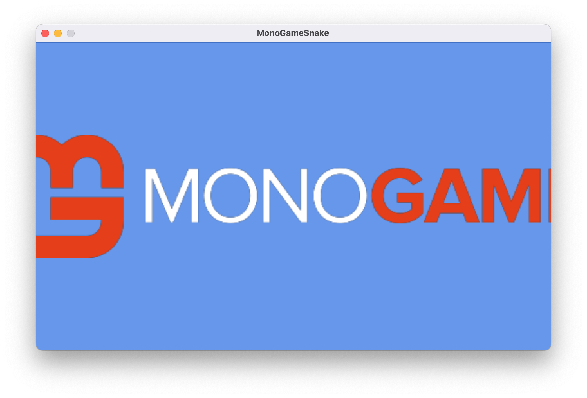
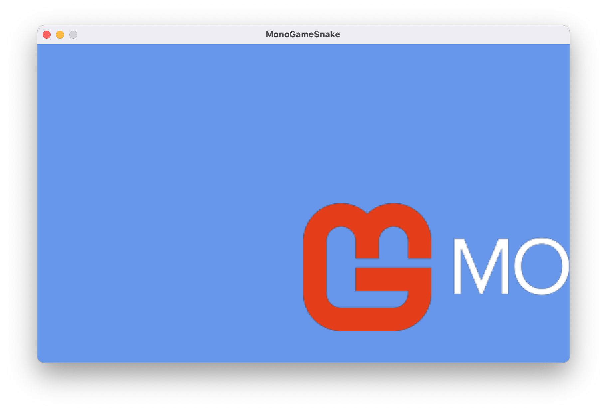
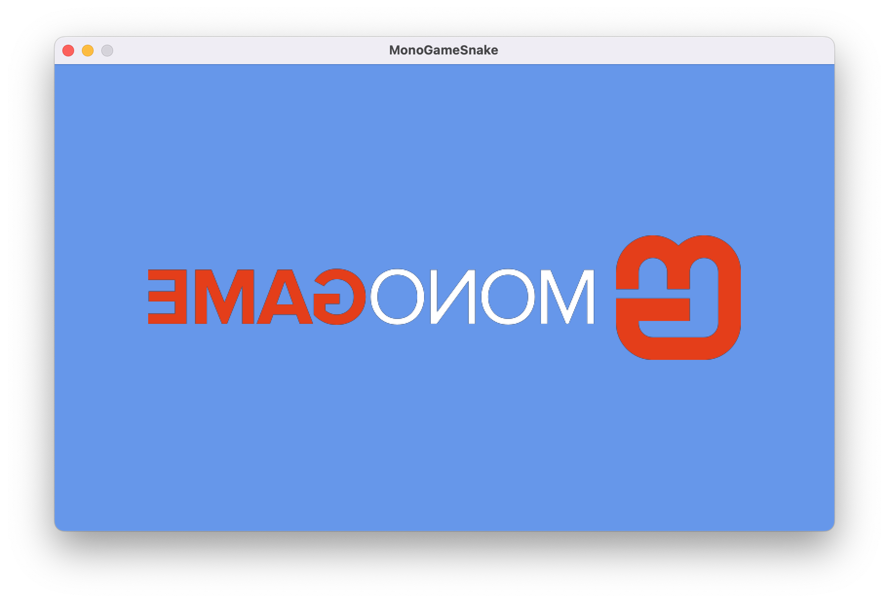
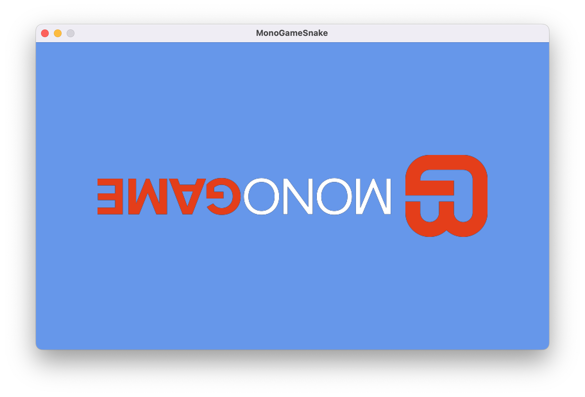
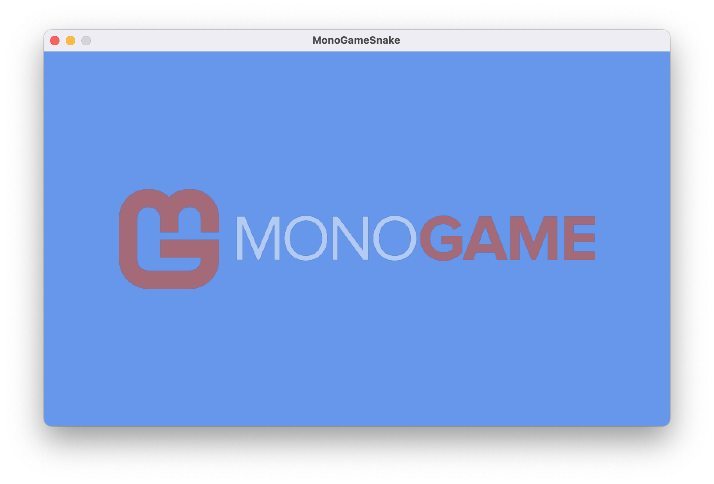
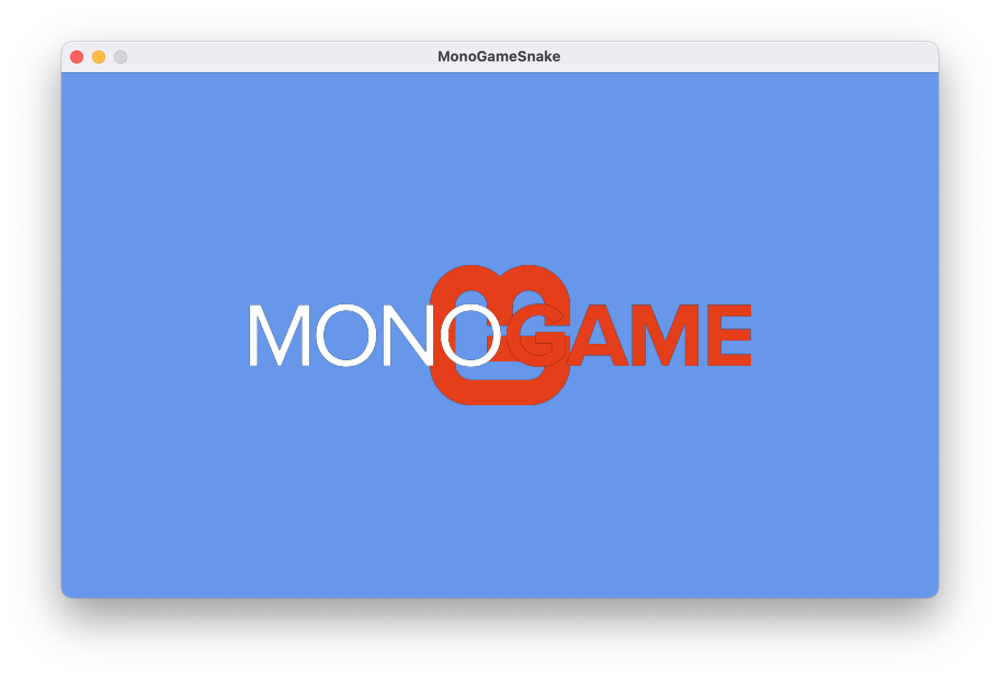
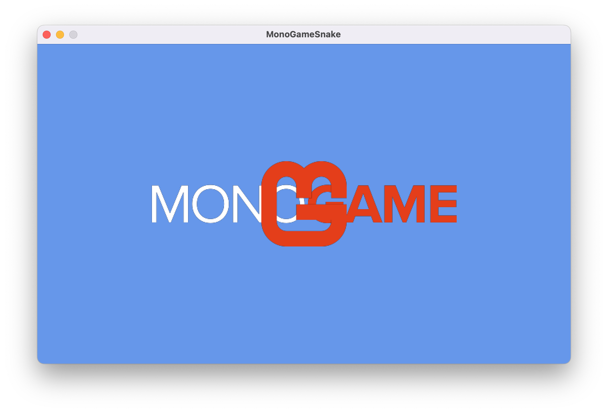

Textures are images that are used in your game to represent the visual graphics to the player, commonly referred to as *Sprites*.  In [Chapter 04](../04_content_pipeline/index.md#loading-assets), you went through the steps of using the **Content Pipeline** to load the MonoGame *logo.png* texture and rendering it to the screen.

In this chapter, you will:

- Learn how to render a texture with the [**SpriteBatch**](xref:Microsoft.Xna.Framework.Graphics.SpriteBatch).
- Explorer how to manipulate the way the texture is rendered using the parameters of the [**SpriteBatch.Draw**](xref:Microsoft.Xna.Framework.Graphics.SpriteBatch.Draw(Microsoft.Xna.Framework.Graphics.Texture2D,Microsoft.Xna.Framework.Vector2,Microsoft.Xna.Framework.Color)) method.

## Drawing a Texture

When rendering in MonoGame, *render states*, properties of the [**GraphicsDevice**](xref:Microsoft.Xna.Framework.Graphics.GraphicsDevice) that affect how rendering is performed, need to be set.  When rendering 2D sprites, the [**SpriteBatch**](xref:Microsoft.Xna.Framework.Graphics.SpriteBatch) class simplifies rendering by managing these render states for you.

> [!IMPORTANT]
> Although the [**SpriteBatch**](xref:Microsoft.Xna.Framework.Graphics.SpriteBatch) makes it easier to manage the render states for the [**GraphicsDevice**](xref:Microsoft.Xna.Framework.Graphics.GraphicsDevice), it can also change states that you may have set manually, such as when you are performing 3D rendering.  Keep this in mind when mixing 2D and 3D rendering.

Three methods are are used when rendering with the [**SpriteBatch**](xref:Microsoft.Xna.Framework.Graphics.SpriteBatch):

1. [**SpriteBatch.Begin**](xref:Microsoft.Xna.Framework.Graphics.SpriteBatch.Begin(Microsoft.Xna.Framework.Graphics.SpriteSortMode,Microsoft.Xna.Framework.Graphics.BlendState,Microsoft.Xna.Framework.Graphics.SamplerState,Microsoft.Xna.Framework.Graphics.DepthStencilState,Microsoft.Xna.Framework.Graphics.RasterizerState,Microsoft.Xna.Framework.Graphics.Effect,System.Nullable{Microsoft.Xna.Framework.Matrix})) prepares the Graphics Device for rendering, including the render states.
2. [**SpriteBatch.Draw**](xref:Microsoft.Xna.Framework.Graphics.SpriteBatch.Draw(Microsoft.Xna.Framework.Graphics.Texture2D,Microsoft.Xna.Framework.Rectangle,Microsoft.Xna.Framework.Color)) tells the [**SpriteBatch**](xref:Microsoft.Xna.Framework.Graphics.SpriteBatch) what to render. This is usually called multiple times before [**SpriteBatch.End**](xref:Microsoft.Xna.Framework.Graphics.SpriteBatch.End) and batches the draw calls for efficiency.
3. [**SpriteBatch.End**](xref:Microsoft.Xna.Framework.Graphics.SpriteBatch.End) submits the draw calls that were batched to the graphics device to be rendered.

> [!NOTE]
> The order of method calls when rendering using the [**SpriteBatch**](xref:Microsoft.Xna.Framework.Graphics.SpriteBatch) is important.  [**SpriteBatch.Begin**](xref:Microsoft.Xna.Framework.Graphics.SpriteBatch.Begin(Microsoft.Xna.Framework.Graphics.SpriteSortMode,Microsoft.Xna.Framework.Graphics.BlendState,Microsoft.Xna.Framework.Graphics.SamplerState,Microsoft.Xna.Framework.Graphics.DepthStencilState,Microsoft.Xna.Framework.Graphics.RasterizerState,Microsoft.Xna.Framework.Graphics.Effect,System.Nullable{Microsoft.Xna.Framework.Matrix})) must be called before any [**SpriteBatch.Draw**](xref:Microsoft.Xna.Framework.Graphics.SpriteBatch.Draw(Microsoft.Xna.Framework.Graphics.Texture2D,Microsoft.Xna.Framework.Rectangle,Microsoft.Xna.Framework.Color)) calls are made.  When finished, [**SpriteBatch.End**](xref:Microsoft.Xna.Framework.Graphics.SpriteBatch.End) must be called before another [**SpriteBatch.Begin**](xref:Microsoft.Xna.Framework.Graphics.SpriteBatch.Begin(Microsoft.Xna.Framework.Graphics.SpriteSortMode,Microsoft.Xna.Framework.Graphics.BlendState,Microsoft.Xna.Framework.Graphics.SamplerState,Microsoft.Xna.Framework.Graphics.DepthStencilState,Microsoft.Xna.Framework.Graphics.RasterizerState,Microsoft.Xna.Framework.Graphics.Effect,System.Nullable{Microsoft.Xna.Framework.Matrix})) can be called.  If these methods are called out of order, an exception will be thrown.

As mentioned in [Chapter 03](../03_the_game1_file/index.md#the-game-loop), all rendering should be done inside the [**Draw**](xref:Microsoft.Xna.Framework.Game.Draw(Microsoft.Xna.Framework.GameTime)) method. The [**Draw**](xref:Microsoft.Xna.Framework.Game.Draw(Microsoft.Xna.Framework.GameTime)) method's responsibility is to render the game state that was calculated in [**Update**](xref:Microsoft.Xna.Framework.Game.Update(Microsoft.Xna.Framework.GameTime)); it should not contain any game logic or complex calculations.

At the end of [Chapter 04](../04_content_pipeline/index.md#loading-assets), you added the following code to the [**Draw**](xref:Microsoft.Xna.Framework.Game.Draw(Microsoft.Xna.Framework.GameTime)) in the *Game1.cs* file:

```cs
_spriteBatch.Begin();
_spriteBatch.Draw(_logo, Vector2.Zero, Color.White);
_spriteBatch.End();
```

These lines initialize the [**SpriteBatch**](xref:Microsoft.Xna.Framework.Graphics.SpriteBatch), draw the logo at [**Vector2.Zero**](xref:Microsoft.Xna.Framework.Vector2.Zero) (0, 0), and complete the batch. When you ran the game and the logo appeared in the window's upper-left corner:

<figure><figcaption><p><strong>Figure 5-1: The MonoGame logo drawn to the game window.</strong></p></figcaption></figure>

The [**SpriteBatch.Draw**](xref:Microsoft.Xna.Framework.Graphics.SpriteBatch.Draw(Microsoft.Xna.Framework.Graphics.Texture2D,Microsoft.Xna.Framework.Vector2,Microsoft.Xna.Framework.Color)) method we just used can be given the following parameters:

| Parameter  | Type                                                             | Description                                                                                                                                                     |
|------------|------------------------------------------------------------------|-----------------------------------------------------------------------------------------------------------------------------------------------------------------|
| *texture*  | [**Texture2D**](xref:Microsoft.Xna.Framework.Graphics.Texture2D) | The [**Texture2D**](xref:Microsoft.Xna.Framework.Graphics.Texture2D) to draw.                                                                                    |
| *position* | [**Vector2**](xref:Microsoft.Xna.Framework.Vector2)              | The X and Y coordinates at which the texture will be rendered, with the texture's origin being the upper-left corner of the image.                              |
| *color*    | [**Color**](xref:Microsoft.Xna.Framework.Color)                  | The color mask (tint) to apply to the image drawn. Specifying [**Color.White**](xref:Microsoft.Xna.Framework.Color.White) will render the texture with no tint. |

Try adjusting the position and color parameters and see how they can affect the image being drawn.

MonoGame uses a coordinate system where (0, 0) is at the screen's upper-left corner. X values increase moving right, and Y values increase moving down. Understanding this, let's try to center the logo on the game window.

To center content on the screen, we need to find the window's center point. We can access this using the [**Window.ClientBounds**](xref:Microsoft.Xna.Framework.GameWindow.ClientBounds) property from the [**Game**](xref:Microsoft.Xna.Framework.Game) class, which represents the rectangular bounds of the game window.  [**Window.ClientBounds**](xref:Microsoft.Xna.Framework.GameWindow.ClientBounds) exposes both  [**Width**](xref:Microsoft.Xna.Framework.Rectangle.Width) and [**Height**](xref:Microsoft.Xna.Framework.Rectangle.Height) properties for the window's dimensions in pixels.  By dividing these dimensions in half, we can can calculate the window's center coordinates.  Let's update our [**Draw**](xref:Microsoft.Xna.Framework.Graphics.SpriteBatch.Draw(Microsoft.Xna.Framework.Graphics.Texture2D,Microsoft.Xna.Framework.Rectangle,Microsoft.Xna.Framework.Color)) method to use this:

```cs
_spriteBatch.Draw(_logo, new Vector2(Window.ClientBounds.Width, Window.ClientBounds.Height) * 0.5f, Color.White);
```

> [!TIP]  
> In the example above, we multiply the [**Vector2**](xref:Microsoft.Xna.Framework.Vector2) created by `0.5f` to halve the value instead of dividing it by `2.0f`. If you are not used to seeing this, it might seem strange at first, but it is actually an optimization technique. CPUs are able to perform multiplication operations much faster than division operations and reading `* 0.5f` is easily understood to be the same thing as `/ 2.0f` when reading.

We have now set the position to half the window's dimensions, which should center the logo. Let's run the game to see the result.

<figure><figcaption><p><strong>Figure 5-2: Attempting to draw the MonoGame logo centered on the game window.</strong></p></figcaption></figure>

The logo is not centered as we expected it to be.  Even though we set the *position* parameter to the center of the game window, the texture starts drawing from its *origin*, which is the upper-left corner in this example.  So when we set the position to the screen's center, we are actually placing the logo's upper-left corner at that point, not its center.

One way to correct this is to subtract half the width and height of the texture from the game window's center position like so:

```cs
_spriteBatch.Draw(
  _logo,        // texture
  new Vector2(  // position
    (Window.ClientBounds.Width * 0.5f) - (_logo.Width * 0.5f),
    (Window.ClientBounds.Height * 0.5f) - (_logo.Height * 0.5f)),
  Color.White); // color
```

This offsets the position so that it correctly centers the image to the game window.

<figure><figcaption><p><strong>Figure 5-3: The MonoGame logo drawn centered on the game window.</strong></p></figcaption></figure>

While this works, there is a better approach.  There is a different overload of the [**SpriteBatch.Draw**](xref:Microsoft.Xna.Framework.Graphics.SpriteBatch.Draw(Microsoft.Xna.Framework.Graphics.Texture2D,Microsoft.Xna.Framework.Vector2,Microsoft.Xna.Framework.Color)) method that provides additional parameters for complete control over the draw operation. Update your code to:

```cs
_spriteBatch.Draw(
  _logo,              // texture
  new Vector2(        // position
    (Window.ClientBounds.Width * 0.5f) - (_logo.Width * 0.5f),
    (Window.ClientBounds.Height * 0.5f) - (_logo.Height * 0.5f)),
  null,               // sourceRectangle
  Color.White,        // color
  0.0f,               // rotation
  Vector2.Zero,       // origin
  1.0f,               // scale
  SpriteEffects.None, // effects
  0.0f);              // layerDepth
```

This overload produces the same centered result but exposes all parameters that control rendering for a draw operation.  Unlike engines that abstract much of these details away, MonoGame provides explicit control for a flexible custom rendering pipeline.  Here is what each parameter does:

| Parameter         | Type                                                                     | Description                                                                                                                                                                                                    |
|-------------------|--------------------------------------------------------------------------|----------------------------------------------------------------------------------------------------------------------------------------------------------------------------------------------------------------|
| *texture*         | [**Texture2D**](xref:Microsoft.Xna.Framework.Graphics.Texture2D)         | The [**Texture2D**](xref:Microsoft.Xna.Framework.Graphics.Texture2D) to draw.                                                                                                                                   |
| *position*        | [**Vector2**](xref:Microsoft.Xna.Framework.Vector2)                      | The X and Y coordinate position at which the texture will be rendered, relative to the *origin* parameter.                                                                                                     |
| *sourceRectangle* | [**Rectangle**](xref:Microsoft.Xna.Framework.Rectangle)                  | An optional region within the texture to be rendered in order to draw only a portion of the texture. Specifying `null` will render the entire texture.                                                         |
| *color*           | [**Color**](xref:Microsoft.Xna.Framework.Color)                          | The color mask (tint) to apply to the image drawn. Specifying [**Color.White**](xref:Microsoft.Xna.Framework.Color.White) will render the texture with no tint.                                                |
| *rotation*        | `float`                                                                  | The amount of rotation, in radians, to apply to the texture when rendering. Specifying `0.0f` will render the image with no rotation.                                                                          |
| *origin*          | [**Vector2**](xref:Microsoft.Xna.Framework.Vector2)                      | The X and Y coordinate origin point of the texture when rendering. This will affect the offset of the texture when rendered as well being the origin in which the texture is rotated around and scaled from.   |
| *scale*           | `float`                                                                  | The amount to scale the image across the x- and y-axes. Specifying `1.0f` will render the image at its default size with no scaling.                                                                           |
| *effects*         | [**SpriteEffects**](xref:Microsoft.Xna.Framework.Graphics.SpriteEffects) | A [**SpriteEffects**](xref:Microsoft.Xna.Framework.Graphics.SpriteEffects) enum value to that specifies if the texture should be rendered flipped across the horizontal axis, the vertical axis, or both axes. |
| *layerDepth*      | `float`                                                                  | Specifies the depth at which the texture is rendered. Textures with a higher layer depth value are drawn on top of those with a lower layer depth value. **Note: This value will only apply when using `SpriteSortMode.FrontToBack` or \`SpriteSortMode.BackToFront. We'll cover this in a moment.** |

### Rotation

First let's explore the `rotation` parameter.  This value is the amount of rotation to apply to the sprite when rendering it.  Let's rotate the texture 90° to make it vertical. Since rotation is measured in radians, not degrees, we can use the built-in math library in MonoGame to make the conversion for us by calling [**MathHelper.ToRadians**](xref:Microsoft.Xna.Framework.MathHelper.ToRadians(System.Single)).  Update the code to:

```cs
_spriteBatch.Draw(
  _logo,                    // texture
  new Vector2(              // position
    (Window.ClientBounds.Width * 0.5f) - (_logo.Width * 0.5f),
    (Window.ClientBounds.Height * 0.5f) - (_logo.Height * 0.5f)),
  null,                     // sourceRectangle
  Color.White,              // color
  MathHelper.ToRadians(90), // rotation
  Vector2.Zero,             // origin
  1.0f,                     // scale
  SpriteEffects.None,       // effects
  0.0f);                    // layerDepth
```

Running the code now shows the rotated image, but not in the expected position:

<figure><figcaption><p><strong>Figure 5-4: Attempting to draw the MonoGame logo rotated 90° and centered on the game window.</strong></p></figcaption></figure>

The reason the sprite did not rotate as expected is because of the `origin` parameter.  

### Origin

The `origin` parameter specifies the point of origin in which the sprite is rendered from, rotated from, and scaled from.  By default, if no origin is set, it will be [**Vector2.Zero**](xref:Microsoft.Xna.Framework.Vector2.Zero), the upper-left corner of the sprite.  To visualize this, see Figure 5-4 below.  The red square represents where the origin is for the sprite, and we can see how it's rotated around this origin point.

<figure><figcaption><p><strong>Figure 5-5: Demonstration of how a sprite is rotated around its origin.</strong></p></figcaption></figure>

To resolve the rotation issue we had, we only need to change the `origin` parameter so that instead of defaulting to the upper-left corner of the sprite, it is set to the center of the sprite.  When doing this, we need to set the values based on the sprites width and height, so the center origin will be half the width and height of the sprite. Update the code to:

```cs
_spriteBatch.Draw(
  _logo,                    // texture
  new Vector2(              // position
    Window.ClientBounds.Width, 
    Window.ClientBounds.Height) * 0.5f,
  null,                     // sourceRectangle
  Color.White,              // color
  MathHelper.ToRadians(90), // rotation
  new Vector2(              // origin
    _logo.Width, 
    _logo.Height) * 0.5f,
  1.0f,                     // scale
  SpriteEffects.None,       // effects
  0.0f);                    // layerDepth
```

By moving the sprite's origin point to its center, this not only corrects the point of rotation, but also eliminates the need to offset the position by half the sprite's dimensions. Running the game now shows the log properly centered and rotated 90°.

<figure><figcaption><p><strong>Figure 5-6: The MonoGame logo drawn rotated 90° and centered on the game window.</strong></p></figcaption></figure>

### Scale

The `scale` parameter specifies the amount of scaling to apply to the sprite when it is rendered.  The default value is `1.0f`, which can be read as "rendering the sprite at 1x the size".  Increasing this will scale up the size of the sprite and decreasing it will scale down the sprite.  Let's see an example of this by setting the scale of the logo sprite to `1.5f`:

```cs
_spriteBatch.Draw(
  _logo,                    // texture
  new Vector2(              // position
    Window.ClientBounds.Width, 
    Window.ClientBounds.Height) * 0.5f,
  null,                     // sourceRectangle
  Color.White,              // color
  0.0f,                     // rotation
  new Vector2(              // origin
    _logo.Width, 
    _logo.Height) * 0.5f,
  1.5f,                     // scale
  SpriteEffects.None,       // effects
  0.0f);                    // layerDepth
```

<figure><figcaption><p><strong>Figure 5-7: The MonoGame logo drawn scaled at 1.5x the size.</strong></p></figcaption></figure>

Note that the sprite scaled up from the center.  This is because we still have the `origin` parameter set as the center of the sprite.  If we instead adjusted the code so the `origin` parameter was back in the upper-left corner like so:

```cs
_spriteBatch.Draw(
  _logo,                    // texture
  new Vector2(              // position
    Window.ClientBounds.Width, 
    Window.ClientBounds.Height) * 0.5f,
  null,                     // sourceRectangle
  Color.White,              // color
  0.0f,                     // rotation
  Vector2.Zero,             // origin
  1.5f,                     // scale
  SpriteEffects.None,       // effects
  0.0f);                    // layerDepth
```

Then the scaling is applied from the origin in the upper-left corner producing the following result:

<figure><figcaption><p><strong>Figure 5-8: The MonoGame logo drawn scaled at 1.5x the size with the origin set in the upper-left corner.</strong></p></figcaption></figure>

Scaling can also be applied to the x- and y-axes independently by providing it with a [**Vector2**](xref:Microsoft.Xna.Framework.Vector2) value instead of a float value.  For instance, let's scale the x-axis of the sprite by 1.5x and reduce the scale of the y-axis to 0.5x:

```cs
_spriteBatch.Draw(
  _logo,                    // texture
  new Vector2(              // position
    Window.ClientBounds.Width,
    Window.ClientBounds.Height) * 0.5f,
  null,                     // sourceRectangle
  Color.White,              // color
  0.0f,                     // rotation
  new Vector2(              // origin
    _logo.Width,
    _logo.Height) * 0.5f,
  new Vector2(1.5f, 0.5f),  // scale
  SpriteEffects.None,       // effects
  0.0f);
```

Which will produce the following result:

<figure><figcaption><p><strong>Figure 5-9: The MonoGame logo drawn scaled at 1.5x the size on the x-axis and 0.5x on the y-axis.</strong></p></figcaption></figure>

### SpriteEffects

The `effects` parameter is used to flip the sprite when rendered on either the horizontal or vertical axis, or both. This value for this parameter will be one of the [**SpriteEffects**](xref:Microsoft.Xna.Framework.Graphics.SpriteEffects) enum values.

| SpriteEffect | Description |
| --- | --- |
| [**SpriteEffects.None**](xref:Microsoft.Xna.Framework.Graphics.SpriteEffects.None) | No effect is applied and the sprite is rendered normally. |
| [**SpriteEffects.FlipHorizontally**](xref:Microsoft.Xna.Framework.Graphics.SpriteEffects.FlipHorizontally) | The sprite is rendered flipped along the horizontal axis. |
| [**SpriteEffects.FlipVertically**](xref:Microsoft.Xna.Framework.Graphics.SpriteEffects.FlipVertically) | The sprite is rendered flipped along the vertical axis. |

Let's see this by applying the [**SpriteEffects.FlipHorizontally**](xref:Microsoft.Xna.Framework.Graphics.SpriteEffects.FlipHorizontally) value to the sprite:

```cs
_spriteBatch.Draw(
    _logo,                          // texture
    new Vector2(                    // position
        Window.ClientBounds.Width,
        Window.ClientBounds.Height) * 0.5f,
    null,                           // sourceRectangle
    Color.White,                    // color
    0.0f,                           // rotation
    new Vector2(                    // origin
        _logo.Width,
        _logo.Height) * 0.5f,
    1.0f,                           // scale
    SpriteEffects.FlipHorizontally, // effects
    0.0f);                          // layerDepth
```

Which will produce the following result:

<figure><figcaption><p><strong>Figure 5-10: The MonoGame logo flipped horizontally.</strong></p></figcaption></figure>

The [**SpriteEffects**](xref:Microsoft.Xna.Framework.Graphics.SpriteEffects) enum value also uses the [`[Flag]`](https://learn.microsoft.com/en-us/dotnet/fundamentals/runtime-libraries/system-flagsattribute) attribute, which means we can combine both horizontal and vertical flipping together.  To do this, we use the [bitwise OR operator](https://learn.microsoft.com/en-us/dotnet/csharp/language-reference/operators/bitwise-and-shift-operators#logical-or-operator-) `|`.  Update the `effect` parameter value to the following:

```cs
_spriteBatch.Draw(
    _logo,                              // texture
    new Vector2(                        // position
        Window.ClientBounds.Width,
        Window.ClientBounds.Height) * 0.5f,
    null,                               // sourceRectangle
    Color.White,                        // color
    0.0f,                               // rotation
    new Vector2(                        // origin
        _logo.Width,
        _logo.Height) * 0.5f,
    1.0f,                               // scale
    SpriteEffects.FlipHorizontally |    // effects
    SpriteEffects.FlipVertically,
    0.0f);                              // layerDepth
```

Now the sprite is flipped both horizontally and vertically

<figure><figcaption><p><strong>Figure 5-11: The MonoGame logo flipped horizontally and vertically.</strong></p></figcaption></figure>

### Color and Opacity

The `color` parameter applies a color mask to the sprite when it's rendered.  Note that this is not setting the actual color of the image, just a mask that is applied, like a tint.  The default value is [**Color.White**](xref:Microsoft.Xna.Framework.Color.White).  So if we're setting it to [**Color.White**](xref:Microsoft.Xna.Framework.Color.White), why does this not affect the tinting of the sprite drawn?

When the `color` parameter is applied, each color channel (Red, Green, Blue) of the sprite is multiplied by the corresponding channel in the `color` parameter, where each channel is represented as a value between `0.0f` and `1.0f`.  For [**Color.White**](xref:Microsoft.Xna.Framework.Color.White), all color channels are set to `1.0f` (255 in byte form), so the multiplication looks like this:

```sh
Final Red = Sprite Red * 1.0f
Final Green = Sprite Green * 1.0f
Final Blue = Sprite Blue * 1.0f;
```

Since multiplying by `1.0f` doesn't change the value, [**Color.White**](xref:Microsoft.Xna.Framework.Color.White) essentially preserves the original colors of the sprite.

Let's change the `color` parameter to use [**Color.Green**](xref:Microsoft.Xna.Framework.Color.Green):

```cs
_spriteBatch.Draw(
    _logo,                    // texture
    new Vector2(              // position
        Window.ClientBounds.Width,
        Window.ClientBounds.Height) * 0.5f,
    null,                     // sourceRectangle
    Color.Green,              // color
    0.0f,                     // rotation
    new Vector2(              // origin
        _logo.Width,
        _logo.Height) * 0.5f,
    1.0f,                     // scale
    SpriteEffects.None,       // effects
    0.0f); 
```

This produces the following result:

<figure><figcaption><p><strong>Figure 5-12: The MonoGame logo with a green color tint applied.</strong></p></figcaption></figure>

> [!NOTE]
> The icon and the word "GAME" in the logo look black after using a [**Color.Green**](xref:Microsoft.Xna.Framework.Color.Green) because the Red, Blue Green components of that color are (`0.0f`, `0.5f`, `0.0f`).  The Orange color used in the logo is [**Color.MonoGameOrange**](xref:Microsoft.Xna.Framework.Color.MonoGameOrange), which has the component values of (`0.9f`, `0.23f`, `0.0f`).  When multiplying the component values, the result is (`0.0f`, `0.125f`, `0.0f`) which would be Red 0, Green 31, Blue 0 in byte values.  So it's not quite fully black, but it is very close.
>
> This is why it's important to understand how the `color` parameter values are applied to the sprite when it is rendered.

To adjust the opacity of a sprite, we can multiply the `color` parameter value by a value between `0.0f` (fully transparent) and `1.0f` (fully opaque).  For instance, if we wanted to render the logo with 50% transparency we can multiply the `color` parameter by `0.5f` like this:

```cs
_spriteBatch.Draw(
    _logo,                    // texture
    new Vector2(              // position
        Window.ClientBounds.Width,
        Window.ClientBounds.Height) * 0.5f,
    null,                     // sourceRectangle
    Color.White * 0.5f,       // color
    0.0f,                     // rotation
    new Vector2(              // origin
        _logo.Width,
        _logo.Height) * 0.5f,
    1.0f,                     // scale
    SpriteEffects.None,       // effects
    0.0f); 
```

Which will produce the following result:

<figure><figcaption><p><strong>Figure 5-13: The MonoGame logo with half transparency.</strong></p></figcaption></figure>

### Source Rectangle

The `sourceRectangle` parameter specifies a specific boundary within the texture that should be rendered.  So far, we've just set this parameter to `null`, which specifies that the full texture should be rendered.  If we only wanted to render a portion of the texture as the sprite, we can set this parameter value.  

For instance, take the logo image we've been using.  We can break it down into two distinct regions; the MonoGame icon and the MonoGame wordmark.

<figure><figcaption><p><strong>Figure 5-14: The MonoGame logo broken down into the icon and wordmark regions.</strong></p></figcaption></figure>

We can see from Figure 5-13 above that the actual icon starts at position (0, 0) and is 128px wide and 128px tall. Likewise, the wordmark starts at position (150, 34) and is 458px wide and 58px tall. Knowing the starting position and the width and height of the region gives us a defined rectangle that we can use as the `sourceRectangle`.

Let's see this in action by drawing the icon and the wordmark separately from the same texture.  First, after the call to the [**GraphicsDevice.Clear**](xref:Microsoft.Xna.Framework.Graphics.GraphicsDevice.Clear(Microsoft.Xna.Framework.Color)) method, add the following variables:

```cs
Rectangle iconSourceRect = new Rectangle(0, 0, 128, 128);
Rectangle wordmarkSourceRect = new Rectangle(150, 34, 458, 58);
```

Next, replace the current `_spriteBatch.Draw` method call with the following:

```cs
_spriteBatch.Draw(
    _logo,              // texture
    new Vector2(        // position
      Window.ClientBounds.Width, 
      Window.ClientBounds.Height) * 0.5f,
    iconSourceRect,     // sourceRectangle
    Color.White,        // color
    0.0f,               // rotation
    new Vector2(        // origin
      iconSourceRect.Width, 
      iconSourceRect.Height) * 0.5f,
    1.0f,               // scale
    SpriteEffects.None, // effects
    0.0f);              // layerDepth

_spriteBatch.Draw(
    _logo,              // texture
    new Vector2(        // position
      Window.ClientBounds.Width, 
      Window.ClientBounds.Height) * 0.5f,
    wordmarkSourceRect, // sourceRectangle
    Color.White,        // color
    0.0f,               // rotation
    new Vector2(        // origin
      wordmarkSourceRect.Width, 
      wordmarkSourceRect.Height) * 0.5f,
    1.0f,               // scale
    SpriteEffects.None, // effects
    0.0f);              // layerDepth
```

The following changes were made:

- Two new [**Rectangle**](xref:Microsoft.Xna.Framework.Rectangle) values called `iconSourceRect` and `wordmarkSourceRect` that represent the boundaries of the MonoGame icon and wordmark regions within the logo texture were added.
- The *sourceRectangle* parameter of the `_spriteBatch.Draw` was updated to use the new `iconSourceRect` value. **Notice that we are still telling it to draw the `_logo` for the *texture*, we've just supplied it with a source rectangle this time.**
- The *origin* parameter was updated to use the width and height of the `iconSourceRect`. Since the overall dimensions of what we'll be rendering has changed due to supplying a source rectangle, the origin needs to be adjusted to those dimensions as well. 
- Finally, a second `_spriteBatch.Draw` call is made, this time using the `wordmarkSourceRect` as the source rectangle so that the wordmark is drawn.

If you run the game now, you should see the following:

<figure><figcaption><p><strong>Figure 5-16: The MonoGame icon and wordmark, from the logo texture, centered in the game window.</strong></p></figcaption></figure>

> [!NOTE]
> Making use of the `sourceRectangle` parameter to draw different sprites from the same texture is optimization technique that we'll explore further in the next chapter.

### Layer Depth

The final parameter to discuss is the `layerDepth` parameter. Notice that in Figure 5-14 above, the wordmark is rendered on top of the icon.  This is because of the order the draw calls were made; first the icon was rendered, then the wordmark was rendered.

The [**SpriteBatch.Begin**](xref:Microsoft.Xna.Framework.Graphics.SpriteBatch.Begin(Microsoft.Xna.Framework.Graphics.SpriteSortMode,Microsoft.Xna.Framework.Graphics.BlendState,Microsoft.Xna.Framework.Graphics.SamplerState,Microsoft.Xna.Framework.Graphics.DepthStencilState,Microsoft.Xna.Framework.Graphics.RasterizerState,Microsoft.Xna.Framework.Graphics.Effect,System.Nullable{Microsoft.Xna.Framework.Matrix})) method contains several optional parameters, one of which is the `sortMode` parameter.  By default, this value is [**SpriteSortMode.Deferred**](xref:Microsoft.Xna.Framework.Graphics.SpriteSortMode.Deferred), which means what is drawn is done so in the order of the [**SpriteBatch.Draw**](xref:Microsoft.Xna.Framework.Graphics.SpriteBatch.DrawString(Microsoft.Xna.Framework.Graphics.SpriteFont,System.Text.StringBuilder,Microsoft.Xna.Framework.Vector2,Microsoft.Xna.Framework.Color,System.Single,Microsoft.Xna.Framework.Vector2,System.Single,Microsoft.Xna.Framework.Graphics.SpriteEffects,System.Single)) calls.  Each subsequent call will be drawn visually on top of the previous call.

When [**SpriteSortMode.Deferred**](xref:Microsoft.Xna.Framework.Graphics.SpriteSortMode.Deferred) is used, then the `layerDepth` parameter in the [**SpriteBatch.Draw**](xref:Microsoft.Xna.Framework.Graphics.SpriteBatch.DrawString(Microsoft.Xna.Framework.Graphics.SpriteFont,System.Text.StringBuilder,Microsoft.Xna.Framework.Vector2,Microsoft.Xna.Framework.Color,System.Single,Microsoft.Xna.Framework.Vector2,System.Single,Microsoft.Xna.Framework.Graphics.SpriteEffects,System.Single)) call is essentially ignored.  For instance, in the first `_spriteBatch.Draw` method call, update the `layerDepth` parameter to `1.0f`.

```cs
_spriteBatch.Draw(
    _logo,              // texture
    new Vector2(        // position
      Window.ClientBounds.Width, 
      Window.ClientBounds.Height) * 0.5f,
    iconSourceRect,     // sourceRectangle
    Color.White,        // color
    0.0f,               // rotation
    new Vector2(        // origin
      iconSourceRect.Width, 
      iconSourceRect.Height) * 0.5f,
    1.0f,               // scale
    SpriteEffects.None, // effects
    1.0f);              // layerDepth
```

Doing this should tell it to render on a layer above the wordmark since the icon is at `1.0f` and the wordmark is at `0.0f` for the `layerDepth`.  However, if you run the game now, you'll see that no change actually happens; the wordmark is still drawn on top of the icon.

To make use of the `layerDepth` parameter, you need to set the `sortMode` to either [**SpriteSortMode.BackToFront**](xref:Microsoft.Xna.Framework.Graphics.SpriteSortMode.BackToFront) or [**SpriteSortMode.FrontToBack**](xref:Microsoft.Xna.Framework.Graphics.SpriteSortMode.FrontToBack).

| Sort Mode                    | Description                                                                           |
|------------------------------|---------------------------------------------------------------------------------------|
| [**SpriteSortMode.BackToFront**](xref:Microsoft.Xna.Framework.Graphics.SpriteSortMode.BackToFront) | Sprites are sorted by depth in back-to-front order prior to drawing. |
| [**SpriteSortMode.FrontToBack**](xref:Microsoft.Xna.Framework.Graphics.SpriteSortMode.FrontToBack) | Sprites are sorted by depth in front-to-back order prior to drawing. |

Let's see this in action.  We've already set the `layerDepth` parameter of the icon to `1.0f`.  Find the `_spriteBatch.Begin()` method call and update it to the following:

```cs
_spriteBatch.Begin(sortMode: SpriteSortMode.FrontToBack);
```

Now we're telling it to use the [**SpriteSortMode.FrontToBack**](xref:Microsoft.Xna.Framework.Graphics.SpriteSortMode.FrontToBack) sort mode, which will sort the draw calls so that those with a higher `layerDepth` will be drawn on top of those with a lower one.  Even though we didn't change the order of the `_spriteBatch.Draw` calls, if you run the game now, you will see the following:

<figure><figcaption><p><strong>Figure 5-17: The MonoGame icon drawn on top of the wordmark.</strong></p></figcaption></figure>

There are also two additional [**SpriteSortMode**](xref:Microsoft.Xna.Framework.Graphics.SpriteSortMode) values that can be used.  These, however, are situational and can have draw backs when using them, so understanding what they are for is important.

The first is [**SpriteSortMode.Texture**](xref:Microsoft.Xna.Framework.Graphics.SpriteSortMode.Texture).  This works similar to [**SpriteSortMode.Deferred**](xref:Microsoft.Xna.Framework.Graphics.SpriteSortMode.Deferred) in that draw calls happen in the order they are made.  However, before the draw calls are made, they are sorted by texture.  This can be helpful when using multiple textures to reduce texture swapping, however it can have unintended results with layering if you're not careful.

The second is [**SpriteSortMode.Immediate**](xref:Microsoft.Xna.Framework.Graphics.SpriteSortMode.Immediate).  When using this sort mode, when a draw call is made, it is immediately flushed to the GPU and rendered to the screen, ignoring the layer depth, instead of batched and drawn when [**SpriteBatch.End**](xref:Microsoft.Xna.Framework.Graphics.SpriteBatch.End) is called. Using this can cause performance issues and should only be used when necessary.  We'll discuss an example of using this in a later chapter when we discuss shaders, since with [**SpriteSortMode.Immediate**](xref:Microsoft.Xna.Framework.Graphics.SpriteSortMode.Immediate) you can adjust shader parameters for each individual draw call.

## Conclusion

Let's review what you accomplished in this chapter:

- You learned about the different parameters of the [**SpriteBatch.Draw**](xref:Microsoft.Xna.Framework.Graphics.SpriteBatch.Draw(Microsoft.Xna.Framework.Graphics.Texture2D,Microsoft.Xna.Framework.Vector2,Microsoft.Xna.Framework.Color)) method and how they affect sprite rendering.
- You learned how the `rotation` parameter works and how to convert between degrees and radians using [**MathHelper.ToRadians**](xref:Microsoft.Xna.Framework.MathHelper.ToRadians(System.Single)).
- You learned how the `origin` parameter affects sprite positioning, rotation, and scaling.
- You learned how to use the `scale` parameter to resize sprites uniformly or along individual axes.
- You explored the [**SpriteEffects**](xref:Microsoft.Xna.Framework.Graphics.SpriteEffects) enum to flip sprites horizontally and vertically.
- You learned how the `color` parameter can be used to tint sprites and adjust their opacity.
- You used the `sourceRectangle` parameter to draw specific regions from a texture.
- You explored sprite layering using the `layerDepth` parameter and different [**SpriteSortMode**](xref:Microsoft.Xna.Framework.Graphics.SpriteSortMode) options.

In the next chapter, we'll take what we've learned about working with textures and learn techniques to optimize rendering to reduce texture swapping.

## Test Your Knowledge

1. What is the purpose of the `origin` parameter in SpriteBatch.Draw, and how does it affect position, rotation and scaling?

    <details>
    <summary>Question 1 Answer</summary>

    > The `origin` parameter determines the reference point for the sprite's position, rotation, and scaling. When set to [**Vector2.Zero**](xref:Microsoft.Xna.Framework.Vector2.Zero), the sprite rotates and scales from its upper-left corner. When set to the center of the sprite, the sprite rotates and scales from its center. The origin point also affects where the sprite is positioned relative to the `position` parameter.
    </details><br />

2. How can you adjust a sprite's opacity using [**SpriteBatch.Draw**](xref:Microsoft.Xna.Framework.Graphics.SpriteBatch.DrawString(Microsoft.Xna.Framework.Graphics.SpriteFont,System.Text.StringBuilder,Microsoft.Xna.Framework.Vector2,Microsoft.Xna.Framework.Color,System.Single,Microsoft.Xna.Framework.Vector2,System.Single,Microsoft.Xna.Framework.Graphics.SpriteEffects,System.Single))?

    <details>
    <summary>Question 2 Answer</summary>

    > A sprite's opacity can be adjusted by multiplying the `color` parameter by a value between `0.0f` (fully transparent) and `1.0f` (fully opaque). For example, `Color.White * 0.5f` will render the sprite at 50% opacity.
    </details><br />

3. How can you flip a sprite horizontally and vertically at the same time using SpriteEffects?

    <details>
    <summary>Question 3 Answer</summary>

    > To flip a sprite both horizontally and vertically, you can combine the SpriteEffects values using the bitwise OR operator (`|`):
    >
    > ```cs
    > SpriteEffects.FlipHorizontally | SpriteEffects.FlipVertically
    > ```

    </details><br />

4. When using the `sourceRectangle` parameter, what information do you need to specify, and what is its purpose?

    <details>
    <summary>Question 4 Answer</summary>

    > The `sourceRectangle` parameter requires a [**Rectangle**](xref:Microsoft.Xna.Framework.Rectangle) value where the x- and y-coordinates specify the upper-left corner of the region within the texture and the width and height, in pixels, of the region.
    >
    > Its purpose is to specify a specific region within a texture to draw, allowing multiple sprites to be drawn from different parts of the same texture.
    </details><br />
