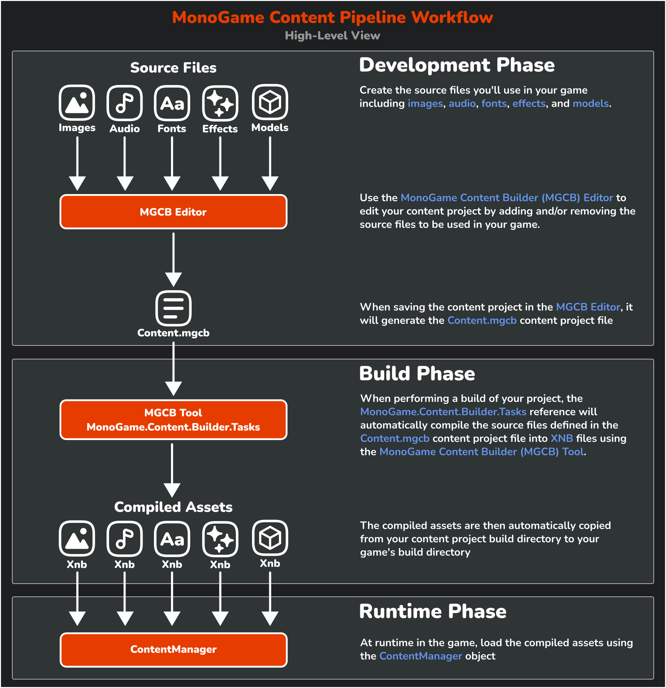
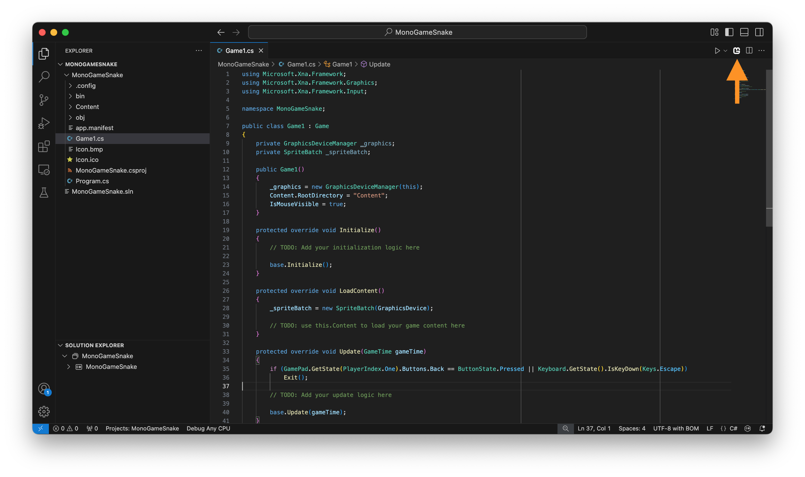
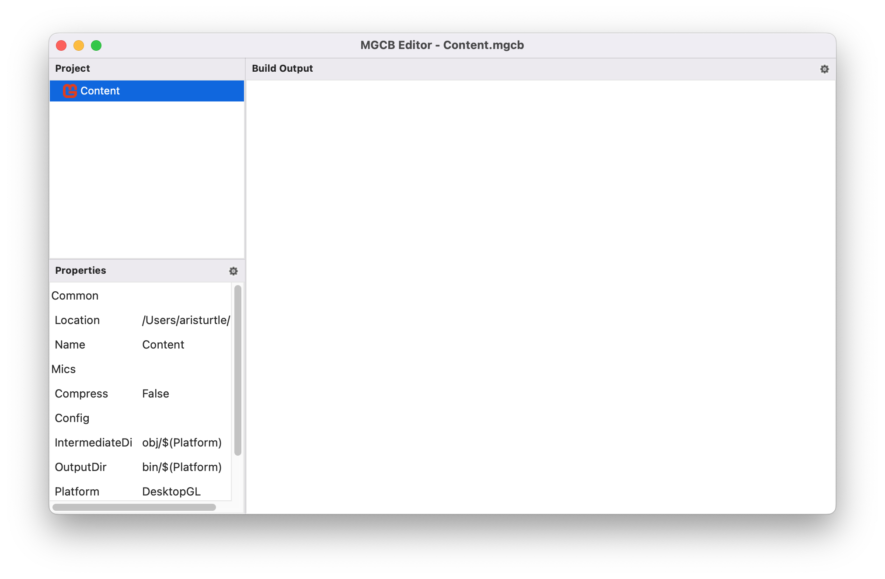
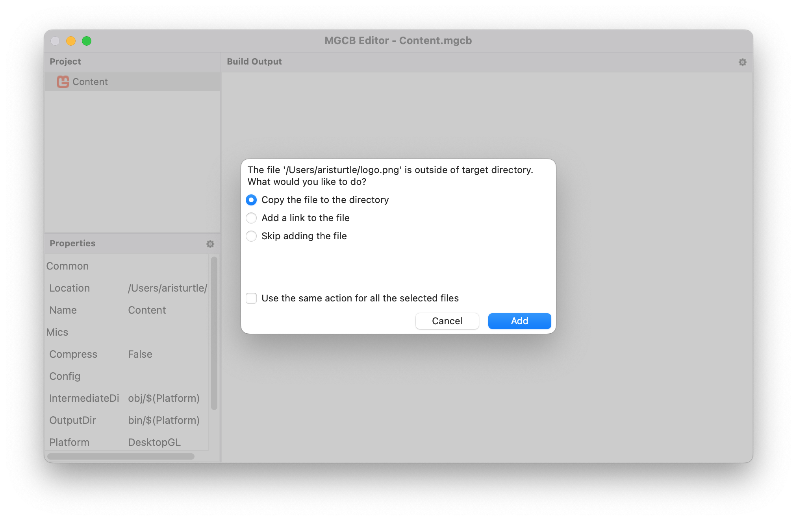
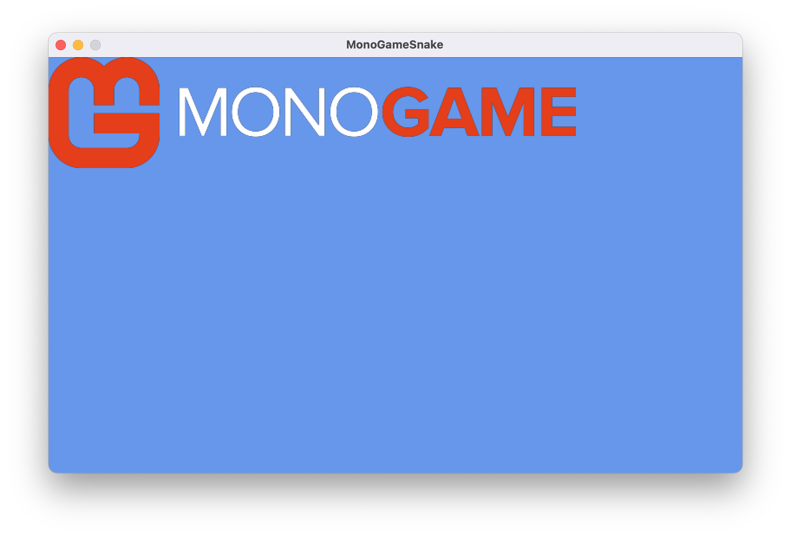

Every game has assets; images to represent the visual graphics to players, audio to provide sound effects and background music, fonts to render text with, and much more.  These assets start out as raw files (e.g. *.png* image files or *.mp3* audio files), which you'll need to load into the game to use.

## Loading Assets

Loading assets can be done during runtime directly from file, or it can be loaded through the **Content Pipeline**  Both of these methods are two sides of the same coin and there are trade offs to each approach.

For instance, to load an image file directly at runtime, you would need to:

1. Add the image file to your project.
2. Configure the project to copy the image file on build to the build output directory.
3. Load the image file as a texture at runtime using the [**Texture2D.FromFile**](xref:Microsoft.Xna.Framework.Graphics.Texture2D.FromFile(Microsoft.Xna.Framework.Graphics.GraphicsDevice,System.String)) method.

> [!IMPORTANT]
> A big disadvantage to loading an image file as a texture directly, is when that when it loads it, it does so in its compressed format such as *.png* or *.jpg*.  These compression formats are not understood by a Graphics Processing Unit (GPU); they will need to be decompressed into raw bytes as a format the GPU does understand before it can store the data.  Doing this can potentially leave a larger memory footprint for your assets.  You will also need to handle how different compression formats work on the platform you are targeting such as desktops, mobile, and consoles.  
>
> Alternatively, as we'll explore below, using the **Content Pipeline** handles this for you automatically.

On the other side of this coin, MonoGame offers the **Content Pipeline**; a workflow for managing assets. The workflow is made up of a set of tools and utilities that are automatically added by default when you create a new MonoGame project using the MonoGame project templates.  To use this workflow, you need to:

1. Add the asset file to your content project (*Content.mgcb* file) using the MGCB Editor.
2. Perform a project build. Doing this, the *MonoGame.Content.Builder.Tasks* NuGet reference will compile the assets defined in the content project, optimized for the target platform, and automatically copy them to the game project build directory.
3. Load the compiled asset at runtime using the [**ContentManager**](xref:Microsoft.Xna.Framework.Content.ContentManager).

The following image illustrates this workflow:

|  |
| :---: |
| **FigFigure 4-1: MonoGame Content Pipeline Workflowure** |

For the same amount of steps, you also get the benefit of the assets being pre-processed and compiled to an optimized format for the target platform.  For instance, image files can be compiled using [DXT compression](https://en.wikipedia.org/wiki/S3\_Texture\_Compression), which is a format that is understood by GPUs without needing to be decompressed first, reducing the memory footprint.

> [!NOTE]
> For more information on the benefits of compiling assets and what optimizations it can offer, see the [Content Pipeline](../../../getting_started/content_pipeline/index.md) documentation.

For this tutorial series, we are going to focus on using the content pipeline workflow to load assets.  Doing this will get you as the developer accustomed to using the content pipeline tools and also give the benefits of having assets precompiled to optimized formats.

To get started and to walk through the process, we'll start with loading an image file.  Right-click the following image of the MonoGame logo and save it named *logo.png* somewhere on your on your computer, such as your desktop.

|  |
| :---: |
| **Figure 4-2: MonoGame Horizontal Logo** |

## Opening the MGCB Editor

The *MonoGame Content Builder Editor (MGCB Editor)* is a GUI tool that can be used to edit your content project.  The content project is the *Content.mgcb* file in your game project directory.  This file can be edited manually by hand, however it's much easier to use the MGCB Editor instead.  To open the *Content.mgcb* content project file in the MGCB Editor, perform the following based on your editor:

### [Visual Studio Code](#tab/vscode)

To open the *Content.mgcb* content project file in the MGCB Editor with Visual Studio Code, you can use the *MonoGame for VSCode* extension.  You should have installed this extension in [Chapter 02](../02_getting_started/index.md#installing-the-monogame-for-vscode-extension).  With this extension install, anytime you have a code file open, you will see the MonoGame logo in the top-right of the code window like below:

|  |
| :---: |
| **Figure 4-3: MonoGame for VSCode extension icon** |

Clicking the MonoGame logo here will open the *Content.mgcb* content project file from the current project in the MGCB Editor.

### [Visual Studio 2022](#tab/vs2022)

To open the *Content.mgcb* content project file in the MGCB Editor with Visual Studio 2022, you can use the *MonoGame Framework C# project templates* extension.  Despite the name, this extension does more than just install the MonoGame project templates.  With this extension installed, simply double-click the *Content.mgcb* content project file in the Solution Explorer panel and it will open it in the MGCB Editor.

### [dotnet CLI](#tab/dotnetcli)

To open the *Content.mgcb* content project file in the MGCB Editor using the dotnet CLI commands, perform the following:

1. Open a new Command Prompt or Terminal window in the same directory as your game project's *.csproj* file.
2. Enter the command `dotnet mgcb-editor ./Content/Content.mgcb`

---

Once you have the *Content.mgcb* content project file for your game project opened in the MGCB Editor, you should see a window similar to the following:

|  |
| :---: |
| **Figure 4-4: MonoGame Content Builder Editor (MGCB Editor) Window** |

## Adding Assets in the MGCB Editor

Now that the *Content.mgcb* content project file is opened in the MGCB Editor, we can add the assets to it that we want to include in our game.  For now, we're just going to add the image file of the MonoGame logo that you downloaded previously.  To do this, perform the following:

1. Right-click on the *Content* node in the *Project* panel on the left.
2. Select *Add > New Folder*.
3. Name the folder `images`.
4. Right-click on the new *images* folder
5. Select *Add > Existing Item*.
6. Navigate to the *logo.png* file you downloaded and choose it

After adding an existing file, you will be prompted with a pop-up asking if you would like to *Copy the file to the directory* or *Add a link*.

|  |
| :---: |
| **Figure 4-5: Add Existing File Popup** |

For the purposes of this tutorial, choose the *Copy the file to the directory* option, then click the *Add* button.  When adding existing files in the future, the choice between copying the file and adding a link can make a big difference:

- **Copy the file to the directory**: Choosing this will make a literal copy of the selected file and put the copy inside the Content directory of your project.  This means any changes in the original source file will not be reflected in the copy.

- **Add a link**: Choosing this will instead add a reference to the source file without making a copy.  This means changes made in the source file will be reflected on each build.  However, the link is stored as a relative link, with the path being relative to the *Content.mgcb* file.  So if the source file moves, or you move the project, you'll need to re-add the link.

After adding the *logo.png* file, your project node should look similar to the following:

|  |
| :---: |
| **Figure 4-6: Logo image added to the MGCB Editor** |

After changes have been made in the MGBC Editor, ensure that you save the changes.  They are not automatically saved, though you will be warned if you close the editor and haven't saved changes. You can tell that changes have not been saved by looking at the title bar of the MGCB editor window.  If it has an '*' at the end of the window title, this means changes have not been saved.  To save changes, you can perform one of the following:

- Choose *File > Save* from the top menu.
- Click the *Save* icon in the top tool bar.
- Use the `CTRL+S` keyboard shortcut.
  
Save the changes and then close the MGCB Editor.

## Understanding Content Paths

The folder structure you create in the MGCB Editor directly affects how you load content in your game. When you perform a build of your game project, the *MonoGame.Content.Builder.Tasks* NuGet package reference will:

1. Compile the image into an optimized format in the **content project's** output directory (typically *ProjectRoot/Content/bin/Platform/Content*) as an *.xnb* file.
2. Copy the compiled assets to your **game's** output directory (typically *ProjectRoot/bin/Debug/net8.0/Content* or *ProjectRoot/bin/Release/net8.0/Content*).

For example, if your content project contains:

```sh
Content/
  ├── images/
  │   └── logo.png
  └── sounds/
      └── music.mp3
```

then when the tasks first compiles the assets, they will be output to:

```sh
ProjectRoot/
  └── Content/
      └── bin/
          └── DesktopGL/
              └── Content/
                  ├── images/
                  │   └── logo.xnb
                  └── sounds/
                      └── music.xnb
```

Then after compiling them and copying them to the game projects output directory, it will look like the following:

```sh
ProjectRoot/
  └── bin/
      └── Debug/
          └── net8.0/
              └── Content/
                  ├── images/
                  │   └── logo.xnb
                  └── sounds/
                      └── music.xnb
```

When the [**ContentManager**](xref:Microsoft.Xna.Framework.Content.ContentManager) is used to load these assets, it looks for them relative to its [**RootDirectory**](xref:Microsoft.Xna.Framework.Content.ContentManager.RootDirectory) property. By default, this is set to `"Content"` in the `Game1` constructor to match where the compiled assets are copied. The path used to load an asset must match its location relative to the [**RootDirectory**](xref:Microsoft.Xna.Framework.Content.ContentManager.RootDirectory), minus any extension. For example, to load the above assets, the paths would be `"images/logo"` and `"sounds/music"`.

## Loading Content In Game

To load assets that have been processed through the content pipeline, we can use the [**ContentManager**](xref:Microsoft.Xna.Framework.Content.ContentManager).  The [**ContentManager**](xref:Microsoft.Xna.Framework.Content.ContentManager) not only loads the asset for us, but als provides methods of managing the asset once loaded.  For instance, when an asset is loaded the first time, the [**ContentManager**](xref:Microsoft.Xna.Framework.Content.ContentManager) internally caches the loaded asset.  Loading that same asset later will return the cached asset instead of having to perform another disk read to load the asset again.

The [**Game**](xref:Microsoft.Xna.Framework.Game) class provides the [**Content**](xref:Microsoft.Xna.Framework.Game.Content) property which is ready to use instance of the [**ContentManager**](xref:Microsoft.Xna.Framework.Content.ContentManager).  We can use this to load content using the [**ContentManager.Load&lt;T&gt;**](xref:Microsoft.Xna.Framework.Content.ContentManager.Load``1(System.String)) method.  This method takes two parts:

1. `T` Type Reference: The content type we are loading.
2. `assetName` Parameter: A string path that matches the content path of the asset to load.  As mentioned in the [Understanding Content Paths](#understanding-content-paths) section, the content path is relative to the [**ContentManager.RootDirectory**](xref:Microsoft.Xna.Framework.Content.ContentManager.RootDirectory), minus the extension.  For instance, we added our image to the *images* folder in the content project, the content path for it will be `"images/logo"`.

Let's update the game now to load the image file using the [**ContentManager**](xref:Microsoft.Xna.Framework.Content.ContentManager). Open the *Game1.cs* file in the game project and perform the following:

1. Add a new [**Texture2D**](xref:Microsoft.Xna.Framework.Graphics.Texture2D) field to store the logo texture in:

    ```cs
    private Texture2D _logo;
    ```

2. In [**LoadContent**](xref:Microsoft.Xna.Framework.Game.LoadContent), load the logo texture using the content pipeline:

    ```cs
    _logo = Content.Load<Texture2D>("images/logo");
    ```

3. In [**Draw**](xref:Microsoft.Xna.Framework.Game.Draw(Microsoft.Xna.Framework.GameTime)), draw the texture using the [**SpriteBatch**](xref:Microsoft.Xna.Framework.Graphics.SpriteBatch):

    ```cs
    _spriteBatch.Begin();
    _spriteBatch.Draw(_logo, Vector2.Zero, Color.White);
    _spriteBatch.End();
    ```
  
    > [!NOTE]
    > We'll go more into detail about the [**SpriteBatch**](xref:Microsoft.Xna.Framework.Graphics.SpriteBatch) in the next chapter.

Running the game now will show the MonoGame logo displayed in the upper-left corner of the game window.

|  |
| :---: |
| **Figure 4-7: The MonoGame logo drawn to the game window** |

## Conclusion

Let's review what you accomplished in this chapter:

- You learned about the advantages of loading assets using the **Content Pipeline**.
- You added an image file asset to the *Content.mgcb* content project using the MGCB Editor.
- You learned about the **Content Pipeline** workflow and how MonoGame automates the process for you.
- You loaded the image file asset using the [**ContentManager**](xref:Microsoft.Xna.Framework.Content.ContentManager)

In the next chapter, we'll go more into detail on working with textures and the various options available when rendering them.

## Test Your Knowledge

1. What are the two main ways of loading a texture, and what are the pros and cons of each approach?

    <details>
    <summary>Question 1 Answer</summary>

    > The two main ways to load a texture in MonoGame are:
    >
    > 1. Directly from file using [**Texture2D.FromFile**](xref:Microsoft.Xna.Framework.Graphics.Texture2D.FromFile(Microsoft.Xna.Framework.Graphics.GraphicsDevice,System.String)).   This method requires manually setting up file copying, offers no pre-processing benefits, and can have a higher memory footprint.
    >  
    > 2. Using the content pipeline with [**Content.Load<Texture2D>**](xref:Microsoft.Xna.Framework.Content.ContentManager.Load``1(System.String)).  Using the content pipeline optimizes textures into formats for the target platform(s), automatically handles compiling and copying assets during build, and reduces memory footprint, but requires additional setup using the MGCB Editor.
    </details><br />

2. During the MonoGame content pipeline workflow, assets are compiled and then copied to the project output directory.  What is responsible for performing this task?

    <details>
    <summary>Question 2 Answer</summary>

    > The *MonoGame.Content.Builder.Tasks* NuGet reference.

    </details><br />
