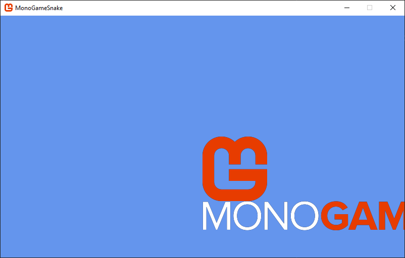
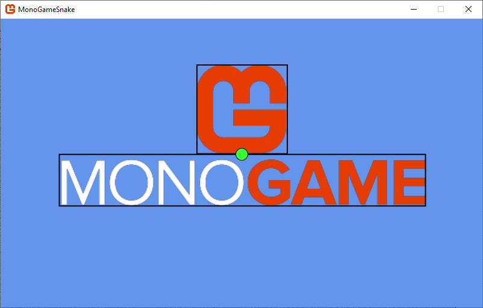
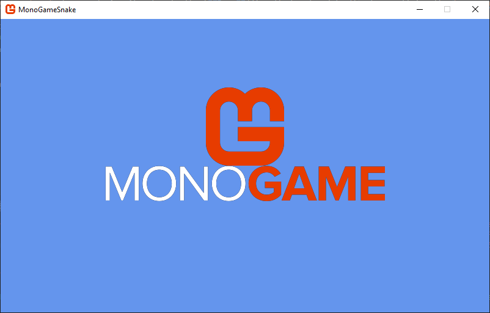

In [Chapter 05](../05_working_with_textures/index.md), you learned how to load and render textures using [**SpriteBatch**](). While rendering individual textures works well for simple games, it can lead to performance issues as your game grows more complex. In this chapter, we'll explore how to optimize texture rendering by reducing texture swaps and creating reusable components for better organization.

In this chapter, you will:
- Learn about texture swapping and its impact on performance.
- Understand what texture atlases are and how they can improve rendering efficiency.
- Create a reusable `Sprite` class to simplify texture atlas usage.

By the end of this chapter, you'll understand how to organize your game's textures for optimal performance and have a flexible sprite system for your future game projects.

## Texture Swapping
Every time the [**SpriteBatch.Draw**]() method is executed with a different *texture* parameter than the previous [**SpriteBatch.Draw**]() method call, a *texture swap* occurs, unbinding the current texture on the GPU and binding the new texture.

> [!NOTE]
> A texture swap occurs when the GPU needs to switch between different textures during rendering. While each individual swap may seem trivial, the cumulative effect in a complex game can significantly impact performance.

For example, let's explore the following simplified draw calls for an example Pong game:

```cs
// Using the paddle texture to render the left player paddle.
// The paddle texture is bound to the GPU.
_spriteBatch.Draw(paddleTexture, leftPaddlePosition, Color.White);

// Using the ball texture to render the ball
// A texture swap occurs, unbinding the paddle texture to bind the ball texture.
_spriteBatch.Draw(ballTexture, ballPosition, Color.White);

// Reusing the paddle texture to draw the right player paddle.
// A texture swap occurs again, unbinding the ball texture to bind the paddle texture.
_spriteBatch.Draw(paddleTexture, rightPaddlePosition, Color.White);
```

In the above example:

1. The paddle texture is bound to the GPU so the left player paddle can be drawn.
2. The paddle texture is unbound from the GPU and the ball texture is bound so that the ball can be drawn (Texture Swap #1).
3. The ball texture is unbound from the GPU and the paddle texture is bound again so the right player paddle can be drawn (Texture Swap #2).

These texture swaps, while negligible in this example, can become a performance issue in a full game where you might be drawing hundreds or thousands of sprites per frame.

### Attempting to Optimize Draw Order
One approach to get around this could be to optimize the order of the draw calls to minimize texture swaps:

```cs
// Render the left and right paddles first.
// This reduces the number of texture swaps needed from two to one.
_spriteBatch.Draw(paddleTexture, _leftPaddlePosition, Color.White);
_spriteBatch.Draw(paddleTexture, _rightPaddlePosition, Color.White);
_spriteBatch.Draw(ballTexture, _ballPosition, Color.White);
```

This approach does reduce the texture swaps, however it is not a scalable solution. In a real game with dozens of different textures and complex draw orders for layered sprites, UI elements, particles, etc., managing draw order by texture becomes impractical and will conflict with desired visual layering.

## What is a Texture Atlas
A texture atlas (also known as a sprite sheet) is a large image file that contains multiple smaller images packed together. Instead of loading separate textures for each game element, you load the single texture file with all the images combined like a scrapbook where all your photos are arranged on the same page.

> [!NOTE]
> Using a texture atlas not only eliminates texture swaps but also reduces memory usage and simplifies asset management since you're loading and tracking a single texture instead of many individual ones.

In the Pong example, imagine taking the paddle and ball image and combining them into a single image file like in Figure 6-1 below:

<figure><figcaption><p><strong>Figure 6-1: Pong Texture Atlas Example.</strong></p></figcaption></figure>

Now when we draw these images, we would be using the same texture and just specify the source rectangles for the paddle or ball when needed, completely eliminating texture swaps.

```cs
private Texture2D _textureAtlas;
private Rectangle _paddleSourceRect;
private Rectangle _ballSourceRect;

protected override void LoadContent()
{
    _textureAtlas = Content.Load<Texture2D>("pong-atlas");
    _paddleSourceRect = new Rectangle(0, 0, 32, 32);
    _ballSourceRect = new Rectangle(32, 0, 32, 32);
}

protected override void Draw(GameTime gameTime)
{
    GraphicsDevice.Clear(Color.CornflowerBlue);

    _spriteBatch.Begin();
    
    // All draw calls use the same texture, so there is no texture swapping!
    _spriteBatch.Draw(_textureAtlas, _leftPaddlePosition, _paddleSourceRect, Color.White);
    _spriteBatch.Draw(_textureAtlas, _rightPaddlePosition, _paddleSourceRect, Color.White);
    _spriteBatch.Draw(_textureAtlas, _ballPosition, _ballSourceRect, Color.White);
    
    _spriteBatch.End();
}
```

> [!TIP]
> When creating a texture atlas, organize related sprites close together and try to minimize empty space between sprites. This makes the atlas more efficient and easier to maintain.

## Defining the `Sprite` Class
While using texture atlases solves the performance issues of texture swapping, managing multiple source rectangles and draw parameters for each sprite can become complex as your game grows. In the Pong game we are already tracking source rectangles for both the paddle and ball sprites. Imagine scaling this up to a game with dozens of different sprites, each potentially needing their own position, rotation, scale, and other rendering properties. 

To better organize this complexity, we can apply object-oriented design principles by creating a `Sprite` class that encapsulates all the information needed to render a sprite from our texture atlas. 

The following table lists the fields, properties, and methods needed for the `Sprite` class we will create:

| Property          | Type                  | Description                                                                                                          |
| ----------------- | --------------------- | -------------------------------------------------------------------------------------------------------------------- |
| `Texture`         | [**Texture2D**]()     | The source texture used when rendering the sprite.                                                                   |
| `SourceRectangle` | [**Rectangle**]()     | The boundary within the source texture to render.                                                                    |
| `Color`           | [**Color**]()         | The color tint to apply when rendering the sprite.                                                                   |
| `Rotation`        | `float`               | The amount of rotation, in radians, to apply when rendering the sprite.                                              |
| `Scale`           | [**Vector2**]()       | The scale factor to apply to the x- and y-axes when rendering the sprite.                                            |
| `Origin`          | [**Vector2**]()       | The xy-coordinate origin point, relative to the top-left corner, of the sprite.                                      |
| `Effects`         | [**SpriteEffects**]() | The [**SpriteEffects**]() value to apply when rendering to flip the sprite horizontally, vertically, or both.        |
| `LayerDepth`      | `float`               | The depth at which the sprite is rendered.                                                                           |
| `Width`           | `float`               | The width of the sprite, calculated by multiplying the width of the `_sourceRectangle` by the x-axis scale factor.   |
| `Height`          | `float`               | The height of the sprite, calculated by multiplying the height of the `_sourceRectangle` by the y-axis scale factor. |

| Method                         | Returns  | Description                                                                                              |
| ------------------------------ | -------- | -------------------------------------------------------------------------------------------------------- |
| `Sprite(Texture2D, Rectangle)` | `Sprite` | Creates a new instance of the `Sprite` class using source texture and source rectangle parameters given. |
| `Draw(SpriteBatch, Vector2)`   | `void`   | Draws the sprite using the [**SpriteBatch**]() provided at the specified position.                       |

> [!NOTE]
> The properties of the `Sprite` class directly correspond to the parameters used in [**SpriteBatch.Draw**](). This design makes it simple to encapsulate all rendering information while maintaining flexibility in how each sprite is displayed.

> [!TIP]
> The `Width` and `Height` properties automatically account for scaling, making it easier to perform calculations like collision detection or positioning without manually applying the scale factor each time.

## Adding the `Sprite` class

Now that we have defined what the `Sprite` class should be, let's create it.  Instead of adding this to the game project, we're going to add it to the *MonoGameLibrary* class library project that was setup in [Chapter 04](../04_game_library/index.md).  Perform the following:

1. Add a new folder to the *MonoGameLibrary* project named *Graphics*.
2. Create a new file named *Sprite.cs* in that folder.

Add the following code for the foundation of the `Sprite` class to the *Sprite.cs* file:

```cs
using System.Diagnostics;
using Microsoft.Xna.Framework;
using Microsoft.Xna.Framework.Graphics;

namespace MonoGameLibrary.Graphics;

public class Sprite
{

}
```

> [!NOTE]
> The *Sprite.cs* class file is placed in the *MonoGame/Graphics* directory and the class uses the `MonoGame.Graphics` namespace to keep rendering-related classes organized together.  As we add more functionality to the library, we'll continue to use directories and namespaces to maintain a clean structure.

### Properties
Let's start by adding the properties needed to store the sprite's rendering information:

```cs
/// <summary>
/// Gets the source texture used when rendering this Sprite.
/// </summary>
public Texture2D Texture { get; }

/// <summary>
/// Gets the source rectangle that represents the region within the source texture to use
/// when rendering this Sprite.
/// </summary>
public Rectangle SourceRectangle { get; protected set; }

/// <summary>
/// Gets or Sets the color tint to apply when rendering this sprite.
/// Default value is Color.White.
/// </summary>
public Color Color { get; set; } = Color.White;

/// <summary>
/// Gets or Sets the amount of rotation, in radians, to apply when rendering this sprite.
/// Sprite is rotated around the Origin.
/// Default value is 0.0f
/// </summary>
public float Rotation { get; set; } = 0.0f;

/// <summary>
/// Gets or Sets the scale factor to apply to the x- and y-axes when rendering this sprite.
/// Sprite is scaled from the Origin.
/// Default value is Vector2.One.
/// </summary>
public Vector2 Scale { get; set; } = Vector2.One;

/// <summary>
/// Gets or Sets the xy-coordinate origin point, relative to the top-left corner, of this sprite.
/// Default value is Vector2.Zero
/// </summary>
public Vector2 Origin { get; set; } = Vector2.Zero;

/// <summary>
/// Gets or Sets whether this sprite should be flipped horizontally, vertically, or both, when rendered.
/// Default value is SpriteEffects.None.
/// </summary>
public SpriteEffects Effects { get; set; } = SpriteEffects.None;

/// <summary>
/// Gets or Sets the depth at which this sprite is rendered.
/// Default value is 0.0f.
/// </summary>
public float LayerDepth { get; set; } = 0.0f;

/// <summary>
/// Gets the width of this sprite multiplied by the x-axis scale factor.
/// </summary>
public float Width => SourceRectangle.Width * Scale.X;

/// <summary>
/// Gets the height of this sprite, multiplied by the y-axis scale factor.
/// </summary>
public float Height => SourceRectangle.Height * Scale.Y;
```

The above adds the following properties to the `Sprite` class:

- The `Texture` property is a get-only property since there is no design reason it should even change once a `Sprite` instance is created.
- The `SourceRectangle` property has a public getter while the setter is *protected*.  This is setting the stage to extend the `Sprite` class later when we explore creating animated sprites.
- The `Color`, `Rotation`, `Scale`, `Origin`, `Effects`, and `LayerDepth` properties encapsulate the parameters of the [**SpriteBatch.Draw**]() method; each property set to the default value that would be given when the method is called.
- The `Width` and `Height` properties are get-only properties that are calculated based on the width and height of the `SourceRectangle` property, multiplied by the scale factor.  This automatically accounts for scaling, making it easier to perform calculations like collision detection or positioning without manually applying the scale factor each time.

### Constructor
Now that we have the properties defined, let's add a constructor:

```cs
/// <summary>
/// Creates a new Sprite instance using the source texture and source rectangle provided.
/// </summary>
/// <param name="texture">The source texture of the sprite.</param>
/// <param name="sourceRectangle">The source rectangle to use when rendering the sprite.</param>
public Sprite(Texture2D texture, Rectangle sourceRectangle)
{
    Debug.Assert(texture is not null);
    Debug.Assert(!texture.IsDisposed);

    Texture = texture;
    SourceRectangle = sourceRectangle;
}
```

The constructor requires two parameters, a [**Texture2D**]() and a [**Rectangle**](), representing the source texture (texture atlas) and the boundry within the atlas where the sprite is.  Before storing the references, checks are made to ensure:

- The [**Texture2D**]() given is not null
- The [**Texture2D**]() given was not previously disposed of
- The [**Rectangle**]() given is a boundary that is contained within the [**Texture2D**]().

You might think that adding these checks are pointless, because when would you ever pass in a null or disposed texture, or provide a source rectangle that is out of bounds of the texture bounds. Of course you would never do this right?  Well, we're all human and sometimes we make mistakes.  It's always best to check yourself to be sure before you publish your game with bugs that could have been avoided.

> [!TIP]  
> Instead of throwing exceptions in the constructor when performing these checks,  `Debug.Assert` is used here.  This has a similar result as throwing an exception, except that the line of code is only ever executed when you run the code in a Debug build.  It asserts that the statement provided is true.  If the statement is false, then code execution will be paused at that line of code similar to if you add a breakpoint to debug.  This allows you to catch any issues while developing your game and running in a Debug build without needing to throw exceptions.  
>
> The `Debug.Assert` lines of code are also removed completely when you compile the project in a Release build, so you don't have to worry about debug specific code making its way into your final release.

### Draw Method
Finally, add the method responsible for rendering the sprite:

```cs
/// <summary>
/// Draws this sprite using the SpriteBatch given at the position specified.
/// </summary>
/// <param name="spriteBatch">The SpriteBatch to use when rendering this sprite.</param>
/// <param name="position">The xy-coordinate position to render this sprite at.</param>
public void Draw(SpriteBatch spriteBatch, Vector2 position)
{
    spriteBatch.Draw(Texture, position, SourceRectangle, Color, Rotation, Origin, Scale, Effects, LayerDepth);
}
```

The `Draw` method requires two parameters, a [**SpriteBatch**]() instance used to render the sprite and a [**Vector2**]() specifying the position to render the sprite at.  Here, the [**SpriteBatch.Draw**]() method is executed using the properties of the `Sprite` as the parameters, with the [**Vector2**]() specified as the position.

Now that we have built and explained each part of the `Sprite` class, here is the complete implementation for comparison:

```cs
using System.Diagnostics;
using Microsoft.Xna.Framework;
using Microsoft.Xna.Framework.Graphics;

namespace MonoGameLibrary.Graphics;

public class Sprite
{
    /// <summary>
    /// Gets the source texture used when rendering this Sprite.
    /// </summary>
    public Texture2D Texture { get; }

    /// <summary>
    /// Gets the source rectangle that represents the region within the source texture to use
    /// when rendering this Sprite.
    /// </summary>
    public Rectangle SourceRectangle { get; protected set; }

    /// <summary>
    /// Gets or Sets the color tint to apply when rendering this sprite.
    /// Default value is Color.White.
    /// </summary>
    public Color Color { get; set; } = Color.White;

    /// <summary>
    /// Gets or Sets the amount of rotation, in radians, to apply when rendering this sprite.
    /// Sprite is rotated around the Origin.
    /// Default value is 0.0f
    /// </summary>
    public float Rotation { get; set; } = 0.0f;

    /// <summary>
    /// Gets or Sets the scale factor to apply to the x- and y-axes when rendering this sprite.
    /// Sprite is scaled from the Origin.
    /// Default value is Vector2.One.
    /// </summary>
    public Vector2 Scale { get; set; } = Vector2.One;

    /// <summary>
    /// Gets or Sets the xy-coordinate origin point, relative to the top-left corner, of this sprite.
    /// Default value is Vector2.Zero
    /// </summary>
    public Vector2 Origin { get; set; } = Vector2.Zero;

    /// <summary>
    /// Gets or Sets whether this sprite should be flipped horizontally, vertically, or both, when rendered.
    /// Default value is SpriteEffects.None.
    /// </summary>
    public SpriteEffects Effects { get; set; } = SpriteEffects.None;

    /// <summary>
    /// Gets or Sets the depth at which this sprite is rendered.
    /// Default value is 0.0f.
    /// </summary>
    public float LayerDepth { get; set; } = 0.0f;

    /// <summary>
    /// Gets the width of this sprite multiplied by the x-axis scale factor.
    /// </summary>
    public float Width => SourceRectangle.Width * Scale.X;

    /// <summary>
    /// Gets the height of this sprite, multiplied by the y-axis scale factor.
    /// </summary>
    public float Height => SourceRectangle.Height * Scale.Y;

    /// <summary>
    /// Creates a new Sprite instance using the source texture and source rectangle provided.
    /// </summary>
    /// <param name="texture">The source texture of the sprite.</param>
    /// <param name="sourceRectangle">The source rectangle to use when rendering the sprite.</param>
    public Sprite(Texture2D texture, Rectangle sourceRectangle)
    {
        Debug.Assert(texture is not null);
        Debug.Assert(!texture.IsDisposed);

        Texture = texture;
        SourceRectangle = sourceRectangle;
    }

    /// <summary>
    /// Draws this sprite using the SpriteBatch given at the position specified.
    /// </summary>
    /// <param name="spriteBatch">The SpriteBatch to use when rendering this sprite.</param>
    /// <param name="position">The xy-coordinate position to render this sprite at.</param>
    public void Draw(SpriteBatch spriteBatch, Vector2 position)
    {
        spriteBatch.Draw(Texture, position, SourceRectangle, Color, Rotation, Origin, Scale, Effects, LayerDepth);
    }
}
```

## Using the `Sprite` Class
With the `Sprite` class now created, let's see it in action.  Recall the illustration of the MonoGame logo we added to the game broken down into texture regions from [Chapter 05](../05_working_with_textures/index.md#texture-regions):

<figure><figcaption><p><strong>Figure 6-2: The MonoGame logo broken down into texture regions.</strong></p></figcaption></figure>

The contents of this image are similar to a texture atlas.  Within the single image it contains two separate images:

- The MonoGame logo icon at (0, 0) with a width of 128px and a height of 128px.
- The MonoGame wordmark at (150, 34) with a width of 458px and a height of 58px.

Knowing this, let's adjust the code in our game to use the new `Sprite` class to create a logo and wordmark sprite from the single image.  First, open the *Game1.cs* file and add the following namespace using statement at the top:

```cs
using MonoGameLibrary.Graphics;
```

Next, locate the `_logo` instance member field declaration and add the following directly after:

```cs
// Sprite object that represents the MonoGame icon within the logo texture.
private Sprite _monogameIcon;

// Sprite object that represents the MonoGame wordmark within the logo texture.
private Sprite _monogameWordmark;
```

These will be the two `Sprite` instance we will create for the icon and wordmark sprites from the logo texture.  Next, locate the [**LoadContent**]() method and add the following after the logo texture is loaded:

```cs
// Create a new sprite from the logo texture using the texture region that
// contains only the MonoGame icon.
_monogameIcon = new Sprite(_logo, new Rectangle(0, 0, 128, 128));

// Create a new sprite from the logo texture using the texture region that
// contains only the MonoGame wordmark.
_monogameWordmark = new Sprite(_logo, new Rectangle(150, 34, 458, 58));
```

The above code takes the single `_logo` texture and uses it to create both the `_monogameIcon` and `monogameWordmark` sprites.  The *sourceRectangle* parameter provided for each are based on the texture region boundaries shown in Figure 6-2 above.

Next, locate the [**Draw**]() method and replace the entire method with the following:

```cs
protected override void Draw(GameTime gameTime)
{
    GraphicsDevice.Clear(Color.CornflowerBlue);

    // Calculate the center X and Y coordinate position of the game window.
    Vector2 center = new Vector2(Window.ClientBounds.Width, Window.ClientBounds.Height) * 0.5f;

    _spriteBatch.Begin();

    //  Draw the icon sprite at the center of the game window.
    _monogameIcon.Draw(_spriteBatch, center);

    // Draw the wordmark sprite at the center of the game window below the icon.
    _monogameWordmark.Draw(_spriteBatch, new Vector2(center.X, center.Y + _monogameIcon.Height));

    _spriteBatch.End();

    base.Draw(gameTime);
}
```

The new code for the [**Draw**]() method now renders both sprites.  Since both sprites are using the same source [**Texture2D**](), no texture swapping occurs between the calls.  The center of the game window is calculated and used as the position to draw each of the sprites, with the `_monogameWordmark` sprite being drawn below the `_monogameIcon` sprite by making using of the `Sprite.Height` property.  Let's run the game and see the result.

<figure><figcaption><p><strong>Figure 6-3: The MonoGame icon and wordmark.</strong></p></figcaption></figure>

We have a similar problem that we saw [in the previous chapter](../05_working_with_textures/index.md#drawing-a-texture); the sprites are *technically* drawn correctly at the center of the screen, but the `Origin` was never set for them, so it's default is the upper-left corner of each sprite.  Our goal here is to draw the sprites such that the logo is centered on top of the wordmark and both are centered on the game window.  Take a look at Figure 6-4 below:

<figure><figcaption><p><strong>Figure 6-3: The MonoGame icon and wordmark centered on the game window with the origin point shown.</strong></p></figcaption></figure>

The green circle in the image represents the center of the game window.  In order to render the sprites like shown in the image, we need to adjust their `Origin` properties so they align with where the green circle is.  

- For the MonoGame logo, we can see that the origin would be at the bottom-center of the sprite.
- For the MonoGame wordmark, we can see that the origin would be at the upper-center of the sprite.

Now that we know where the origins should be, let's update our code.  Locate the [**LoadContent**]() method and add the following after the two sprites are created:

```cs
// Set the origin of the icon sprite to the bottom-center
_monogameIcon.Origin = new Vector2(_monogameIcon.SourceRectangle.Width * 0.5f, _monogameIcon.SourceRectangle.Height);

// Set the origin of the wordmark sprite to the upper-center
_monogameWordmark.Origin = new Vector2(_monogameWordmark.SourceRectangle.Width * 0.5f, 0);
```

The above sets the correct `Origin` property for both sprites.  Notice that both use the [**Width**]() property of the `SourceRectangle` for each sprite to get the X coordinate center for the origin.  When setting the origin, it needs to be relative to the bounds of what is being drawn, in this case the bounding source rectangle of each sprite.  The [**Rectangle**]() struct in MonoGame does have a [**Center**]() property, but that would not have been correct to use here.  The `SourceRectangle` for the `_monogameWordmark` is (150, 34) with a width of 458px and a height of 58px, so the *center* would have been 379, which is half the width from the X coordinate position of the rectangle (150 + 458/2).  Instead we just need the center of the bounds of the rectangle, which we get by calculating half the width.

Now that we've set the `Origin` property for both sprites, we no longer need to adjust the position of the `_monogameWordmark` by the height of the `_monogameLogo` when rendering it.  Locate the [**Draw**]() method and update the draw call for the `_monogameWordmark` to the following:

```cs
// Draw the wordmark sprite at the center of the game window.
_monogameWordmark.Draw(_spriteBatch, center);
```

Running the game now produces the expected result.

<figure><figcaption><p><strong>Figure 6-3: The MonoGame icon and wordmark centered on the game window.</strong></p></figcaption></figure>

- A single texture is used to render two sprites, so no texture swapping
- The logo is centered on top of the wordmark, and both are centered relative to the game window


