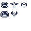
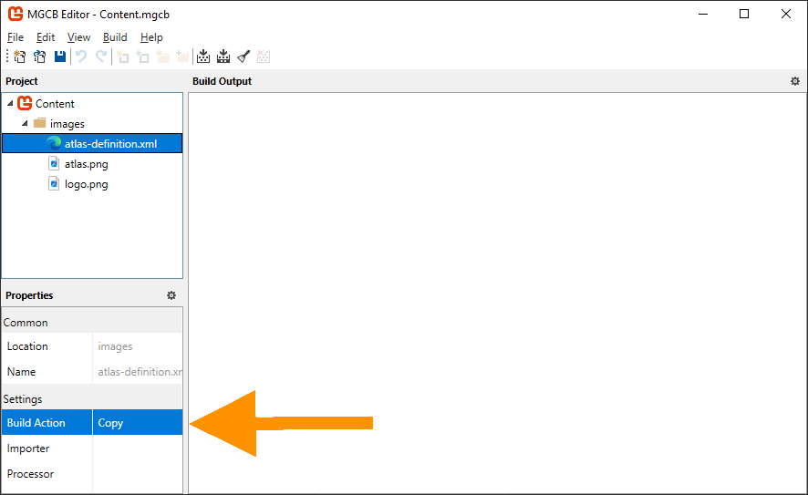

In [Chapter 06](../06_working_with_textures/index.md), you learned how to load and render textures using [**SpriteBatch**](xref:Microsoft.Xna.Framework.Graphics.SpriteBatch). While rendering individual textures works well for simple games, it can lead to performance issues as your game grows more complex. In this chapter, we will explore how to optimize texture rendering by reducing texture swaps and creating reusable components for better organization.

In this chapter, you will:

- Learn about texture swapping and its impact on performance.
- Explore texture atlases as a solution for optimizing texture rendering.
- Create reusable classes to optimize and simplify texture management and rendering.

By the end of this chapter, you will understand how to organize your game's textures for optimal performance and have a flexible texture atlas management system for your future game projects.

## Texture Swapping

Every time the [**SpriteBatch.Draw**](xref:Microsoft.Xna.Framework.Graphics.SpriteBatch.Draw(Microsoft.Xna.Framework.Graphics.Texture2D,Microsoft.Xna.Framework.Vector2,System.Nullable{Microsoft.Xna.Framework.Rectangle},Microsoft.Xna.Framework.Color,System.Single,Microsoft.Xna.Framework.Vector2,Microsoft.Xna.Framework.Vector2,Microsoft.Xna.Framework.Graphics.SpriteEffects,System.Single)) method is executed with a different *texture* parameter than the previous [**SpriteBatch.Draw**](xref:Microsoft.Xna.Framework.Graphics.SpriteBatch.Draw(Microsoft.Xna.Framework.Graphics.Texture2D,Microsoft.Xna.Framework.Vector2,System.Nullable{Microsoft.Xna.Framework.Rectangle},Microsoft.Xna.Framework.Color,System.Single,Microsoft.Xna.Framework.Vector2,Microsoft.Xna.Framework.Vector2,Microsoft.Xna.Framework.Graphics.SpriteEffects,System.Single)) method call, a *texture swap* occurs, unbinding the current texture on the GPU and binding the new texture.

> [!NOTE]
> A texture swap occurs when the GPU needs to switch between different textures during rendering. While each individual swap may seem trivial, the cumulative effect in a complex game can significantly impact performance.

For example, here is are the simplified draw call for an example Pong game:

[!code-csharp]

In the above example:

1. The paddle texture is bound to the GPU so the left player paddle can be drawn.
2. The paddle texture is unbound from the GPU and the ball texture is bound so that the ball can be drawn (Texture Swap #1).
3. The ball texture is unbound from the GPU and the paddle texture is bound again so the right player paddle can be drawn (Texture Swap #2).

These texture swaps, while negligible in this example, can become a performance issue in a full game where you might be drawing hundreds or thousands of sprites per frame.

### Attempting to Optimize Draw Order

One approach to get around this could be to optimize the order of the draw calls to minimize texture swaps.  For example, if we reorder the draw calls from the previous example so that both paddles are drawn first and then the ball, the number of texture swaps is reduced from two to one:

[!code-csharp]

However this is not a scalable solution. In a real game with dozens of different textures and complex draw orders for layered sprites, UI elements, particles, etc., managing draw order by texture becomes impractical and will conflict with desired visual layering.

## What is a Texture Atlas

A texture atlas (also known as a sprite sheet) is a large image file that contains multiple smaller images packed together. Instead of loading separate textures for each sprite, you load the single texture file with all the images combined like a scrapbook where all your photos are arranged on the same page.

> [!NOTE]
> Using a texture atlas not only eliminates texture swaps but also reduces memory usage and simplifies asset management since you are loading and tracking a single texture instead of many individual ones.

In the Pong example, imagine taking the paddle and ball image and combining them into a single image file like in *Figure 7-1* below:

|  |
|:------------------------------------------------------------------:|
|             **Figure 7-1: Pong Texture Atlas Example**             |

Now when we draw these images, we would be using the same texture and just specify the source rectangles for the paddle or ball when needed, completely eliminating texture swaps.

[!code-csharp]

While using the single texture with source rectangles solves the potential performance issues, managing multiple source rectangles in variables can become complex as your game grows.  In the Pong example above, we are already tracking the source rectangles for both the paddle and ball sprites. Imagine scaling this up to a game with dozens of different images, each potentially needing their own position, rotation, scale, and other rendering properties.  

To better organize this complexity, we can apply object-oriented design principles to create classes that encapsulates the information needed.

## The TextureRegion Class

In [Chapter 06](../06_working_with_textures/index.md#source-rectangle), we learned about using the `sourceRectangle` parameter to reuse the same texture when rendering sprites but specifying different regions within the texture to render.  For our next step, we will build on this and create a class called `TextureRegion`.

We are going to add this class to the class library we created in [Chapter 04](../04_creating_a_class_library/index.md).  Perform the following:

1. Add new folder in the *MonoGameLibrary* project named `Graphics`
2. Create a new file named `TextureRegion.cs` inside the *Graphics* folder you just created.
3. Add the following code for the foundation of the `TextureRegion` class to the file:

[!code-csharp]

> [!NOTE]
> The `TextureRegion.cs` class file is placed in the *MonoGame/Graphics* folder and the class uses the `MonoGameLibrary.Graphics` [namespace](https://learn.microsoft.com/en-us/dotnet/csharp/fundamentals/types/namespaces#namespaces-overview) to keep graphics-related classes organized together.  As we add more functionality to the library, we will continue to use directories and namespaces to maintain a clean structure.

We will add several components to this class in sequence. Each section below should be added to the `TextureRegion` class in the order presented between the brackets ` { } ` of the class definition. As we go through each part, the class will gradually take shape to handle all the texture handling behavior we need.

### TextureRegion Members

The `TextureRegion` class will utilize four properties to define and manage a region within a texture.  Add the following properties:

[!code-csharp]

The `Texture` and `SourceRectangle` properties work together to define where the region is located: `Texture` specifies which texture contains the region, while `SourceRectangle` defines its exact location and size within that texture. The `Width` and `Height` properties provide convenient access to the region's dimensions without having to access the SourceRectangle property directly.

### TextureRegion Constructor

The `TextureRegion` class provides two ways to create a new texture region.

Add the following constructors:

[!code-csharp]

* The default constructor creates an empty texture region that can be configured later.
* The parameterized constructor allows you to define the region's source texture and boundary in a single step.

The second constructor provides a convenient way to create texture regions when you know the exact location and dimensions within the source texture upfront.

### TextureRegion Methods

Finally, the `TextureRegion` class will provide three overloaded Draw methods to render the texture region. Add the following methods:

[!code-csharp]

These methods provide flexible options for rendering the texture region, similar to what the [**SpriteBatch.Draw**](xref:Microsoft.Xna.Framework.Graphics.SpriteBatch.Draw(Microsoft.Xna.Framework.Graphics.Texture2D,Microsoft.Xna.Framework.Vector2,System.Nullable{Microsoft.Xna.Framework.Rectangle},Microsoft.Xna.Framework.Color,System.Single,Microsoft.Xna.Framework.Vector2,System.Single,Microsoft.Xna.Framework.Graphics.SpriteEffects,System.Single)) method does:

- The simplest overload requires only position and color.
- A second overload exposes all rendering parameters while allowing for a single float value to be applied to both axes for scaling.
- The third overload is the most flexible, offering all rendering parameters and independent x- and y-axis scaling.

Only the last `Draw` method actually uses the `Texture` specified in the class, as the other two methods both depend on this final implementation, simplifying the code needed to actually do the drawing.

## The TextureAtlas Class

In the [What is a Texture Atlas](#what-is-a-texture-atlas) section above, a texture atlas was described as a scrap book that holds all of the individual sprites for the game.  These individual sprites can now be represented by the `TextureRegion` class we just created.  Now, we will create the `TextureAtlas` class to represent the collection of the regions that make up all of our sprites.

Just like the `TextureRegion` class, we are going to add this to the class library.  In the *Graphics* folder within the *MonoGameLibrary* project, add a new file named `TextureAtlas.cs`, then add the following code for the foundation of the `TextureAtlas` class:

[!code-csharp]

As before, each section below adds more functionality to this class, one after the other within the `TextureAtlas` class.

### TextureAtlas Members

The `TextureAtlas` class needs two key members to manage texture regions. Add the following:

[!code-csharp]

The private `_regions` dictionary stores named texture regions, allowing us to retrieve specific regions by name, while the `Texture` property holds the source texture that contains all the regions. Together, these members enable the atlas to manage multiple texture regions from a single source texture.

### TextureAtlas Constructors

The `TextureAtlas` class provides two ways to create a new atlas.

Add the following constructors:

[!code-csharp]

* The default constructor creates an empty atlas that can be configured later.
* The parameterized constructor allows you to specify the source texture immediately.

Both constructors initialize the `_regions` dictionary so that it is ready to be used either way.

### TextureAtlas Methods

Finally, The `TextureAtlas` class will provide methods for managing texture regions and creating atlases from configuration files. Add the following methods:

[!code-csharp]

These methods serve different purposes in managing the texture atlas:

1. Region Management
    - `AddRegion`: Creates a new `TextureRegion` at the specified location in the atlas.
    - `GetRegion`: Retrieves a previously added region by its name.
    - `RemoveRegion`: Removes a specific region by its name.
    - `Clear`: Removes all regions from the atlas.
2. Atlas Creation
    - `FromFile`: creates a new `TextureAtlas` from an XML configuration file. This method will load the source texture then create and add the regions based on the XML configuration.  We will look more into using the XML configuration in a moment.

## Using the TextureAtlas Class

Now we can put our new `TextureAtlas` class to use by exploring two approaches; creating an atlas manually and using XML configuration.  So far, we have been practicing using textures with the MonoGame logo. Now we will use a new texture atlas that contains various sprites we will need for our game.

Download the texture atlas by right-clicking the following image and saving it as atlas.png:

|  |
|:-----------------------------------------------------------------:|
|          **Figure 7-2: The texture atlas for our game**           |

> [!TIP]
> You may notice that our texture atlas image has some empty areas, which seems like a waste.  Its dimensions are 256x256 pixels when it could have just been 240x160 pixels.
>
> **This is intentional.**
>
> Game graphics often use texture dimensions that are powers of 2 (128, 256, 512, 1024, etc.) for technical reasons. While modern graphics hardware can handle any texture size, power-of-2 dimensions provide better memory efficiency and more precise rendering. When pixel coordinates are converted to texture coordinates during rendering, powers of 2 can be represented more precisely in floating-point calculations, helping prevent visual artifacts like texture seams.
>
> This is not critical for simple 2D games, but adopting this practice early will serve you well as your games become more complex.

Add this texture atlas to your content project using the MGCB Editor:

1. Open the *Content.mgcb* file in the MGCB Editor
2. In the editor, right-click the *images* folder and choose *Add > Existing item...*.
3. Navigate to and choose the *atlas.png* file you downloaded to add it.
4. Save the changes and close the MGCB Editor.

> [!TIP]
> If you need a refresher on adding content using the MGCB Editor, you can revisit the [Chapter 05: The Content Pipeline](../05_content_pipeline/index.md).

First, we will explore creating the texture atlas and defining the texture regions directly in code.  Replace the contents of `Game1.cs` with the following:

[!code-csharp]

The key changes in this implementation are:

1. The `_logo` field was removed.
2. Added  `TextureRegion` members for the slime and bat sprites.
3. In [**LoadContent**](xref:Microsoft.Xna.Framework.Game.LoadContent):
    - Removed loading the logo texture.
    - Created a `TextureAtlas` with the atlas texture.
    - Added regions for both the slime and the bat.
    - Retrieved the regions using their names.
4. Updated [**Draw**](xref:Microsoft.Xna.Framework.Game.Draw(Microsoft.Xna.Framework.GameTime)) to:
   - Draw the slime at a scale factor of 4.
   - Draw the bat 10 pixels to the right of the slime based on the slime's `Width` property, at a scale of 4.

Running the game now shows both sprites in the upper-left corner:

|  |
|:------------------------------------------------------------------------------------------------------------------------------------------------:|
|                   **Figure 7-3: The slime and bat texture regions being rendered in the upper-left corner of the game window**                   |

While manual creation works for a few sprites, managing many regions becomes cumbersome. Now we will explore the `TextureAtlas.FromFile` method to load our atlas configuration from XML instead. Perform the following:

1. Open the *Content.mgcb* file in the MGCB Editor
1. Create a new file named `atlas-definition` in the *Content/images* folder using "Add -> New Item -> XML Content".
1. In the properties panel at the bottom for the `atlas-definition.xml` file, change the *`Build Action`* property from `Build` to *`Copy`*.
1. Save the changes and close the MGCB Editor
1. Open the new `atlas-definition.xml` file in your code editor (The MGCB editor cannot edit files, only manage the what content it builds)
1. Replace the contents of the XML file with the following:

    [!code-xml]

    |  |
    |:---------------------------------------------------------------------------------------------------------------------------------------------------:|
    |                **Figure 7-4: The atlas-definition.xml file added to the content project with the Build Action property set to Copy**                |

    > [!TIP]
    > Using the content pipeline to copy files ensures they are placed in the correct location alongside other game content. While there are other methods (like editing the .csproj), this approach keeps asset management centralized

1. Update the contents of `Game1.cs` with the following code:

    [!code-csharp]

The key improvements here is in [**LoadContent**](xref:Microsoft.Xna.Framework.Game.LoadContent), where we now:

- Create an atlas from the XML configuration file.
- Let the `TextureAtlas.FromFile` method handle texture loading and region creation.
- Removed the manual creation of regions in code.

This configuration based approached is advantageous because we can now add new and modify existing regions within the atlas without having to change code and/or recompile.  This also keeps the sprite definitions separate from the game logic.

Running the game now will show the same results as *Figure 7-4* above, with the slime and bat texture regions rendered in the upper-left corner of the game window.

## Conclusion

In this chapter, you accomplished the following:

- Learned about texture swapping and its impact on performance
- Explored texture atlases as a solution for optimizing texture rendering
- Learned what a class library is and the benefits of using one.
- Created reusable `TextureRegion` and `TextureAtlas` classes to optimize and simplify texture management.
- Learned how to include assets in the content pipeline that should only be copied and not processed.

In the next chapter, we will build on the concepts of the `TextureAtlas` and explore creating the `Sprite` and `AnimatedSprite` classes to further simplify managing and rendering sprites.

## Test Your Knowledge

1. What is a texture swap and why can it impact performance?

    :::question-answer
    A texture swap occurs when the GPU needs to unbind one texture and bind another between draw calls. While individual swaps may seem trivial, they can significantly impact performance in games with many sprites as each swap is an expensive GPU operation.
    :::

2. Name a benefit of using a texture atlas.

    :::question-answer
    Any of the following are benefits of using a texture atlas:

    - Eliminates texture swaps by using a single texture
    - Reduces memory usage
    - Simplifies asset management
    - Improves rendering performance

    :::
