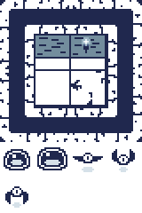
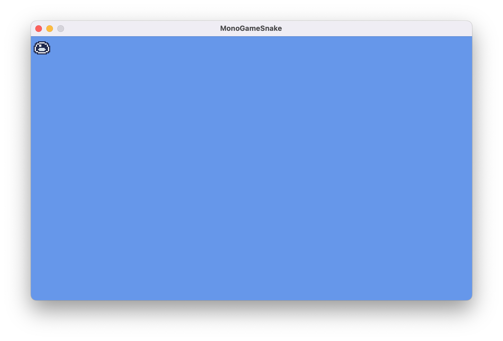
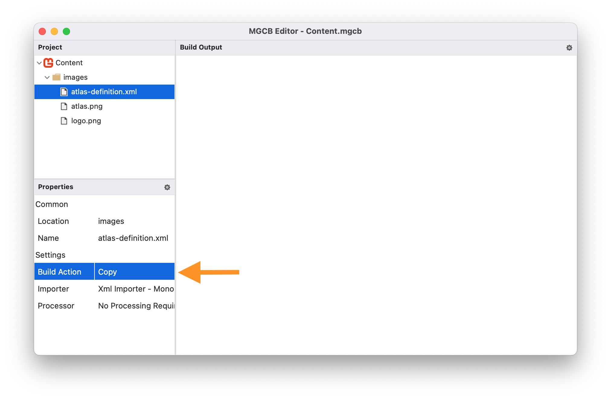

In [Chapter 07](../07_working_with_textures/index.md), you learned how to load and render textures using [**SpriteBatch**](xref:Microsoft.Xna.Framework.Graphics.SpriteBatch). While rendering individual textures works well for simple games, it can lead to performance issues as your game grows more complex. In this chapter, we will explore how to optimize texture rendering by reducing texture swaps and creating reusable components for better organization.

In this chapter, you will:

- Learn about texture swapping and its impact on performance.
- Explore texture atlases as a solution for optimizing texture rendering.
- Create reusable classes to optimize and simplify texture management and rendering.

By the end of this chapter, you'll understand how to organize your game's textures for optimal performance and have a flexible texture atlas management system for your future game projects.

## Texture Swapping

Every time the [**SpriteBatch.Draw**](xref:Microsoft.Xna.Framework.Graphics.SpriteBatch.Draw(Microsoft.Xna.Framework.Graphics.Texture2D,Microsoft.Xna.Framework.Vector2,System.Nullable{Microsoft.Xna.Framework.Rectangle},Microsoft.Xna.Framework.Color,System.Single,Microsoft.Xna.Framework.Vector2,Microsoft.Xna.Framework.Vector2,Microsoft.Xna.Framework.Graphics.SpriteEffects,System.Single)) method is executed with a different *texture* parameter than the previous [**SpriteBatch.Draw**](xref:Microsoft.Xna.Framework.Graphics.SpriteBatch.Draw(Microsoft.Xna.Framework.Graphics.Texture2D,Microsoft.Xna.Framework.Vector2,System.Nullable{Microsoft.Xna.Framework.Rectangle},Microsoft.Xna.Framework.Color,System.Single,Microsoft.Xna.Framework.Vector2,Microsoft.Xna.Framework.Vector2,Microsoft.Xna.Framework.Graphics.SpriteEffects,System.Single)) method call, a *texture swap* occurs, unbinding the current texture on the GPU and binding the new texture.

> [!NOTE]
> A texture swap occurs when the GPU needs to switch between different textures during rendering. While each individual swap may seem trivial, the cumulative effect in a complex game can significantly impact performance.

For example, let's explore the following simplified draw calls for an example Pong game:

```cs
// Using the paddle texture to render the left player paddle.
// The paddle texture is bound to the GPU.
_spriteBatch.Draw(paddleTexture, leftPaddlePosition, Color.White);

// Using the ball texture to render the ball
// A texture swap occurs, unbinding the paddle texture to bind the ball texture.
_spriteBatch.Draw(ballTexture, ballPosition, Color.White);

// Reusing the paddle texture to draw the right player paddle.
// A texture swap occurs again, unbinding the ball texture to bind the paddle texture.
_spriteBatch.Draw(paddleTexture, rightPaddlePosition, Color.White);
```

In the above example:

1. The paddle texture is bound to the GPU so the left player paddle can be drawn.
2. The paddle texture is unbound from the GPU and the ball texture is bound so that the ball can be drawn (Texture Swap #1).
3. The ball texture is unbound from the GPU and the paddle texture is bound again so the right player paddle can be drawn (Texture Swap #2).

These texture swaps, while negligible in this example, can become a performance issue in a full game where you might be drawing hundreds or thousands of sprites per frame.

### Attempting to Optimize Draw Order

One approach to get around this could be to optimize the order of the draw calls to minimize texture swaps  For example, if we reorder the draw calls from the previous example so that both paddles are drawn first and then the ball, the number of texture swaps is reduced from two to one:

```cs
// Render the left and right paddles first.
// This reduces the number of texture swaps needed from two to one.
_spriteBatch.Draw(paddleTexture, _leftPaddlePosition, Color.White);
_spriteBatch.Draw(paddleTexture, _rightPaddlePosition, Color.White);
_spriteBatch.Draw(ballTexture, _ballPosition, Color.White);
```

However this is not a scalable solution. In a real game with dozens of different textures and complex draw orders for layered sprites, UI elements, particles, etc., managing draw order by texture becomes impractical and will conflict with desired visual layering.

## What is a Texture Atlas

A texture atlas (also known as a sprite sheet) is a large image file that contains multiple smaller images packed together. Instead of loading separate textures for each sprite, you load the single texture file with all the images combined like a scrapbook where all your photos are arranged on the same page.

> [!NOTE]
> Using a texture atlas not only eliminates texture swaps but also reduces memory usage and simplifies asset management since you're loading and tracking a single texture instead of many individual ones.

In the Pong example, imagine taking the paddle and ball image and combining them into a single image file like in Figure 6-1 below:

|  |
| :---: |
| **Figure 6-1: Pong Texture Atlas Example** |

Now when we draw these images, we would be using the same texture and just specify the source rectangles for the paddle or ball when needed, completely eliminating texture swaps.

```cs
private Texture2D _textureAtlas;
private Rectangle _paddleSourceRect;
private Rectangle _ballSourceRect;

protected override void LoadContent()
{
    _textureAtlas = Content.Load<Texture2D>("pong-atlas");
    _paddleSourceRect = new Rectangle(0, 0, 32, 32);
    _ballSourceRect = new Rectangle(32, 0, 32, 32);
}

protected override void Draw(GameTime gameTime)
{
    GraphicsDevice.Clear(Color.CornflowerBlue);

    _spriteBatch.Begin();
    
    // All draw calls use the same texture, so there is no texture swapping!
    _spriteBatch.Draw(_textureAtlas, _leftPaddlePosition, _paddleSourceRect, Color.White);
    _spriteBatch.Draw(_textureAtlas, _rightPaddlePosition, _paddleSourceRect, Color.White);
    _spriteBatch.Draw(_textureAtlas, _ballPosition, _ballSourceRect, Color.White);
    
    _spriteBatch.End();
}
```

While using the single texture with source rectangles solves the potential performance issues, managing multiple source rectangles in variables can become complex as your game grows.  In the Pong example above, we're already tracking the source rectangles for both the paddle and ball sprites. Imagine scaling this up to a game with dozens of different images, each potentially needing their own position, rotation, scale, and other rendering properties.  

To better organize this complexity, we can apply object-oriented design principles to create classes that encapsulates the information needed.

## The TextureRegion Class

In [Chapter 07](../07_working_with_textures/index.md#source-rectangle), we learned about using the `sourceRectangle` parameter to reuse the same texture when rendering sprites but specifying different regions within the texture to render.  Let's first build on this and create a class called `TextureRegion`.

We're going to add this class to the class library we created in [Chapter 04](../04_creating_a_class_library/index.md).  Perform the following:

1. Add new directory in the *MonoGameLibrary* project named `Graphics`
2. Create a new file named *TextureRegion.cs* inside the *Graphics* directory you just created.

Add the following code for the foundation of the `TextureRegion` class to the *TextureRegion.cs* file:

```cs
using System.Diagnostics;
using Microsoft.Xna.Framework;
using Microsoft.Xna.Framework.Graphics;

namespace MonoGameLibrary.Graphics;

public class TextureRegion
{

}
```

> [!NOTE]
> The *TextureRegion.cs* class file is placed in the *MonoGame/Graphics* directory and the class uses the `MonoGameLibrary.Graphics` [namespace](https://learn.microsoft.com/en-us/dotnet/csharp/fundamentals/types/namespaces#namespaces-overview) to keep graphics-related classes organized together.  As we add more functionality to the library, we will continue to use directories and namespaces to maintain a clean structure.

### TextureRegion Members

The `TextureRegion` class will utilize four properties to define and manage a region within a texture.  Add the following properties:

```cs
/// <summary>
/// Gets or Sets the source texture this texture region is part of.
/// </summary>
public Texture2D Texture { get; set; }

/// <summary>
/// Gets or Sets the source rectangle boundary of this texture region within the source texture.
/// </summary>
public Rectangle SourceRectangle { get; set; }

/// <summary>
/// Gets the width, in pixels, of this texture region.
/// </summary>
public int Width => SourceRectangle.Width;

/// <summary>
/// Gets the height, in pixels, of this texture region.
/// </summary>
public int Height => SourceRectangle.Height;
```

The `Texture` and `SourceRectangle` properties work together to define where the region is located: `Texture` specifies which texture contains the region, while `SourceRectangle` defines its exact location and size within that texture. The `Width` and `Height` properties provide convenient access to the region's dimensions without having to access the SourceRectangle property directly.

### TextureRegion Constructor

The `TextureRegion` class will provide two ways to create a new texture region.  Add the following constructors:

```cs
/// <summary>
/// Creates a new texture region.
/// </summary>
public TextureRegion() { }

/// <summary>
/// Creates a new texture region using the specified source texture.
/// </summary>
/// <param name="texture">The texture to use as the source texture for this texture region.</param>
/// <param name="x">The x-coordinate position of the upper-left corner of this texture region relative to the upper-left corner of the source texture.</param>
/// <param name="y"><The y-coordinate position of the upper-left corner of this texture region relative to the upper-left corner of the source texture./param>
/// <param name="width">The width, in pixels, of this texture region.</param>
/// <param name="height">The height, in pixels, of this texture region.</param>
public TextureRegion(Texture2D texture, int x, int y, int width, int height)
{
    Texture = texture;
    SourceRectangle = new Rectangle(x, y, width, height);
}
```

The default constructor creates an empty texture region that can be configured later, while the parameterized constructor allows you to define the region's source texture and boundary in a single step. This second constructor provides a convenient way to create texture regions when you know the exact location and dimensions within the source texture upfront.

### TextureRegion Methods

Finally, the `TextureRegion` class will provide three overloaded Draw methods to render the texture region. Add the following methods:

```cs
/// <summary>
/// Submit this texture region for drawing in the current batch.
/// </summary>
/// <param name="spriteBatch">The spritebatch instance used for batching draw calls.</param>
/// <param name="position">The xy-coordinate location to draw this texture region on the screen.</param>
/// <param name="color">The color mask to apply when drawing this texture region on screen.</param>
public void Draw(SpriteBatch spriteBatch, Vector2 position, Color color)
{
    Draw(spriteBatch, position, color, 0.0f, Vector2.Zero, Vector2.One, SpriteEffects.None, 0.0f);
}

/// <summary>
/// Submit this texture region for drawing in the current batch.
/// </summary>
/// <param name="spriteBatch">The spritebatch instance used for batching draw calls.</param>
/// <param name="position">The xy-coordinate location to draw this texture region on the screen.</param>
/// <param name="color">The color mask to apply when drawing this texture region on screen.</param>
/// <param name="rotation">The amount of rotation, in radians, to apply when drawing this texture region on screen.</param>
/// <param name="origin">The center of rotation, scaling, and position when drawing this texture region on screen.</param>
/// <param name="scale">The scale factor to apply when drawing this texture region on screen.</param>
/// <param name="effects">Specifies if this texture region should be flipped horizontally, vertically, or both when drawing on screen.</param>
/// <param name="layerDepth">The depth of the layer to use when drawing this texture region on screen.</param>
public void Draw(SpriteBatch spriteBatch, Vector2 position, Color color, float rotation, Vector2 origin, float scale, SpriteEffects effects, float layerDepth)
{
    Draw(
        spriteBatch,
        position,
        color,
        rotation,
        origin,
        new Vector2(scale, scale),
        effects,
        layerDepth
    );
}

/// <summary>
/// Submit this texture region for drawing in the current batch.
/// </summary>
/// <param name="spriteBatch">The spritebatch instance used for batching draw calls.</param>
/// <param name="position">The xy-coordinate location to draw this texture region on the screen.</param>
/// <param name="color">The color mask to apply when drawing this texture region on screen.</param>
/// <param name="rotation">The amount of rotation, in radians, to apply when drawing this texture region on screen.</param>
/// <param name="origin">The center of rotation, scaling, and position when drawing this texture region on screen.</param>
/// <param name="scale">The amount of scaling to apply to the x- and y-axes when drawing this texture region on screen.</param>
/// <param name="effects">Specifies if this texture region should be flipped horizontally, vertically, or both when drawing on screen.</param>
/// <param name="layerDepth">The depth of the layer to use when drawing this texture region on screen.</param>
public void Draw(SpriteBatch spriteBatch, Vector2 position, Color color, float rotation, Vector2 origin, Vector2 scale, SpriteEffects effects, float layerDepth)
{
    spriteBatch.Draw(
        Texture,
        position,
        SourceRectangle,
        color,
        rotation,
        origin,
        scale,
        effects,
        layerDepth
    );
}
```

These methods provide flexible options for rendering the texture region, similar to what the [**SpriteBatch.Draw**](xref:Microsoft.Xna.Framework.Graphics.SpriteBatch.Draw(Microsoft.Xna.Framework.Graphics.Texture2D,Microsoft.Xna.Framework.Vector2,System.Nullable{Microsoft.Xna.Framework.Rectangle},Microsoft.Xna.Framework.Color,System.Single,Microsoft.Xna.Framework.Vector2,System.Single,Microsoft.Xna.Framework.Graphics.SpriteEffects,System.Single)) method does:

- The simplest overload requires only position and color.
- A second overload exposes all rendering parameters while allowing for a single float value to be applied to both axes for scaling.
- The third overload is the most flexible, offering all rendering parameters and independent x- and y-axis scaling.

### Using the TextureRegion Class

Let's put our new `TextureRegion` class to use by creating a simple game scene. So far, we've been practicing using textures with the MonoGame logo.  Now we will use a new texture atlas that contains various sprites we'll need for our game.

Download the texture atlas by right-clicking the following image and saving it as *atlas.png*:

|  |
| :---: |
| **Figure 6-2: The texture atlas for our game** |

Add this texture atlas to your content project using the MGCB Editor:

1. Open the *Content.mgcb* file in the MGCB Editor
2. In the editor, right-click the *images* directory and choose *Add > Existing item...*.
3. Navigate to and choose the *atlas.png* file you downloaded to add it.
4. Save the changes and close the MGCB Editor.

> [!TIP]
> If you need a refresher on adding content using the MGCB Editor, you can revisit the [Adding Assets in the MGCB Editor](../06_content_pipeline/index.md#adding-assets-in-the-mgcb-editor) section of Chapter 04.

Replace the contents of *Game1.cs* with the following code:

[!code-csharp[](./src/Game1-texture-region-usage.cs?highlight=12,32-36,51-56)]

Let's examine the key changes in the code:

1. We added a `TextureRegion` member `_slime` to store our sprite from the atlas.
2. In the [**LoadContent**](xref:Microsoft.Xna.Framework.Game.LoadContent) method, we created a texture region by
    - Loading the atlas texture using the content manager
    - Created a `TextureRegion` that defines the slime's location in the atlas at position 0,160 with the size 40x40.
3. Update the [**Draw**](xref:Microsoft.Xna.Framework.Game.Draw(Microsoft.Xna.Framework.GameTime)) method to render the slime texture region using the `TextureRegion.Draw` method.

Running the game now shows the slime sprite in the upper-left corner of the game window:

|  |
| :---: |
| **Figure 6-3: The slime texture region being rendered in the upper-left corner of the game window** |

## The TextureAtlas Class

In the [What is a Texture Atlas](#what-is-a-texture-atlas) section above, a texture atlas was described as a scrap book that holds all of the individual sprites for the game.  These individual sprites can now be represented by the `TextureRegion` class we just created.  Now, we'll create the `TextureAtlas` class to represent the collection of the regions that make up all of our sprites.

Just like the `TextureRegion` class, we're going to add this to the class library.  In the *Graphics* directory within the *MonoGameLibrary* project, add a new file named *TextureAtlas.cs*.  Add the following code for the foundation fo the `TextureAtlas` class to the *TextureAtlas.cs* file:

```cs
using System.Collections.Generic;
using System.IO;
using System.Xml;
using System.Xml.Linq;
using Microsoft.Xna.Framework;
using Microsoft.Xna.Framework.Content;
using Microsoft.Xna.Framework.Graphics;

namespace MonoGameLibrary.Graphics;

public class TextureAtlas
{

}
```

### TextureAtlas Members

The `TextureAtlas` class needs two key members to manage texture regions. Add the following:

```cs
private Dictionary<string, TextureRegion> _regions;

/// <summary>
/// Gets or Sets the source texture represented by this texture atlas.
/// </summary>
public Texture2D Texture { get; set; }
```

The private `_regions` dictionary stores named texture regions, allowing us to retrieve specific regions by name, while the `Texture` property holds the source texture that contains all the regions. Together, these members enable the atlas to manage multiple texture regions from a single source texture.

### TextureAtlas Constructors

The `TextureAtlas` class will provide two ways to create a new atlas.  Add the following constructors:

```cs
/// <summary>
/// Creates a new texture atlas.
/// </summary>
public TextureAtlas()
{
    _regions = new Dictionary<string, TextureRegion>();
}

/// <summary>
/// Creates a new texture atlas instance using the given texture.
/// </summary>
/// <param name="texture">The source texture represented by the texture atlas.</param>
public TextureAtlas(Texture2D texture)
{
    Texture = texture;
    _regions = new Dictionary<string, TextureRegion>();
}
```

The default constructor creates an empty atlas that can be configured later, while the parameterized constructor allows you to specify the source texture immediately. Both constructors initialize the `_regions` dictionary so that it's ready to be used either way.

### TextureAtlas Methods

Finally, The `TextureAtlas` class will provide methods for managing texture regions and creating atlases from configuration files. Add the following methods:

```cs
/// <summary>
/// Creates a new region and adds it to this texture atlas.
/// </summary>
/// <param name="name">The name to give the texture region.</param>
/// <param name="x">The top-left x-coordinate position of the region boundary relative to the top-left corner of the source texture boundary.</param>
/// <param name="y">The top-left y-coordinate position of the region boundary relative to the top-left corner of the source texture boundary.</param>
/// <param name="width">The width, in pixels, of the region.</param>
/// <param name="height">The height, in pixels, of the region.</param>
public void AddRegion(string name, int x, int y, int width, int height)
{
    TextureRegion region = new TextureRegion(Texture, x, y, width, height);
    _regions.Add(name, region);
}

/// <summary>
/// Gets the region from this texture atlas with the specified name.
/// </summary>
/// <param name="name">The name of the region to retrieve.</param>
/// <returns>The TextureRegion with the specified name.</returns>
public TextureRegion GetRegion(string name)
{
    return _regions[name];
}

/// <summary>
/// Removes the region from this texture atlas with the specified name.
/// </summary>
/// <param name="name">The name of the region to remove.</param>
/// <returns></returns>
public bool RemoveRegion(string name)
{
    return _regions.Remove(name);
}

/// <summary>
/// Removes all regions from this texture atlas.
/// </summary>
public void Clear()
{
    _regions.Clear();
}

/// <summary>
/// Creates a new texture atlas based a texture atlas xml configuration file.
/// </summary>
/// <param name="content">The content manager used to load the texture for the atlas.</param>
/// <param name="fileName">The path to the xml file, relative to the content root directory.</param>
/// <returns>The texture atlas created by this method.</returns>
public static TextureAtlas FromFile(ContentManager content, string fileName)
{
    TextureAtlas atlas = new TextureAtlas();

    string filePath = Path.Combine(content.RootDirectory, fileName);

    using (Stream stream = TitleContainer.OpenStream(filePath))
    {
        using (XmlReader reader = XmlReader.Create(stream))
        {
            XDocument doc = XDocument.Load(reader);
            XElement root = doc.Root;

            // The <Texture> element contains the content path for the Texture2D to load.
            // So we'll retrieve that value then use the content manager to load the texture.
            string texturePath = root.Element("Texture").Value;
            atlas.Texture = content.Load<Texture2D>(texturePath);

            // The <Regions> element contains individual <Region> elements, each one describing
            // a different texture region within the atlas.  
            //
            // Example:
            // <Regions>
            //      <Region name="spriteOne" x="0" y="0" width="32" height="32" />
            //      <Region name="spriteTwo" x="32" y="0" width="32" height="32" />
            // </Regions>
            //
            // So we retrieve all of the <Region> elements then loop through each one
            // and generate a new TextureRegion instance from it and add it to this atlas.
            var regions = root.Element("Regions")?.Elements("Region");

            if (regions != null)
            {
                foreach (var region in regions)
                {
                    string name = region.Attribute("name")?.Value;
                    int x = int.Parse(region.Attribute("x")?.Value ?? "0");
                    int y = int.Parse(region.Attribute("y")?.Value ?? "0");
                    int width = int.Parse(region.Attribute("width")?.Value ?? "0");
                    int height = int.Parse(region.Attribute("height")?.Value ?? "0");

                    if (!string.IsNullOrEmpty(name))
                    {
                        atlas.AddRegion(name, x, y, width, height);
                    }
                }
            }

            return atlas;
        }
    }
}
```

These methods serve different purposes in managing the texture atlas:

1. Region Management
    - `AddRegion`: Creates a new `TextureRegion` at the specified location in the atlas.
    - `GetRegion`: Retrieves a previously added region by its name.
    - `RemoveRegion`: Removes a specific region by its name.
    - `Clear`: Removes all regions from the atlas.
2. Atlas Creation
    - `FromFile`: creates a new `TextureAtlas` from an XML configuration file. This method will load the source texture then create and add the regions based on the XML configuration.  We'll look more into using the XML configuration in a moment.

### Using the TextureAtlas Class

Let's put our new `TextureAtlas` class to use by exploring two approaches; creating an atlas manually and using XML configuration.

First, let's create the texture atlas in code.  Replace the contents of *Game1.cs* with the following:

[!code-csharp[](./src/Game1-texture-atlas-usage.cs?highlight=13,36-45,65-66)]

The key changes in this implementation are:

1. Added a `TextureRegion` member `_bat` alongside our existing `_slime`.
2. In [**LoadContent**](xref:Microsoft.Xna.Framework.Game.LoadContent):
    - Created a `TextureAtlas` with the atlas texture.
    - Added regions for both the slime and the bat.
    - Retrieved the regions using their names.
3. Updated [**Draw**](xref:Microsoft.Xna.Framework.Game.Draw(Microsoft.Xna.Framework.GameTime)) to render both sprites, using the slime's `Width` property to position the bat.

Running the game now shows both sprites in the upper-left corner:

|  |
| :---: |
| **Figure 6-4: The slime and bat texture regions being rendered in the upper-left corner of the game window** |

While manual creation works for a few sprites, managing many regions becomes cumbersome. Let's now explore the `TextureAtlas.FromFile` method to load our atlas configuration from XML instead. Perform the following:

1. Create a new file named *atlas-definition.xml* in the *Content/images* directory.
2. Add the following content to that file:

    ```xml
    <?xml version="1.0" encoding="utf-8"?>
    <TextureAtlas>
        <Texture>images/atlas</Texture>
        <Regions>
            <Region name="slime" x="0" y="160" width="40" height="40" />
            <Region name="bat" x="80" y="160" width="40" height="40" />
        </Regions>
    </TextureAtlas>
    ```

3. Open the *Content.mgcb* file in the MGCB Editor
4. In the editor, right-click the *images* directory and choose *Add . Existing item...*.
5. Navigate to and choose the *atlas-definition.xml* file you just created to add it.
6. In the properties panel at the bottom for the *atlas-definition.xml* file, change the *Build Action* property from *Build* to *Copy*.

    |  |
    | :---: |
    | **Figure 6-5: The atlas-definition.xml file added to the content project with the Build Action property set to Copy** |

7. Save the changes and close the MGCB Editor

    > [!TIP]
    > Using the content pipeline to copy files ensures they're placed in the correct location alongside other game content. While there are other methods (like editing the .csproj), this approach keeps asset management centralized

8. Replace the contents of *Game1.cs* with the following code:

[!code-csharp[](./src/Game1-texture-atlas-xml-usage.cs?highlight=33-38)]

The key improvements here is in [**LoadContent**](xref:Microsoft.Xna.Framework.Game.LoadContent), where we now:

- Create an atlas from the XML configuration file.
- Let the `TextureAtlas.FromFile` method handle texture loading and region creation.

This configuration based approached is advantageous because we can now add new and modify existing regions within the atlas without having to change code and/or recompile.  This also keeps the sprite definitions separate from the game logic.

Running the game now will show the same results as Figure 6-5 above, with the slime and bat texture regions rendered in the upper-left corner of the game window.

## Conclusion

Let's review what you accomplished in this chapter:

- Learned about texture swapping and its impact on performance
- Explored texture atlases as a solution for optimizing texture rendering
- Learned what a class library is and the benefits of using one.
- Created reusable `TextureRegion` and `TextureAtlas` classes to optimize and simplify texture management.
- Learned how to include assets in the content pipeline that should only be copied and not processed.

In the next chapter, we'll build on the concepts of the `TextureAtlas` and explore creating the `Sprite` and `AnimatedSprite` classes to further simplify managing and rendering sprites.

## Test Your Knowledge

1. What is a texture swap and why can it impact performance?

   <details>
   <summary>Question 1 Answer</summary>

   > A texture swap occurs when the GPU needs to unbind one texture and bind another between draw calls. While individual swaps may seem trivial, they can significantly impact performance in games with many sprites as each swap is an expensive GPU operation.
   </details><br />

2. Name a benefit of using a texture atlas.

   <details>
   <summary>Question 2 Answer</summary>

   > Any of the following are benefits of using a texture atlas:
   > - Eliminates texture swaps by using a single texture
   > - Reduces memory usage
   > - Simplifies asset management
   > - Improves rendering performance
   </details><br />
