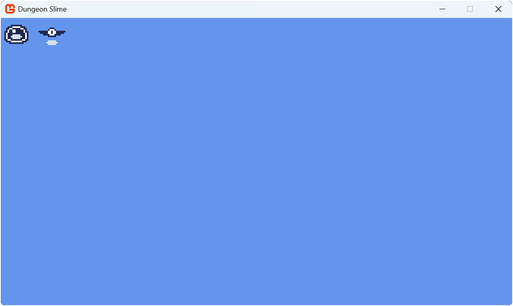

In [Chapter 07](../07_optimizing_texture_rendering/index.md), you learned how to use texture atlases to optimize rendering performance. While this solved the issue of texture swapping, managing individual sprites and their properties becomes increasingly complex as your game grows. Even in our simple example with just a slime and a bat, we would eventually need to track various properties for each sprite:

- Color mask for tinting.
- Origin for rotation and scale.
- Scale for size adjustments.
- Rotation for orientation.
- Sprite effects to flip horizontally and/or vertically.
- Layer depth for draw order layering.

Imagine scaling this up to dozens of sprites, each with multiple instances on screen.  Tracking all these properties through individual variables quickly becomes unmanageable. In this chapter, we will solve this by creating a class that encapsulates sprite information and handles rendering.

## The Sprite Class

A sprite in our game represents a visual object created from a texture region, along with its rendering properties. While multiple sprites might use the same texture region (like multiple enemies of the same type), each sprite can have unique properties that control how it appears on screen; its position, rotation, scale, and other visual characteristics.

By creating a `Sprite` class, we can encapsulate both the texture region and its rendering parameters into a single, reusable component. This not only makes our code more organized but also makes it easier to manage multiple instances of the same type of sprite.

In the *Graphics* folder within the *MonoGameLibrary* project, add a new file named `Sprite.cs` and add the following code for the foundation of the `Sprite` class to the file:

[!code-csharp]

### Properties

The `Sprite` class will utilize properties that mirror the parameters used in [**SpriteBatch.Draw**](xref:Microsoft.Xna.Framework.Graphics.SpriteBatch.Draw(Microsoft.Xna.Framework.Graphics.Texture2D,Microsoft.Xna.Framework.Vector2,System.Nullable{Microsoft.Xna.Framework.Rectangle},Microsoft.Xna.Framework.Color,System.Single,Microsoft.Xna.Framework.Vector2,System.Single,Microsoft.Xna.Framework.Graphics.SpriteEffects,System.Single)) so the rendering parameter for each sprite is self contained.  Add the following properties:

[!code-csharp]

The `TextureRegion` property works to provide the texture and source rectangle when rendering the sprite. Other properties directly correspond to [**SpriteBatch.Draw**](xref:Microsoft.Xna.Framework.Graphics.SpriteBatch.Draw(Microsoft.Xna.Framework.Graphics.Texture2D,Microsoft.Xna.Framework.Vector2,System.Nullable{Microsoft.Xna.Framework.Rectangle},Microsoft.Xna.Framework.Color,System.Single,Microsoft.Xna.Framework.Vector2,System.Single,Microsoft.Xna.Framework.Graphics.SpriteEffects,System.Single)) parameters with the same default values, making it easy to understand how each property affects the sprite's appearance.

> [!TIP]
> The calculated `Width` and `Height` properties make it easier to position sprites relative to each other without manually applying scale factors.

### Constructors

The `Sprite` class provides two ways to create a new sprite.

Add the following constructors:

[!code-csharp]

* The default constructor creates an empty sprite that can be configured later.
* The parameterized constructor allows you to specify the source texture region for the sprite.

### Methods

Finally, add the following two method to the `Sprite` class:

[!code-csharp]

- `CenterOrigin`: Sets the origin point of the sprite to its center.

    > [!NOTE]
    > The origin needs to be set based on the width and height of the source texture region itself, regardless of the scale the sprite is rendered at.

- `Draw`: Uses the `TextureRegion` property to submit the sprite for rendering using the properties of the sprite itself.  

## Create Sprites With The TextureAtlas Class

While the `GetRegion` method of the `TextureAtlas` class we created in [Chapter 07](../07_optimizing_texture_rendering/index.md#the-textureatlas-class) works well for retrieving regions, creating sprites requires multiple steps:

1. Get the region by name.
2. Store it in a variable.
3. Create a new sprite with that region.

We can simplify this process by adding a sprite creation method to the `TextureAtlas` class. Open the `TextureAtlas.cs` and add the following method:

[!code-csharp]

## Using the Sprite Class

Now we can adjust our game to use the `Sprite` class instead of just the texture regions.  Update the contents of `Game1.cs` with the following:

[!code-csharp]

The key changes in this implementation are:

- The `_slime` and `_bat` members were changed from `TextureRegion`  to `Sprite`.
- In [**LoadContent**](xref:Microsoft.Xna.Framework.Game.LoadContent)
  - The `_slime` and `_bat` sprites are now created using the new `TextureAtlas.CreateSprite` method.
  - Both the `_slime` and `_bat` sprites are given a scale of 4.0f.
- In [**Draw**](xref:Microsoft.Xna.Framework.Game.Draw(Microsoft.Xna.Framework.GameTime)), the draw calls were updated to use the `Sprite.Draw` method.

Running the game now will produce the same result as in the previous chapter.  

|  |
|:----------------------------------------------------------------------------------------------------------------------------------------:|
|                   **Figure 8-1: The slime and bat sprites being rendered in the upper-left corner of the game window**                   |

> [!NOTE]
> Notice how even though we increased the scale of both sprites, the bat sprite is still only 10px to the right of the slime.  This is because the `Width` property we created for the `Sprite` class takes into account the scale factor of the sprite as well.  

Try adjusting the various properties available for the slime and the bat sprites to see how they affect the rendering.

## Conclusion

In this chapter, we created a reusable `Sprite` class that encapsulates the properties for each sprite that we would render.  The `TextureAtlas` class was updated to simplify sprite creation based on the `Sprite` class we created.

In the next chapter, we will build upon the `Sprite` class to create an `AnimatedSprite` class that will allow us to bring our sprites to life through animation.

## Test Your Knowledge

1. What is the benefit of using a Sprite class instead of managing texture regions directly?

    :::question-answer
    The `Sprite` class encapsulates all rendering properties (position, rotation, scale, etc.) into a single, reusable component. This makes it easier to manage multiple instances of the same type of sprite without having to track properties through individual variables.
    :::

2. Why do the `Width` and `Height` properties of a Sprite take the Scale property into account?

    :::question-answer
    The `Width` and `Height` properties account for scaling to make it easier to position sprites relative to each other without having to manually calculate the scaled dimensions. This is particularly useful when sprites are rendered at different scales.
    :::

3. When using the `CenterOrigin` method, why is the origin calculated using the region's dimensions rather than the sprite's scaled dimensions?

    :::question-answer
    The origin needs to be set based on the texture region's actual dimensions because it represents the point around which scaling and rotation are applied. Using the scaled dimensions would result in incorrect positioning since the origin would change based on the current scale factor.
    :::

4. What advantage does the `TextureAtlas.CreateSprite` method provide over using `GetRegion`?

    :::question-answer
    The `CreateSprite` method simplifies sprite creation by combining multiple steps (getting the region, storing it, creating a sprite) into a single method call. This reduces code repetition and makes sprite creation more straightforward.
    :::
