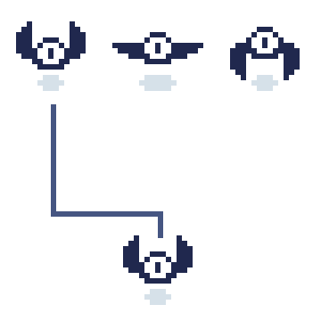

While packing images into a texture atlas and managing them through our `Sprite` class improves performance and organization, games need animation to bring their visuals to life. 2D animation in games works much like a flip book; a sequence of individual images (*frames*) displayed in rapid succession creates the illusion of movement. Each frame represents a specific point in the sprite's animation, and when these frames are cycled through quickly, our eyes perceive fluid motion.

> [!NOTE]
> The term "frame" in animation refers to a single image in an animation sequence. This is different from a game frame, which represents one complete render cycle of your game.

In MonoGame, we can create these animations by cycling through different regions of our texture atlas, with each region representing a single frame of the animation. For example, *Figure 9-1* below shows three frames that make up a bat's wing-flapping animation:

|   |
| :-----------------------------------------------------------------------------------------------: |
|                  **Figure 9-1: Animation example of a bat flapping its wings**                    |

By drawing each frame sequentially over time, we create the illusion that the bat is flapping its wings. The speed at which we switch between frames determines how smooth or rapid the animation appears.

In this chapter, we will build off of the `Sprite` class we created in [Chapter 08](../08_the_sprite_class/index.md) to create an `AnimatedSprite` class we can use to bring animations to life.

## The Animation Class

Before we can create animated sprites, we need a way to manage animation data. We will create an `Animation` class to encapsulate this information. In the *Graphics* folder within the *MonoGameLibrary* project, add a new file named `Animation.cs` with this initial structure:

[!code-csharp]

### Animation Properties

An animation requires two key pieces of information: the sequence of frames to display and the timing between them. Add these properties to the `Animation` class:

[!code-csharp]

* The `Frames` property stores the collection of texture regions that make up the animation sequence. The order of regions in this collection is important; they will be displayed in the same sequence they are added, creating the animation's movement. For example, in our bat animation, the frames would be ordered to show the wings moving up, then fully extended, then down.

* The `Delay` property defines how long each frame should be displayed before moving to the next one. This timing control allows us to adjust the speed of our animations; a shorter delay creates faster animations, while a longer delay creates slower ones.

> [!NOTE]
> Using `TimeSpan` for the delay allows us to specify precise timing intervals, making it easier to synchronize animations with game time. In other scenarios, you could opt to just use `float` values instead.

### Animation Constructors

The `Animation` class provides two ways to create an animation.

Add the following constructors:

[!code-csharp]

* The default constructor creates an animation with an empty collection of frames and a default delay of 100 milliseconds between each frame.
* The parameterized constructor allows you to specify the frames of animation and the delay for the animation.

> [!TIP]
> The default 100 milliseconds delay provides a good starting point for most animations, roughly equivalent to 10 animation frame changes per second.

## Creating Animations With The TextureAtlas Class

The `TextureAtlas` class we created in [Chapter 07](../07_optimizing_texture_rendering/index.md#the-textureatlas-class) can do more than just manage texture regions and create sprites; it can also store and manage animation data to create animated sprites.  The `atlas.png` image we are currently using contains the frames of animation for both a slime and a bat, as well as sprites for other things. We will first update our `atlas-definition.xml` file to include all regions in the atlas, as well as add new `<Animation>` elements to define the animations.  

Open the `atlas-definition.xml` file in your code editor and replace the contents with the following:

[!code-xml]

The key changes here are:

- Regions have been added for all regions within the atlas.
- The slime and bat regions have been renamed to reflect the frame number of the animation.
- A new `<Animations>` element has been added that defines `<Animation>` elements.

> [!NOTE]
> In the bat animation, we reuse frame "bat-1" in the sequence (bat-1, bat-2, bat-1, bat-3). This creates a smoother wing-flapping animation by returning to the neutral position between up and down wing positions.

Now that we have a fully configured XML configuration for the atlas, we need to update the `TextureAtlas` class to manage animation data.  Open the `TextureAtlas.cs` file and make the following changes:

1. Add the following using statement so we can reference the `TimeSpan` struct:

    [!code-csharp]

2. Add storage for animations after the `Texture` property:

    [!code-csharp]

3. Update the constructors so that the animations dictionary is initialized:

    [!code-csharp]

4. Add methods to manage animations, similar to those that we use to manage regions:

    [!code-csharp]

5. Update the `FromFile` method to parse the new `<Animation>` animation definitions from the XML configuration file

    [!code-csharp]

The updated `FromFile` method now handles both region and animation definitions from the XML configuration. For animations, it:

- Reads the `<Animations>` section from the XML.
- For each animation:
  - Gets the name and frame delay.
  - Collects the referenced texture regions.
  - Creates and stores a new `Animation` instance.

## The AnimatedSprite Class

With our `Animation` class handling animation data, and the `TextureAtlas` updated to store the animation data, we can now create a class that represents an animated sprites. Since an animated sprite is essentially a sprite that changes its texture region over time, we can build upon our existing `Sprite` class through [inheritance](https://learn.microsoft.com/en-us/dotnet/csharp/fundamentals/tutorials/inheritance).

> [!NOTE]
> By inheriting from `Sprite`, our `AnimatedSprite` class automatically gets all the rendering properties (position, rotation, scale, etc.) while adding new animation-specific functionality.

The key to this design is the `Sprite.Region` property. Our `Sprite` class already knows how to render whatever region is currently set, so our `AnimatedSprite` class just needs to update this region property to the correct animation frame at the right time.

We will now create the initial structure for our `AnimatedSprite` class. In the *Graphics* folder within the *MonoGameLibrary* project, add a new file named `AnimatedSprite.cs`:

[!code-csharp]

### AnimatedSprite Members

An animated sprite needs to track both its current animation state and timing information. Add the following members to the `AnimatedSprite` class:

[!code-csharp]

The class uses three private fields to manage its animation state:

- `_currentFrame`: Tracks which frame of the animation is currently being displayed.
- `_elapsed`: Keeps track of how much time has passed since the last frame change.
- `_animation`: Stores the current animation being played.

The `Animation` property provides access to the current animation and ensures the sprite always starts with the first frame when a new animation is set. When you assign a new animation, the property's setter automatically updates the sprite's region to display the first frame of that animation.

> [!NOTE]
> Starting with the first frame when setting a new animation ensures consistent behavior when switching between different animations.

### AnimatedSprite Constructors

The `AnimatedSprite` class provides two ways to create an animated sprite.

Add the following constructors:

[!code-csharp]

* The default constructor creates an empty animated sprite that can be configured later.
* The parameterized constructor creates an animated sprite with a specified animation, which automatically sets the sprite's initial region to the first frame of that animation through the `Animation` property.

> [!NOTE]
> Both constructors inherit from the base `Sprite` class, so an `AnimatedSprite` will have all the same rendering properties (position, rotation, scale, etc.) as a regular sprite.

### AnimatedSprite Methods

The `AnimatedSprite` class needs a way to update its animation state over time. This is handled by adding an `Update` method:

[!code-csharp]

The `Update` method manages the animation timing and frame progression:

1. Accumulates the time passed since the last update in `_elapsed`.
2. When enough time has passed (defined by the animation's delay):
   - Resets the elapsed time counter
   - Advances to the next frame
   - Loops back to the first frame if we have reached the end
   - Updates the sprite's region to display the current frame

> [!NOTE]
> Unlike the `Sprite` class which only needs a `Draw` method, the `AnimatedSprite` requires this additional `Update` method to handle frame changes over time. This follows MonoGame's update/draw pattern we first saw in [Chapter 03](../03_the_game1_file/index.md)

The `Draw` method inherited from the base `Sprite` class remains unchanged, as it will automatically use whatever frame is currently set as the sprite's region.

## Creating AnimatedSprites With The TextureAtlas Class

Similar to the update we did to the `TextureAtlas` class in [Chapter 08](../08_the_sprite_class/index.md#create-sprites-with-the-textureatlas-class), creating an `AnimatedSprite` from the atlas would require

1. Get the animation by name.
2. Store it in a variable.
3. Create a new animated sprite with that animation.

We can simplify this process by adding an animated sprite creation method to the `TextureAtlas` class. Open `TextureAtlas.cs` and add the following method:

[!code-csharp]

## Using the AnimatedSprite Class

We can now adjust our game to use the `AnimatedSprite` class to see our sprites come to life. Update the contents of `Game1.cs` with the following:

[!code-csharp]

Here are the key changes in this implementation:

- The `_slime` and `_bat` members were changed from `Sprite`  to `AnimatedSprite`.
- In [**LoadContent**](xref:Microsoft.Xna.Framework.Game.LoadContent) the `_slime` and `_bat` sprites are now created using the new `TextureAtlas.CreateAnimatedSprite` method.
- In [**Update**](xref:Microsoft.Xna.Framework.Game.Update(Microsoft.Xna.Framework.GameTime)), the animations are updated based on the game time using the `AnimatedSprite.Update` method.

Running the game now shows both sprites animating automatically:

- The slime bounces between two frames
- The bat's wings flap in a continuous cycle

|   |
| :----------------------------------------------------------------------------------: |
|                 **Figure 9-2: The slime and bat sprite animating**                   |

## Conclusion

In this chapter, you accomplished the following:

- Created an `Animation` class to manage frame sequences and timing.
- Extended the `TextureAtlas` class to support animation definitions.
- Built an `AnimatedSprite` class that inherits from `Sprite`.
- Applied inheritance to add animation capabilities while maintaining existing sprite functionality.
- Used XML configuration to define animations separately from code.

Now that we can efficiently manage and render sprites and animations, in the next chapter we will start taking a look at user input.

## Test Your Knowledge

1. Why did we create a separate `Animation` class instead of putting animation properties directly in `AnimatedSprite`?

    :::question-answer
    Separating animation data into its own class allows multiple `AnimatedSprite` instances to share the same animation definition. This is more efficient than each sprite having its own copy of the frame sequence and timing information.
    :::

2. What is the benefit of using `TimeSpan` for animation delays instead of float values?

    :::question-answer
    `TimeSpan` provides precise timing control and makes it easier to synchronize animations with game time. It also makes the delay values more explicit (milliseconds vs arbitrary numbers) and helps prevent timing errors.
    :::

3. Why does the `AnimatedSprite` class need an `Update` method while the base `Sprite` class does not?

    :::question-answer
    The `AnimatedSprite` needs to track elapsed time and change frames based on the animation's timing. This requires updating its state over time, while a regular sprite's appearance remains static until explicitly changed.
    :::

4. In the `TextureAtlas` XML configuration, why might you want to reuse a frame in an animation sequence, like we did with the bat animation?

    :::question-answer
    Reusing frames in an animation sequence can create smoother animations by providing transition states. In the bat animation, reusing the neutral position (bat-1) between wing movements creates a more natural flapping motion without requiring additional sprite frames.
    :::
