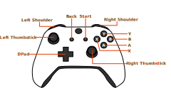
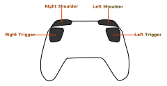
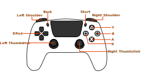
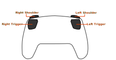

When you play a game, you need ways to control what is happening; using a keyboard or gamepad to control a character or clicking the mouse to navigate a menu, MonoGame helps us handle all these different types of controls through dedicated input classes:

- [**Keyboard**](xref:Microsoft.Xna.Framework.Input.Keyboard): Detects which keys are being pressed.
- [**Mouse**](xref:Microsoft.Xna.Framework.Input.Mouse): Tracks mouse movement, button clicks, and scroll wheel use.
- [**GamePad**](xref:Microsoft.Xna.Framework.Input.GamePad): Manages controller input like button presses and thumbstick movement.
- [**TouchPanel**](xref:Microsoft.Xna.Framework.Input.Touch.TouchPanel): Manages touch input on devices with a touch panel such as mobile phones and tablets.

Each of these input types has a `GetState` method that, when called, checks what is happening with that device at that moment. Think of it like taking a snapshot; when you call `GetState`, MonoGame looks at that exact moment to see which buttons are pressed, where the mouse is, or how the controller is being used.

In this chapter you will, we will learn how to use each of these dedicated input classes to handle player input.

## Keyboard Input

The keyboard is often the primary input device for PC games, used for everything from character movement to menu navigation. MonoGame provides the [**Keyboard**](xref:Microsoft.Xna.Framework.Input.Keyboard) class to handle keyboard input, making it easy to detect which keys are being pressed at any time.  Calling [**Keyboard.GetState**](xref:Microsoft.Xna.Framework.Input.Keyboard.GetState) will retrieve the current state of the keyboard as a [**KeyboardState**](xref:Microsoft.Xna.Framework.Input.KeyboardState) struct.

### KeyboardState Struct

The [**KeyboardState**](xref:Microsoft.Xna.Framework.Input.KeyboardState) struct contains methods that can be used to determine if a keyboard key is currently down or up:

| Method                                                                                                                | Description                                                              |
|-----------------------------------------------------------------------------------------------------------------------|--------------------------------------------------------------------------|
| [**IsKeyDown(Keys)**](xref:Microsoft.Xna.Framework.Input.KeyboardState.IsKeyDown(Microsoft.Xna.Framework.Input.Keys)) | Returns `true` if the specified key is down; otherwise, returns `false`. |
| [**IsKeyUp(Keys)**](xref:Microsoft.Xna.Framework.Input.KeyboardState.IsKeyUp(Microsoft.Xna.Framework.Input.Keys))     | Returns `true` if the specified key is up; otherwise, returns `false`.   |

For example, if we wanted to see if the Space key is down, you could use the following:

[!code-csharp]

> [!TIP]
> Notice we store the keyboard state in a variable instead of calling [**Keyboard.GetState**](xref:Microsoft.Xna.Framework.Input.Keyboard.GetState) multiple times. This is more efficient and ensures consistent input checking within a single frame.

## Mouse Input

The mouse is often the secondary input device for PC games, used for various actions from camera movement to interacting with menus and objects.  MonoGame provides the [**Mouse**](xref:Microsoft.Xna.Framework.Input.Mouse) class to handle mouse input, making it easy to detect which buttons are pressed, the position of the mouse cursor, and the value of the scroll wheel.  Calling [**Mouse.GetState**](xref:Microsoft.Xna.Framework.Input.Mouse.GetState) will retrieve the current state of the mouse as a [**MouseState**](xref:Microsoft.Xna.Framework.Input.MouseState) struct.

### MouseState Struct

The [**MouseState**](xref:Microsoft.Xna.Framework.Input.MouseState) struct contains properties that can be used to determine the state of the mouse buttons, the mouse position, and the scroll wheel value:

| Property                                                                               | Type                                                              | Description                                                                                                             |
|----------------------------------------------------------------------------------------|-------------------------------------------------------------------|-------------------------------------------------------------------------------------------------------------------------|
| [**LeftButton**](xref:Microsoft.Xna.Framework.Input.MouseState.LeftButton)             | [**ButtonState**](xref:Microsoft.Xna.Framework.Input.ButtonState) | Returns the state of the left mouse button.                                                                             |
| [**MiddleButton**](xref:Microsoft.Xna.Framework.Input.MouseState.MiddleButton)         | [**ButtonState**](xref:Microsoft.Xna.Framework.Input.ButtonState) | Returns the state of the middle mouse button.  This is often the button when pressing the scroll wheel down as a button |
| [**Position**](xref:Microsoft.Xna.Framework.Input.MouseState.Position)                 | [**Point**](xref:Microsoft.Xna.Framework.Point)                   | Returns the position of the mouse cursor relative to the bounds of the game window.                                     |
| [**RightButton**](xref:Microsoft.Xna.Framework.Input.MouseState.RightButton)           | [**ButtonState**](xref:Microsoft.Xna.Framework.Input.ButtonState) | Returns the state of the right mouse button.                                                                            |
| [**ScrollWheelValue**](xref:Microsoft.Xna.Framework.Input.MouseState.ScrollWheelValue) | `int`                                                             | Returns the **cumulative** scroll wheel value since the start of the game                                               |
| [**XButton1**](xref:Microsoft.Xna.Framework.Input.MouseState.XButton1)                 | [**ButtonState**](xref:Microsoft.Xna.Framework.Input.ButtonState) | Returns the state of the first extended button on the mouse.                                                            |
| [**XButton2**](xref:Microsoft.Xna.Framework.Input.MouseState.XButton2)                 | [**ButtonState**](xref:Microsoft.Xna.Framework.Input.ButtonState) | Returns the state of the second extended button on the mouse.                                                           |

> [!NOTE]
> [**ScrollWheelValue**](xref:Microsoft.Xna.Framework.Input.MouseState.ScrollWheelValue) returns the cumulative value of the scroll wheel since the start of the game, not how much it moved since the last update.  To determine how much it moved between one update and the next, you would need to compare it with the previous frame's value.  We will discuss comparing previous and current frame values for inputs in the next chapter.

Unlike keyboard input which uses [**IsKeyDown(Keys)**](xref:Microsoft.Xna.Framework.Input.KeyboardState.IsKeyDown(Microsoft.Xna.Framework.Input.Keys))/[**IsKeyUp(Keys)**](xref:Microsoft.Xna.Framework.Input.KeyboardState.IsKeyUp(Microsoft.Xna.Framework.Input.Keys)) methods mouse buttons return a [**ButtonState**](xref:Microsoft.Xna.Framework.Input.ButtonState):

- [**ButtonState.Pressed**](xref:Microsoft.Xna.Framework.Input.ButtonState): The button is being held down.
- [**ButtonState.Released**](xref:Microsoft.Xna.Framework.Input.ButtonState): The button is not being pressed.

For example, if we wanted to see if the left mouse button is down, you could use the following

[!code-csharp]

## Gamepad Input

Gamepads are often used as a primary input for a game or an alternative for keyboard and mouse controls.  MonoGame provides the [**GamePad**](xref:Microsoft.Xna.Framework.Input.GamePad) class to handle gamepad input, making it easy to detect which buttons are pressed and the value of the thumbsticks. Calling [**GamePad.GetState**](xref:Microsoft.Xna.Framework.Input.GamePad.GetState(Microsoft.Xna.Framework.PlayerIndex)) will retrieve the state of the gamepad as a [**GamePadState**](xref:Microsoft.Xna.Framework.Input.GamePadState) struct.  Since multiple gamepads can be connected, you will need to supply a [**PlayerIndex**](xref:Microsoft.Xna.Framework.PlayerIndex) value to specify which gamepad state to retrieve.

### GamePadState Struct

The [**GamePadState**](xref:Microsoft.Xna.Framework.Input.GamePadState) struct and properties that can be used to get the state of the buttons, dpad, triggers, and thumbsticks:

| Property                                                                       | Type                                                                            | Description                                                                                                                                                                                                                        |
|--------------------------------------------------------------------------------|---------------------------------------------------------------------------------|------------------------------------------------------------------------------------------------------------------------------------------------------------------------------------------------------------------------------------|
| [**Buttons**](xref:Microsoft.Xna.Framework.Input.GamePadState.Buttons)         | [**GamePadButtons**](xref:Microsoft.Xna.Framework.Input.GamePadButtons)         | Returns a struct that identifies which buttons on the controller are pressed.                                                                                                                                                      |
| [**DPad**](xref:Microsoft.Xna.Framework.Input.GamePadState.DPad)               | [**GamePadDPad**](xref:Microsoft.Xna.Framework.Input.GamePadDPad)               | Returns a struct that identifies which directions on the DPad are pressed.                                                                                                                                                         |
| [**IsConnected**](xref:Microsoft.Xna.Framework.Input.GamePadState.IsConnected) | `bool`                                                                          | Returns a value that indicates whether the controller is connected.                                                                                                                                                                |
| [**ThumbSticks**](xref:Microsoft.Xna.Framework.Input.GamePadState.ThumbSticks) | [**GamePadThumbSticks**](xref:Microsoft.Xna.Framework.Input.GamePadThumbSticks) | Returns a struct that contains the direction of each thumbstick.  Each thumbstick (left and right) are represented as a [**Vector2**](xref:Microsoft.Xna.Framework.Vector2) value between `-1.0f` and `1.0` for the x- and y-axes. |
| [**Triggers**](xref:Microsoft.Xna.Framework.Input.GamePadState.Triggers)       | [**GamePadTriggers**](xref:Microsoft.Xna.Framework.Input.GamePadTriggers)       | Returns a struct that contains the value of each trigger. Each trigger (left and right) are represented as a `float` value between `0.0f`, meaning not pressed, and `1.0f`, meaning fully pressed.                                 |

#### Buttons

The [**GamePadState.Buttons**](xref:Microsoft.Xna.Framework.Input.GamePadState.Buttons) property returns a [**GamePadButtons**](xref:Microsoft.Xna.Framework.Input.GamePadButtons) struct that can be used to identify which buttons on the controller are pressed.  This struct contains the following properties:

| Property                                                                             | Type                                                              | Description                                   |
|--------------------------------------------------------------------------------------|-------------------------------------------------------------------|-----------------------------------------------|
| [**A**](xref:Microsoft.Xna.Framework.Input.GamePadButtons.A)                         | [**ButtonState**](xref:Microsoft.Xna.Framework.Input.ButtonState) | Returns the state of the A button             |
| [**B**](xref:Microsoft.Xna.Framework.Input.GamePadButtons.B)                         | [**ButtonState**](xref:Microsoft.Xna.Framework.Input.ButtonState) | Returns the state of the B button             |
| [**Back**](xref:Microsoft.Xna.Framework.Input.GamePadButtons.Back)                   | [**ButtonState**](xref:Microsoft.Xna.Framework.Input.ButtonState) | Returns the state of the Back button          |
| [**BigButton**](xref:Microsoft.Xna.Framework.Input.GamePadButtons.BigButton)         | [**ButtonState**](xref:Microsoft.Xna.Framework.Input.ButtonState) | Returns the state of the BigButton button     |
| [**LeftShoulder**](xref:Microsoft.Xna.Framework.Input.GamePadButtons.LeftShoulder)   | [**ButtonState**](xref:Microsoft.Xna.Framework.Input.ButtonState) | Returns the state of the LeftShoulder button  |
| [**LeftStick**](xref:Microsoft.Xna.Framework.Input.GamePadButtons.LeftStick)         | [**ButtonState**](xref:Microsoft.Xna.Framework.Input.ButtonState) | Returns the state of the LeftStick button     |
| [**RightShoulder**](xref:Microsoft.Xna.Framework.Input.GamePadButtons.RightShoulder) | [**ButtonState**](xref:Microsoft.Xna.Framework.Input.ButtonState) | Returns the state of the RightShoulder button |
| [**RightStick**](xref:Microsoft.Xna.Framework.Input.GamePadButtons.RightStick)       | [**ButtonState**](xref:Microsoft.Xna.Framework.Input.ButtonState) | Returns the state of the RightStick button    |
| [**Start**](xref:Microsoft.Xna.Framework.Input.GamePadButtons.Start)                 | [**ButtonState**](xref:Microsoft.Xna.Framework.Input.ButtonState) | Returns the state of the Start button         |
| [**X**](xref:Microsoft.Xna.Framework.Input.GamePadButtons.X)                         | [**ButtonState**](xref:Microsoft.Xna.Framework.Input.ButtonState) | Returns the state of the X button             |
| [**Y**](xref:Microsoft.Xna.Framework.Input.GamePadButtons.Y)                         | [**ButtonState**](xref:Microsoft.Xna.Framework.Input.ButtonState) | Returns the state of the Y button             |

> [!NOTE]
> Recall from [Chapter 01](../01_what_is_monogame/index.md) that MonoGame is a implementation the XNA API.  Since XNA was originally created for making games on Windows PC and Xbox 360, the names of the gamepad buttons match those of an Xbox 360 controller.
>
> The [**BigButton**](xref:Microsoft.Xna.Framework.Input.GamePadButtons.BigButton) refers to the large, centrally located button on special Xbox 360 controllers created for games like "Scene It?" - this button is not present on standard controllers and is not mapped to any button on modern controllers. It remains in the API for backward compatibility with XNA.
>
> | Front                                                      | Back                                                     |
> | :--------------------------------------------------------- | :------------------------------------------------------- |
> | Xbox                                                       |                                                          |
> |  |  |
> | Playstation                                                |                                                          |
> |    |    |

Like with the [mouse input](#mousestate-struct), each of these buttons are represented by a [**ButtonState**](xref:Microsoft.Xna.Framework.Input.ButtonState) enum value.  For instance, if you wanted to check if the A button is being pressed you could do the following:

[!code-csharp]

> [!NOTE]
> You may notice however, that the GamePadState also requires a controller index, as more than one can be connected at the same time. The latest Xbox console for instance can support up to 8 controllers at a time, for this reason you need to specify which controller you are listening for.  Additionally, if you want ANY controller to start your game, you will need to loop through all possible controllers each frame until the first one "picks up".

#### DPad

The [**DPad**](xref:Microsoft.Xna.Framework.Input.GamePadState.DPad)  property returns a [**GamePadDPad**](xref:Microsoft.Xna.Framework.Input.GamePadDPad) struct that can be used to identify which DPad buttons on the controller are pressed. This struct contains the following properties:

| Property                                                         | Type                                                              | Description                                 |
|------------------------------------------------------------------|-------------------------------------------------------------------|---------------------------------------------|
| [**Down**](xref:Microsoft.Xna.Framework.Input.GamePadDPad.Down)  | [**ButtonState**](xref:Microsoft.Xna.Framework.Input.ButtonState) | Returns the state of the DPad Down button.  |
| [**Left**](xref:Microsoft.Xna.Framework.Input.GamePadDPad.Down)  | [**ButtonState**](xref:Microsoft.Xna.Framework.Input.ButtonState) | Returns the state of the DPad Left button.  |
| [**Right**](xref:Microsoft.Xna.Framework.Input.GamePadDPad.Down) | [**ButtonState**](xref:Microsoft.Xna.Framework.Input.ButtonState) | Returns the state of the DPad Right button. |
| [**Up**](xref:Microsoft.Xna.Framework.Input.GamePadDPad.Down)    | [**ButtonState**](xref:Microsoft.Xna.Framework.Input.ButtonState) | Returns the state of the DPad Up Button.    |

Like with the [Buttons](#buttons), these also return a [**ButtonState**](xref:Microsoft.Xna.Framework.Input.ButtonState) enum value to represent the state of the DPad button.  For instance, if you wanted to check if the DPad up button is being pressed, you could do the following:

[!code-csharp]

#### Thumbsticks

The [**ThumbSticks**](xref:Microsoft.Xna.Framework.Input.GamePadState.ThumbSticks) property returns a [**GamePadThumbSticks**](xref:Microsoft.Xna.Framework.Input.GamePadThumbSticks) struct that can be used to retrieve the values of the left and right thumbsticks.  This struct contains the following properties:

| Property                                                                 | Type                                                | Description                                    |
|--------------------------------------------------------------------------|-----------------------------------------------------|------------------------------------------------|
| [**Left**](xref:Microsoft.Xna.Framework.Input.GamePadThumbSticks.Left)   | [**Vector2**](xref:Microsoft.Xna.Framework.Vector2) | The direction the left thumbstick is pressed.  |
| [**Right**](xref:Microsoft.Xna.Framework.Input.GamePadThumbSticks.Right) | [**Vector2**](xref:Microsoft.Xna.Framework.Vector2) | The direction the right thumbstick is pressed. |

The thumbstick values are represented as a [**Vector2**](xref:Microsoft.Xna.Framework.Vector2) value:

- X-axis: A value between `-1.0f` (pushed fully to the left) and `1.0f` (pushed fully to the right).
- Y-axis: A value between `-1.0f` (pushed fully downward) and `1.0f` (pushed fully upward).

For example, if you wanted to move a sprite using the left thumbstick, you could do the following

[!code-csharp]

> [!IMPORTANT]
> Notice that we inverted the y-axis value of the thumbstick by multiplying it by `-1.0f`. This is necessary because the thumbstick y-axis values range from `-1.0f` (down) to `1.0f` (up).  The y-axis of the screen coordinates in MonoGame **increases** downward, as we saw in [Chapter 06](../06_working_with_textures/index.md#drawing-a-texture).
>
> This inversion aligns the thumbstick's y-axis value with the screen movement.

#### Triggers

The [**Triggers**](xref:Microsoft.Xna.Framework.Input.GamePadState.Triggers) property returns a [**GamePadTriggers**](xref:Microsoft.Xna.Framework.Input.GamePadTriggers) struct that can be used to retrieve the values of the left and right triggers. This struct contains the following properties:

| Property                                                              | Type    | Description                    |
|-----------------------------------------------------------------------|---------|--------------------------------|
| [**Left**](xref:Microsoft.Xna.Framework.Input.GamePadTriggers.Left)   | `float` | The value of the left trigger. |
| [**Right**](xref:Microsoft.Xna.Framework.Input.GamePadTriggers.Right) | `float` | The value of the left trigger. |

The trigger values are represented as a float value between `0.0f` (not pressed) to `1.0f` (fully pressed). The triggers on a gamepad, however, can be either *analog* or *digital* depending the gamepad manufacturer.  For gamepads with *digital* triggers, the value will always be either `0.0f` or `1.0f`, as a digital trigger does not register values in between based on the amount of pressure applied to the trigger.  

For example, if we were creating a racing game, the right trigger could be used for acceleration like the following:

[!code-csharp]

### GamePadState Methods

The [**GamePadState**](xref:Microsoft.Xna.Framework.Input.GamePadState) struct also contains two methods that can be used to get information about the device's inputs as either being up or down:

| Method                                                                                                                           | Description                                                                                                                                                                                                                                                                                                           |
|----------------------------------------------------------------------------------------------------------------------------------|-----------------------------------------------------------------------------------------------------------------------------------------------------------------------------------------------------------------------------------------------------------------------------------------------------------------------|
| [**IsButtonDown(Buttons)**](xref:Microsoft.Xna.Framework.Input.GamePadState.IsButtonDown(Microsoft.Xna.Framework.Input.Buttons)) | Returns a value that indicates whether the specified button is down.  Multiple [**Buttons**](xref:Microsoft.Xna.Framework.Input.Buttons) values can be given using the bitwise OR `|` operator.  When multiple buttons are given, the return value indicates if all buttons specified are down, not just one of them. |
| [**IsButtonUp(Buttons)**](xref:Microsoft.Xna.Framework.Input.GamePadState.IsButtonUp(Microsoft.Xna.Framework.Input.Buttons))     | Returns a value that indicates whether the specified button is up.  Multiple [**Buttons**](xref:Microsoft.Xna.Framework.Input.Buttons) values can be given using the bitwise OR `|` operator.  When multiple buttons are given, the return value indicates if all buttons specified are up, not just one of them.     |

You can use the [**IsButtonDown(Buttons)**](xref:Microsoft.Xna.Framework.Input.GamePadState.IsButtonDown(Microsoft.Xna.Framework.Input.Buttons)) and [**IsButtonUp(Buttons)**](xref:Microsoft.Xna.Framework.Input.GamePadState.IsButtonUp(Microsoft.Xna.Framework.Input.Buttons)) methods to get the state of all buttons, including the DPad.  The following is a complete list of all of the [**Buttons**](xref:Microsoft.Xna.Framework.Input.Buttons) enum values:

- [**Buttons.A**](xref:Microsoft.Xna.Framework.Input.Buttons)
- [**Buttons.B**](xref:Microsoft.Xna.Framework.Input.Buttons)
- [**Buttons.Back**](xref:Microsoft.Xna.Framework.Input.Buttons)
- [**Buttons.BigButton**](xref:Microsoft.Xna.Framework.Input.Buttons)
- [**Buttons.DPadDown**](xref:Microsoft.Xna.Framework.Input.Buttons)
- [**Buttons.DPadLeft**](xref:Microsoft.Xna.Framework.Input.Buttons)
- [**Buttons.DPadRight**](xref:Microsoft.Xna.Framework.Input.Buttons)
- [**Buttons.DPadUp**](xref:Microsoft.Xna.Framework.Input.Buttons)
- [**Buttons.LeftShoulder**](xref:Microsoft.Xna.Framework.Input.Buttons)
- [**Buttons.LeftStick**](xref:Microsoft.Xna.Framework.Input.Buttons)
- [**Buttons.LeftThumbstickDown**](xref:Microsoft.Xna.Framework.Input.Buttons)
- [**Buttons.LeftThumbstickLeft**](xref:Microsoft.Xna.Framework.Input.Buttons)
- [**Buttons.LeftThumbstickRight**](xref:Microsoft.Xna.Framework.Input.Buttons)
- [**Buttons.LeftThumbstickUp**](xref:Microsoft.Xna.Framework.Input.Buttons)
- [**Buttons.LeftTrigger**](xref:Microsoft.Xna.Framework.Input.Buttons)
- [**Buttons.None**](xref:Microsoft.Xna.Framework.Input.Buttons)
- [**Buttons.RightShoulder**](xref:Microsoft.Xna.Framework.Input.Buttons)
- [**Buttons.RightStick**](xref:Microsoft.Xna.Framework.Input.Buttons)
- [**Buttons.RightStickDown**](xref:Microsoft.Xna.Framework.Input.Buttons)
- [**Buttons.RightStickLeft**](xref:Microsoft.Xna.Framework.Input.Buttons)
- [**Buttons.RightStickRight**](xref:Microsoft.Xna.Framework.Input.Buttons)
- [**Buttons.RightStickUp**](xref:Microsoft.Xna.Framework.Input.Buttons)
- [**Buttons.RightTrigger**](xref:Microsoft.Xna.Framework.Input.Buttons)
- [**Buttons.Start**](xref:Microsoft.Xna.Framework.Input.Buttons)
- [**Buttons.X**](xref:Microsoft.Xna.Framework.Input.Buttons)
- [**Buttons.Y**](xref:Microsoft.Xna.Framework.Input.Buttons)

> [!CAUTION]
> While you can use these methods to get the state of any of these button inputs, the state will only tell you if it is being pressed or released.  For the actual thumbstick values and trigger values, you would need to use the properties instead.

For example, if we wanted to check if the A button on the the first gamepad is pressed, you could use the following:

[!code-csharp]

### GamePad Vibration

Another capability of gamepads is haptic feedback through vibration motors.  MonoGame allows you to control this feature using the [**GamePad.SetVibration**](xref:Microsoft.Xna.Framework.Input.GamePad.SetVibration(Microsoft.Xna.Framework.PlayerIndex,System.Single,System.Single)) method.  This method takes three parameters:

1. The [**PlayerIndex**](xref:Microsoft.Xna.Framework.PlayerIndex) of the gamepad to vibrate.
2. The intensity of the left motor (from `0.0f` for no vibration to `1.0f` for maximum vibration).
3. The intensity of the right motor (using the same scale).

Most modern gamepads have two vibration motors, a larger one (usually the left motor) for low-frequency rumble and a smaller one (usually the right motor) for high-frequency feedback.  By controlling these independently, you can create various haptic effects:

[!code-csharp]

## TouchPanel Input

For mobile devices such as Android/iOS phones and tablets, the primary input device is the touch panel screen.  Touching a location on the screen is similar to clicking a location on your computer with a mouse.  MonoGame provides the [**TouchPanel**](xref:Microsoft.Xna.Framework.Input.Touch.TouchPanel) class to handle touch input.  

The [**TouchPanel**](xref:Microsoft.Xna.Framework.Input.Touch.TouchPanel) class offers two ways of retrieving information about touch input:

- [**TouchPanel.GetState**](xref:Microsoft.Xna.Framework.Input.Touch.TouchPanel.GetState) retrieves a [**TouchCollection**](xref:Microsoft.Xna.Framework.Input.Touch.TouchCollection) struct that contains [**TouchLocation**](xref:Microsoft.Xna.Framework.Input.Touch.TouchLocation) values for each point of touch on the touch panel.
- [**TouchPanel.ReadGesture**](xref:Microsoft.Xna.Framework.Input.Touch.TouchPanel.ReadGesture) retrieves a [**GestureSample**](xref:Microsoft.Xna.Framework.Input.Touch.GestureSample) struct that contains information about recent gestures that have been performed like a vertical or horizontal drag across the screen.

### TouchCollection

When calling [**TouchPanel.GetState**](xref:Microsoft.Xna.Framework.Input.Touch.TouchPanel.GetState) a [**TouchCollection**](xref:Microsoft.Xna.Framework.Input.Touch.TouchCollection) struct is returned.  This collection contains a [**TouchLocation**](xref:Microsoft.Xna.Framework.Input.Touch.TouchLocation) value for each point of touch.  

#### TouchLocation

Each [**TouchLocation**](xref:Microsoft.Xna.Framework.Input.Touch.TouchLocation) value in a touch collection contains the following properties:

| Property                                                                        | Type                                                                                  | Description                                                                                     |
|---------------------------------------------------------------------------------|---------------------------------------------------------------------------------------|-------------------------------------------------------------------------------------------------|
| [**Id**](xref:Microsoft.Xna.Framework.Input.Touch.TouchLocation.Id)             | `int`                                                                                 | The id of the touch location.                                                                   |
| [**Position**](xref:Microsoft.Xna.Framework.Input.Touch.TouchLocation.Position) | [**Vector2**](xref:Microsoft.Xna.Framework.Vector2)                                   | The position of the touch location.                                                             |
| [**Pressure**](xref:Microsoft.Xna.Framework.Input.Touch.TouchLocation.Pressure) | `float`                                                                               | The amount of pressure applied at the touch location. **(Only available for Android devices.)** |
| [**State**](xref:Microsoft.Xna.Framework.Input.Touch.TouchLocation.State)       | [**TouchLocationState**](xref:Microsoft.Xna.Framework.Input.Touch.TouchLocationState) | The current state of the touch location.                                                        |

The important properties of the location are the [**Position**](xref:Microsoft.Xna.Framework.Input.Touch.TouchLocation.Position) and the [**State**](xref:Microsoft.Xna.Framework.Input.Touch.TouchLocation.State) The position property will tell us the location of the touch event, and the state can be one of the following values:

| State                                                                        | Description                                                               |
|------------------------------------------------------------------------------|---------------------------------------------------------------------------|
| [**Invalid**](xref:Microsoft.Xna.Framework.Input.Touch.TouchLocation.State)  | This touch location position is invalid.                                  |
| [**Moved**](xref:Microsoft.Xna.Framework.Input.Touch.TouchLocation.State)    | This touch location position was updated or pressed at the same position. |
| [**Pressed**](xref:Microsoft.Xna.Framework.Input.Touch.TouchLocation.State)  | This touch location was pressed.                                          |
| [**Released**](xref:Microsoft.Xna.Framework.Input.Touch.TouchLocation.State) | This touch location was released.                                         |

When the state is moved or pressed, then we know that location on the touch panel is being touched.  So we can capture it and use it like the following:

[!code-csharp]

> [!NOTE]
> Unlike mouse input which only tracks a single point, [**TouchPanel**](xref:Microsoft.Xna.Framework.Input.Touch.TouchPanel) supports multiple simultaneous touch points. The [**TouchCollection**](xref:Microsoft.Xna.Framework.Input.Touch.TouchCollection) contains all active touch points, which is why we loop through them in the sample above.

The state of a touch location progresses through the states typically in order of:

- [**Pressed**](xref:Microsoft.Xna.Framework.Input.Touch.TouchLocation.State): Initial contact with the screen.
- [**Moved**](xref:Microsoft.Xna.Framework.Input.Touch.TouchLocation.State) : Touch point moved while maintaining contact.
- [**Released**](xref:Microsoft.Xna.Framework.Input.Touch.TouchLocation.State): Contact with screen ended.
- [**Invalid**](xref:Microsoft.Xna.Framework.Input.Touch.TouchLocation.State) : Touch data is invalid (using when tracking data is lost).

### GestureSample

When calling [**TouchPanel.ReadGesture**](xref:Microsoft.Xna.Framework.Input.Touch.TouchPanel.ReadGesture) a [**GestureSample**](xref:Microsoft.Xna.Framework.Input.Touch.GestureSample) struct containing the information about recent gestures that have been performed is returned.  The [**GestureSample**](xref:Microsoft.Xna.Framework.Input.Touch.GestureSample) struct contains the following properties:

| Property                                                                              | Type                                                                    | Description                                                                    |
|---------------------------------------------------------------------------------------|-------------------------------------------------------------------------|--------------------------------------------------------------------------------|
| [**Delta**](xref:Microsoft.Xna.Framework.Input.Touch.GestureSample.Delta)             | [**Vector2**](xref:Microsoft.Xna.Framework.Vector2)                     | Gets the delta information about the first touch-point in the gesture sample.  |
| [**Delta2**](xref:Microsoft.Xna.Framework.Input.Touch.GestureSample.Delta2)           | [**Vector2**](xref:Microsoft.Xna.Framework.Vector2)                     | Gets the delta information about the second touch-point in the gesture sample. |
| [**GestureType**](xref:Microsoft.Xna.Framework.Input.Touch.GestureSample.GestureType) | [**GestureType**](xref:Microsoft.Xna.Framework.Input.Touch.GestureType) | Gets the type of the gesture.                                                  |
| [**Position**](xref:Microsoft.Xna.Framework.Input.Touch.GestureSample.Position)       | [**Vector2**](xref:Microsoft.Xna.Framework.Vector2)                     | Gets the position of the first touch-point in the gesture sample.              |
| [**Position2**](xref:Microsoft.Xna.Framework.Input.Touch.GestureSample.Position2)     | [**Vector2**](xref:Microsoft.Xna.Framework.Vector2)                     | Gets the position of the second touch-point in the gesture sample.             |

> [!NOTE]
> Gestures have two delta properties and two position properties.  This is because some gestures require multiple touch inputs to perform, such as performing a pinch to zoom in or out.  You would need the location of both touch points to determine the correct zoom to apply during the gesture.

To determine what type of gesture is performed, we can get that from the [**GestureType**](xref:Microsoft.Xna.Framework.Input.Touch.GestureSample.GestureType) property which will be one of the following values:

| Gesture Type                                                               | Description                                                                                     |
|----------------------------------------------------------------------------|-------------------------------------------------------------------------------------------------|
| [**DoubleTap**](xref:Microsoft.Xna.Framework.Input.Touch.GestureType)      | The user double tapped the device twice which is always preceded by a Tap gesture.              |
| [**DragComplete**](xref:Microsoft.Xna.Framework.Input.Touch.GestureType)   | States completion of a drag gesture (VerticalDrag, HorizontalDrag, or FreeDrag).                |
| [**Flick**](xref:Microsoft.Xna.Framework.Input.Touch.GestureType)          | States that a touch was combined with  a quick swipe.                                           |
| [**FreeDrag**](xref:Microsoft.Xna.Framework.Input.Touch.GestureType)       | The user touched a point and the performed a free-form drag.                                    |
| [**Hold**](xref:Microsoft.Xna.Framework.Input.Touch.GestureType)           | The user touched a single point for approximately one second.                                   |
| [**HorizontalDrag**](xref:Microsoft.Xna.Framework.Input.Touch.GestureType) | The user touched the screen and performed either a left-to-right or right-to-left drag gesture. |
| [**None**](xref:Microsoft.Xna.Framework.Input.Touch.GestureType)           | No gesture.                                                                                     |
| [**Pinch**](xref:Microsoft.Xna.Framework.Input.Touch.GestureType)          | The user converged or diverged two touch-points on the screen which is like a two-finger drag.  |
| [**PinchComplete**](xref:Microsoft.Xna.Framework.Input.Touch.GestureType)  | An in-progress pinch gesture was completed.                                                     |
| [**Tap**](xref:Microsoft.Xna.Framework.Input.Touch.GestureType)            | The user touched a single point.                                                                |
| [**VerticalDrag**](xref:Microsoft.Xna.Framework.Input.Touch.GestureType)   | The user touched the screen and performed either a top-to-bottom or bottom-to-top drag gesture. |

> [!IMPORTANT]
> Before gestures can be detected, they have to be enabled using [**TouchPanel.EnabledGestures**](xref:Microsoft.Xna.Framework.Input.Touch.TouchPanel.EnabledGestures).  This can be done in [**Game.Initialize**](xref:Microsoft.Xna.Framework.Game.Initialize) like the following:
>
> [!code-csharp]

The following is an example of using a gesture to detect horizontal and vertical drags:

[!code-csharp]

> [!IMPORTANT]
> Notice above that we use a `while` loop with [**TouchPanel.IsGestureAvailable**](xref:Microsoft.Xna.Framework.Input.Touch.TouchPanel.IsGestureAvailable) as the condition for the loop.  The reason we do this is because when a user performs a gesture, such as a horizontal drag across the screen, very quickly, what can often occurs is a series of multiple small drag gestures are registered and queued.  
>
> Each time [**TouchPanel.ReadGesture**](xref:Microsoft.Xna.Framework.Input.Touch.TouchPanel.ReadGesture) is called, it will dequeue the next gesture.  So to ensure that we handle the complete gesture, we loop the gesture queue until there are none left.

## Implementing Input in Our Game

For our game, we are going to implement keyboard and gamepad controls based on the following criteria:

| Keyboard Input            | Gamepad Input                               | Description                          |
|---------------------------|---------------------------------------------|--------------------------------------|
| [Keys.W] and [Keys.Up]    | [Thumbstick.Left.Y] and [Buttons.DPadUp]    | Moves the slime up the screen.       |
| [Keys.S] and [Keys.Down]  | [Thumbstick.Left.Y] and [Buttons.DPadDown]  | Moves the slime down the screen      |
| [Keys.A] and [Keys.Left]  | [Thumbstick.Left.X] and [Buttons.DPadLeft]  | Moves the slime left on the screen.  |
| [Keys.D] and [Keys.Right] | [Thumbstick.Left.X] and [Buttons.DPadRight] | Moves the slime right on the screen. |
| [Keys.Space]              | [Buttons.A]                                 | Increased the speed of the slime.    |

Open `Game1.cs` and update it with the following:

[!code-csharp]

The key changes made here are:

1. The `_slimePosition` field was added to track the position of the slime as it moves.
2. The `MOVEMENT_SPEED` constant was added to use as the base multiplier for the movement speed.
3. The `CheckKeyboardInput` method was added which checks for input from the keyboard based on the input table above and moves the slime based on the keyboard input detected.
4. The `CheckGamePadInput` method was added which checks for input from the gamepad based on the input table above and moves the slime based the gamepad input detected.

    > [!NOTE]
    > The gamepad implementation includes a priority system for directional input.  The code prioritizes the analog thumbstick values over the digital DPad buttons.  This design choice provides players with more nuanced control, as analog inputs allow for a variable movements speed based on how far the thumbstick is pushed, while DPad buttons only provide on/off input states. The code first checks if either thumbstick axis has a non-zero value, and only falls back to DPad input when the thumbstick is centered.
    >
    > To enhance player experience, the gamepad implementation also includes gamepad vibration when the speed boost is activated.  Haptic feedback like this creates a more immersive experience by engaging additional senses for the player beyond just visual and auditory feedback.

5. In [**Update**](xref:Microsoft.Xna.Framework.Game.Update(Microsoft.Xna.Framework.GameTime))  `CheckKeyboardInput` and `CheckGamePadInput` methods are called.
6. In [**Draw**](xref:Microsoft.Xna.Framework.Game.Draw(Microsoft.Xna.Framework.GameTime)), the slime is now drawn using `_slimePosition` as the position.

Running the game now, you can move the slime around using the keyboard with the arrow keys or WASD keys.  If you have a gamepad plugged in you can also use the DPad and left thumbstick.

|  |
|:-----------------------------------------------------------------------------------------------:|
|                 **Figure 10-1: The slime moving around based on device input**                  |

> [!NOTE]
> You may notice that the slime is capable of moving completely off the screen, this is completely normal as we have not yet implemented any logic to prevent it from doing so, it only doing what we currently tell it to do.

## Input Buffering

While checking for input every frame works well for continuous actions like movement, many games benefit from more sophisticated input handling techniques. One such technique is **input buffering**, which can significantly improve how responsive controls feel to players.

### Understanding Input Buffering

Input buffering is a technique where the game temporarily stores player inputs that cannot be immediately processed. Instead of discarding these inputs, they are placed in a queue and processed in order when the game is ready to handle them.

Input buffering is particularly valuable in games where:

- Actions occur at fixed intervals rather than continuously (like turn-based games or grid movement).
- Precise timing is required for complex input sequences (like fighting games).
- Multiple rapid inputs need to be remembered in order (like quick directional changes).

Without input buffering, players must time their inputs perfectly to align with the game's update cycle. With buffering, the game becomes more forgiving and responsive by:

1. Storing inputs that arrive between action updates.
2. Preserving the order of inputs for more predictable behavior.
3. Creating a sense that the game is actually listening to the player.

### Implementing a Simple Input Buffer

A basic input buffer can be implemented using a queue data structure, which follows a First-In-First-Out (FIFO) pattern:

[!code-csharp]

> [!NOTE]
> The [`Queue<T>`](https://learn.microsoft.com/en-us/dotnet/api/system.collections.generic.queue-1?view=net-9.0>) is a First In, First Out (FIFO) collection in C#. When you add items with `Enqueue()`, they join the end of the line, and when you retrieve items with `Dequeue()`, you always get the oldest item (the one at the front of the line). Think of it like people waiting in line - the first person to arrive is the first one served.
>
> This contrasts with a [`Stack<T>`](https://learn.microsoft.com/en-us/dotnet/api/system.collections.generic.stack-1?view=net-9.0>), which follows Last In, First Out (LIFO) behavior, where the most recently added item is the first one retrieved.

The size of an input buffer is an important design decision. If it's too small, players might still feel the game isn't responsive enough. If it's too large, the game might feel like it's playing itself by working through a backlog of commands.

### When to Use Input Buffering

Consider implementing input buffering in your game when:

- Players complain about the game feeling "unresponsive".
- Your game uses fixed-interval updates for certain mechanics.
- Actions require precise timing that is difficult for players to hit consistently.
- You want to allow players to "queue up" their next few moves.

We'll see a practical implementation of input buffering in [Chapter 23](../23_completing_the_game/index.md) when we finalize our snake-like game mechanics, where timing and direction changes are critical to gameplay.

## Conclusion

In this chapter, you accomplished the following:

- Handle keyboard input to detect key presses.
- Handle mouse input including button clicks and cursor position.
- Work with gamepad controls including buttons, thumbsticks, and vibration.
- Understand touch input for mobile devices including touch points and gestures.
- Implement movement controls using different input methods.
- Consider controller-specific details like coordinate systems and analog vs digital input.

In the next chapter, we will learn how to track previous input states to handle single-press events and implement an input management system to simplify some of the complexity of handling input.

## Test Your Knowledge

1. Why do we store the result of `GetState` in a variable instead of calling it multiple times?

    :::question-answer
    Storing the state in a variable is more efficient and ensures consistent input checking within a frame. Each `GetState` call polls the device, which can impact performance if called repeatedly.
    :::

2. What is the main difference between how keyboard and mouse/gamepad button states are checked?

    :::question-answer
    Keyboard input uses [**IsKeyUp**](xref:Microsoft.Xna.Framework.Input.KeyboardState.IsKeyUp(Microsoft.Xna.Framework.Input.Keys))/[**IsKeyDown**](xref:Microsoft.Xna.Framework.Input.KeyboardState.IsKeyDown(Microsoft.Xna.Framework.Input.Keys)) methods, while mouse and gamepad buttons return a [**ButtonState**](xref:Microsoft.Xna.Framework.Input.ButtonState) enum value (Pressed or Released).
    :::

3. When using thumbstick values for movement, why do we multiply the Y value by -1?

    :::question-answer
    The thumbstick Y-axis values (-1.0f down to 1.0f up) are inverted compared to MonoGame's screen coordinate system (Y increases downward). Multiplying by -1 aligns the thumbstick direction with screen movement.
    :::

4. What is the difference between analog and digital trigger input on a gamepad?

    :::question-answer
    Analog triggers provide values between 0.0f and 1.0f based on how far they are pressed, while digital triggers only report 0.0f (not pressed) or 1.0f (pressed). This affects how you handle trigger input in your game.
    :::

5. What is the key difference between [**TouchPanel.GetState**](xref:Microsoft.Xna.Framework.Input.Touch.TouchPanel.GetState) and [**TouchPanel.ReadGesture**](xref:Microsoft.Xna.Framework.Input.Touch.TouchPanel.ReadGesture)?

    :::question-answer
    [**TouchPanel.GetState**](xref:Microsoft.Xna.Framework.Input.Touch.TouchPanel.GetState) returns information about current touch points on the screen, while [**TouchPanel.ReadGesture**](xref:Microsoft.Xna.Framework.Input.Touch.TouchPanel.ReadGesture) provides information about specific gesture patterns like taps, drags, and pinches that have been performed.
    :::

6. Why do we use a while loop with [**TouchPanel.IsGestureAvailable**](xref:Microsoft.Xna.Framework.Input.Touch.TouchPanel.IsGestureAvailable) when reading gestures?

    :::question-answer
    Quick gestures can generate multiple gesture events that are queued. Using a while loop with [**TouchPanel.IsGestureAvailable**](xref:Microsoft.Xna.Framework.Input.Touch.TouchPanel.IsGestureAvailable) ensures we process all queued gestures, as [**TouchPanel.ReadGesture**](xref:Microsoft.Xna.Framework.Input.Touch.TouchPanel.ReadGesture) only returns one gesture at a time.
    :::

7. How does touch input differ from mouse input in terms of handling multiple input points?

    :::question-answer
    Touch input can handle multiple simultaneous touch points through the [**TouchCollection**](xref:Microsoft.Xna.Framework.Input.Touch.TouchCollection), while mouse input only tracks a single cursor position. This allows touch input to support features like multi-touch gestures that are not possible with a mouse.
    :::

8. What are the different states a [**TouchLocation**](xref:Microsoft.Xna.Framework.Input.Touch.TouchLocation) can have and what do they indicate?

    :::question-answer
    A [**TouchLocation**](xref:Microsoft.Xna.Framework.Input.Touch.TouchLocation) can have four states:

    - [**Pressed**](xref:Microsoft.Xna.Framework.Input.Touch.TouchLocationState): Initial contact with the screen
    - [**Moved**](xref:Microsoft.Xna.Framework.Input.Touch.TouchLocationState): Touch point moved while maintaining contact
    - [**Released**](xref:Microsoft.Xna.Framework.Input.Touch.TouchLocationState): Contact with the screen ended
    - [**Invalid**](xref:Microsoft.Xna.Framework.Input.Touch.TouchLocationState): Touch data is not valid or tracking was lost

    :::
