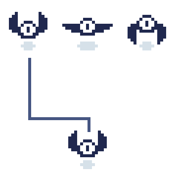
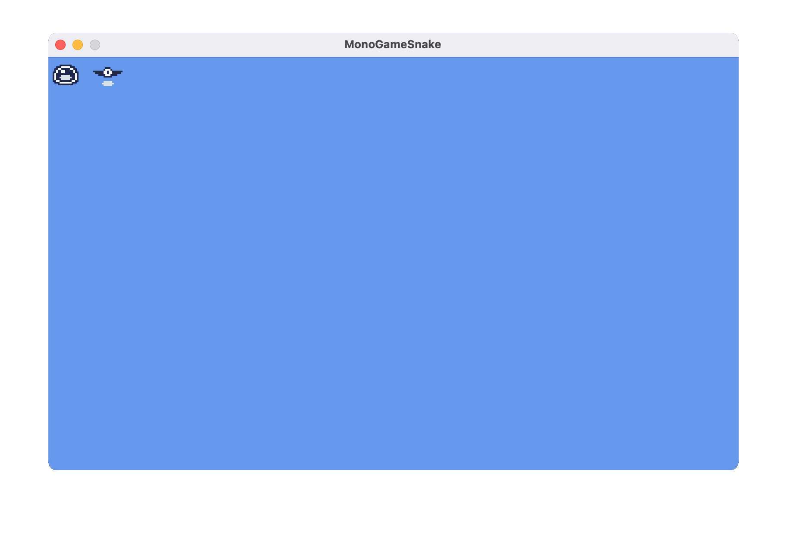

While packing images into a texture atlas and managing them through our `Sprite` class improves performance and organization, games need animation to bring their visuals to life. 2D animation in games works much like a flip book; a sequence of individual images (*frames*) displayed in rapid succession creates the illusion of movement. Each frame represents a specific point in the sprite's animation, and when these frames are cycled through quickly, our eyes perceive fluid motion.

> [!NOTE]
> The term "frame" in animation refers to a single image in an animation sequence. This is different from a game frame, which represents one complete render cycle of your game.

In MonoGame, we can create these animations by cycling through different regions of our texture atlas, with each region representing a single frame of the animation. For example, Figure 8-1 below shows three frames that make up a bat's wing-flapping animation:

|  |
| :---: |
| **Figure 8-1: Animation example of a bat flapping its wings** |

By drawing each frame sequentially over time, we create the illusion that the bat is flapping its wings. The speed at which we switch between frames determines how smooth or rapid the animation appears.

In this chapter, we'll build off of the `Sprite` class we created in [Chapter 09](../09_the_sprite_class/index.md) to create an `AnimatedSprite` class we can use to bring animations to life.

## The Animation Class

Before we can create animated sprites, we need a way to manage animation data. Let's create an `Animation` class to encapsulate this information. In the *Graphics* directory within the *MonoGameLibrary* project, add a new file named *Animation.cs* with this initial structure:

```cs
using System;
using System.Collections.Generic;

namespace MonoGameLibrary.Graphics;

public class Animation
{

}
```

### Animation Properties

An animation requires two key pieces of information: the sequence of frames to display and the timing between them. Let's add these properties to the `Animation` class:

```cs
/// <summary>
/// The texture regions that make up the frames of this animation.  The order of the regions within the collection
/// are the order that the frames should be displayed in.
/// </summary>
public List<TextureRegion> Frames {get; set;}

/// <summary>
/// The amount of time to delay between each frame before moving to the next frame for this animation.
/// </summary>
public TimeSpan Delay {get; set;}
```

The `Frames` property stores the collection of texture regions that make up the animation sequence. The order of regions in this collection is important; they'll be displayed in the same sequence they're added, creating the animation's movement. For example, in our bat animation, the frames would be ordered to show the wings moving up, then fully extended, then down.

The `Delay` property defines how long each frame should be displayed before moving to the next one. This timing control allows us to adjust the speed of our animations; a shorter delay creates faster animations, while a longer delay creates slower ones.

> [!NOTE]
> Using `TimeSpan` for the delay allows us to specify precise timing intervals, making it easier to synchronize animations with game time. In other scenarios, you could opt to use `float` values instead.

### Animation Constructors

The `Animation` class will provide two ways to create an animation.  Add the following constructors:

```cs
/// <summary>
/// Creates a new animation.
/// </summary>
public Animation()
{
    Frames = new List<TextureRegion>();
    Delay = TimeSpan.FromMilliseconds(100);
}

/// <summary>
/// Creates a new animation with the specified frames and delay.
/// </summary>
/// <param name="frames">An ordered collection of the frames for this animation.</param>
/// <param name="delay">The amount of time to delay between each frame of this animation.</param>
public Animation(List<TextureRegion> frames, TimeSpan delay)
{
    Frames = frames;
    Delay = delay;
}
```

The default constructor creates an animation with an empty collection of frames and a default delay of 100 milliseconds between each frame.  The parameterized constructor allows you to specify the frames of animation and the delay for the animation.

> [!TIP]
> The default 100 milliseconds delay provides a good starting point for most animations, roughly equivalent to 10 animation frame changes per second.

## Creating Animations With The TextureAtlas Class

The `TextureAtlas` class we created in [Chapter 08](../08_optimizing_texture_rendering/index.md#the-textureatlas-class) can do more than just manage texture regions and create sprites; it can also store and manage animation data to create animated sprites with.  The *atlas.png* image we are currently using contains the frames of animation for both a slime and a bat, as well as sprites for other things. Let's first update our *atlas-definition.xml* file to include all regions in the atlas, as well as add new `<Animation>` elements to define the animations.  Open the *atlas-definition.xml* file and replace the contents with the following:

```xml
<?xml version="1.0" encoding="utf-8"?>
<TextureAtlas>
    <Texture>images/atlas</Texture>
    <Regions>
        <Region name="wall-upper-left" x="0" y="0" width="40" height="40" />
        <Region name="wall-upper-middle" x="40" y="0" width="40" height="40" />
        <Region name="wall-upper-middle-alt" x="80" y="0" width="40" height="40" />
        <Region name="wall-upper-right" x="120" y="0" width="40" height="40" />
        <Region name="wall-left-middle" x="0" y="40" width="40" height="40" />
        <Region name="wall-front" x="40" y="40" width="40" height="40" />
        <Region name="wall-front-alt" x="80" y="40" width="40" height="40" />
        <Region name="wall-right-middle" x="120" y="40" width="40" height="40" />
        <Region name="wall-left-middle-alt" x="0" y="80" width="40" height="40" />
        <Region name="floor-tile" x="40" y="80" width="40" height="40" />
        <Region name="floor-tile-cracked" x="80" y="80" width="40" height="40" />
        <Region name="wall-right-middle-alt" x="120" y="80" width="40" height="40" />
        <Region name="wall-bottom-left" x="0" y="120" width="40" height="40" />
        <Region name="wall-bottom-middle" x="40" y="120" width="40" height="40" />
        <Region name="wall-bottom-middle-alt" x="80" y="120" width="40" height="40" />
        <Region name="wall-bottom-right" x="120" y="120" width="40" height="40" />
        <Region name="slime-1" x="0" y="160" width="40" height="40" />
        <Region name="slime-2" x="40" y="160" width="40" height="40" />
        <Region name="bat-1" x="80" y="160" width="40" height="40" />
        <Region name="bat-2" x="120" y="160" width="40" height="40" />
        <Region name="bat-3" x="0" y="200" width="40" height="40" />
    </Regions>
    <Animations>
        <Animation name="slime-animation" delay="200">
            <Frame region="slime-1" />
            <Frame region="slime-2" />
        </Animation>
        <Animation name="bat-animation" delay="200">
            <Frame region="bat-1" />
            <Frame region="bat-2" />
            <Frame region="bat-1" />
            <Frame region="bat-3" />
        </Animation>
    </Animations>
</TextureAtlas>
```

The key changes here are:

- Regions have been added for all regions within the atlas.
- The slime and bat regions have been renamed to reflect the frame number of the animation.
- A new `<Animations>` element has been added that defines `<Animation>` elements.

> [!NOTE]
> In the bat animation, we reuse frame "bat-1" in the sequence (bat-1, bat-2, bat-1, bat-3). This creates a smoother wing-flapping animation by returning to the neutral position between up and down wing positions.

Now that we have a fully configured XML configuration for the atlas, we need to update the `TextureAtlas` class to manage animation data.  Open the *TextureAtlas.cs* file and make the following changes:

1. Add storage for animations

    ```cs
    private Dictionary<string, Animation> _animations;
    ```

2. Update the constructors so that the animations dictionary is initialized:

    ```cs
    /// <summary>
    /// Creates a new texture atlas.
    /// </summary>
    public TextureAtlas()
    {
        _regions = new Dictionary<string, TextureRegion>();
        _animations = new Dictionary<string, Animation>();
    }

    /// <summary>
    /// Creates a new texture atlas instance using the given texture.
    /// </summary>
    /// <param name="texture">The source texture represented by the texture atlas.</param>
    public TextureAtlas(Texture2D texture)
    {
        Texture = texture;
        _regions = new Dictionary<string, TextureRegion>();
        _animations = new Dictionary<string, Animation>();
    }
    ```

3. Add methods to manage animations, similar to those that we use to manage regions:

    ```cs
    /// <summary>
    /// Adds the given animation to this texture atlas with the specified name.
    /// </summary>
    /// <param name="animationName">The name of the animation to add.</param>
    /// <param name="animation">The animation to add.</param>
    public void AddAnimation(string animationName, Animation animation)
    {
        _animations.Add(animationName, animation);
    }

    /// <summary>
    /// Gets the animation from this texture atlas with the specified name.
    /// </summary>
    /// <param name="animationName">The name of the animation to retrieve.</param>
    /// <returns>The animation with the specified name.</returns>
    public Animation GetAnimation(string animationName)
    {
        return _animations[animationName];
    }

    /// <summary>
    /// Removes the animation with the specified name from this texture atlas.
    /// </summary>
    /// <param name="animationName">The name of the animation to remove.</param>
    /// <returns>true if the animation is removed successfully; otherwise, false.</returns>
    public bool RemoveAnimation(string animationName)
    {
        return _animations.Remove(animationName);
    }
    ```

4. Update the `FromFile` method to parse the new `<Animation>` animation definitions from the XML configuration file

    ```cs
    /// <summary>
    /// Creates a new texture atlas based a texture atlas xml configuration file.
    /// </summary>
    /// <param name="content">The content manager used to load the texture for the atlas.</param>
    /// <param name="fileName">The path to the xml file, relative to the content root directory..</param>
    /// <returns>The texture atlas created by this method.</returns>
    public static TextureAtlas FromFile(ContentManager content, string fileName)
    {
        TextureAtlas atlas = new TextureAtlas();

        string filePath = Path.Combine(content.RootDirectory, fileName);

        using (Stream stream = TitleContainer.OpenStream(filePath))
        {
            using (XmlReader reader = XmlReader.Create(stream))
            {
                XDocument doc = XDocument.Load(reader);
                XElement root = doc.Root;

                // The <Texture> element contains the content path for the Texture2D to load.
                // So we'll retrieve that value then use the content manager to load the texture.
                string texturePath = root.Element("Texture").Value;
                atlas.Texture = content.Load<Texture2D>(texturePath);

                // The <Regions> element contains individual <Region> elements, each one describing
                // a different texture region within the atlas.  
                //
                // Example:
                // <Regions>
                //      <Region name="spriteOne" x="0" y="0" width="32" height="32" />
                //      <Region name="spriteTwo" x="32" y="0" width="32" height="32" />
                // </Regions>
                //
                // So we retrieve all of the <Region> elements then loop through each one
                // and generate a new TextureRegion instance from it and add it to this atlas.
                var regions = root.Element("Regions")?.Elements("Region");

                if (regions != null)
                {
                    foreach (var region in regions)
                    {
                        string name = region.Attribute("name")?.Value;
                        int x = int.Parse(region.Attribute("x")?.Value ?? "0");
                        int y = int.Parse(region.Attribute("y")?.Value ?? "0");
                        int width = int.Parse(region.Attribute("width")?.Value ?? "0");
                        int height = int.Parse(region.Attribute("height")?.Value ?? "0");

                        if (!string.IsNullOrEmpty(name))
                        {
                            atlas.AddRegion(name, x, y, width, height);
                        }
                    }
                }

                // The <Animations> element contains individual <Animation> elements, each one describing
                // a different animation within the atlas.
                //
                // Example:
                // <Animations>
                //      <Animation name="animation" delay="100">
                //          <Frame region="spriteOne" />
                //          <Frame region="spriteTwo" />
                //      </Animation>
                // </Animations>
                //
                // So we retrieve all of the <Animation> elements then loop through each one
                // and generate a new Animation instance from it and add it to this atlas.
                var animationElements = root.Element("Animations").Elements("Animation");

                if(animationElements != null)
                {
                    foreach(var animationElement in animationElements)
                    {
                        string name = animationElement.Attribute("name")?.Value;
                        float delayInMilliseconds = float.Parse(animationElement.Attribute("delay")?.Value ?? "0");
                        TimeSpan delay = TimeSpan.FromMilliseconds(delayInMilliseconds);

                        List<TextureRegion> frames = new List<TextureRegion>();

                        var frameElements = animationElement.Elements("Frame");

                        if(frameElements != null)
                        {
                            foreach(var frameElement in frameElements)
                            {
                                string regionName = frameElement.Attribute("region").Value;
                                TextureRegion region = atlas.GetRegion(regionName);
                                frames.Add(region);
                            }
                        }

                        Animation animation = new Animation(frames, delay);
                        atlas.AddAnimation(name, animation);
                    }
                }

                return atlas;
            }
        }
    }
    ```

The updated `FromFile` method now handles both region and animation definitions from the XML configuration. For animations, it:

- Reads the `<Animations>` section from the XML.
- For each animation:
  - Gets the name and frame delay.
  - Collects the referenced texture regions.
  - Creates and stores a new `Animation` instance.

## The AnimatedSprite Class

With our `Animation` class handling animation data, and the `TextureAtlas` updated to store the animation data, we can now create a class that represents an animated sprites. Since an animated sprite is essentially a sprite that changes its texture region over time, we can build upon our existing `Sprite` class through inheritance.

> [!NOTE]
> By inheriting from `Sprite`, our `AnimatedSprite` class automatically gets all the rendering properties (position, rotation, scale, etc.) while adding animation-specific functionality.

The key to this design is the `Sprite.Region` property. Our `Sprite` class already knows how to render whatever region is currently set, so our `AnimatedSprite` class just needs to update this region property to the correct animation frame at the right time.

Let's create the initial structure for our `AnimatedSprite` class. In the *Graphics* directory within the *MonoGameLibrary* project, add a new file named *AnimatedSprite.cs*:

```cs
using System;
using Microsoft.Xna.Framework;

namespace MonoGameLibrary.Graphics;

public class AnimatedSprite : Sprite
{

}
```

### AnimatedSprite Members

An animated sprite needs to track both its current animation state and timing information. Let's add the following members to the `AnimatedSprite` class:

```cs
private int _currentFrame;
private TimeSpan _elapsed;
private Animation _animation;

/// <summary>
/// Gets or Sets the animation for this animated sprite.
/// </summary>
public Animation Animation
{
    get => _animation;
    set
    {
        _animation = value;
        Region = _animation.Frames[0];
    }
}
```

The class uses three private fields to manage its animation state:

- `_currentFrame`: Tracks which frame of the animation is currently being displayed.
- `_elapsed`: Keeps track of how much time has passed since the last frame change.
- `_animation`: Stores the current animation being played.

The `Animation` property provides access to the current animation while ensuring the sprite always starts with the first frame when a new animation is set. When you assign a new animation, the property's setter automatically updates the sprite's region to display the first frame of that animation.

> [!NOTE]
> Starting with the first frame when setting a new animation ensures consistent behavior when switching between different animations.

### AnimatedSprite Constructors

The `AnimatedSprite` class will provide two ways to create an animated sprite.  Add the following constructors:

```cs
/// <summary>
/// Creates a new animated sprite.
/// </summary>
public AnimatedSprite() { }

/// <summary>
/// Creates a new animated sprite with the specified frames and delay.
/// </summary>
/// <param name="animation">The animation for this animated sprite.</param>
public AnimatedSprite(Animation animation)
{
    Animation = animation;
}
```

The default constructor creates an empty animated sprite that can be configured later. The parameterized constructor creates an animated sprite with a specified animation, which automatically sets the sprite's initial region to the first frame of that animation through the `Animation` property.

> [!NOTE]
> Both constructors inherit from the base `Sprite` class, so an `AnimatedSprite` will have all the same rendering properties (position, rotation, scale, etc.) as a regular sprite.

### AnimatedSprite Methods

The `AnimatedSprite` class needs a way to update its animation state over time. This is handled by a single `Update` method:

```cs
/// <summary>
/// Updates this animated sprite.
/// </summary>
/// <param name="gameTime">A snapshot of the game timing values provided by the framework.</param>
public void Update(GameTime gameTime)
{
    _elapsed += gameTime.ElapsedGameTime;

    if (_elapsed >= _animation.Delay)
    {
        _elapsed -= _animation.Delay;
        _currentFrame++;

        if (_currentFrame >= _animation.Frames.Count)
        {
            _currentFrame = 0;
        }

        Region = _animation.Frames[_currentFrame];
    }
}
```

The `Update` method manages the animation timing and frame progression:

1. Accumulates the time passed since the last update in `_elapsed`.
2. When enough time has passed (defined by the animation's delay):
   - Resets the elapsed time counter
   - Advances to the next frame
   - Loops back to the first frame if we've reached the end
   - Updates the sprite's region to display the current frame

> [!NOTE]
> Unlike the `Sprite` class which only needs a `Draw` method, the `AnimatedSprite` requires this additional `Update` method to handle frame changes over time. This follows MonoGame's update/draw pattern we first saw in [Chapter 03](../03_the_game1_file/index.md)

The `Draw` method inherited from the base `Sprite` class remains unchanged, as it will automatically use whatever frame is currently set as the sprite's region.

## Creating AnimatedSprites With The TextureAtlas Class

Similar to the update we did to the `TextureAtlas` class in [Chapter 09](../09_the_sprite_class/index.md#create-sprites-with-the-textureatlas-class), creating an `AnimatedSprite` from the atlas would require

1. Get the animation by name.
2. Store it in a variable.
3. Create a new animated sprite with that animation.

We can simplify this process by adding an animated spirte creation method to the `TextureAtlas` class. Open *TextureAtlas.cs* and add the following method:

```cs
/// <summary>
/// Creates a new animated sprite using the animation from this texture atlas with the specified name.
/// </summary>
/// <param name="animationName">The name of the animation to use.</param>
/// <returns>A new AnimatedSprite using the animation with the specified name.</returns>
public AnimatedSprite CreateAnimatedSprite(string animationName)
{
    Animation animation = GetAnimation(animationName);
    return new AnimatedSprite(animation);
}
```

## Using the AnimatedSprite Class

Let's adjust our game now to use the `AnimatedSprite` class to see our sprites come to life. Replaces the contents of *Game1.cs* with the following:

[!code-csharp[](./src/Game1-animatedsprite-usage.cs?highlight=13-14,37-41,49-51)]

Let's examine the key changes in this implementation:

- The `_slime` and `_bat` members were changed from `Sprite`  to `AnimatedSprite`.
- In [**LoadContent**](xref:Microsoft.Xna.Framework.Game.LoadContent) the `_slime` and `_bat` sprites are now created using the new `TextureAtlas.CreateAnimatedSprite` method.
- In [**Update**](xref:Microsoft.Xna.Framework.Game.Update(Microsoft.Xna.Framework.GameTime)), the animations are updated based on the game time using hte `AnimatedSprite.Update` method.

Running the game now shows both sprites animating automatically:

- The slime bounces between two frames
- The bat's wings flap in a continuous cycle

|  |
| :---: |
| **Figure 8-2: The slime and bat sprite animating** |

## Conclusion

Let's review what you accomplished in this chapter:

- Created an `Animation` class to manage frame sequences and timing.
- Extended the `TextureAtlas` class to support animation definitions.
- Built an `AnimatedSprite` class that inherits from `Sprite`.
- Applied inheritance to add animation capabilities while maintaining existing sprite functionality.
- Used XML configuration to define animations separately from code.

Now that we can efficiently manage and render sprites and animations, in the next chapter we'll start taking a look at user input.

## Test Your Knowledge

1. Why did we create a separate `Animation` class instead of putting animation properties directly in `AnimatedSprite`?

   <details>
   <summary>Question 1 Answer</summary>
   
   > Separating animation data into its own class allows multiple `AnimatedSprite` instances to share the same animation definition. This is more efficient than each sprite having its own copy of the frame sequence and timing information.
   </details><br />

2. What is the benefit of using `TimeSpan` for animation delays instead of float values?

   <details>
   <summary>Question 2 Answer</summary>
   
   > `TimeSpan` provides precise timing control and makes it easier to synchronize animations with game time. It also makes the delay values more explicit (milliseconds vs arbitrary numbers) and helps prevent timing errors.
   </details><br />

3. Why does the `AnimatedSprite` class need an `Update` method while the base `Sprite` class doesn't?

   <details>
   <summary>Question 3 Answer</summary>
   
   > The `AnimatedSprite` needs to track elapsed time and change frames based on the animation's timing. This requires updating its state over time, while a regular sprite's appearance remains static until explicitly changed.
   </details><br />

4. In the `TextureAtlas` XML configuration, why might you want to reuse a frame in an animation sequence, like we did with the bat animation?

   <details>
   <summary>Question 4 Answer</summary>
   
   > Reusing frames in an animation sequence can create smoother animations by providing transition states. In the bat animation, reusing the neutral position (bat-1) between wing movements creates a more natural flapping motion without requiring additional sprite frames.
   </details><br />