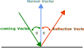

In [Chapter 10](../10_input_management/index.md), you learned how to manage player input to control game objects. However, for objects in your game to interact with each other, collecting items, hitting obstacles, or triggering events, you need to detect when these objects come into contact. This is accomplished through collision detection.

In this chapter you will:

- Understand different collision shapes and their use cases.
- Implement rectangle-based collision detection.
- Create circle-based collision detection.
- Learn how to handle object overlap and response.
- Build a reusable collision system for your game.

Let's start by understanding the basics of collision detection and the different approaches we can use.

## Understanding Collision Detection

Before we start implementing collision detection, let's discuss what collision detection actually is. In 2D games, collision detection involves checking if two objects interact with each other in some way. There are several approaches to detecting collisions, ranging from simple to complex:

1. Distance Checks: The simplest form - checking if objects are within a certain range of each other. This is useful when you only need to know if objects are "near" each other, like detecting if an enemy is close enough to chase the player.

2. Simple Shape Based Checks: Checking if two shapes overlap. The most common and simple shapes used are:
   - Rectangles:
        - Great for walls, platforms, and most game objects.
        - Easy to visualize and debug.
        - Works well with tile-based games.
   - Circles:
       - Better for round objects like balls and coins.
       - More accurate for rotating objects.
       - Simpler check for overlap than rectangles.

    > [!NOTE]
    > These shapes are popular because they're simple to work with and cover most gameplay needs.  

3. Complex Polygon Checks: For games needing precise collision detection, you can use more complex shapes. However, these are more complicated to implement and generally unnecessary for most 2D games.

> [!TIP]
> Start with the simplest collision detection that meets your needs. If distance checks work for your game mechanic, there's no need to implement more complex shape-based collision. Similarly, rectangle collision is usually sufficient for most 2D games.

### Collision Detection vs Collision Response

Often times when talking about collision detection, the term is used to mean both the detection of overlapping shapes and what to do once a positive check has occurred.  What you do after a positive collision check has occurred is called the *collision response*.  Some of the common responses are:

- Blocking: Prevent objects from overlapping (like walls).
- Triggering: Cause an event (like collecting items).
- Bouncing: Reflect objects off each other (like balls).

We'll explore implementing these responses throughout this chapter.

## Rectangle Collision

The most basic form of collision detection uses rectangles, often called *bounding boxes* because they bound (or contain) the game object.  Typically for rectangles we use what is called *Axis-Aligned Bounding Box* (AABB) detection.  In order to use AABB detection, the axes of the rectangle must be aligned with the axes of the screen.  That's just a fancy way of saying the rectangles can't be rotated.

For example, look at Figure 11-1 below.  The axes of the rectangle on the left are aligned with the axes of the screen, however the axes of the rectangle on the right are not.

|  |
| :---: |
| **Figure 11-1: Axis-Aligned Bounding Box versus Not Axis-Aligned Bounding Box** |

If two bounding boxes were to overlap, like in Figure 11-2 below, then we would say they are colliding:

|  |
| :---: |
| **Figure 11-2: Two axis-aligned bounding boxes colliding** |

MonoGame provides the [**Rectangle**](xref:Microsoft.Xna.Framework.Rectangle) struct which represents a rectangle by its position (X,Y) and size (Width,Height). The following table shows some of the properties of the [**Rectangle**](xref:Microsoft.Xna.Framework.Rectangle) struct:

| Property                                                    | Type  | Description                                                                                                                                                                          |
|-------------------------------------------------------------|-------|--------------------------------------------------------------------------------------------------------------------------------------------------------------------------------------|
| [**Bottom**](xref:Microsoft.Xna.Framework.Rectangle.Bottom) | `int` | Returns the y-coordinate location of the bottom edge of the rectangle.  This is equal to [**Rectangle.Y](xref:Microsoft.Xna.Framework.Rectangle.Y) plus the height of the rectangle. |
| [**Left**](xref:Microsoft.Xna.Framework.Rectangle.Left)     | `int` | Returns the x-coordinate location of the left edge of the rectangle.  This is equal to [**Rectangle.X**](Microsoft.Xna.Framework.Rectangle.X).                                       |
| [**Right**](xref:Microsoft.Xna.Framework.Rectangle.Right)   | `int` | Returns the x-coordinate location of the right edge of the rectangle.  This is equal to [**Rectangle.X**](xref:Microsoft.Xna.Framework.Rectangle.X) plus the width of the rectangle. |
| [**Top**](xref:Microsoft.Xna.Framework.Rectangle.Top)       | `int` | Returns the y-coordinate location of the top edge of the rectangle. This is equal to [**Rectangle.Y**](xref:Microsoft.Xna.Framework.Rectangle.Y).                                    |

When using AABB collision detection, there are four conditions that must be true in order to say a collision has occurred.  Given two bounding boxes (rectangles), `A` and `B`, these conditions are:

1. `A.Left` must be less than `B.Right`.
2. `A.Right` must be greater than `B.Left`.
3. `A.Top` must be less than `B.Bottom`.
4. `A.Bottom` must be greater than `B.Top`.

If even a single one of these conditions is false, then the bounding boxes are not overlapping and thus not colliding.

In code, this would look similar to the following:

```cs
public bool IsColliding(Rectangle a, Rectangle b)
{
    return a.Left < b.Right &&
           a.Right > b.Left &&
           a.Top < b.Bottom &&
           a.Bottom > b.Top;
}
```

We do not need to implement this ourselves though. the MonoGame [**Rectangle**](xref:Microsoft.Xna.Framework.Rectangle) struct has an [**Intersects**](xref:Microsoft.Xna.Framework.Rectangle.Intersects(Microsoft.Xna.Framework.Rectangle)) method we can use that already implements the AABB check for us.

```cs
Rectangle rect1 = new Rectangle(0, 0, 32, 32);
Rectangle rect2 = new Rectangle(16, 16, 32, 32);

bool isColliding = rect1.Intersects(rect2);
```

Using this, let's modify our game code to check for collision between the slime and the bat sprites. Open the *Game1.cs* file and perform the following:

1. Add the following method which checks for collisions between the slime and bat and returns true if they are colliding or false if not:

    ```cs
    private bool CollisionCheck()
    {
        Rectangle slimeBounds = new Rectangle
        (
            (int)_slimePosition.X,
            (int)_slimePosition.Y,
            (int)_slime.Width,
            (int)_slime.Height
        );
        
        Rectangle batBounds = new Rectangle
        (
            (int)_batPosition.X,
            (int)_batPosition.Y,
            (int)_bat.Width,
            (int)_bat.Height
        );

        return slimeBounds.Intersects(batBounds);
    }
    ```

2. In the [**Update**](xref:Microsoft.Xna.Framework.Game.Update(Microsoft.Xna.Framework.GameTime)) method, just before the `base.Update` call, add the following:

    ```cs
    if (CollisionCheck())
    {
        _slime.Color = Color.Red;
        _bat.Color = Color.Red;
    }
    else
    {
        _slime.Color = Color.White;
        _bat.Color = Color.White;
    }
    ```

This change performs the following:

- Creates a `CollisionCheck` method we can call to check for collisions.  Within this method it:
  - Creates a [**Rectangle**](xref:Microsoft.Xna.Framework.Rectangle) to represent the bounds of the slime.
  - Creates a [**Rectangle**](xref:Microsoft.Xna.Framework.Rectangle) to represent the bounds of the bat.
  - Checks if the bounds of the slime intersects the bounds of the bat.
    - If they intersect, returns true.
    - If they do not intersect, returns false.
- Call the `CollisionCheck` method from [**Update**](xref:Microsoft.Xna.Framework.Game.Update(Microsoft.Xna.Framework.GameTime)).
  - If it returns true, set the color mask of both sprites to red.
  - if it returns false, set the color mask of both sprites to the default white.

> [!NOTE]
> When there is a collision and we change the color to red, this change is the *collision response*.  We'll discuss responses more in-depth later in this chapter.

Running the game now, you can move the slime sprite around and anytime it collides with the bat sprite, both will change to a red tint.  You can click to move the bat to a different position to see that its bounding box updates with its position.

|  |
| :---: |
| **Figure 11-3: The slime and bat sprite changing colors when colliding** |

## The Circle Struct

For some objects, a circle might better represent their collision area.  MonoGame does not have a `Circle` struct to represent a circle like it does with [**Rectangle**](xref:Microsoft.Xna.Framework.Rectangle).  Before we can discuss circle collision, we will need to create our own.  

In the *MonoGameLibrary* project, add a new file named *Circle.cs*.  Add the following code as the foundation of the `Circle` struct:

```cs
using System;
using Microsoft.Xna.Framework;

namespace MonoGameLibrary;

public readonly struct Circle : IEquatable<Circle>
{
    
}
```

> [!NOTE]
> Notice that the struct will implement [`IEquatable<T>`](https://learn.microsoft.com/en-us/dotnet/api/system.iequatable-1).  When creating value types like this, it is recommended to implement `IEquatable<T>` because it has better performance and can help avoid boxing.  
>
> For more information on recommended design guidelines for structs, see https://learn.microsoft.com/en-us/dotnet/standard/design-guidelines/struct.

### Circle Fields

The `Circle` struct uses both private and public fields to store its state.

First, add the following private static field that stores a reusable empty circle:

```cs
private static readonly Circle s_empty = new Circle();
```

Next, add the following public fields that define the circle's position and size:

```cs
/// <summary>
/// The x-coordinate of the center of this circle.
/// </summary>
public readonly int X;

/// <summary>
/// The y-coordinate of the center of this circle.
/// </summary>
public readonly int Y;

/// <summary>
/// The length, in pixels, from the center of this circle to the edge.
/// </summary>
public readonly int Radius;
```

These public fields store the fundamental properties of the circle:

- `X` and `Y` define the center point location.
- `Radius` defines how far the circle extends from its center.

### Circle Properties

The `Circle` struct provides properties to access its location, state, and its boundaries.

Add the following property to get the location of the circle as a [**Point**](xref:Microsoft.Xna.Framework.Point) value:

```cs
/// <summary>
/// Gets the location of the center of this circle.
/// </summary>
public readonly Point Location => new Point(X, Y);
```

Add the following properties to track empty circles:

```cs
/// <summary>
/// Gets a circle with X=0, Y=0, and Radius=0.
/// </summary>
public static Circle Empty => s_empty;

/// <summary>
/// Gets a value that indicates whether this circle has a radius of 0 and a location of (0, 0).
/// </summary>
public readonly bool IsEmpty => X == 0 && Y == 0 && Radius == 0;
```

> [!NOTE]
> The `Empty` property returns a reusable instance of an empty circle stored in the private static field `s_empty`. This is more efficient than creating new empty circles each time one is needed, as it reuses the same instance in memory.

Add the following properties for getting the circle's boundaries:

```cs
/// <summary>
/// Gets the y-coordinate of the highest point on this circle.
/// </summary>
public readonly int Top => Y - Radius;

/// <summary>
/// Gets the y-coordinate of the lowest point on this circle.
/// </summary>
public readonly int Bottom => Y + Radius;

/// <summary>
/// Gets the x-coordinate of the leftmost point on this circle.
/// </summary>
public readonly int Left => X - Radius;

/// <summary>
/// Gets the x-coordinate of the rightmost point on this circle.
/// </summary>
public readonly int Right => X + Radius;
```

> [!TIP]
> These boundary properties are particularly useful when you need to know the extent of a circle in screen space, such as determining if a circle is visible on screen or creating a bounding box around the circle.

### Circle Constructors

The `Circle` struct provides two ways to create a new circle:

```cs
/// <summary>
/// Creates a new circle with the specified position and radius.
/// </summary>
/// <param name="x">The x-coordinate of the center of the circle.</param>
/// <param name="y">The y-coordinate of the center of the circle..</param>
/// <param name="radius">The length from the center of the circle to an edge.</param>
public Circle(int x, int y, int radius)
{
    X = x;
    Y = y;
    Radius = radius;
}

/// <summary>
/// Creates a new circle with the specified position and radius.
/// </summary>
/// <param name="location">The center of the circle.</param>
/// <param name="radius">The length from the center of the circle to an edge.</param>
public Circle(Point location, int radius)
{
    X = location.X;
    Y = location.Y;
    Radius = radius;
}
```

The first constructor accepts individual x and y coordinates for the circle's center, while the second accepts a [**Point**](xref:Microsoft.Xna.Framework.Point) struct that combines both coordinates. Both constructors require a radius value that defines the circle's size.

### Circle Methods

The `Circle` struct implements several methods to support equality comparison between circles. These methods allow us to check if two circles are identical (have the same center position and radius).

First, add the following methods for comparing a circle with another object:

```cs
/// <summary>
/// Returns a value that indicates whether this circle and the specified object are equal
/// </summary>
/// <param name="obj">The object to compare with this circle.</param>
/// <returns>true if this circle and the specified object are equal; otherwise, false.</returns>
public override readonly bool Equals(object obj) => obj is Circle other && Equals(other);

/// <summary>
/// Returns a value that indicates whether this circle and the specified circle are equal.
/// </summary>
/// <param name="other">The circle to compare with this circle.</param>
/// <returns>true if this circle and the specified circle are equal; otherwise, false.</returns>
public readonly bool Equals(Circle other) => this.X == other.X &&
                                                this.Y == other.Y &&
                                                this.Radius == other.Radius;
```

Next, add the following override for `GetHashCode` to support using circles in hash-based collections:

```cs
/// <summary>
/// Returns the hash code for this circle.
/// </summary>
/// <returns>The hash code for this circle as a 32-bit signed integer.</returns>
public override readonly int GetHashCode() => HashCode.Combine(X, Y, Radius);
```

Finally, add the following  operator overloads to support using == and != with circles:

```cs
/// <summary>
/// Returns a value that indicates if the circle on the left hand side of the equality operator is equal to the
/// circle on the right hand side of the equality operator.
/// </summary>
/// <param name="lhs">The circle on the left hand side of the equality operator.</param>
/// <param name="rhs">The circle on the right hand side of the equality operator.</param>
/// <returns>true if the two circles are equal; otherwise, false.</returns>
public static bool operator ==(Circle lhs, Circle rhs) => lhs.Equals(rhs);

/// <summary>
/// Returns a value that indicates if the circle on the left hand side of the inequality operator is not equal to the
/// circle on the right hand side of the inequality operator.
/// </summary>
/// <param name="lhs">The circle on the left hand side of the inequality operator.</param>
/// <param name="rhs">The circle on the right hand side fo the inequality operator.</param>
/// <returns>true if the two circle are not equal; otherwise, false.</returns>
public static bool operator !=(Circle lhs, Circle rhs) => !lhs.Equals(rhs);
```

> [!TIP]
> The operator overloads allow you to compare circles using familiar syntax:
>
> ```cs
> Circle circle1 = new Circle(0, 0, 5);
> Circle circle2 = new Circle(0, 0, 5);
> bool areEqual = circle1 == circle2;    // Returns true
> ```

## Circle Collision

Circle collision is calculated using the distance between the centers of the two circles. If the distance between the center of two circles is smaller than the sum of their radii, then they are considered overlapping (colliding).  To find the distance between the center of two circles, Monogame provides the [**Vector2.Distance**](xref:Microsoft.Xna.Framework.Vector2.Distance(Microsoft.Xna.Framework.Vector2,Microsoft.Xna.Framework.Vector2)) method which needs two pieces of information:

1. The location of the center of one circle.
1. The location of the center of another circle.

> [!TIP]
> To find the distance between two points, think about walking from one point to another - you can walk straight there (the direct distance) or you can walk first up/down then left/right (forming a right triangle). [**Vector2.Distance**](xref:Microsoft.Xna.Framework.Vector2.Distance(Microsoft.Xna.Framework.Vector2,Microsoft.Xna.Framework.Vector2)) calculates this direct path between the points automatically using Pythagorean's Theorem.

The following example shows how we can use this method to calculate the distance between two circles:

```cs
Circle circle1 = new Circle(5, 6, 5);
Circle circle1 = new Circle(8, 10, 5);
float distance = Vector2.Distance(circle1.Location.ToVector2(), circle2.Location.ToVector2());
```

> [!TIP]
> The [ToVector2](xref:Microsoft.Xna.Framework.Point.ToVector2) method provides an easy way to convert the [**Point**](xref:Microsoft.Xna.Framework.Point) to a [**Vector2**](xref:Microsoft.Xna.Framework.Vector2) for use with the [**Vector2.Distance**](xref:Microsoft.Xna.Framework.Vector2.Distance(Microsoft.Xna.Framework.Vector2,Microsoft.Xna.Framework.Vector2)) method.

Now that we know how to determine the distance between the center of two circles, we only need to compare that value with the sum of the radii of the two circles.

1. If the distance is greater than or equal to the sum of the radii, then the circles do not overlap
2. If the distance is less than the sum of the radii, then the circles do overlap.

|  |
| :---: |
| **Figure 11-4: Circle collision showing how distance between centers determines overlap** |

> [!NOTE]
> In Figure 11-4 above, we can see from the two circles in the upper-left corner that the distance is equal to the sum of the radii.  This means they are **touching** but not overlapping. Remember, to overlap, the distance must be less than the sum of the radii.

Let's update the `Circle` struct we created to include an `Intersects` method similar to [**Rectangle**](xref:Microsoft.Xna.Framework.Rectangle).  Add the following method to the `Circle` struct

```cs
/// <summary>
/// Returns a value that indicates whether the specified circle intersects with this circle.
/// </summary>
/// <param name="other">The other circle to check.</param>
/// <returns>true if the other circle intersects with this circle; otherwise, false.</returns>
public bool Intersects(Circle other)
{
    int radii = this.Radius + other.Radius;
    float distance = Vector2.Distance(this.Location.ToVector2(), other.Location.ToVector2());
    return distance < radii;
}
```

Now update the game to use the `Circle` struct as the bounding box for collision for the slime and the sprite.  Open *Game1.cs* and perform the following:

1. In  `CheckCollision` change the `slimeBound` and `batBound` values to now be `Circle` instead of [**Rectangle**](xref:Microsoft.Xna.Framework.Rectangle):

```cs
Circle slimeBounds = new Circle
(
    (int)(_slimePosition.X + (_slime.Width * 0.5f)),
    (int)(_slimePosition.Y + (_slime.Height * 0.5f)),
    (int)(_slime.Width * 0.5f)
);

Circle batBounds = new Circle
(
    (int)(_batPosition.X + (_bat.Width * 0.5f)),
    (int)(_batPosition.Y + (_bat.Height * 0.5f)),
    (int)(_bat.Width * 0.5f)
);
```

> [!NOTE]
> When creating the circles above, the `x` and `y` values given are the position of the sprite multiplied by half the width and height of the sprite.  This is done because the location of a `Circle` should be the center of the sprite.

Running the game will produce very similar result to what we saw before when using rectangles for the bounding box.

## Collision Response

Now that we can detect when objects collide, we need to decide how they should react to those collisions. There are several common types of collision responses we can implement.  The ones we'll discuss in this tutorial are blocking, trigger, and bounce responses.

### Blocking Collision Response

The most basic collision response is to prevent objects from overlapping. This is commonly used for walls, platforms, and other solid obstacles. Let's modify our slime movement to be blocked by the bat.  Perform the following:

1. In [**Update**](xref:Microsoft.Xna.Framework.Game.Update(Microsoft.Xna.Framework.GameTime)), before `HandleKeyboardInput` is called, add the following:

    ```cs
    // Store the previous position before moving
    Vector2 _previousSlimePosition = _slimePosition;
    ```

2. Next, update the collision detection and response we have to instead reset the slime's position if it collides with the bat:

    ```cs
    if (CollisionCheck())
    {
        _slimePosition = _previousSlimePosition;
    }
    ```

These changes perform the following

1. The position of the slime is stored before any input checks occur that could potentially move it.
2. The input checks happen like normal, which may adjust the position of the slime
3. When the collision check is made, if a collision occurs, the position of the slime is reset back to where it was before it was moved.

Running the game now, if you attempt to move the slime onto the bat, you'll see that the slime will be blocked from doing so.

|  |
| :---: |
| **Figure 11-5: An example of blocking collision response; the slime is unable to move over the bat** |

### Trigger Collision Response

Sometimes you want to trigger an event, rather than block movement, when a collision occurs. Common examples include:

- Collecting items.
- Activating switches.
- Entering zones or areas.
- Triggering cutscenes.

Let's implement a trigger response in our game where the slime "eats" the bat, causing the bat to respawn at a random location on the screen.

Update the collision response code in [**Update**](xref:Microsoft.Xna.Framework.Game.Update(Microsoft.Xna.Framework.GameTime)) to randomly reposition the bat:

```cs
if (CollisionCheck())
{
    // Divide the width  and height of the screen into equal columns and
    // rows based on the width and height of the bat.
    int totalColumns = GraphicsDevice.PresentationParameters.BackBufferWidth / (int)_bat.Width;
    int totalRows = GraphicsDevice.PresentationParameters.BackBufferHeight / (int)_bat.Height;

    // Choose a random row and column based on the total number of each
    int column = Random.Shared.Next(0, totalColumns);
    int row = Random.Shared.Next(0, totalRows);

    // Change the bat position by setting the x and y values equal to
    // the column and row multiplied by the width and height.
    _batPosition = new Vector2(column * _bat.Width, row * _bat.Height);
}
```

> [!TIP]
> Use [**GraphicsDevice.PresentationParameters**](xref:Microsoft.Xna.Framework.Graphics.GraphicsDevice.PresentationParameters) o get the actual screen dimensions instead of [**GraphicsDeviceManager.PreferredBackBufferWidth**](xref:Microsoft.Xna.Framework.GraphicsDeviceManager.PreferredBackBufferWidth) and [**GraphicsDeviceManager.PreferredBackBufferHeight**](xref:Microsoft.Xna.Framework.GraphicsDeviceManager.PreferredBackBufferHeight).  The preferred values are only hints and may not reflect the actual back buffer size.

When you run the game and move the slime into the bat, you'll see the bat instantly teleport to a new random position on the screen:

|  |
| :---: |
| **Figure 11-6: An example of trigger collision response; The bat moves to a random location on the screen when the slime collides with it** |

### Bounce Collision Response

For games that need objects to bounce off each other (like in Pong), we need to calculate how their velocity should change after the collision.  MonoGame provides the [**Vector2.Reflect**](xref:Microsoft.Xna.Framework.Vector2.Reflect(Microsoft.Xna.Framework.Vector2,Microsoft.Xna.Framework.Vector2)) method to handle this calculation for us. The method needs two pieces of information:

1. The incoming vector (the direction something is moving).
2. The normal vector (the direction perpendicular to the surface).

|  |
| :---: |
| **Figure 11-7: Vector reflection showing how an incoming vector reflects off a surface based on its normal vector** |

As shown in the diagram above, when an incoming vector hits a surface, it reflects at the same angle ($\theta$) relative to the normal vector.

> [!TIP]
> Think of the normal vector like the line you'd draw perpendicular to a mirror's surface. The angle between your incoming path and this line will be the same as the angle between your reflection and this line.

Let's implement bounce collision response by modifying our game so the bat moves automatically and bounces off screen edges.  Perform the following:

1. We need to add a field to track the bat's velocity.  Add the following field:

    ```cs
    private Vector2 _batVelocity;
    ```

2. Add the following method that can be used to assign a random velocity to the bat:

    ```cs
    private void AssignRandomBatVelocity()
    {
        // Generate a random angle
        float angle = (float)(Random.Shared.NextDouble() * Math.PI * 2);
        
        // Convert angle to a direction vector
        float x = (float)Math.Cos(angle);
        float y = (float)Math.Sin(angle);
        Vector2 direction = new Vector2(x, y);

        // Multiply the direction vector by the movement speed
        _batVelocity = direction * MOVEMENT_SPEED;
    }
    ```

3. In [**Initialize**](xref:Microsoft.Xna.Framework.Game.Initialize) after setting the `_batPosition` call the `AssignRandomBatVelocity` method:

    ```cs
    AssignRandomBatVelocity();
    ```

4. Add the following method that will update the bat's velocity and ensure it remains within the screen bounds (collision detection) and if it should go out of bounds, will bounce it back (collision response):

    ```cs
    private void UpdateBatMovement()
    {
        // Calculate the new position of the bat based on the velocity
        Vector2 newPosition = _batPosition + _batVelocity;
    
        // Get the bounds of the screen as a rectangle
        Rectangle screenBounds = new Rectangle(
            0,
            0,
            GraphicsDevice.PresentationParameters.BackBufferWidth,
            GraphicsDevice.PresentationParameters.BackBufferHeight
        );
    
        // Get the bounds of the bat as a rectangle
        Rectangle batBounds = new Rectangle(
            (int)newPosition.X,
            (int)newPosition.Y,
            (int)_bat.Width,
            (int)_bat.Height
        );
    
        // if the bat is not contained within the bounds of the screen, then we
        // perform our collision response and bounce (reflect) it off the screen
        // edge that it is closest too
        if (!screenBounds.Contains(batBounds))
        {
            // First find the distance from the edges of the bat to each edge of the screen
            float distanceLeft = Math.Abs(screenBounds.Left - batBounds.Left);
            float distanceRight = Math.Abs(screenBounds.Right - batBounds.Right);
            float distanceTop = Math.Abs(screenBounds.Top - batBounds.Top);
            float distanceBottom = Math.Abs(screenBounds.Bottom - batBounds.Bottom);
    
            // Determine which edge is the closest edge
            float minDistance = Math.Min(
                Math.Min(distanceLeft, distanceRight),
                Math.Min(distanceTop, distanceBottom)
            );
    
            Vector2 normal;
    
            if (minDistance == distanceLeft)
            {
                // The bat is closest to the left edge, so get the left edge normal
                // and move the new position so the left edge of the bat will be
                // flush with the left edge of the screen.
                normal = Vector2.UnitX;
                newPosition.X = 0;
            }
            else if (minDistance == distanceRight)
            {
                // The bat is closest to the right edge, so get the right edge normal
                // and move the new position so that the right edge of the bat will
                // be flush with the right edge of the screen.            
                normal = -Vector2.UnitX;
                newPosition.X = screenBounds.Right - _bat.Width;
            }
            else if (minDistance == distanceTop)
            {
                // The bat is closest to the top edge, so get the top edge normal
                // and move the new position so that the top edge of the bat will
                // be flush with the top edge of the screen.
                normal = Vector2.UnitY;
                newPosition.Y = 0;
            }
            else
            {
                // the bat is closest to the bottom edge, so get the bottom edge normal
                // and move the new position so that the bottom edge of the bat will
                // be flush with the bottom edge of the screen.
                normal = -Vector2.UnitY;
                newPosition.Y = screenBounds.Bottom - _bat.Height;
            }
    
            // Reflect the velocity about the normal
            _batVelocity = Vector2.Reflect(_batVelocity, normal);        
        }
    
        // Set the new position of the bat
        _batPosition = newPosition;
    }
    ```

    > [!TIP]
    > [**Vector2.UnitX**](xref:Microsoft.Xna.Framework.Vector2.UnitX) is $(1, 0)$ and [**Vector2.UnitY**](xref:Microsoft.Xna.Framework.Vector2.UnitY) is $(0, 1)$.  We use these to get the screen edge normal since the edges of the screen are not at an angle.  For more complex surfaces, you would need to calculate the appropriate normal vector based on the surface angle

5. In [**Update**](xref:Microsoft.Xna.Framework.Game.Update(Microsoft.Xna.Framework.GameTime)), call the new `UpdateBatMovement` method just after the `_bat.Update(gameTime)` call:

    ```cs
    UpdateBatMovement();    
    ```

6. Finally, in [**Update**](xref:Microsoft.Xna.Framework.Game.Update(Microsoft.Xna.Framework.GameTime)), update the collision response when the slime and bat collide so that it spawns the bat in a new random position and assigns a random velocity:

    ```cs
    if (CollisionCheck())
    {
        // Divide the width and height of the screen into equal columns and
        // rows based on the width and height of the bat.
        int totalColumns = GraphicsDevice.PresentationParameters.BackBufferWidth / (int)_bat.Width;
        int totalRows = GraphicsDevice.PresentationParameters.BackBufferHeight / (int)_bat.Height;

        // Choose a random row and column.
        int column = Random.Shared.Next(0, totalColumns);
        int row = Random.Shared.Next(0, totalRows);

        // Change the bat position.
        _batPosition = new Vector2(column * _bat.Width, row * _bat.Height);

        // Assign a new random velocity.
        AssignRandomBatVelocity();
    }
    ```

Running the game now, you'll see the bat moving automatically and bouncing off the screen edges. When the slime collides with it, the bat will teleport to a random location and start moving in a new random direction:

|  |
| :---: |
| **Figure 11-7: An example of bounce collision response; The bat bounces off screen edges and gets a new velocity when respawning** |

## Optimizing Collision Performance

When checking for collisions between multiple objects, testing every object against every other object (often called brute force checking) becomes inefficient as your game grows. Brute force checking can be calculated as $(n * (n - 1)) / 2$ where $n$ is the total number of objects.  For example, if you have 100 objects in your game, that's $(100 * 99) / 2 = 4950$ collision checks every frame.  To improve performance, we can use a two-phase approach:

1. Broad Phase: A quick, simple check to rule out objects that definitely aren't colliding.
2. Narrow Phase: A more precise check only performed on objects that passed the broad phase.

For our simple game with just two objects, this optimization isn't necessary. However, as you develop more complex games, implementing a broad-phase check can significantly improve performance.  Later in this tutorial series we will implement an algorithm called spatial hashing to perform broad phase checks.

## Separating Axis Theorem

One collision detection method we did not discuss in this tutorial is called *Separating Axis Therom* (SAT).  SAT is used for more complex collision detection scenarios between objects such as rotated rectangles or *convex* polygons.  There are also performance considerations to consider when using SAT.

Implementing SAT is out-of-scope for this tutorial. If you are interested in further reading about this, please see the following articles as a good starting point

- [Separating Axis Theorem (SAT) Explanation](https://www.sevenson.com.au/actionscript/sat/).
- [Collision Detection Using the Separating Axis Theorem](https://gamedevelopment.tutsplus.com/tutorials/collision-detection-using-the-separating-axis-theorem--gamedev-169) by Kah Shiu Chong.
- [N Tutorial A - Collision Detection and Response](http://www.metanetsoftware.com/technique/tutorialA.html).

## Conclusion

Let's review what you accomplished in this chapter:

- Learned about different collision shapes and when to use each
- Implemented rectangle-based collision using Rectangle.Intersects
- Created a Circle struct and implemented circle-based collision
- Explored three types of collision responses:
  - Blocking: Preventing objects from overlapping
  - Triggering: Causing events when objects collide  
  - Bouncing: Reflecting objects off surfaces

In the next chapter, we'll start exploring audio to add sound effects when a collision occurs and background music to our game.

## Test Your Knowledge

1. What is the difference between collision detection and collision response?

   <details>
   <summary>Question 1 Answer</summary>

   > Collision detection is determining when two objects overlap or intersect, while collision response is what happens after a collision is detected (like blocking movement, triggering events, or bouncing objects off each other).
   </details><br />

2. When using Rectangle.Intersects for AABB collision, what four conditions must all be true for a collision to occur?

   <details>
   <summary>Question 2 Answer</summary>

   > For two rectangles A and B to collide:
   > 1. A's left edge must be less than B's right edge
   > 2. A's right edge must be greater than B's left edge
   > 3. A's top edge must be less than B's bottom edge
   > 4. A's bottom edge must be greater than B's top edge
   </details><br />

3. When implementing circle collision, why do we compare the distance between centers to the sum of the radii?

   <details>
   <summary>Question 3 Answer</summary>

   > Two circles are colliding if the distance between their centers is less than the sum of their radii. If the distance is greater, they are separate. If the distance equals the sum of radii, they are just touching at one point.
   </details><br />

4. When implementing bounce collision response, what two pieces of information does [**Vector2.Reflect**](xref:Microsoft.Xna.Framework.Vector2.Reflect(Microsoft.Xna.Framework.Vector2,Microsoft.Xna.Framework.Vector2)) need?

   <details>
   <summary>Question 4 Answer</summary>

   > [**Vector2.Reflect**](xref:Microsoft.Xna.Framework.Vector2.Reflect(Microsoft.Xna.Framework.Vector2,Microsoft.Xna.Framework.Vector2)) needs:
   > 1. The incoming vector (direction the object is moving)
   > 2. The normal vector (direction perpendicular to the surface being hit)
   </details><br />

5. Why might you choose to use circle collision over rectangle collision for certain objects?

   <details>
   <summary>Question 5 Answer</summary>

   > Circle collision might be chosen because:
   > - It's more accurate for round objects
   > - It handles rotating objects better
   > - It's simpler for continuous collision detection
   > - It's natural for radius-based interactions
   </details><br />

6. In the blocking collision response example, why do we store the previous position before handling input?

   <details>
   <summary>Question 6 Answer</summary>

   > We store the previous position so that if a collision occurs after movement, we can reset the object back to its last valid position. This prevents objects from moving through each other by undoing any movement that would cause overlap.
   </details><br />