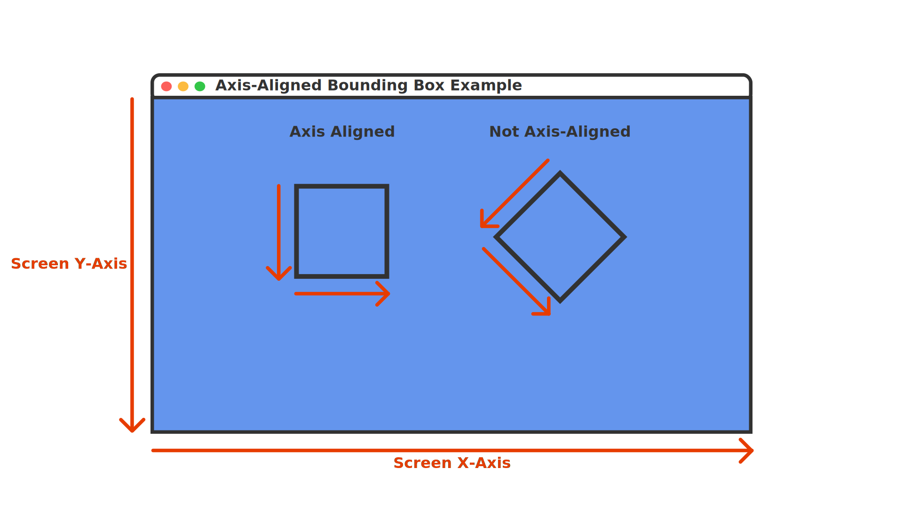
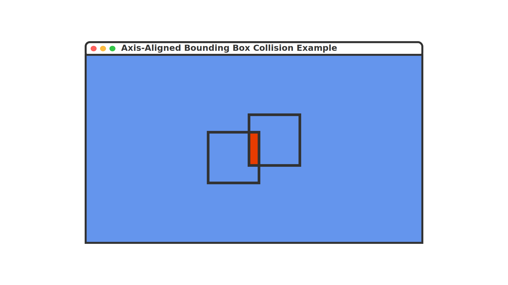

In [Chapter 11](../11_input_management/index.md), you learned how to manage player input to control game objects. However, for objects in your game to interact with each other, collecting items, hitting obstacles, or triggering events, you need to detect when these objects come into contact. This is accomplished through collision detection.

In this chapter you will:

- Understand different collision shapes and their use cases.
- Implement rectangle-based collision detection.
- Create circle-based collision detection.
- Learn how to handle object overlap and response.
- Build a reusable collision system for your game.

We will first start by understanding the basics of collision detection and the different approaches that can be used.

> [!NOTE]
> There is a lot to understand when it comes to collision detection and the many complex ways that two objects can be considered IN collision or NEAR collision. It is critical to get an understanding of the basics before jumping into code. So buckle up, we have a story to tell before you can get back to the keyboard.
>
> Feel free to keep coming back to this chapter and refer to the content when you need to, with a fresh cup of coffee.

## Understanding Collision Detection

Before we start implementing collision detection, we should discuss what collision detection actually is. In 2D games, collision detection involves checking if two objects interact with each other in some way. There are several approaches to detecting collisions, ranging from simple to complex:

### Proximity Collision Detection

The simplest form is checking if objects are within a certain range of each other. This is useful when you only need to know if objects are "near" each other like detecting if an enemy is close enough to chase a player or if two objects are close enough to perform a more complex collision check.

### Simple Shape Based Collision Detection

Shaped based collision detection checks if two shapes overlap. The most common and simple shapes used are circles and rectangles:

#### Circle Collision Detection

Circle collision detection is computationally a simpler check than rectangles. There are also no special considerations if the circles are rotated, which makes them easier to use. To determine if two circle shapes are overlapping, we only need to check if the square of the sum of the radii between the two circles is less than the squared distance between the two circles with the following formula:

To find the distance between two circles, imagine drawing a line from the center of one circle to the center of the other. The length of this line is the distance, but we could also calculate it by first walking up or down and then walking left or right from the center of one circle to another, forming a right triangle.

|  |
| :----------------------------------------------------------------------------------------------------------------------------------------: |
|                       **Figure 12-1: Showing the distance between the center of two circles forms a right triangle**                       |

In *Figure 12-1* above

- $a$ is the horizontal distance between the centers of the two circles (x-axis).
- $b$ is the vertical distance between the centers of the two circles (y-axis).
- $c$ is the total distance between the centers of the two circles.

Since this forms a right triangle, we can use Pythagorean's Theorem to calculate $c^2$ given $a^2$ and $b^2$:

$$c^2 = a^2 + b^2$$

To check for overlap of two circles, we compare whether the *squared sum of the radii* of the two circles is greater than the *squared distance*:

$$(radius_{circle1} + radius_{circle2})^2 > a^2 + b^2$$

It is easy to confuse the direction of the inequality sign. As a quick mental test, think of how the math works when the origin of two circles are at the same position, i.e., when the *squared distance* is zero.

To calculate the squared distance between two points, MonoGame provides the [**Vector2.DistanceSquared**](xref:Microsoft.Xna.Framework.Vector2.DistanceSquared(Microsoft.Xna.Framework.Vector2,Microsoft.Xna.Framework.Vector2)) method:

[!code-csharp]

> [!TIP]
> MonoGame also provides a distance calculation method with [**Vector2.Distance**](xref:Microsoft.Xna.Framework.Vector2.Distance(Microsoft.Xna.Framework.Vector2,Microsoft.Xna.Framework.Vector2)) which returns the distance by providing the square root of the distance squared. So why not use this instead?
>
> Square root operations are more computationally complex for a CPU. So instead of getting the normal distance, which would require the square root operation, it is more efficient for the cpu to multiply the sum of the radii by itself to get the squared sum and use that for comparison instead.

#### Rectangle Collision Detection

Rectangles, often called *bounding boxes*, typically uses what is called *Axis-Aligned Bounding Box* (AABB) collision detection to determine if two rectangle shapes overlap. Unlike circles, to perform AABB collision detection, the x- and y-axes of both rectangles must be aligned with the x- and y-axes of the screen. This is just another way of saying that the rectangles cannot be rotated.

|  |
| :--------------------------------------------------------------------------------------------------------------------------------------------------------------------------------------------------------------------------------------------------------------: |
|                **Figure 12-2: The rectangle on the left is axis-aligned since both the axes are aligned with the screen axes. The rectangle on the right is non axis-aligned since it is rotated and the axes do not align with the screen axes**                |

MonoGame provides the [**Rectangle**](xref:Microsoft.Xna.Framework.Rectangle) struct which represents a rectangle by its position (X,Y) and size (Width,Height). The following table shows some of the properties of the [**Rectangle**](xref:Microsoft.Xna.Framework.Rectangle) struct:

| Property                                                    | Type  | Description                                                                                                                                                                           |
| ----------------------------------------------------------- | ----- | ------------------------------------------------------------------------------------------------------------------------------------------------------------------------------------- |
| [**Bottom**](xref:Microsoft.Xna.Framework.Rectangle.Bottom) | `int` | Returns the y-coordinate location of the bottom edge of the rectangle. This is equal to [**Rectangle.Y**](xref:Microsoft.Xna.Framework.Rectangle.Y) plus the height of the rectangle. |
| [**Left**](xref:Microsoft.Xna.Framework.Rectangle.Left)     | `int` | Returns the x-coordinate location of the left edge of the rectangle. This is equal to [**Rectangle.X**](xref:Microsoft.Xna.Framework.Rectangle.X).                                    |
| [**Right**](xref:Microsoft.Xna.Framework.Rectangle.Right)   | `int` | Returns the x-coordinate location of the right edge of the rectangle. This is equal to [**Rectangle.X**](xref:Microsoft.Xna.Framework.Rectangle.X) plus the width of the rectangle.   |
| [**Top**](xref:Microsoft.Xna.Framework.Rectangle.Top)       | `int` | Returns the y-coordinate location of the top edge of the rectangle. This is equal to [**Rectangle.Y**](xref:Microsoft.Xna.Framework.Rectangle.Y).                                     |

To determine if two rectangles overlap using AABB collision detection, there are four conditions that need to be checked, and all four conditions must be true. Given two rectangles $A$ and $B$, these conditions are:

1. $A_{Left}$ must be less than $B_{Right}$.
2. $A_{Right}$ must be greater than $B_{Left}$.
3. $A_{Top}$ must be less than $B_{Bottom}$.
4. $A_{Bottom}$ must be greater than $B_{Top}$.

If even a single one of these conditions is false, then the rectangles are not overlapping and thus not colliding.

MonoGame provides the [**Rectangle.Intersects**](xref:Microsoft.Xna.Framework.Rectangle.Intersects(Microsoft.Xna.Framework.Rectangle)) method which will perform an AABB collision check for us:

[!code-csharp]

|  |
| :---------------------------------------------------------------------------------------------------------------------------------------------------------------------------------------------------------: |
|                   **Figure 12-3: The rectangle on the left is overlapping the rectangle on the right based on the conditions required for the Axis-Aligned Bounding Box collision check**                   |

#### Complex Polygon Collision Detection

Complex polygon collision detection uses a method called *Separating Axis Theorem* (SAT) to determine if two polygon shapes overlap. SAT uses more complex calculations that can determine if any polygon shape overlaps with another polygon shape, including if they are rotated. There are performance considerations to consider when using SAT.

Implementing SAT is out-of-scope for this tutorial. If you are interested in further reading about this, please see the following articles as a good starting point:

- [Separating Axis Theorem (SAT) Explanation](https://www.sevenson.com.au/actionscript/sat/).
- [Collision Detection Using the Separating Axis Theorem](https://gamedevelopment.tutsplus.com/tutorials/collision-detection-using-the-separating-axis-theorem--gamedev-169) by Kah Shiu Chong.
- [N Tutorial A - Collision Detection and Response](http://www.metanetsoftware.com/technique/tutorialA.html).

#### Choosing a Collision Detection Method

When determining which collision detection method to use, you should start with the simplest one that meets the needs of your game. If distance checks work for your game mechanic, there's no need to implement more complex shape based detections. Similarly, if a circle can represent the bounding area of a game object, start with that before moving on to rectangles.

Some other points to consider are

- Circles:
  - Better for round objects like balls and coins.
  - More accurate for rotating objects.
  - A simpler check for overlap than rectangles.
- Rectangles:
  - Great for walls, platforms, and most game objects.
  - Easy to visualize and debug.
  - Works well with tile-based games.

### Collision Detection vs Collision Response

Often times when talking about collision detection, the term is used to mean both the detection of overlapping shapes and what to do once a positive check has occurred. What you do after a positive collision check has occurred is called the *collision response*. Some of the common responses are:

#### Blocking Collision Response

A blocking collision response is the most basic response which just prevents the two objects from overlapping. This is commonly used for walls, platforms and other solid objects. To perform a blocking collision response:

1. Store the object’s current location and calculate the new position it should move to.
2. Check if it is overlapping an object at the new location:

- If it is overlapping, then set the position to the position before it was moved.
- If it is not overlapping, set the position to the new calculated position.

For example:

[!code-csharp]

Sometimes, instead of preventing an object from moving onto another object, we want to ensure an object remains contained within a certain bounding area. MonoGame also provides the [**Rectangle.Contains**](xref:Microsoft.Xna.Framework.Rectangle.Contains(Microsoft.Xna.Framework.Rectangle)) method that we can use to determine this. [**Rectangle.Contains**](xref:Microsoft.Xna.Framework.Rectangle.Contains(Microsoft.Xna.Framework.Rectangle)) can check if any of the following are completely contained within the bounds of the rectangle;

- [**Point**](xref:Microsoft.Xna.Framework.Point)
- [**Rectangle**](xref:Microsoft.Xna.Framework.Rectangle)
- [**Vector2**](xref:Microsoft.Xna.Framework.Vector2)

For example, if we wanted to perform a blocking collision response that ensure a sprite remained contained within the bounds of the game screen:

[!code-csharp]

> [!TIP]
> Use [**GraphicsDevice.PresentationParameters**](xref:Microsoft.Xna.Framework.Graphics.GraphicsDevice.PresentationParameters) to get the actual screen dimensions instead of [**GraphicsDeviceManager.PreferredBackBufferWidth**](xref:Microsoft.Xna.Framework.GraphicsDeviceManager.PreferredBackBufferWidth) and [**GraphicsDeviceManager.PreferredBackBufferHeight**](xref:Microsoft.Xna.Framework.GraphicsDeviceManager.PreferredBackBufferHeight). The preferred values are only hints and may not reflect the actual back buffer size.

#### Trigger Collision Response

Sometimes you want to trigger an event, rather than block movement, when a collision occurs. Common examples include:

- Collecting items.
- Activating switches.
- Entering zones or areas.
- Triggering cutscenes.

Performing a trigger collision response is just simply checking if the game object is overlapping with the bounding area of the trigger zone, and if so trigger the event.

For example:

[!code-csharp]

#### Bounce Collision Response

For games that need objects to bounce off each other (like the ball in a Pong game), we need to calculate how their velocity should change after the collision. MonoGame provides the [**Vector2.Reflect**](xref:Microsoft.Xna.Framework.Vector2.Reflect(Microsoft.Xna.Framework.Vector2,Microsoft.Xna.Framework.Vector2)) method to handle this calculation for us. The method needs two pieces of information:

1. The incoming vector (the direction the object is moving in before the collision).
2. The normal vector (the direction perpendicular to the surface).

|  |
| :--------------------------------------------------------------------------------------------------------------------------------------------------------------: |
|                 **Figure 12-4: A diagram showing how an incoming vector reflects off of a surface base around the normal vector of the surface**                 |

As shown in the diagram above, when an incoming vector hits a surface, it reflects at the same angle ($\theta$) relative to the normal vector.

> [!TIP]
> Think of the normal vector like the line you'd draw perpendicular to a mirror's surface. The angle between your incoming path and this line will be the same as the angle between your reflection and this line.

For example, if we had a ball moving around the screen and wanted it to bounce off the edges of the screen:

[!code-csharp]

> [!TIP]
> [**Vector2.UnitX**](xref:Microsoft.Xna.Framework.Vector2.UnitX) is $(1, 0)$ and [**Vector2.UnitY**](xref:Microsoft.Xna.Framework.Vector2.UnitY) is $(0, 1)$. We use these to get the screen edge normal since the edges of the screen are not at an angle. For more complex surfaces, you would need to calculate the appropriate normal vector based on the surface angle.

### Optimizing Collision Performance

When checking for collisions between multiple objects, testing every object against every other object (often called brute force checking) becomes inefficient as your game grows. Brute force checking can be calculated as $(n * (n - 1)) / 2$ where $n$ is the total number of objects. For example, if you have 100 objects in your game, that's $(100 * 99) / 2 = 4950$ collision checks every frame. To improve performance, we can use a two-phase approach:

1. Broad Phase: A quick, simple check to rule out objects that definitely are not colliding.
2. Narrow Phase: A more precise check that is only performed on objects that have passed the broad phase.

For our simple game with just two objects, this optimization is not necessary. However, as you develop more complex games, implementing a broad-phase check can significantly improve performance.

> [!NOTE]
> Time to get back to the code! The fun starts again here.

## The Circle Struct

For our game, we are going to implement circle based collision detection. MonoGame does not have a `Circle` struct to represent a circle like it does with [**Rectangle**](xref:Microsoft.Xna.Framework.Rectangle). Before we can perform circle collision, we will need to create our own.

In the root of the *MonoGameLibrary* project, add a new file named `Circle.cs`. Add the following code as the foundation of the `Circle` struct:

[!code-csharp]

> [!NOTE]
> Notice that the struct has declared it will implement the [`IEquatable<T>`](https://learn.microsoft.com/en-us/dotnet/api/system.iequatable-1) interface. When creating value types like this, it is recommended to implement `IEquatable<T>` because it has better performance for comparing objects and can help avoid boxing.
>
> For more information on recommended design guidelines for structs, see [Struct Design - Framework Design Guidelines | Microsoft Learn](https://learn.microsoft.com/en-us/dotnet/standard/design-guidelines/struct)
>
> Ignore the red squiggles for now, they will be resolved as we add more code.

### Circle Fields

The `Circle` struct uses both private and public fields to store its state.

First, add the following private static field that stores a reusable empty circle:

[!code-csharp]

Next, add the following public fields that define the circle's position and size:

[!code-csharp]

These public fields store the fundamental properties of the circle:

- `X` and `Y` define the center point location.
- `Radius` defines how far the circle extends from its center.

### Circle Properties

The `Circle` struct provides properties to access its location, state, and its boundaries.

Add the following property to get the location of the circle as a [**Point**](xref:Microsoft.Xna.Framework.Point) value:

[!code-csharp]

Add the following properties to track empty circles:

[!code-csharp]

> [!NOTE]
> The `Empty` property returns a reusable instance of an empty circle stored in the private static field `s_empty`. This is more efficient than creating new empty circles each time one is needed, as it reuses the same instance in memory.

Add the following properties for getting the circle's boundaries:

[!code-csharp]

> [!TIP]
> These boundary properties are particularly useful when you need to know the extent of a circle in screen space, such as determining if a circle is visible on screen or creating a bounding box around the circle.

### Circle Constructors

The `Circle` struct provides two ways to create a new circle:

[!code-csharp]

- The first constructor accepts individual x and y coordinates for the circle's center.
- The second accepts a [**Point**](xref:Microsoft.Xna.Framework.Point) struct that combines both coordinates.

Both constructors require a radius value that defines the circle's size.

### Circle Methods

The `Circle` struct implements several methods to support equality comparison between circles. These methods allow us to check if two circles are identical (have the same center position and radius).

First, add the following method that will check if two circles are overlapping with each other:

[!code-csharp]

Next we start implementing the [`IEquatable<T>`](https://learn.microsoft.com/en-us/dotnet/api/system.iequatable-1) Interface, add the following methods for comparing a circle with another object:

[!code-csharp]

Next, add the following override for `GetHashCode` to support using circles in hash-based collections:

[!code-csharp]

Finally, add the following operator overloads to support using == and != with circles:

[!code-csharp]

IEquatable interface implemented, red squiggles be gone.

> [!TIP]
> The operator overloads allow you to compare circles using familiar syntax:
>
> [!code-csharp]

Now that we have a struct to represent a circle and check for overlapping, we will update our game to implement collision detection and responses.

## Adding Collision To Our Game

If you run the game right now and move the slime around, you will notice a few issues that can be fixed by adding collision detection and response:

1. You can move the slime outside the bounds of the screen.
2. Nothing occurs when the slime collides with the bat.
3. The bat does not move, providing no challenge in the game.

We can now implement these features using collision detection and response in our game. In the *DungeonSlime* project (your main game project), open the `Game1.cs` file and make the following changes to the `Game1` class:

[!code-csharp]

The key changes made here are:

1. The field `_batPosition` was added to track the position of the bat.
2. The field `_batVelocity` was added to track the velocity of the bat.
3. The `AssignRandomBatVelocity()` method was added which calculates a random x and y velocity for the bat to move at when called.
4. In [**Initialize**](xref:Microsoft.Xna.Framework.Game.Initialize), the initial position of the bat is set and `AssignRandomVelocity` is called to assign the initial velocity for the bat.
5. In [**Update**](xref:Microsoft.Xna.Framework.Game.Update(Microsoft.Xna.Framework.GameTime)), collision detection and response logic was added to perform the following in order:
   1. A [**Rectangle**](xref:Microsoft.Xna.Framework.Rectangle) bound is created to represent the bounds of the screen.
   2. A `Circle` bound is created to represent the bounds of the slime.
   3. Distance based checks are performed to ensure that the slime cannot move outside of the screen, the resolution of which is to perform a blocking response.
   4. A new position for the bat is calculated based on the current velocity of the bat.
   5. A `Circle` bound is created to represent the bounds of the bat.
   6. Distance based checks are performed to ensure the bat cannot move outside of the screen, the resolution of which is to perform a bounce response.
   7. A collision check is made to determine if the slime and bat are colliding (bat "eating" the slime). If so, the bat is assigned a new random position within the screen and assigned a new random velocity.
6. In [**Draw**](xref:Microsoft.Xna.Framework.Game.Draw(Microsoft.Xna.Framework.GameTime)), the bat is now drawn using the `_batPosition` value.

Running the game now

- The bat will start moving with a random velocity and bounce off the edges of the screen
- You can move the slime around, but cannot leave the bounds of the screen with the slime.
- If you move the slime to collide ("eat") the bat, the bat will respawn at a new location with a new velocity.

|  |
| :----------------------------------------------------------------------------------------------------------------------------------------------------------------: |
|            **Figure 12-5: When the slime collides ("eats") the bat, the bat respawns in a new location on the screen with a random velocity assigned**             |

## Conclusion

In this chapter, you accomplished the following:

- Learned about different approaches to collision detection:
  - Distance-based checks for simple proximity detection.
  - Shape-based checks using circles and rectangles.
  - Complex polygon checks using SAT.
- Understood when to use different collision shapes:
  - Circles for round objects and rotation.
  - Rectangles for walls and platforms.
- Explored different types of collision responses:
  - Blocking to prevent objects from overlapping.
  - Triggering events when objects collide.
  - Bouncing to reflect objects off surfaces.
- Created reusable components:
  - Implemented a Circle struct for circle-based collision.
  - Added methods to detect circle intersections.
- Applied collision concepts to our game:
  - Added screen boundary collision for the slime.
  - Implemented bouncing behavior for the bat.
  - Created a trigger response when the slime "eats" the bat.

In the next chapter, we will explore using tilesets and tilemaps to create tile based environments for our game.

## Test Your Knowledge

1. What is the difference between collision detection and collision response?

   ::: question-answer
   Collision detection is determining when two objects overlap or intersect, while collision response is what happens after a collision is detected (like blocking movement, triggering events, or bouncing objects off each other).
   :::

2. When using Rectangle.Intersects for AABB collision, what four conditions must all be true for a collision to occur?

   ::: question-answer
   For two rectangles A and B to collide:

   1. A's left edge must be less than B's right edge.
   2. A's right edge must be greater than B's left edge.
   3. A's top edge must be less than B's bottom edge.
   4. A's bottom edge must be greater than B's top edge.

   :::

3. When implementing circle collision, why do we compare the distance between centers to the sum of the radii?

   ::: question-answer
   Two circles are colliding if the distance between their centers is less than the sum of their radii. If the distance is greater, they are separate. If the distance equals the sum of radii, they are just touching at one point.
   :::

4. When implementing bounce collision response, what two pieces of information does [**Vector2.Reflect**](xref:Microsoft.Xna.Framework.Vector2.Reflect(Microsoft.Xna.Framework.Vector2,Microsoft.Xna.Framework.Vector2)) need?

   ::: question-answer
   [**Vector2.Reflect**](xref:Microsoft.Xna.Framework.Vector2.Reflect(Microsoft.Xna.Framework.Vector2,Microsoft.Xna.Framework.Vector2)) needs:

   1. The incoming vector (direction the object is moving).
   2. The normal vector (direction perpendicular to the surface being hit).

   :::

5. Why might you choose to use circle collision over rectangle collision for certain objects?

   ::: question-answer
   Circle collision might be chosen because:

   - It is more accurate for round objects.
   - It handles rotating objects better.
   - It is simpler for continuous collision detection.
   - It is natural for radius-based interactions.

   :::

6. In the blocking collision response example, why do we store the previous position before handling input?

   ::: question-answer
   We store the previous position so that if a collision occurs after movement, we can reset the object back to its last valid position. This prevents objects from moving through each other by undoing any movement that would cause overlap.
   :::
