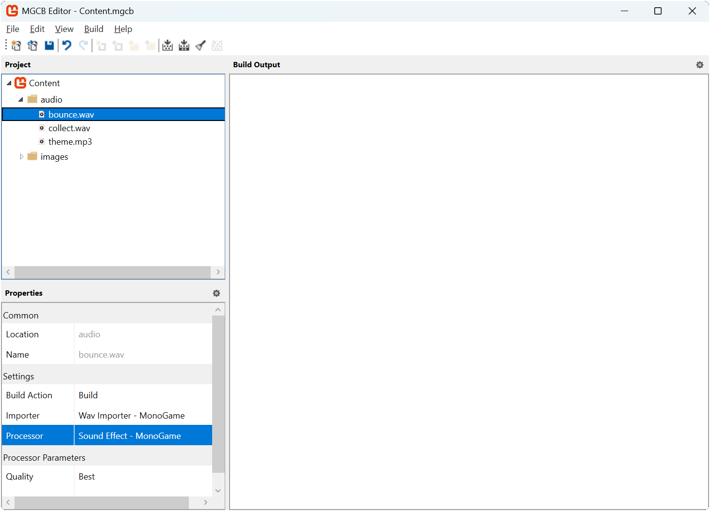
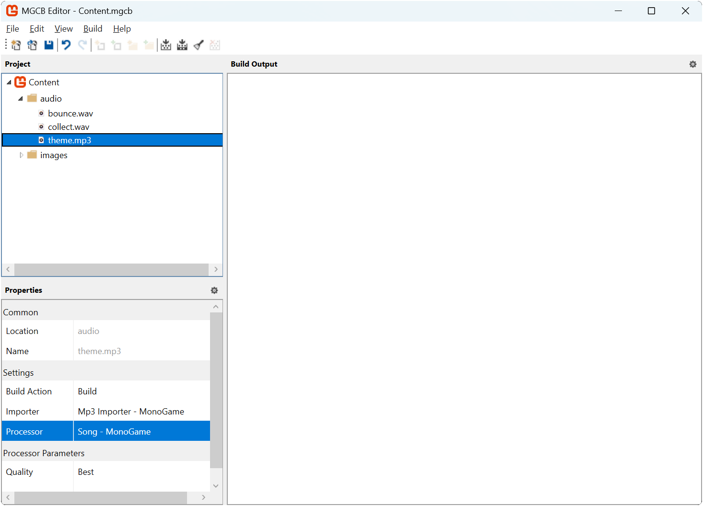

In [Chapter 11](../11_collision_detection/index.md), we implemented collision detection to enable interactions between game objects; the slime can now "eat" the bat, which respawns in a random location, while the bat bounces off screen edges. While these mechanics work visually, our game lacks an important element of player feedback: audio.

Audio plays a crucial role in game development by providing immediate feedback for player actions and creating atmosphere. Sound effects alert players when events occur (like collisions or collecting items), while background music helps establish mood and atmosphere.

In this chapter, you will:

- Learn how MonoGame handles different types of audio content.
- Learn how to load and play sound effects and music using the content pipeline.
- Implement sound effects for collision events.
- Add background music to enhance atmosphere.
- Control audio playback including volume and looping.

Let's start by understanding how MonoGame approaches audio content.

## Understanding Audio in MonoGame

Recall from [Chapter 01](../01_what_is_monogame/index.md) that MonoGame is an implementation of the XNA API. When Microsoft originally released XNA, there were two methods for implementing audio in your game: the *Microsoft Cross-Platform Audio Creation Tool* (XACT) and the simplified sound API. XACT is a mini audio engineering studio where you can easily edit the audio for your game like editing volume, pitch, looping, applying effects, and other properties without having to do it in code. At that time, XACT for XNA games was akin to what FMOD Studio is today for game audio.

|  |
|:--------------------------------------------------------------------------------------:|
|             **Figure 12-1: Microsoft Cross-Platform Audio Creation Tool**              |

While XACT projects are still fully supported in MonoGame, it remains a Windows-only tool that hasn't been updated since Microsoft discontinued the original XNA, nor has its source code been made open source. Though it's possible to install XACT on modern Windows, the process can be complex. For these reasons, this tutorial will focus on the simplified sound API, which provides all the core functionality needed for most games while remaining cross-platform compatible.

The simplified sound API approaches audio management through two distinct paths, each optimized for different use cases in games. When adding audio to your game, you need to consider how different types of sounds should be handled. A short sound effect, like the bounce of a ball, needs to play immediately and might need to play multiple times simultaneously. In contrast, background music needs to play continuously but doesn't require the same immediate response.

MonoGame addresses these different needs through two main classes:

### Sound Effects

The [**SoundEffect**](xref:Microsoft.Xna.Framework.Audio.SoundEffect) class handles short audio clips like:

- Collision sounds.
- Player action feedback (jumping, shooting, etc.).
- UI interactions (button clicks, menu navigation).
- Environmental effects (footsteps, ambient sounds).

The key characteristics of sound effects are:

- Loaded entirely into memory for quick access
- Can play multiple instances simultaneously
- Lower latency playback (ideal for immediate feedback)
- Individual volume control per instance

When you play a [**SoundEffect**](xref:Microsoft.Xna.Framework.Audio.SoundEffect), it returns a [**SoundEffectInstance**](xref:Microsoft.Xna.Framework.Audio.SoundEffectInstance) that can be used to control that specific playback:

```cs
// Load the sound effect
SoundEffect soundEffect = Content.Load<SoundEffect>("sound effect");

// Create an instance we can control
SoundEffectInstance soundEffectInstance = soundEffect.CreateInstance();
soundEffectInstance.Volume = 0.5f;
soundEffectInstance.Play();

// Or play it directly if we don't need to control it
soundEffectInstance.Play();
```

### Music

The [**Song**](xref:Microsoft.Xna.Framework.Audio.Song) class handles longer audio pieces like background music.  The key characteristics of songs are:

- Streamed from storage rather than loaded into memory.
- Only one song can be played at a time.
- Higher latency, but lower memory usage.

Songs are played through the [**MediaPlayer**](xref:Microsoft.Xna.Framework.Media.MediaPlayer) class:

```cs
// Load the song
Song backgroundMusic = Content.Load<Song>("theme");

// Play the song, optionally looping
MediaPlayer.IsRepeating = true;
MediaPlayer.Play(backgroundMusic);
```

> [!NOTE]
> While [**SoundEffect**](xref:Microsoft.Xna.Framework.Audio.SoundEffect) instances can be played simultaneously, trying to play a new [**Song**](xref:Microsoft.Xna.Framework.Audio.Song) while another is playing will automatically stop the current song. This is why [**Song**](xref:Microsoft.Xna.Framework.Audio.Song) is ideal for background music where you typically only want one track playing at a time.

Throughout this chapter, we'll use both classes to add audio feedback to our game; sound effects for the bat bouncing and being eaten by the slime, and background music to create atmosphere.

## Loading Audio Content

Just like textures, audio content in MonoGame can be loaded through the content pipeline, optimizing the format for your target platform.

### Supported Audio Formats

MonoGame supports several audio file formats for both sound effects and music:

- `.wav`: Uncompressed audio, ideal for short sound effects
- `.mp3`: Compressed audio, better for music and longer sounds
- `.ogg`: Open source compressed format, supported on all platforms
- `.wma`: Windows Media Audio format (not recommended for cross-platform games)

> [!TIP]
> For sound effects, `.wav` files provide the best loading and playback performance since they don't need to be decompressed. For music, `.mp3` or `.ogg` files are better choices as they reduce file size while maintaining good quality.

### Adding Audio Files

Before we can add audio to our game, we need some sound files to work with. Download the following audio files:

- [bounce.wav](./files/bounce.wav) - For when the bat bounces off screen edges
- [collect.wav](./files/collect.wav) - For when the slime eats the bat
- [theme.mp3](./files/theme.mp3) - Background music

> [!NOTE]
>
> - *bounce.wav* is "Retro Impact Punch 07" by Davit Masia (https://kronbits.itch.io/retrosfx).
> - *collect.wav* is "Retro Jump Classic 08" by Davit Masia (https://kronbits.itch.io/retrosfx).
> - *theme.mp3* is "8bit Dungeon Level" by Kevin MacLeod (incompetech.com), Licensed under Creative Commons: By Attribution 4.0 License http://creativecommons.org/licenses/by/4.0/

Add these files to your content project using the MGCB Editor:

1. Open the *Content.mgcb* file in the MGCB Editor.
2. Create a new directory called `audio` (right-click *Content* > *Add* > *New Folder*).
3. Right-click the new *audio* directory and choose *Add* > *Existing Item...*.
4. Navigate to and select the audio files you downloaded.
5. For each file that's added, check its properties in the Properties panel:
   - For `.wav` files, ensure *Build Action* is set to `Build` and *Content Processor* is set to `Sound Effect`.
   - For `.mp3` files, ensure *Build Action* is set to `Build` and *Content Processor* is set to `Song`.

    |  |  |
    | :---: | :---: |
    | **Figure 12-2: MGCB Editor properties panel showing Sound Effect content processor settings for .wav files** | **Figure 12-3: MGCB Editor properties panel showing Song content processor settings for .mp3 files** |

### Loading Sound Effects

To load a sound effect, we use [**ContentManager.Load**](xref:Microsoft.Xna.Framework.Content.ContentManager.Load``1(System.String)) with the [**SoundEffect**](xref:Microsoft.Xna.Framework.Audio.SoundEffect) type.  Open then *Game1.cs* and perform the following:

1. First, add the following fields to store the sound effects that are loaded:

    ```cs
    private SoundEffect _bounceSound;
    private SoundEffect _collectSound;
    ```

2. In [LoadContent](xref:Microsoft.Xna.Framework.Game.LoadContent) add the following to load the sound effects:

    ```cs
    _bounceSound = Content.Load<SoundEffect>("audio/bounce");
    _collectSound = Content.Load<SoundEffect>("audio/collect");
    ```

### Loading Music

Loading music is similar, only we specify the [**Song**](xref:Microsoft.Xna.Framework.Audio.Song) type instead.  Perform the following:

1. First, add the following field to track the song:

    ```cs
    private Song _backgroundMusic;
    ```

2. In [LoadContent](xref:Microsoft.Xna.Framework.Game.LoadContent) add the following to load the song:

    ```cs
    _backgroundMusic = Content.Load<Song>("audio/theme");
    ```

## Playing Audio

Now that we have our audio content loaded, we can implement sound playback in our game. Let's start by understanding how to play sound effects and music, then we'll add them to our game's collision events.

### Playing Sound Effects

The [**SoundEffect**](xref:Microsoft.Xna.Framework.Audio.SoundEffect) class provides two ways to play sounds:

1. Direct playback using [**SoundEffect.Play**](xref:Microsoft.Xna.Framework.Audio.SoundEffect.Play):

    ```cs
    // Play the sound effect with default settings
    _bounceSound.Play();
    ```

2. Creating an instance using [**SoundEffect.CreateInstance**](xref:Microsoft.Xna.Framework.Audio.SoundEffect.CreateInstance):

    ```cs
    // Create an instance we can control
    SoundEffectInstance bounceInstance = _bounceSound.CreateInstance();
    bounceInstance.Volume = 0.5f;
    bounceInstance.Play();
    ```

The first method is simpler but provides no control over the playback. The second method returns a [**SoundEffectInstance**](xref:Microsoft.Xna.Framework.Audio.SoundEffectInstance) that can be controlled through several properties:

| Property                                                                        | Type                                                            | Description                                                                |
|---------------------------------------------------------------------------------|-----------------------------------------------------------------|----------------------------------------------------------------------------|
| [**IsLooped**](xref:Microsoft.Xna.Framework.Audio.SoundEffectInstance.IsLooped) | `bool`                                                          | Whether the sound should loop when it reaches the end.                     |
| [**Pan**](xref:Microsoft.Xna.Framework.Audio.SoundEffectInstance.Pan)           | `float`                                                         | Stereo panning between -1.0f (full left) and 1.0f (full right).            |
| [**Pitch**](xref:Microsoft.Xna.Framework.Audio.SoundEffectInstance.Pitch)       | `float`                                                         | Pitch adjustment between -1.0f (down one octave) and 1.0f (up one octave). |
| [**State**](xref:Microsoft.Xna.Framework.Audio.SoundEffectInstance.State)       | [**SoundState**](xref:Microsoft.Xna.Framework.Audio.SoundState) | Current playback state (Playing, Paused, or Stopped).                      |
| [**Volume**](xref:Microsoft.Xna.Framework.Audio.SoundEffectInstance.Volume)     | `float`                                                         | Volume level between 0.0f (silent) and 1.0f (full volume).                 |

### Playing Music

Unlike sound effects, music is played through the [**MediaPlayer**](xref:Microsoft.Xna.Framework.Media.MediaPlayer) class. This static class manages playback of [**Song**](xref:Microsoft.Xna.Framework.Media.Song) instances and provides global control over music playback:

```cs
// Set whether the song should repeat when finished
MediaPlayer.IsRepeating = true;

// Adjust the volume (0.0f to 1.0f)
MediaPlayer.Volume = 0.5f;

// Start playing the background music
MediaPlayer.Play(_backgroundMusic);
```

> [!NOTE]
> Only one song can play at a time. Starting a new song will automatically stop any currently playing song.

### Adding Audio to Our Game

Let's update our game to play audio at appropriate times.  We'll play:

- Background music when the game first loads.
- The bounce sound when the bat hits screen edges.
- The collect sound when the slime eats the bat.

Open *Game1.cs* and make the following changes:

1. First, let's add background music playback. In [Initialize](xref:Microsoft.Xna.Framework.Game.Initialize), after the call to `base.Initialize()`, add:

    ```cs
    // Ensure the song is looping
    MediaPlayer.IsRepeating = true;
    
    // PLay the song
    MediaPlayer.Play(_backgroundMusic);
    ```

2. Next, update the `UpdateBatMovement` method to play the bounce sound when the bat hits screen edges.  Add the following as part of the collision response:

    ```cs
    // Play bounce sound
    _bounceSound.Play();
    ```

3. Finally, in [**Update**](xref:Microsoft.Xna.Framework.Game.Update(Microsoft.Xna.Framework.GameTime)), add the collect sound during the collision response when the slime eats the bat:

    ```cs
    // Play collect sound
    _collectSound.Play();
    ```

Running the game now, you'll hear:

- Background music playing continuously.
- A bounce sound whenever the bat hits screen edges.
- A collect sound whenever the slime eats the bat.

## Audio Management

While playing sounds and music is straightforward, a complete game needs to handle various audio states and cleanup. An audio manager that will:

- Track and manage sound effects and songs
- Handle volume control
- Manage audio state (pause/resume, mute/unmute)
- Clean up resources properly

To get started, create a new directory called *Audio* in the *MonoGameLibrary* project.

### The AudioManager Class

To effectively manage audio in our games, we'll create an `AudioManager` class that handles loading, playing, and controlling both sound effects and music. This manager will be implemented as a [**GameComponent**](xref:Microsoft.Xna.Framework.GameComponent), allowing it to receive automatic updates and cleanup.

In the *Audio* directory of the *MonoGameLibrary* project, add a new file named *AudioManager.cs* with this initial structure:

```cs
using System;
using System.Collections.Generic;
using Microsoft.Xna.Framework;
using Microsoft.Xna.Framework.Audio;
using Microsoft.Xna.Framework.Media;

namespace MonoGameLibrary.Audio;

public class AudioManager : GameComponent
{

}
```

> [!TIP]
> The `AudioManager` class inherits from [**GameComponent**](xref:Microsoft.Xna.Framework.GameComponent), which allows it to be added to a game's component collection and automatically receive updates.

#### AudioManager Members

The `AudioManager` class needs to track various audio resources and states. Add these private fields:

```cs
private readonly Dictionary<string, SoundEffect> _soundEffects;
private readonly Dictionary<string, Song> _songs;
private readonly List<SoundEffectInstance> _activeSoundEffectInstances;
private float _previousMusicVolume;
private float _previousSoundEffectVolume;
```

These fields serve different purposes:

- `_soundEffects`: Stores loaded sound effects by their asset name.
- `_songs`: Stores loaded songs by their asset name.
- `_activeSoundEffectInstances`: Tracks currently playing sound effects.
- `_previousMusicVolume` and `_previousSoundEffectVolume`: Store volume levels for mute/unmute functionality.

### AudioManager Properties

The AudioManager provides a property to track its mute state.  Add the following property:

```cs
/// <summary>
/// Gets a value that indicates if audio is muted.
/// </summary>
public bool IsMuted { get; private set; }
```

### AudioManager Constructor

The constructor initializes our collections and sets up the component.  Add the following constructor:

```cs
/// <summary>
/// Creates a new AudioManager instance.
/// </summary>
/// <param name="game">The game this audio manager will belong too..</param>
public AudioManager(Game game)
    : base(game)
{
    _soundEffects = new Dictionary<string, SoundEffect>();
    _songs = new Dictionary<string, Song>();
    _activeSoundEffectInstances = new List<SoundEffectInstance>();
}
```

### AudioManager Methods

The `AudioManager` class provides several categories of methods to handle different aspects of audio management.  Each group of methods serves a specific purpose in managing game audio, from basic playback to more complex state management.

#### Game Component Methods

Add the following methods to the manager which override key methods from [**GameComponent**](xref:Microsoft.Xna.Framework.GameComponent):

```cs
/// <summary>
/// Initializes this Audio manager.
/// </summary>
public override void Initialize()
{
    _previousMusicVolume = MediaPlayer.Volume = 1.0f;
    _previousSoundEffectVolume = SoundEffect.MasterVolume = 1.0f;
    base.Initialize();
}

/// <summary>
/// Updates this Audio manager
/// </summary>
/// <param name="gameTime">A snapshot of the current timing values for the game.</param>
public override void Update(GameTime gameTime)
{
    int index = 0;

    while (index < _activeSoundEffectInstances.Count)
    {
        SoundEffectInstance instance = _activeSoundEffectInstances[index];

        if (instance.State == SoundState.Stopped && !instance.IsDisposed)
        {
            instance.Dispose();
        }

        _activeSoundEffectInstances.RemoveAt(index);
    }

    base.Update(gameTime);
}

/// <summary>
/// Disposes this Audio manager and cleans up resources.
/// </summary>
/// <param name="disposing">Indicates whether managed resources should be disposed.</param>
protected override void Dispose(bool disposing)
{
    if (disposing)
    {
        foreach (SoundEffect soundEffect in _soundEffects.Values)
        {
            soundEffect.Dispose();
        }

        foreach (Song song in _songs.Values)
        {
            song.Dispose();
        }

        _soundEffects.Clear();
        _songs.Clear();
        _activeSoundEffectInstances.Clear();
    }

    base.Dispose(disposing);
}
```

- `Initialize`: Sets up initial audio states by setting the default volume levels for both music and sound effects to full volume (1.0f). These values are also stored as the previous volumes for use when unmuting.
- `Update`: Handles cleanup of completed sound effects. Each frame, it checks for any sound effect instances that have finished playing (reached the Stopped state) and disposes of them to free up resources.
- `Dispose`: Ensures proper cleanup of audio resources when the game closes. All sound effects and songs are disposed of, and the collections tracking them are cleared.

#### Content Management Methods

Add the following methods to handle handle loading audio content into the manager:

```cs
/// <summary>
/// Adds the sound effect with the specified asset name to this audio manager.
/// </summary>
/// <param name="assetName">The asset name of the sound effect to add.</param>
public void AddSoundEffect(string assetName)
{
    SoundEffect soundEffect = Game.Content.Load<SoundEffect>(assetName);
    _soundEffects.Add(assetName, soundEffect);
}

/// <summary>
/// Adds the song with the specified asset name to this audio manager.
/// </summary>
/// <param name="assetName">The asset name of the song to add.</param>
public void AddSong(string assetName)
{
    Song song = Game.Content.Load<Song>(assetName);
    _songs.Add(assetName, song);
}    
```

- `AddSoundEffect`: Loads a sound effect from the content pipeline using the provided asset name and stores it in the `_soundEffects` dictionary for later use.
- `AddSong`: Similar to `AddSoundEffect`, this loads a song from the content pipeline and stores it in the `_songs` dictionary.

#### Playback Methods

Add the following methods to control audio playback:

```cs
/// <summary>
/// Plays the sound effect with the specified asset name.
/// </summary>
/// <param name="assetName">The asset name of the sound effect to play.</param>
/// <param name="volume">The volume, ranging from 0.0 (silence) to 1.0 (full volume).</param>
/// <param name="pitch">The pitch adjustment, ranging from -1.0 (down an octave) to 0.0 (no change) to 1.0 (up an octave).</param>
/// <param name="pan">The panning, ranging from -1.0 (left speaker) to 0.0 (centered), 1.0 (right speaker).</param>
/// <param name="isLooped">Whether the the sound effect should loop after playback.</param>
/// <returns>The sound effect instance created by playing the sound effect.</returns>
public SoundEffectInstance PlaySoundEffect(string assetName, float volume = 1.0f, float pitch = 0.0f, float pan = 0.0f, bool isLooped = false)
{
    SoundEffect soundEffect = _soundEffects[assetName];

    SoundEffectInstance soundEffectInstance = soundEffect.CreateInstance();
    soundEffectInstance.Volume = volume;
    soundEffectInstance.Pitch = pitch;
    soundEffectInstance.Pan = pan;
    soundEffectInstance.IsLooped = isLooped;

    soundEffectInstance.Play();

    return soundEffectInstance;
}

/// <summary>
/// Plays the song with the specified asset name.
/// </summary>
/// <param name="assetName">The asset name of the song to play.</param>
public void PlaySong(string assetName)
{
    Song song = _songs[assetName];
    MediaPlayer.Play(song);
}
```

- `PlaySoundEffect`: Creates and plays an instance of a sound effect with customizable properties like volume, pitch, panning, and looping. Returns the instance for further control if needed.
- `PlaySong`: Starts playing a song through the MediaPlayer. Since only one song can play at a time, this will automatically stop any currently playing song.

#### State Control Methods

Add the following methods to manage the overall state of audio playback:

```cs
/// <summary>
/// Pauses all audio.
/// </summary>
public void PauseAudio()
{
    // Pause any active songs playing
    MediaPlayer.Pause();

    // Pause any active sound effects
    foreach (SoundEffectInstance soundEffectInstance in _activeSoundEffectInstances)
    {
        soundEffectInstance.Pause();
    }
}

/// <summary>
/// Resumes play of all previous paused audio.
/// </summary>
public void ResumeAudio()
{
    // Resume paused music
    MediaPlayer.Resume();

    // Resume any active sound effects
    foreach (SoundEffectInstance soundEffectInstance in _activeSoundEffectInstances)
    {
        soundEffectInstance.Resume();
    }
}

/// <summary>
/// Mutes all audio.
/// </summary>
public void MuteAudio()
{
    // Store the volume so they can be restored during ResumeAudio
    _previousMusicVolume = MediaPlayer.Volume;
    _previousSoundEffectVolume = SoundEffect.MasterVolume;

    // Set all volumes to 0
    MediaPlayer.Volume = 0.0f;
    SoundEffect.MasterVolume = 0.0f;

    IsMuted = true;
}

/// <summary>
/// Unmutes all audio to the volume level prior to muting.
/// </summary>
public void UnmuteAudio()
{
    // Restore the previous volume values
    MediaPlayer.Volume = _previousMusicVolume;
    SoundEffect.MasterVolume = _previousSoundEffectVolume;

    IsMuted = false;
}

/// <summary>
/// Toggles the current audio mute state.
/// </summary>
public void ToggleMute()
{
    if (IsMuted)
    {
        UnmuteAudio();
    }
    else
    {
        MuteAudio();
    }
}
```

- `PauseAudio`: Pauses all currently playing audio including both the active song and any playing sound effects.
- `ResumeAudio`: Resumes playback of previously paused audio, both for the song and sound effects.
- `MuteAudio`: Silences all audio by setting volumes to zero while storing previous volumes.
- `UnmuteAudio`: Restores audio to the volume levels that were active before muting.
- `ToggleMute`: Provides a convenient way to switch between muted and unmuted states.

#### Volume Control Methods

Finally, add the following methods to adjusting the volume of all audio:

```cs
/// <summary>
/// Increases volume of all audio by the specified amount.
/// </summary>
/// <param name="amount">The amount to increase the audio by.</param>
public void IncreaseVolume(float amount)
{
    if (!IsMuted)
    {
        MediaPlayer.Volume = Math.Min(MediaPlayer.Volume + amount, 1.0f);
        SoundEffect.MasterVolume = Math.Min(SoundEffect.MasterVolume + amount, 1.0f);
    }
}

/// <summary>
/// Decreases the volume of all audio by the specified amount.
/// </summary>
/// <param name="amount">The amount to decrease the audio by.</param>
public void DecreaseVolume(float amount)
{
    if (!IsMuted)
    {
        MediaPlayer.Volume = Math.Max(MediaPlayer.Volume - amount, 0.0f);
        SoundEffect.MasterVolume = Math.Max(SoundEffect.MasterVolume - amount, 0.0f);
    }
}
```

- `IncreaseVolume`: Raises the volume of both music and sound effects by the specified amount, ensuring it doesn't exceed the maximum (1.0f).
- `DecreaseVolume`: Lowers the volume of both music and sound effects by the specified amount, ensuring it doesn't go below zero.

### Using the AudioManager

Now that we have our `AudioManager` class to handle audio, let's update our game to use it instead of managing audio directly. We'll remove the individual audio fields and update our collision response code to use the manager.

Open *Game1.cs* and make the following changes to use the new audio manager:

1. First, remove the individual audio fields `_bounceSound`, `_collectSound`, and `_backgroundMusic` and add an `AudioManger` field:

    ```cs
    private AudioManager _audioManager;
    ```

2. In the constructor, create the manager and add it as a game component:

    ```cs
    // Create and add the audio manager
    _audioManager = new AudioManager(this);
    Components.Add(_audioManager);
    ```

3. Update [**Initialize**](xref:Microsoft.Xna.Framework.Game.Initialize) to play the background music through the audio manager instead of the [**MediaPlayer**](xref:Microsoft.Xna.Framework.Media.MediaPlayer):

    ```cs
    // Start playing background music
    _audioManager.PlaySong("audio/theme");
    ```

4. Update [**LoadContent**](xref:Microsoft.Xna.Framework.Game.LoadContent) to load audio through the manager:

    ```cs
    // Load audio content
    _audioManager.AddSoundEffect("audio/bounce");
    _audioManager.AddSoundEffect("audio/collect");
    _audioManager.AddSong("audio/theme");

    // Start playing background music
    _audioManager.PlaySong("audio/theme");
    ```

5. Update `HandleKeyboardInput` to use the manager for audio controls:

    ```cs
    if (InputManager.Keyboard.WasKeyJustPressed(Keys.M))
    {
        _audioManager.ToggleMute();
    }
    
    if (InputManager.Keyboard.WasKeyJustPressed(Keys.OemPlus))
    {
        _audioManager.IncreaseVolume(0.1f);
    }
    
    if (InputManager.Keyboard.WasKeyJustPressed(Keys.OemMinus))
    {
        _audioManager.DecreaseVolume(0.1f);
    }
    ```

6. Update the collision response in `UpdateBatMovement` to play the bounce sound effect using the manager:

    ```cs
    // Play bounce sound through the manager
    _audioManager.PlaySoundEffect("audio/bounce");
    ```

7. Update the collision response in [**Update**](xref:Microsoft.Xna.Framework.Game.Update(Microsoft.Xna.Framework.GameTime)) to play the collect sound effect using the manager:

    ```cs
    // Play collect sound through the manager
    _audioManager.PlaySoundEffect("audio/collect");
    ```

> [!NOTE]
> Since we added the `AudioManager` as a game component, we don't need to worry about updating or disposing of audio resources - the component system handles this automatically.

Running the game now, you'll have the same audio feedback as before, but with better management of audio resources and additional features like volume control and muting. Try using the following controls:

- M key to toggle mute/unmute.
- Plus (+) key to increase volume.
- Minus (-) key to decrease volume.

## Conclusion

Let's review what you accomplished in this chapter:

- Learned about MonoGame's audio system including sound effects and music.
- Added sound effects to our game for:
  - Bat bouncing off screen edges.
  - Slime collecting the bat.
- Implemented background music.
- Created a reusable `AudioManager` class that:
  - Manages loading and playback of audio content.
  - Handles volume control and muting.
  - Automatically cleans up audio resources.
  - Integrates with the game component system.

In the next chapter, we'll explore scene management to handle different game screens like a title screen and a gameplay screen.

## Test Your Knowledge

1. What are the two main classes MonoGame provides for audio playback and how do they differ?

   <details>
   <summary>Question 1 Answer</summary>

   > MonoGame provides [**SoundEffect**](xref:Microsoft.Xna.Framework.Audio.SoundEffect) for short audio clips (loaded entirely into memory, multiple can play at once) and [**Song**](xref:Microsoft.Xna.Framework.Media.Song) for longer audio like music (streamed from storage, only one can play at a time).
   </details><br />

2. What is the advantage of using the content pipeline for loading audio files?

   <details>
   <summary>Question 2 Answer</summary>

   > The content pipeline processes audio files into an optimized format for your target platform, manages asset copying to the output directory, and provides a consistent way to load content at runtime through the [**ContentManager**](xref:Microsoft.Xna.Framework.Content.ContentManager).
   </details><br />

3. Why did we create the `AudioManager` as a game component?

   <details>
   <summary>Question 3 Answer</summary>
   
   > By inheriting from [**GameComponent**](xref:Microsoft.Xna.Framework.GameComponent), the `AudioManager` receives automatic updates and cleanup through the game's component system.
   </details><br />