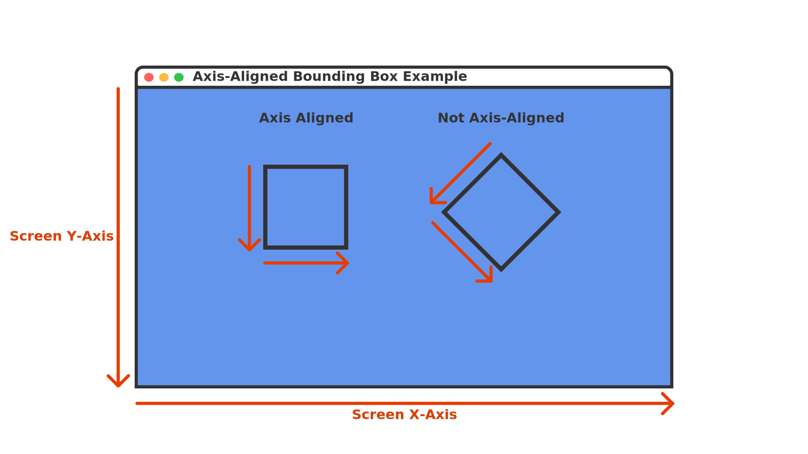
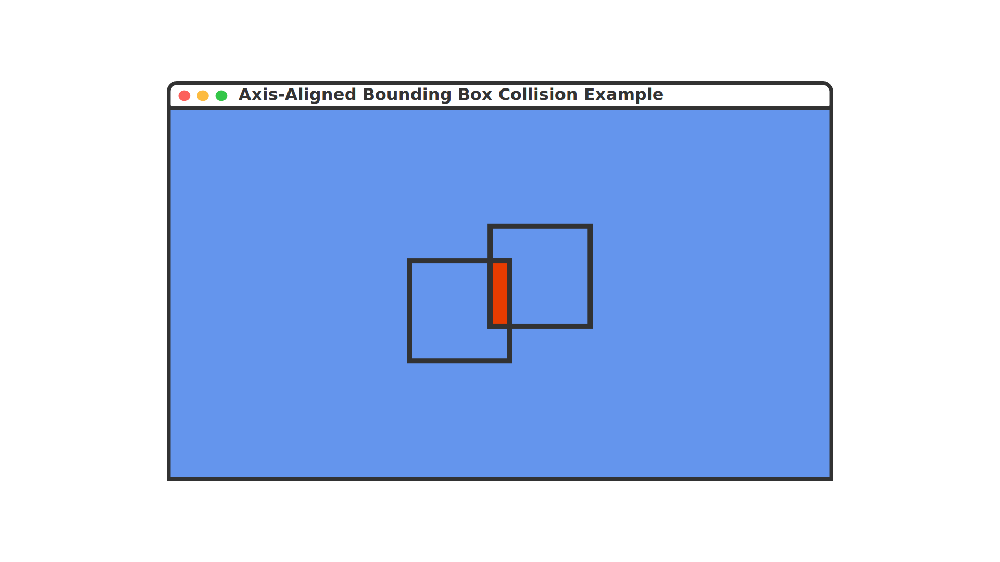

In [Chapter 12](../12_input_management/index.md), you learned how to manage player input to control game objects. However, for objects in your game to interact with each other, collecting items, hitting obstacles, or triggering events, you need to detect when these objects come into contact. This is accomplished through collision detection.

In this chapter you will:

- Understand different collision shapes and their use cases.
- Implement rectangle-based collision detection.
- Create circle-based collision detection.
- Learn how to handle object overlap and response.
- Build a reusable collision system for your game.

Let's start by understanding the basics of collision detection and the different approaches we can use.

## Understanding Collision Detection

Before we start implementing collision detection, let's discuss what collision detection actually is. In 2D games, collision detection involves checking if two objects interact with each other in some way. There are several approaches to detecting collisions, ranging from simple to complex:

### Proximity Collision Detection

The simplest form is checking if objects are within a certain range of each other.  This is useful when you only need to know if objects are "near" each other like detecting if an enemy is close enough to chase a player or if two objects are close enough to perform a more complex collision check.

### Simple Shape Based Collision Detection

Shaped based collision detection checks if two shapes overlap.  The most common and simple shapes used are circles and rectangles:

#### Circle Collision Detection

Circle collision detection is computationally a simpler check than that rectangles.  There are also no special considerations if the circles are rotated, which makes them easier to use.  To determine if two circle shapes are overlapping, we only need to check if the square of the sum of the radii between the two circles is less than the squared distance between the two circles with the following formula:

Two find the distance between two circles, imagine drawing a line from the center of one circle to the center of the other.  This length of this line is the distance, but we could also calculate it by first walking up or down and then walking left or right from the center of one circle to another, forming a right triangle.

|  |
|:-----------------------------------------------------------------------------------------------------------------------------------------:|
|                       **Figure 11-1: Showing the distance between the center of two circles forms a right triange**                       |

In the Figure 11-1 above

- $a$ is the distance between the center of the two on the x-axis (horizontal).
- $b$ is the distance between the center of the two circles on the y-axis (vertical).
- $c$ is the total distance between the center of the two circles.

Since this forms a right triangle, to calculate the squared distance, we can use Pythagorean's Theorem:

$$c^2 = a^2 + b^2$$

Then we just check if the squared sum of the radii of the two circles is less than the squared distance:

$$(radius_{circle1} + radius_{circle2})^2 < c^2$$

If it is less, then the circles are overlapping; otherwise, they are not.

To calculate the squared distance between to points, MonoGame provides the [**Vector2.DistanceSquared**](xref:Microsoft.Xna.Framework.Vector2.DistanceSquared(Microsoft.Xna.Framework.Vector2,Microsoft.Xna.Framework.Vector2)) method:

```cs
Vector2 circle1Position = new Vector2(8, 10);
Vector2 circle2Position = new Vector2(5, 6);

float circle1Radius = 5;
float circle2Radius = 5;

// c^2 = (8 - 5)^2 + (10 - 6)^2
// c^2 = 3^2 + 4^2
// c^2 = 9 + 16
// c^2 = 25
float distanceSquared = Vector2.DistanceSquared(circle1Position, circle2Position); 

// r^2 = (5 + 5)^2
// r^2 = (10)^2
// r^2 = 100
int radiiSquared = (circle1Radius + circle2Radius) * (circle1Radius + circle2Radius)

// They do not overlap since 100 is not less than 25
if(radii < distanceSquared)
{
    
}
```

> [!TIP]
> MonoGame also provides a distance calculation method with [**Vector2.Distance**](xref:Microsoft.Xna.Framework.Vector2.Distance(Microsoft.Xna.Framework.Vector2,Microsoft.Xna.Framework.Vector2)) which returns the distance by providing the square root of the distance squared.  So why don't we use this instead?
>
> Square root operations are more computationally complex for a CPU.  So instead of getting the normal distance, which would require the square root operation, it's more efficient for the cpu to multiply the sum of the radii by itself to get the squared sum and use that for comparison instead.

#### Rectangle Collision Detection

Rectangles, often called *bounding boxes*, typically uses what's called *Axis-Aligned Bounding Box* (AABB) collision detection to determine if two rectangle shapes overlap.  Unlike circles, to perform AABB collision detection, the x- and y-axes of both rectangles must be aligned with the x- and y-axes of the screen.  This is just another way of saying that the rectangles cannot be rotated.

|  |
|:---------------------------------------------------------------------------------------------------------------------------------------------------------------------------------------------------------------------------------------------------------------:|
|                **Figure 11-2: The rectangle on the left is axis-aligned since both the axes are aligned with the screen axes. The rectangle on the right is non axis-aligned sine it is rotated and the axes do not align with the screen axes**                |

MonoGame provides the [**Rectangle**](xref:Microsoft.Xna.Framework.Rectangle) struct which represents a rectangle by its position (X,Y) and size (Width,Height). The following table shows some of the properties of the [**Rectangle**](xref:Microsoft.Xna.Framework.Rectangle) struct:

| Property                                                    | Type  | Description                                                                                                                                                                          |
|-------------------------------------------------------------|-------|--------------------------------------------------------------------------------------------------------------------------------------------------------------------------------------|
| [**Bottom**](xref:Microsoft.Xna.Framework.Rectangle.Bottom) | `int` | Returns the y-coordinate location of the bottom edge of the rectangle.  This is equal to [**Rectangle.Y**](xref:Microsoft.Xna.Framework.Rectangle.Y) plus the height of the rectangle. |
| [**Left**](xref:Microsoft.Xna.Framework.Rectangle.Left)     | `int` | Returns the x-coordinate location of the left edge of the rectangle.  This is equal to [**Rectangle.X**](xref:Microsoft.Xna.Framework.Rectangle.X).                                       |
| [**Right**](xref:Microsoft.Xna.Framework.Rectangle.Right)   | `int` | Returns the x-coordinate location of the right edge of the rectangle.  This is equal to [**Rectangle.X**](xref:Microsoft.Xna.Framework.Rectangle.X) plus the width of the rectangle. |
| [**Top**](xref:Microsoft.Xna.Framework.Rectangle.Top)       | `int` | Returns the y-coordinate location of the top edge of the rectangle. This is equal to [**Rectangle.Y**](xref:Microsoft.Xna.Framework.Rectangle.Y).                                    |

To determine if two rectangles overlap using AABB collision detection, there are four conditions that need to be checked, and all four conditions must be true.  Given two rectangles $A$ and $B$, these conditions are:

1. $A.Left$ must be less than $B.Right$.
2. $A.Right$ must be greater than $B.Left$.
3. $A.Top$ must be less than $B.Bottom$.
4. $A.Bottom$ must be greater than $B.Top$.

If even a single one of these conditions is false, then the rectangles are not overlapping and thus not colliding.

MonoGame provides the [**Rectangle.Intersects**](xref:Microsoft.Xna.Framework.Rectangle.Intersects(Microsoft.Xna.Framework.Rectangle)) method which will perform an AABB collision check for us:

```cs
// Rectangle 1
//                Top: 0
//          ----------------
//         |                |
//         |                |
// Left: 0 |                |  Right: 32
//         |                |
//         |                |
//          ----------------
//              Bottom: 32
Rectangle rect1 = new Rectangle(0, 0, 32, 32);

// Rectangle 2
//                Top: 16
//           ----------------
//          |                |
//          |                |
// Left: 16 |                |  Right: 48
//          |                |
//          |                |
//           ----------------
//              Bottom: 48
Rectangle rect2 = new Rectangle (16, 16, 32, 32);

// rect1.Left (0)  < rect2.Right (48) = true
// rect1.Right (32) > rect3.Left (16) = true
// rect1.Top (0) < rect2.Bottom (48) = true
// rect1.Bottom (32) > rect2.Top (16) = true
bool isColliding = rect1.Intersects(rect2); // returns true
```

|  |
|:-----------------------------------------------------------------------------------------------------------------------------------------------------------------------------------------------------------:|
|                   **Figure 11-3: The rectangle on the left is overlapping the rectangle on the right based on the conditions required for the Axis-Aligned Bounding Box collision check**                   |

#### Complex Polygon Collision Detection

Complex polygon collision detection uses a method called *Separating Axis Theorem* (SAT) to determine if two polygon shapes overlap.  SAT uses more complex calculations that can determine if any ploygon shape overlaps another polygon shape, including if they are rotated. There are performance considerations to consider when using SAT.

Implementing SAT is out-of-scope for this tutorial. If you are interested in further reading about this, please see the following articles as a good starting point:

- [Separating Axis Theorem (SAT) Explanation](https://www.sevenson.com.au/actionscript/sat/).
- [Collision Detection Using the Separating Axis Theorem](https://gamedevelopment.tutsplus.com/tutorials/collision-detection-using-the-separating-axis-theorem--gamedev-169) by Kah Shiu Chong.
- [N Tutorial A - Collision Detection and Response](http://www.metanetsoftware.com/technique/tutorialA.html).

#### Choosing a Collision Detection Method

When determining which collision detection method to use, you should start with the simplest one that meets the needs of your game.  If distance checks work for your game mechanic, there's no need to implement more complex shape based detections.  Similarly, if a circle can represent the bounding area of a game object, start with that before moving onto rectangles.

Some other points to consider are

- Circles:
  - Better for round objects like balls and coins.
  - More accurate for rotating objects.
  - Simpler check for overlap than rectangles.
- Rectangles:
  - Great for walls, platforms, and most game objects.
  - Easy to visualize and debug.
  - Works well with tile-based games.

### Collision Detection vs Collision Response

Often times when talking about collision detection, the term is used to mean both the detection of overlapping shapes and what to do once a positive check has occurred.  What you do after a positive collision check has occurred is called the *collision response*.  Some of the common responses are:

#### Blocking Collision Response

A blocking collision response is the most basic response which just prevents the two objects from overlapping.  This is commonly used for walls, platforms and other solid objects.  To perform a blocking collision response:

1. Store the location of an object calculating the new location to move it to.
2. Check if it is overlapping an object at the new location:

- If it is overlapping, then set the position to the the position before it was moved.
- If it is not overlapping, set the position to the new calculated position.

For example:

```cs
// Store the current location
Vector2 previousLocation = _spriteLocation;

// Calculate a new location
Vector2 newLocation = _spriteLocation + new Vector2(10, 0);

// Create a bounding box for the sprite object
Rectangle spriteBounds = new Rectangle(
    (int)newLocation.X,
    (int)newLocation.Y,
    (int)_sprite.Width,
    (int)_sprite.Height
);

// Create a bounding box for the blocking object
Rectangle blockingBounds = new Rectangle(
    (int)_blockingLocation_.X,
    (int)_blockingLocation_.Y,
    (int)_blockingSprite_.Width,
    (int)_blockingSprite_.Height
);

// Detect if they are colliding
if(spriteBounds.Intersects(blockingBounds)) 
{
    // Respond by not allowing the sprite to move by setting
    // the location back to the previous location.
    newLocation = previousLocation;
}

_spriteLocation = newLocation;
```

Sometimes, instead of preventing an object from moving onto another object, we want to ensure an object remains contained within a certain bounding area. MonoGame also provides the [**Rectangle.Contains**](xref:Microsoft.Xna.Framework.Rectangle.Contains(Microsoft.Xna.Framework.Rectangle)) method that we can use to determine this.  [**Rectangle.Contains**](xref:Microsoft.Xna.Framework.Rectangle.Contains(Microsoft.Xna.Framework.Rectangle)) can check if any of the following are completely contained within the bounds of the rectangle;

- [**Point**](xref:Microsoft.Xna.Framework.Point)
- [**Rectangle**](xref:Microsoft.Xna.Framework.Rectangle)
- [**Vector2**](xref:Microsoft.Xna.Framework.Vector2)

For example, if we wanted to perform a blocking collision response that ensure a sprite remained contained within the bounds of the game screen:

```cs
// Store the current location
Vector2 previousLocation = _spriteLocation;

// Calculate a new location
Vector2 newLocation = _spriteLocation + new Vector2(10, 0);

// Create a bounding box for the sprite object
Rectangle spriteBounds = new Rectangle(
    (int)newLocation.X,
    (int)newLocation.Y,
    (int)_sprite.Width,
    (int)_sprite.Height
);

// Get the bounds of the screen as a rectangle
Rectangle screenBounds = new Rectangle(
    0,
    0,
    GraphicsDevice.PresentationParameters.BackBufferWidth,
    GraphicsDevice.PresentationParameters.BackBufferHeight
);

// Detect if the sprite is contained within the bounds of the screen
if(!screenBounds.Contains(spriteBounds)) 
{
    // Respond by not allowing the sprite to move to move outside the screen
    // bounds by setting the location back to the previous location.
    newLocation = previousLocation;
}

_spriteLocation = newLocation;
```

> [!TIP]
> Use [**GraphicsDevice.PresentationParameters**](xref:Microsoft.Xna.Framework.Graphics.GraphicsDevice.PresentationParameters) to get the actual screen dimensions instead of [**GraphicsDeviceManager.PreferredBackBufferWidth**](xref:Microsoft.Xna.Framework.GraphicsDeviceManager.PreferredBackBufferWidth) and [**GraphicsDeviceManager.PreferredBackBufferHeight**](xref:Microsoft.Xna.Framework.GraphicsDeviceManager.PreferredBackBufferHeight).  The preferred values are only hints and may not reflect the actual back buffer size.

#### Trigger Collision Response

Sometimes you want to trigger an event, rather than block movement, when a collision occurs.  Common examples include

- Collecting items.
- Activating switches.
- Entering zones or areas.
- Triggering cutscenes.

Performing a trigger collision response is just simply checking if the game object is overlapping with the bounding area of the trigger zone, and if so trigger the event.

For example:

```cs
// Create a bounding box for the sprite object
Rectangle spriteBounds = new Rectangle(
    (int)_spriteLocation.X,
    (int)_spriteLocation.Y,
    (int)_sprite.Width,
    (int)_sprite.Height
);

// Detect if the sprite object is within the trigger zone
if(_spriteBounds.Intersects(_triggerBounds))
{
    // Perform some event
    CollectItem();
}
```

#### Bounce Collision Response

For games that need objects to bonce off each other (like a the ball in a Pong game), we need to calculate how their velocity should change after the collision.  MonoGame provides the [**Vector2.Reflect**](xref:Microsoft.Xna.Framework.Vector2.Reflect(Microsoft.Xna.Framework.Vector2,Microsoft.Xna.Framework.Vector2)) method to handle this calculation for us. The method needs two pieces of information:

1. The incoming vector (the direction something is moving).
2. The normal vector (the direction perpendicular to the surface).

|  |
|:----------------------------------------------------------------------------------------------------------------------------------------------------------------:|
|                 **Figure 11-4: A diagram showing how an incoming vector reflects off of a surface base around the normal vector of the surface**                 |

As shown in the diagram above, when an incoming vector hits a surface, it reflects at the same angle ($\theta$) relative to the normal vector.

> [!TIP]
> Think of the normal vector like the line you'd draw perpendicular to a mirror's surface. The angle between your incoming path and this line will be the same as the angle between your reflection and this line.

For example, if we had a ball moving around the screen and wanted it to bounce off the edges of the screen:

```cs
// Calculate the new position of the ball based on the velocity
Vector2 newPosition = _ballPosition + _ballVelocity;

// Get the bounds of the ball as a rectangle
Rectangle ballBounds = new Rectangle(
    (int)_ballPosition.X,
    (int)_ballPosition.Y,
    (int)_ball.Width,
    (int)_ball.Height
);

// Get the bounds of the screen as a rectangle
Rectangle screenBounds = new Rectangle(
    0,
    0,
    GraphicsDevice.PresentationParameters.BackBufferWidth,
    GraphicsDevice.PresentationParameters.BackBufferHeight
);

// Detect if the ball object is within the screen bounds
if(!screenBounds.Contains(batBounds))
{
    // Ball would move outside the screen
    // First find the distance from the edge of the ball to each edge of the screen.
    float distanceLeft = Math.Abs(screenBounds.Left - ballBounds.Left);
    float distanceRight = Math.Abs(screenBounds.Right - ballBounds.Right);
    float distanceTop = Math.Abs(screenBounds.Top - ballBounds.Top);
    float distanceBottom = Math.Abs(screenBounds.Bottom - ballBounds.Bottom);

    // Determine which screen edge is the closest
    float minDistance = Math.Min(
        Math.Min(distanceLeft, distanceRight),
        Math.Min(distanceTop, distanceBottom)
    );

    // Determine the normal vector based on which screen edge is the closest
    Vector2 normal;
    if (minDistance == distanceLeft)
    {
        // Closest to the left edge
        normal = Vector2.UnitX;
        newPosition.X = 0;
    }
    else if (minDistance == distanceRight)
    {
        // Closest to the right edge
        normal = -Vector2.UnitX;
        newPosition.X = screenBounds.Right - _ball.Width;
    }
    else if (minDistance == distanceTop)
    {
        // Closest to the top edge
        normal = Vector2.UnitY;
        newPosition.Y = 0;
    }
    else
    {
        // Closest to the bottom edge
        normal = -Vector2.UnitY;
        newPosition.Y = screenBounds.Bottom - _ball.Height;
    }

    // Reflect the velocity about the normal
    _batVelocity = Vector2.Reflect(_ballVelocity, normal); 
}

// Set the new position of the ball
_ballPosition = newPosition;
```

> [!TIP]
> [**Vector2.UnitX**](xref:Microsoft.Xna.Framework.Vector2.UnitX) is $(1, 0)$ and [**Vector2.UnitY**](xref:Microsoft.Xna.Framework.Vector2.UnitY) is $(0, 1)$.  We use these to get the screen edge normal since the edges of the screen are not at an angle.  For more complex surfaces, you would need to calculate the appropriate normal vector based on the surface angle

### Optimizing Collision Performance

When checking for collisions between multiple objects, testing every object against every other object (often called brute force checking) becomes inefficient as your game grows. Brute force checking can be calculated as $(n * (n - 1)) / 2$ where $n$ is the total number of objects.  For example, if you have 100 objects in your game, that's $(100 * 99) / 2 = 4950$ collision checks every frame.  To improve performance, we can use a two-phase approach:

1. Broad Phase: A quick, simple check to rule out objects that definitely aren't colliding.
2. Narrow Phase: A more precise check only performed on objects that passed the broad phase.

For our simple game with just two objects, this optimization isn't necessary. However, as you develop more complex games, implementing a broad-phase check can significantly improve performance.  Later in this tutorial series we will implement an algorithm called spatial hashing to perform broad phase checks.

## The Circle Struct

For our game, we are going to implement circle based collision detection.   MonoGame does not have a `Circle` struct to represent a circle like it does with [**Rectangle**](xref:Microsoft.Xna.Framework.Rectangle).  Before we can perform circle collision, we will need to create our own.

In the *MonoGameLibrary* project, add a new file named *Circle.cs*.  Add the following code as the foundation of the `Circle` struct:

```cs
using System;
using Microsoft.Xna.Framework;

namespace MonoGameLibrary;

public readonly struct Circle : IEquatable<Circle>
{
    
}
```

> [!NOTE]
> Notice that the struct will implement [`IEquatable<T>`](https://learn.microsoft.com/en-us/dotnet/api/system.iequatable-1).  When creating value types like this, it is recommended to implement `IEquatable<T>` because it has better performance and can help avoid boxing.  
>
> For more information on recommended design guidelines for structs, see [Struct Design - Framework Design Guidelines | Microsoft Learn](https://learn.microsoft.com/en-us/dotnet/standard/design-guidelines/struct)

### Circle Fields

The `Circle` struct uses both private and public fields to store its state.

First, add the following private static field that stores a reusable empty circle:

```cs
private static readonly Circle s_empty = new Circle();
```

Next, add the following public fields that define the circle's position and size:

```cs
/// <summary>
/// The x-coordinate of the center of this circle.
/// </summary>
public readonly int X;

/// <summary>
/// The y-coordinate of the center of this circle.
/// </summary>
public readonly int Y;

/// <summary>
/// The length, in pixels, from the center of this circle to the edge.
/// </summary>
public readonly int Radius;
```

These public fields store the fundamental properties of the circle:

- `X` and `Y` define the center point location.
- `Radius` defines how far the circle extends from its center.

### Circle Properties

The `Circle` struct provides properties to access its location, state, and its boundaries.

Add the following property to get the location of the circle as a [**Point**](xref:Microsoft.Xna.Framework.Point) value:

```cs
/// <summary>
/// Gets the location of the center of this circle.
/// </summary>
public readonly Point Location => new Point(X, Y);
```

Add the following properties to track empty circles:

```cs
/// <summary>
/// Gets a circle with X=0, Y=0, and Radius=0.
/// </summary>
public static Circle Empty => s_empty;

/// <summary>
/// Gets a value that indicates whether this circle has a radius of 0 and a location of (0, 0).
/// </summary>
public readonly bool IsEmpty => X == 0 && Y == 0 && Radius == 0;
```

> [!NOTE]
> The `Empty` property returns a reusable instance of an empty circle stored in the private static field `s_empty`. This is more efficient than creating new empty circles each time one is needed, as it reuses the same instance in memory.

Add the following properties for getting the circle's boundaries:

```cs
/// <summary>
/// Gets the y-coordinate of the highest point on this circle.
/// </summary>
public readonly int Top => Y - Radius;

/// <summary>
/// Gets the y-coordinate of the lowest point on this circle.
/// </summary>
public readonly int Bottom => Y + Radius;

/// <summary>
/// Gets the x-coordinate of the leftmost point on this circle.
/// </summary>
public readonly int Left => X - Radius;

/// <summary>
/// Gets the x-coordinate of the rightmost point on this circle.
/// </summary>
public readonly int Right => X + Radius;
```

> [!TIP]
> These boundary properties are particularly useful when you need to know the extent of a circle in screen space, such as determining if a circle is visible on screen or creating a bounding box around the circle.

### Circle Constructors

The `Circle` struct provides two ways to create a new circle:

```cs
/// <summary>
/// Creates a new circle with the specified position and radius.
/// </summary>
/// <param name="x">The x-coordinate of the center of the circle.</param>
/// <param name="y">The y-coordinate of the center of the circle..</param>
/// <param name="radius">The length from the center of the circle to an edge.</param>
public Circle(int x, int y, int radius)
{
    X = x;
    Y = y;
    Radius = radius;
}

/// <summary>
/// Creates a new circle with the specified position and radius.
/// </summary>
/// <param name="location">The center of the circle.</param>
/// <param name="radius">The length from the center of the circle to an edge.</param>
public Circle(Point location, int radius)
{
    X = location.X;
    Y = location.Y;
    Radius = radius;
}
```

The first constructor accepts individual x and y coordinates for the circle's center, while the second accepts a [**Point**](xref:Microsoft.Xna.Framework.Point) struct that combines both coordinates. Both constructors require a radius value that defines the circle's size.

### Circle Methods

The `Circle` struct implements several methods to support equality comparison between circles. These methods allow us to check if two circles are identical (have the same center position and radius).

First, add the following method that will check if two circles are overlapping with each other:

```cs
/// <summary>
/// Returns a value that indicates whether the specified circle intersects with this circle.
/// </summary>
/// <param name="other">The other circle to check.</param>
/// <returns>true if the other circle intersects with this circle; otherwise, false.</returns>
public bool Intersects(Circle other)
{
    int radiiSquared = (this.Radius + other.Radius) * (this.Radius + other.Radius);
    float distanceSquared = Vector2.DistanceSquared(this.Location.ToVector2(), other.Location.ToVector2());
    return distanceSquared < radiiSquared;
}
```

Next, add the following methods for comparing a circle with another object:

```cs
/// <summary>
/// Returns a value that indicates whether this circle and the specified object are equal
/// </summary>
/// <param name="obj">The object to compare with this circle.</param>
/// <returns>true if this circle and the specified object are equal; otherwise, false.</returns>
public override readonly bool Equals(object obj) => obj is Circle other && Equals(other);

/// <summary>
/// Returns a value that indicates whether this circle and the specified circle are equal.
/// </summary>
/// <param name="other">The circle to compare with this circle.</param>
/// <returns>true if this circle and the specified circle are equal; otherwise, false.</returns>
public readonly bool Equals(Circle other) => this.X == other.X &&
                                                this.Y == other.Y &&
                                                this.Radius == other.Radius;
```

Next, add the following override for `GetHashCode` to support using circles in hash-based collections:

```cs
/// <summary>
/// Returns the hash code for this circle.
/// </summary>
/// <returns>The hash code for this circle as a 32-bit signed integer.</returns>
public override readonly int GetHashCode() => HashCode.Combine(X, Y, Radius);
```

Finally, add the following  operator overloads to support using == and != with circles:

```cs
/// <summary>
/// Returns a value that indicates if the circle on the left hand side of the equality operator is equal to the
/// circle on the right hand side of the equality operator.
/// </summary>
/// <param name="lhs">The circle on the left hand side of the equality operator.</param>
/// <param name="rhs">The circle on the right hand side of the equality operator.</param>
/// <returns>true if the two circles are equal; otherwise, false.</returns>
public static bool operator ==(Circle lhs, Circle rhs) => lhs.Equals(rhs);

/// <summary>
/// Returns a value that indicates if the circle on the left hand side of the inequality operator is not equal to the
/// circle on the right hand side of the inequality operator.
/// </summary>
/// <param name="lhs">The circle on the left hand side of the inequality operator.</param>
/// <param name="rhs">The circle on the right hand side fo the inequality operator.</param>
/// <returns>true if the two circle are not equal; otherwise, false.</returns>
public static bool operator !=(Circle lhs, Circle rhs) => !lhs.Equals(rhs);
```

> [!TIP]
> The operator overloads allow you to compare circles using familiar syntax:
>
> ```cs
> Circle circle1 = new Circle(0, 0, 5);
> Circle circle2 = new Circle(0, 0, 5);
> bool areEqual = circle1 == circle2;    // Returns true
> ```

Now that we have a struct to represent a circle and check for overlapping, let's update our game to implement collision detection and responses.

## Adding Collision To Our Game

If you run the game right now and move the slime around, you'll notice that the slime can move outside the bounds of the screen.  Let's fix this problem first.  We'll check if the slime is contained within the bounds of of the screen, and if not, we'll perform a blocking collision response to prevent it from moving outside the screen.

Open the *Game1.cs* file and perform the following:

1. In [**Update**](xref:Microsoft.Xna.Framework.Game.Update(Microsoft.Xna.Framework.GameTime)), after performing the calls to handle the different input types, add the following to create a bounding rectangle for the screen:

    ```cs
    // Create a bounding rectangle for the screen
    Rectangle screenBounds = new Rectangle(
        0,
        0,
        GraphicsDevice.PresentationParameters.BackBufferWidth,
        GraphicsDevice.PresentationParameters.BackBufferHeight
    );
    ```

2. After creating the bounding rectangle for the screen, add the following to create a bounding circle for the slime:

    ```cs
    // Creating a bounding circle for the slime
    Circle slimeBounds = new Circle(
        (int)(_slimePosition.X + (_slime.Width * 0.5f)),
        (int)(_slimePosition.Y + (_slime.Height * 0.5f)),
        (int)(_slime.Width * 0.5f)
    );
    ```

3. Finally, after creating the bounding rectangle for the circle, add the following to perform a distance based collision check:

    ```cs
    // Use distance based checks to determine if the slime is within the
    // bounds of the game screen, and if it's outside that screen edge,
    // move it back inside.
    if(slimeBounds.Left < screenBounds.Left)
    {
        _slimePosition.X = screenBounds.Left;
    }
    else if(slimeBounds.Right > screenBounds.Right)
    {
        _slimePosition.X = screenBounds.Right - _slime.Width;
    }
    
    if(slimeBounds.Top < screenBounds.Top)
    {
        _slimePosition.Y = screenBounds.Top;
    }
    else if(slimeBounds.Bottom > screenBounds.Bottom)
    {
        _slimePosition.Y = screenBounds.Bottom - _slime.Height;
    }
    ```

Running the game now, try moving the slime outside the edges of the game window.  You'll see that it's now being prevented from doing so:

|  |
|:--------------------------------------------------------------------------------------------------------------------------------------------------:|
|                       **Figure 11-5: Moving the slime around the screen, it is unable to go beyond the edges of the screen**                       |

Next, let's modify the game so that the bat moves automatically and bounces off the edge of the screen.  Perform the following:

1. We need to add a field to track the bat's velocity. Add the following field:

    ```cs
    private Vector2 _batVelocity;
    ```

2. Add the following method that we can use to assign a random velocity to the bat:

    ```cs
    private void AssignRandomBatVelocity()
    {
        // Generate a random angle
        float angle = (float)(Random.Shared.NextDouble() * Math.PI * 2);
    
        // Convert angle to a direction vector
        float x = (float)Math.Cos(angle);
        float y = (float)Math.Sin(angle);
        Vector2 direction = new Vector2(x, y);
    
        // Multiply the direction vector by the movement speed
        _batVelocity = direction * MOVEMENT_SPEED;
    }
    ```

3. In [**Initialize**](xref:Microsoft.Xna.Framework.Game.Initialize), after setting the `_batPosition`, make a call to the `AssignRandomBatVelocity` method:

    ```cs
    AssignRandomBatVelocity();
    ```

4. In [**Update**](xref:Microsoft.Xna.Framework.Game.Update(Microsoft.Xna.Framework.GameTime)), after the checks to keep the slime within bounds of the screen, add the following to calculate the new position of the bat adjusted by its velocity:

    ```cs
    // Calculate the new position of the bat based on the velocity
    Vector2 newBatPosition = _batPosition + _batVelocity;
    ```

5. Next, create a bounding circle for the bat:

    ```cs
    // Create a bounding circle for the bat
    Circle batBounds = new Circle(
        (int)(newBatPosition.X + (_bat.Width * 0.5f)),
        (int)(newBatPosition.Y + (_bat.Height * 0.5f)),
        (int)(_bat.Width * 0.5f)
    );
    ```

6. After that, use distance checks to determine if the bat is within the bounds of the screen, similar to what we did with the slime.  However, this time, we need to also calculate the normal vector for the screen edge that it went out of:

    ```cs
    Vector2 normal = Vector2.Zero;
    
    // Use distance based checks to determine if the bat is within the
    // bounds of the game screen, and if it's outside that screen edge,
    // reflect it about the screen edge normal
    if (batBounds.Left < screenBounds.Left)
    {
        normal.X = Vector2.UnitX.X;
        newBatPosition.X = screenBounds.Left;
    }
    else if (batBounds.Right > screenBounds.Right)
    {
        normal.X = -Vector2.UnitX.X;
        newBatPosition.X = screenBounds.Right - _bat.Width;
    }
    
    if (batBounds.Top < screenBounds.Top)
    {
        normal.Y = Vector2.UnitY.Y;
        newBatPosition.Y = screenBounds.Top;
    }
    else if (batBounds.Bottom > screenBounds.Bottom)
    {
        normal.Y = -Vector2.UnitY.Y;
        newBatPosition.Y = screenBounds.Bottom - _bat.Height;
    }
    ```

    > [!TIP]
    > [**Vector2.UnitX**](xref:Microsoft.Xna.Framework.Vector2.UnitX) is $(1, 0)$ and [**Vector2.UnitY**](xref:Microsoft.Xna.Framework.Vector2.UnitY) is $(0, 1)$.  We use these to get the screen edge normal since the edges of the screen are not at an angle.  For more complex surfaces, you would need to calculate the appropriate normal vector based on the surface angle

7. Next, determine if the velocity of the bat needs to be reflected based on the normal.  We initially set the normal equal to [**Vector2.Zero**](xref:Microsoft.Xna.Framework.Vector2.Zero).  If the bat went out of bounds of the screen at any point, either the `X` or `Y` value of the normal will no longer `0.0f`, so we can use that to determine if we need to reflect:

    ```cs
    // If the normal is anything but Vector2.Zero, this means the bat had
    // moved outside the screen edge so we should reflect it about the
    // normal.
    if(normal != Vector2.Zero)
    {
        _batVelocity = Vector2.Reflect(_batVelocity, normal);
    }
    ```

8. Finally, add the following to update the position of the bat with the new position calculated:

    ```cs
    _batPosition = newBatPosition;
    ```

Running the game now, you'll see the bat moving automatically and bouncing off the screen edges.

|  |
|:-----------------------------------------------------------------------------------------------------------------------------------------------------------------------------------------:|
|                       **Figure 11-6: The bat is assigned a random velocity and moves automatically, bouncing off the edges of the screen if it collides with them**                       |

Finally, let's add a trigger response when the slime "eats" the bat, causing the bat to respawn at a random location on the screen with a new random velocity.  In [**Update**](xref:Microsoft.Xna.Framework.Game.Update(Microsoft.Xna.Framework.GameTime)) after we set the new position for the bat, add the following

```cs
if (slimeBounds.Intersects(batBounds))
{
    // Divide the width  and height of the screen into equal columns and
    // rows based on the width and height of the bat.
    int totalColumns = GraphicsDevice.PresentationParameters.BackBufferWidth / (int)_bat.Width;
    int totalRows = GraphicsDevice.PresentationParameters.BackBufferHeight / (int)_bat.Height;

    // Choose a random row and column based on the total number of each
    int column = Random.Shared.Next(0, totalColumns);
    int row = Random.Shared.Next(0, totalRows);

    // Change the bat position by setting the x and y values equal to
    // the column and row multiplied by the width and height.
    _batPosition = new Vector2(column * _bat.Width, row * _bat.Height);

    // Assign a new random velocity to the bat
    AssignRandomBatVelocity();
}
```

Running the game now, if you move the slime to collide ("eat") the bat, then the bat will respawn at a new location on the screen with a new velocity:

|  |
|:---------------------------------------------------------------------------------------------------------------------------------------------------------------------------------------:|
|                       **Figure 11-7: When the slime collides ("eats") the bat, the bat respawns in a new location on the screen with a random velocity assigned**                       |

## Conclusion

Let's review what you accomplished in this chapter:

- Learned about different approaches to collision detection:
  - Distance-based checks for simple proximity detection.
  - Shape-based checks using circles and rectangles.
  - Complex polygon checks using SAT.
- Understood when to use different collision shapes:
  - Circles for round objects and rotation.
  - Rectangles for walls and platforms.
- Explored different types of collision responses:
  - Blocking to prevent objects from overlapping.
  - Triggering to cause events when objects collide.
  - Bouncing to reflect objects off surfaces.
- Created reusable components:
  - Implemented a Circle struct for circle-based collision.
  - Added methods to detect circle intersection.
- Applied collision concepts to our game:
  - Added screen boundary collision for the slime.
  - Implemented bouncing behavior for the bat.
  - Created a trigger response when the slime "eats" the bat.

In the next chapter, we'll start exploring audio to add sound effects when a collision occurs and background music to our game.

## Test Your Knowledge

1. What is the difference between collision detection and collision response?

   <details>
   <summary>Question 1 Answer</summary>

   > Collision detection is determining when two objects overlap or intersect, while collision response is what happens after a collision is detected (like blocking movement, triggering events, or bouncing objects off each other).
   </details><br />

2. When using Rectangle.Intersects for AABB collision, what four conditions must all be true for a collision to occur?

   <details>
   <summary>Question 2 Answer</summary>

   > For two rectangles A and B to collide:
   > 1. A's left edge must be less than B's right edge
   > 2. A's right edge must be greater than B's left edge
   > 3. A's top edge must be less than B's bottom edge
   > 4. A's bottom edge must be greater than B's top edge
   </details><br />

3. When implementing circle collision, why do we compare the distance between centers to the sum of the radii?

   <details>
   <summary>Question 3 Answer</summary>

   > Two circles are colliding if the distance between their centers is less than the sum of their radii. If the distance is greater, they are separate. If the distance equals the sum of radii, they are just touching at one point.
   </details><br />

4. When implementing bounce collision response, what two pieces of information does [**Vector2.Reflect**](xref:Microsoft.Xna.Framework.Vector2.Reflect(Microsoft.Xna.Framework.Vector2,Microsoft.Xna.Framework.Vector2)) need?

   <details>
   <summary>Question 4 Answer</summary>

   > [**Vector2.Reflect**](xref:Microsoft.Xna.Framework.Vector2.Reflect(Microsoft.Xna.Framework.Vector2,Microsoft.Xna.Framework.Vector2)) needs:
   > 1. The incoming vector (direction the object is moving)
   > 2. The normal vector (direction perpendicular to the surface being hit)
   </details><br />

5. Why might you choose to use circle collision over rectangle collision for certain objects?

   <details>
   <summary>Question 5 Answer</summary>

   > Circle collision might be chosen because:
   > - It's more accurate for round objects
   > - It handles rotating objects better
   > - It's simpler for continuous collision detection
   > - It's natural for radius-based interactions
   </details><br />

6. In the blocking collision response example, why do we store the previous position before handling input?

   <details>
   <summary>Question 6 Answer</summary>

   > We store the previous position so that if a collision occurs after movement, we can reset the object back to its last valid position. This prevents objects from moving through each other by undoing any movement that would cause overlap.
   </details><br />
