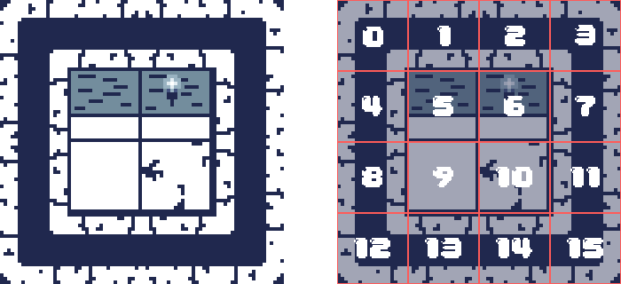
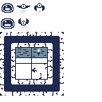

In the previous chapters, you have learned how to draw individual sprites and animated sprites from a texture atlas and handle collision detection. However, the game so far is lacking an actual world or environment to exist in; it is just sprites on a cornflower blue background. Most 2D games feature game worlds built from many tiles arranged in a grid-like patten. These *tilemaps* allow you to efficiently create large game environments without managing thousands of individual sprites.

In this chapter you will:

- Learn what tilemaps are and how they are used in game development.
- Create a `Tileset` class to manage collections of related tiles.
- Build a `Tilemap` class to render tile-based game worlds.
- Implement an XML-based tilemap loading system.
- Update our game to use tilemaps for the game environment.

## Understanding Tilemaps

Tilemaps are a common technique used in 2D game development to create game worlds. Instead of positioning individual sprites for each element in the game world, a tilemap divides the world into a grid and places tiles from a *tileset* at each grid position.

### What is a Tileset?

A tileset is a collection of small images (tiles) that can be combined and arranged to create game environments. Typically these are stored in a single texture atlas, similar to how we have been handing sprites and animations. Common examples of tiles might include:

- Floor and ground tiles.
- Walls and obstacle tiles.
- Decorative elements like plants and furniture.
- Special tiles like doors, ladders, or water.

Each tile in a tileset is assigned an ID number, which the tilemap uses to reference which tile goes where. For example, in *Figure 13-1* below, the tileset we will add to our game in a moment is shown on the left and on the right is the same tileset with an overlay showing how each tile is assigned an ID number.

|  |
| :--------------------------------------------------------------------------------------------------------------------------------------------------------------------------: |
|                   **Figure 13-1: Left: Original dungeon tileset. Right: The same tileset with an overlay showing how each tile is assigned a numeric ID**                    |

### What is a Tilemap?

A tilemap is a grid-based data structure that defines which tiles from a tileset appear at each position in the game world. The tilemap stores an ID for each cell in the grid, where the ID corresponds to a specific tile in the tileset.

For example, a simple tilemap may look like this conceptually:

```text
00 01 02 01 03
04 05 06 05 07
08 09 10 09 11
04 09 09 09 07
12 13 14 13 15
```

If we took the above tilemap data and mapped each cell to the tile in the related tileset, it would look something similar to *Figure 13-2* below:

|  |
| :-------------------------------------------------------------------------------------------------------------------------------------------------------------------------------------------------------------------------------------: |
|                     **Figure 13-2: From tileset to tilemap. Left: Tileset with an overlay showing the tile IDs. Right: The tilemap created using the tiles arranged with the pattern from the code example above**                      |

This approach offers several advantage:

1. **Memory efficiency**: Instead of storing complete information about each tile's appearance, you only need to store a reference ID.
2. **Performance**: Drawing a tilemap can be optimized to reduce texture swapping compared to rendering many individual sprites.
3. **Design flexibility**: Tilemaps make it easy to create, modify, and load level designs from external files.

We will now take this concept and implement it in our game by creating a `Tileset` class and a `Tilemap` class.

## The Tileset Class

The `Tileset` class will manage a collection of tiles from a texture atlas. Each tile will be represented as a `TextureRegion`, building on the tools in the library we created earlier.

In the `Graphics` folder of the *MonoGameLibrary* project, create a new file named `Tileset.cs` with the following code as the initial structure:

[!code-csharp[](./snippets/tileset.cs#declaration)]

### Tileset Properties and Fields

The `Tileset` class needs to store a `TextureRegion` for each of the individual tiles in the tile set and provide the dimensions (width and height) of the tiles. It should also offers additional properties that provide the total number of rows and columns in the tileset and the total number of tiles. Add the following fields and properties:

[!code-csharp[](./snippets/tileset.cs#properties)]

### Tileset Constructor

The `Tileset` class constructor requires a source `TextureRegion` that represents the tileset and the width and height of the tiles. Based on these parameters provided, it can automatically divide the source `TextureRegion` into a grid of smaller texture regions and calculate the total number of rows, columns, and tiles.

Add the following constructor:

[!code-csharp[](./snippets/tileset.cs#ctors)]

### Tileset Methods

The `Tileset` class needs to provide methods to retrieve the `TextureRegion` of a tile based on the index (tile ID) or by the location (row and column) of the tile in the tileset. Add the following methods:

[!code-csharp[](./snippets/tileset.cs#methods)]

## The Tilemap Class

Now that we have a `Tileset` class to define our tile collection, we need a `Tilemap` class to arrange these tiles into a game level. The `Tilemap` class will store which tile goes where in our game world and provide methods to draw the entire map.

In the `Graphics` folder of the *MonoGameLibrary* project, create a new file named `Tilemap.cs` with the following code as the initial structure:

[!code-csharp[](./snippets/tilemap.cs#declaration)]

### Tilemap Properties and Fields

The `Tilemap` class needs to store a reference to the tileset being used, along with an array of the tile IDs representing each tile in the map. It should also offer additional properties that provide the total number of rows and columns in the tilemap and the total number of tiles. Add the following fields and properties:

[!code-csharp[](./snippets/tilemap.cs#properties)]

### Tilemap Constructor

The `Tilemap` constructor requires the `Tilemap` to reference for each tile, the total number of columns and rows in the map, and the size (width and height) of each tile.

Add the following constructor:

[!code-csharp[](./snippets/tilemap.cs#ctors)]

### Tilemap Tile Management Methods

The `Tilemap` class should provide methods to set and retrieve tiles, either by index or location (rows and column). Add the following methods:

[!code-csharp[](./snippets/tilemap.cs#tile-management)]

### Tilemap Draw Method

The `Tilemap` class needs a method to draw the tilemap by iterating through each of the tiles and drawing the `TextureRegion` for that tile at its correct position. Add the following method:

[!code-csharp[](./snippets/tilemap.cs#draw)]

### Tilemap FromFile Method

The `Tilemap` class also requires a method to load and create an instance of the tilemap from an external configuration file. This allows us to separate level design from code. Add the following method:

[!code-csharp[](./snippets/tilemap.cs#from-file)]

## Updating the Game

Now that we have the `Tilemap` and `Tileset` classes defined, we can update our game to use them. We will need to

1. Update the texture atlas to include the tileset.
2. Create a tilemap xml configuration file.
3. Update the game to load the tilemap from the configuration file and draw it.

### Update the Texture Atlas

Currently, the texture atlas we have been using only contains the sprites for the slime and bat animations. We need update it to a new version that contains the tileset as well.

Right-click the following image and save it as `atlas.png` in the `Content/images` directory of the *DungeonSlime* project (your main game project), overwriting the existing one.

> [!NOTE]
> You do not need to do this in the MGCB editor as you are simply replacing the file and not altering any of its import properties.

|  |
| :---------------------------------------------------------------------------------------------------------------: |
|          **Figure 13-3: The texture atlas for our game updated to include the tileset for the tilemap**           |

> [!NOTE]
> Since the slime and bat sprites are in the same position in the new texture atlas, we do not need to update the atlas XML configuration file.

## Creating a Tilemap XML Configuration

Now that we have the texture atlas updated to include the tileset, we need to create a tilemap configuration that our game can load. The configuration will be an XML file that specifies the tileset to use and the arrangement of tiles in the tilemap.

We need to add this configuration file to our content project in the *Content/images* folder with the MGCB Editor, in the same way we did with the "atlas-definition.xml":

1. Open the *Content.mgcb* content project file in the MGCB Editor.
2. Right-click the *images* folder and choose *Add > New Item...*.
3. Select the *Xml Content (.xml)* type and name it `tilemap-definition`
4. Select the `tilemap-definition.xml` file you just created.
5. In the Properties panel, change the *Build Action* property from *Build* to *Copy*.
6. Save the changes in the MGCB Editor.

|  |
| :-------------------------------------------------------------------------------------------------------------------------------------------------------------------: |
|             **Figure 13-4: The Content project in the MGCB Editor with the tilemap-definition.xml file added and the Build Action property set to copy**              |

7. Open the `tilemap-definition.xml` file in your code editor and replace its contents with the following and save it:

[!code-xml[](./snippets/tilemap-definition.xml)]

This tilemap configuration creates a simple dungeon layout with walls around the perimeter and an open floor in the middle. The tile IDs correspond to specific tiles in the tileset:

- `00`, `03`, `12`, `15`: Corner wall tiles (top-left, top-right, bottom-left, bottom-right).
- `01`, `02`, `13`, `14`: Horizontal wall tiles (top and bottom walls).
- `04`, `07`, `08`, `11`: Vertical wall tiles (left and right walls).
- `05` and `06`: Top floor edge tiles.
- `09`: Standard floor tile.
- `10`: Decorated floor tile with a crack in it.

### Update the Game1 Class

With all of the assets now in place and configured, we can update the `Game1` class to load the tilemap and draw it. We will also need to update the collision logic so that the boundary is no longer the edge of the screen, but instead the edges of the wall tiles of the tilemap. Open `Game1.cs` and make the following updates:

[!code-csharp[](./snippets/game1.cs?highlight=31-35,46-61,80-82,109,111,113,125,118,120,122,124,142,145,147,150,153,156,158,161,176–178,300–301)]

The key changes to the `Game1` class include:

1. The `_tilemap` field was added to hold the loaded tilemap.
2. The `_roombounds` [**Rectangle**](xref:Microsoft.Xna.Framework.Rectangle) was added to define the playable area within the tilemap to keep the slime and bat inside the walls.
3. In [**Initialize**](xref:Microsoft.Xna.Framework.Game.Initialize):
   1. The `_roomBounds` is set based on the tilemap's tile size.
   2. The starting position of the slime is now set to be in the center of the room.
4. In [**LoadContent**](xref:Microsoft.Xna.Framework.Game.LoadContent):
   1. The tilemap is loaded from the XML configuration file.
   2. The scale of the tilemap is set to a factor of 4.0.
5. In [**Update**](<xref:Microsoft.Xna.Framework.Game.Update(Microsoft.Xna.Framework.GameTime)>), the `screenBounds` variable was removed and the collision logic has been updated to instead use the `_roomBounds` instead.
6. In [**Draw**](<xref:Microsoft.Xna.Framework.Game.Draw(Microsoft.Xna.Framework.GameTime)>) the tilemap is drawn.

Running the game now with these changes, our game now visually transforms from a simple screen with sprites to a proper game environment with walls and floors. The slime and bat are now confined within the walls of the dungeon defined by our tilemap.

|  |
| :---------------------------------------------------------------------------------------------------------------------------------: |
|            **Figure 13-5: Gameplay with the tilemap rendered and the bat and slime contained within the dungeon walls**             |

## Additional Notes

While the method provided in this chapter offers a straightforward approach to loading tilemaps from external configuration files, several dedicated tools exist specifically for creating tilemaps for games. Popular options include [Tiled](https://www.mapeditor.org/), [LDtk](https://ldtk.io/), and [Ogmo](https://ogmo-editor-3.github.io/). These specialized tools export map configurations in various formats such as XML (similar to what we implemented) or JSON, and often include additional features like multiple layers, object placement, and custom properties for tiles.

> [!NOTE]
> In order to utilize Tilemaps from other tools, you will need a way to import those maps as MonoGame does not natively support them, one option is to use [MonoGame.Extended](https://www.monogameextended.net/) which provides Tilemap importers for Tiled (and more in the future) as well as a host of other features.

Although these tools are more robust than our implementation, the underlying concept remains the same: a tilemap is fundamentally a grid layout where each cell references a tile ID from a tileset. The principles you have learned in this chapter form the foundation for working with any tilemap system, regardless of which tool you might use.

## Conclusion

In this chapter, you accomplished the following:

- Learned about tilemaps and how they are used in 2D game development.
- Created a `Tileset` class to manage collections of tiles from a texture atlas.
- Implemented a `Tilemap` class to render grid-based game environments.
- Created an XML-based tilemap definition system for storing level layouts.
- Updated our game to use tilemaps for the game environment.

In the next chapter, we will start exploring audio to add sound effects when a collision occurs and background music to our game.

## Test Your Knowledge

1. What is the main advantage of using tilemaps for game environments rather than individual sprites?

   :::question-answer
   Tilemaps offer several advantages: memory efficiency (reusing tiles instead of storing complete environments), performance optimization (batched rendering), and design flexibility (easier to create and modify levels). They allow creating large game worlds by reusing a small set of tiles in different arrangements.
   :::

2. What is the relationship between a tileset and a tilemap?

   :::question-answer
   A tileset is a collection of individual tiles stored in a texture atlas, where each tile has a unique ID. A tilemap is a grid-based structure that references tiles from the tileset by their IDs to create a complete game environment. The tileset provides the visual elements, while the tilemap defines their arrangement.
   :::

3. Why might you use an XML definition for a tilemap instead of hardcoding the tile layout?

   :::question-answer
   Using XML definitions for tilemaps separates level design from game code, offering several benefits: easier level editing (without changing code), support for multiple levels, ability to create external level editors, and better organization of game content. It also allows non-programmers like game designers to create and modify levels.
   :::

4. In our implementation, how does the Tilemap's Draw method work?

   :::question-answer
   The Tilemap's Draw method iterates through each position in the grid. For each position, it:

   1. Retrieves the tile ID stored at that position.
   2. Gets the corresponding texture region from the tileset.
   3. Calculates the screen position based on the grid coordinates and tile size.
   4. Draws the texture region at that position using the sprite batch.
      :::
