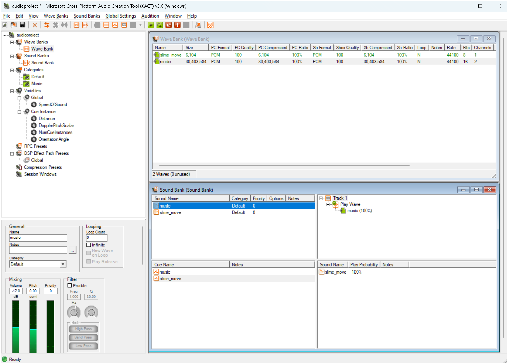
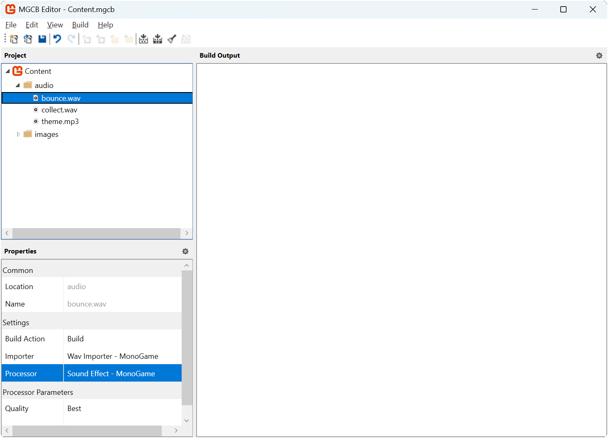
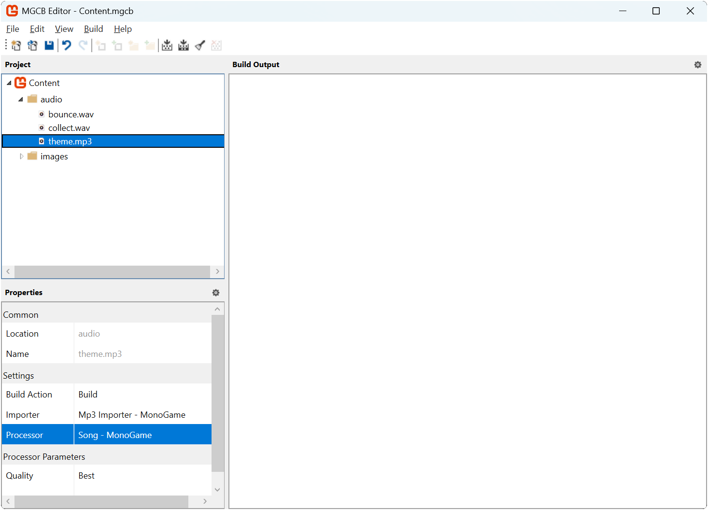

In [Chapter 12](../12_collision_detection/index.md), we implemented collision detection to enable interactions between game objects; the slime can now "eat" the bat, which respawns in a random location, while the bat bounces off walls of the dungeon. While these mechanics work visually, our game lacks an important element of player feedback: audio.

Audio plays a crucial role in game development by providing immediate feedback for player actions and creating atmosphere. Sound effects alert players when events occur (like collisions or collecting items), while background music helps establish mood and atmosphere.

In this chapter, you will:

- Learn how MonoGame handles different types of audio content.
- Learn how to load and play sound effects and music using the content pipeline.
- Implement sound effects for collision events.
- Add background music to enhance atmosphere.

We will first start by understanding how MonoGame approaches audio content.

## Understanding Audio in MonoGame

Recall from [Chapter 01](../01_what_is_monogame/index.md) that MonoGame is an implementation of the XNA API.  With XNA, there were two methods for implementing audio in your game: the *Microsoft Cross-Platform Audio Creation Tool* (XACT) and the simplified sound API.

> [!IMPORTANT]
> XACT is a mini audio engineering studio where you can easily edit the audio for your game like editing volume, pitch, looping, applying effects, and other properties without having to do it in code. At that time, XACT for XNA games was akin to what FMOD Studio is today for game audio.
>
> |  |
> |:--------------------------------------------------------------------------------------:|
> |             **Figure 14-1: Microsoft Cross-Platform Audio Creation Tool**              |
>
> While XACT projects are still fully supported in MonoGame, it remains a Windows-only tool that has not been updated since Microsoft discontinued the original XNA, nor has its source code been made open source. Though it is possible to install XACT on modern Windows, the process can be complex.
>
> For these reasons, this tutorial will focus on the simplified sound API, which provides all the core functionality needed for most games while remaining cross-platform compatible.

The simplified sound API approaches audio management through two distinct paths, each optimized for different use cases in games. When adding audio to your game, you need to consider how different types of sounds should be handled:

- **Sound Effects**: Short audio clips that need to play immediately and often simultaneously, like the bounce of a ball or feedback for picking up a collectable.
- **Music**: Longer audio pieces that play continuously in the background, like level themes.

MonoGame addresses these different needs through two main classes:

### Sound Effects

The [**SoundEffect**](xref:Microsoft.Xna.Framework.Audio.SoundEffect) class handles short audio clips like:

- Collision sounds.
- Player action feedback (jumping, shooting, etc.).
- UI interactions (button clicks, menu navigation).
- Environmental effects (footsteps, ambient sounds).

The key characteristics of sound effects are:

- Loaded entirely into memory for quick access
- Can play multiple instances simultaneously:
  - Mobile platforms can have a maximum of 32 sounds playing simultaneously.
  - Desktop platforms have a maximum of 256 sounds playing simultaneously.
  - Consoles and other platforms have their own constraints, and you would need to refer to the SDK documentation for that platform.
- Lower latency playback (ideal for immediate feedback)
- Individual volume control per instance.

### Music

The [**Song**](xref:Microsoft.Xna.Framework.Media.Song) class handles longer audio pieces like background music.  The key characteristics of songs are:

- Streamed from storage rather than loaded into memory.
- Only one song can be played at a time.
- Higher latency, but lower memory usage.

Throughout this chapter, we will use both classes to add audio feedback to our game; sound effects for the bat bouncing and being eaten by the slime, and background music to create atmosphere.

## Loading Audio Content

Just like textures, audio content in MonoGame can be loaded through the content pipeline, optimizing the format for your target platform.

### Supported Audio Formats

MonoGame supports several audio file formats for both sound effects and music:

- `.wav`: Uncompressed audio, ideal for short sound effects
- `.mp3`: Compressed audio, better for music and longer sounds
- `.ogg`: Open source compressed format, supported on all platforms
- `.wma`: Windows Media Audio format (not recommended for cross-platform games)

> [!TIP]
> For sound effects, `.wav` files provide the best loading and playback performance since they do not need to be decompressed. For music, `.mp3` or `.ogg` files are better choices as they reduce file size while maintaining good quality.

### Adding Audio Files

Adding audio files can be done through the content pipeline, just like we did for image files, using the MGCB Editor.  When you add an audio file to the content project, the MGCB Editor will automatically select the appropriate importer and processor for the audio file based on the file extension.

The processor that are available for audio files file:

- **Sound Effects**: Processes the audio file as a [**SoundEffect**](xref:Microsoft.Xna.Framework.Audio.SoundEffect).  This is  automatically selected for *.wav* files.
- **Song**: Processes the audio file as a [**Song**](xref:Microsoft.Xna.Framework.Media.Song).  This is automatically selected for *.mp3*, *.ogg*, and *.wma* files.

|  |  |
| :-----------------------------------------------------------------------------------------------------------------------------------------------: | :-------------------------------------------------------------------------------------------------------------------------------: |
|                   **Figure 14-2: MGCB Editor properties panel showing Sound Effect content processor settings for .wav files**                    |               **Figure 14-3: MGCB Editor properties panel showing Song content processor settings for .mp3 files**                |

> [!NOTE]
> While you typically will not need to change the processor it automatically selects, there may be times where you add files, such as *.mp3* files that are meant to be sound effects and not songs.  Always double check that the processor selected is for the intended type.

### Loading Sound Effects

To load a sound effect, we use [**ContentManager.Load**](xref:Microsoft.Xna.Framework.Content.ContentManager.Load``1(System.String)) with the [**SoundEffect**](xref:Microsoft.Xna.Framework.Audio.SoundEffect) type:

[!code-csharp]

### Loading Music

Loading music is similar, only we specify the [**Song**](xref:Microsoft.Xna.Framework.Media.Song) type instead.

[!code-csharp]

## Playing Sound Effects

Sound effects are played using the [**SoundEffect**](xref:Microsoft.Xna.Framework.Audio.SoundEffect) class. This class provides two ways to play sounds:

1. Direct playback using [**SoundEffect.Play**](xref:Microsoft.Xna.Framework.Audio.SoundEffect.Play):

    [!code-csharp]

2. Creating an instance using [**SoundEffect.CreateInstance**](xref:Microsoft.Xna.Framework.Audio.SoundEffect.CreateInstance):

    [!code-csharp]

- Use [**SoundEffect.Play**](xref:Microsoft.Xna.Framework.Audio.SoundEffect.Play) for simple sound effects that you just want to play once.
- Use [**SoundEffect.CreateInstance**](xref:Microsoft.Xna.Framework.Audio.SoundEffect.CreateInstance) when you need more control over the sound effect, like adjusting volume, looping, or managing multiple instances of the same sound.  

[**SoundEffectInstance**](xref:Microsoft.Xna.Framework.Audio.SoundEffectInstance) contains several properties that can be used to control how the sound effect is played:

| Property                                                                        | Type                                                            | Description                                                                |
| ------------------------------------------------------------------------------- | --------------------------------------------------------------- | -------------------------------------------------------------------------- |
| [**IsLooped**](xref:Microsoft.Xna.Framework.Audio.SoundEffectInstance.IsLooped) | `bool`                                                          | Whether the sound should loop when it reaches the end.                     |
| [**Pan**](xref:Microsoft.Xna.Framework.Audio.SoundEffectInstance.Pan)           | `float`                                                         | Stereo panning between -1.0f (full left) and 1.0f (full right).            |
| [**Pitch**](xref:Microsoft.Xna.Framework.Audio.SoundEffectInstance.Pitch)       | `float`                                                         | Pitch adjustment between -1.0f (down one octave) and 1.0f (up one octave). |
| [**State**](xref:Microsoft.Xna.Framework.Audio.SoundEffectInstance.State)       | [**SoundState**](xref:Microsoft.Xna.Framework.Audio.SoundState) | Current playback state (Playing, Paused, or Stopped).                      |
| [**Volume**](xref:Microsoft.Xna.Framework.Audio.SoundEffectInstance.Volume)     | `float`                                                         | Volume level between 0.0f (silent) and 1.0f (full volume).                 |

> [!NOTE]
> There is a lot more behind SoundEffectInstances such as the ability to play 3D sounds, as well as the advanced capabilities of the [DynamicSoundEffectInstance](xref:Microsoft.Xna.Framework.Audio.DynamicSoundEffectInstance) which can build audio streams.  However, these are beyond the scope of this beginners guide.  If you wish to know more, then check the [MonoGame documentation](/articles/getting_to_know/whatis/audio/)

## Playing Music

Unlike sound effects, music is played through the [**MediaPlayer**](xref:Microsoft.Xna.Framework.Media.MediaPlayer) class. This static class manages playback of [**Song**](xref:Microsoft.Xna.Framework.Media.Song) instances and provides global control over music playback:

[!code-csharp]

> [!IMPORTANT]
> While [**SoundEffect**](xref:Microsoft.Xna.Framework.Audio.SoundEffect) instances can be played simultaneously, trying to play a new [**Song**](xref:Microsoft.Xna.Framework.Media.Song) while another is playing will stop the current song in the best case, and in the worst case cause a crash on some platforms.  In the example above, the state of the media player is checked first before we tell it to play a song.  Checking the state first and stopping it manually if it is playing is best practice to prevent potential crashes.

## Adding Audio To Our Game

Before we can add audio to our game, we need some sound files to work with. Download the following audio files:

- [bounce.wav](./files/bounce.wav){download} - For when the bat bounces off screen edges
- [collect.wav](./files/collect.wav){download} - For when the slime eats the bat
- [theme.ogg](./files/theme.ogg){download} - Background music

> [!NOTE]
>
> - *bounce.wav* is "Retro Impact Punch 07" by Davit Masia (<https://kronbits.itch.io/retrosfx>).
> - *collect.wav* is "Retro Jump Classic 08" by Davit Masia (<https://kronbits.itch.io/retrosfx>).
> - *theme.mp3* is "Exploration" by Luis Zuno ([@ansimuz](https://twitter.com/ansimuz)).

Add these files to your content project using the MGCB Editor:

1. Open the *Content.mgcb* file in the MGCB Editor.
2. Create a new folder called `audio` (right-click *Content* > *Add* > *New Folder*).
3. Right-click the new *audio* folder and choose *Add* > *Existing Item...*.
4. Navigate to and select the audio files you downloaded.
5. For each file that is added, check its properties in the Properties panel:
   - For `.wav` files, ensure the *Processor* is set to `Sound Effect`.
   - For `.mp3` files, ensure the *Processor* is set to `Song`.
6. Save the changes and close the MGCB Editor.

Next, open the `Game1.cs` file and update it to the following:

[!code-csharp]

The key changes here are:

1. Added the `using Microsoft.Xna.Framework.Audio;` and `using Microsoft.Xna.Framework.Media;` directories to access the [**Song**](xref:Microsoft.Xna.Framework.Media.Song) and [**SoundEffect**](xref:Microsoft.Xna.Framework.Audio) classes.
2. Added the `_boundSoundEffect` and `_collectSoundEffect` fields to store those sound effects when loaded and use them for playback.
3. In [**LoadContent**](xref:Microsoft.Xna.Framework.Game.LoadContent)
   1. The bounce and collect sound effects are loaded using the content manager.
   2. The background theme music is loaded using the content manager.
   3. The background music is played using the media player, checking its state first.
   4. The [**MediaPlayer.IsRepeating**](xref:Microsoft.Xna.Framework.Media.MediaPlayer.IsRepeating) is set to `true` so the background music loops.
4. In [**Update**](xref:Microsoft.Xna.Framework.Game.Update(Microsoft.Xna.Framework.GameTime)):
   1. The bounce sound effect is played when the bat bounces off the edge of the screen.
   2. The collect sound effect is played when the slime eats the bat.

Running the game now, the theme music plays in the background, you can hear the bat bounce off the edge of the screen, and if you move the slime to eat the bat, you hear that as well.

|  |
| :----------------------------------------------------------: |
|            **Figure 14-4: Gameplay with audio.**             |

## Conclusion

In this chapter, you accomplished the following:

- Learned about MonoGame's audio system including sound effects and music.
- Explored the key differences between:
  - Sound effects (short, multiple simultaneous playback).
  - Music (longer, streamed, single playback).
- Added audio content to your game project through the content pipeline.
- Loaded audio files using the ContentManager.
- Implemented audio feedback in your game:
  - Background music to set atmosphere.
  - Sound effects for bat bouncing and collection events.
- Learned best practices for handling audio playback across different platforms.

In the next chapter, we will explore additional ways to manage audio by creating an audio controller module that will help with common tasks such as volume control, muting, and state management.

## Test Your Knowledge

1. What are the two main classes MonoGame provides for audio playback and how do they differ?

    :::question-answer
    MonoGame provides:

    - [**SoundEffect**](xref:Microsoft.Xna.Framework.Audio.SoundEffect) for short audio clips (loaded entirely into memory, multiple can play at once) and
    - [**Song**](xref:Microsoft.Xna.Framework.Media.Song) for longer audio like music (streamed from storage, only one can play at a time).

    :::

2. Why is it important to check if [**MediaPlayer**](xref:Microsoft.Xna.Framework.Media.MediaPlayer) is already playing before starting a new song?

    :::question-answer
    Checking if MediaPlayer is already playing and stopping it if necessary helps prevent crashes on some platforms. Since only one song can play at a time, properly stopping the current song before starting a new one ensures reliable behavior across different platforms.
    :::

3. What file formats are best suited for sound effects and music, respectively, and why?

    :::question-answer
    For sound effects, .wav files are generally best because they are uncompressed and load quickly into memory for immediate playback. For music, compressed formats like .mp3 or .ogg are better suited because they greatly reduce file size while maintaining good audio quality, which is important for longer audio that's streamed rather than fully loaded.
    :::

4. What is the difference between using [**SoundEffect.Play**](xref:Microsoft.Xna.Framework.Audio.SoundEffect.Play) directly and creating a [**SoundEffectInstance**](xref:Microsoft.Xna.Framework.Audio.SoundEffectInstance)?

    :::question-answer

    - [**SoundEffect.Play**](xref:Microsoft.Xna.Framework.Audio.SoundEffect.Play) is simpler but provides limited control - it plays the sound once with basic volume/pitch/pan settings.
    - Creating a [**SoundEffectInstance**](xref:Microsoft.Xna.Framework.Audio.SoundEffectInstance) gives more control including the ability to pause, resume, loop, and change properties during playback, as well as track the sound's state.

    :::

5. How many sound effects can play simultaneously on different platforms?

    :::question-answer
    The number of simultaneous sound effects varies by platform:

    - Mobile platforms: maximum of 32 sounds.
    - Desktop platforms: maximum of 256 sounds.
    - Consoles and other platforms have their own constraints specified in their respective SDK documentation.
    :::
