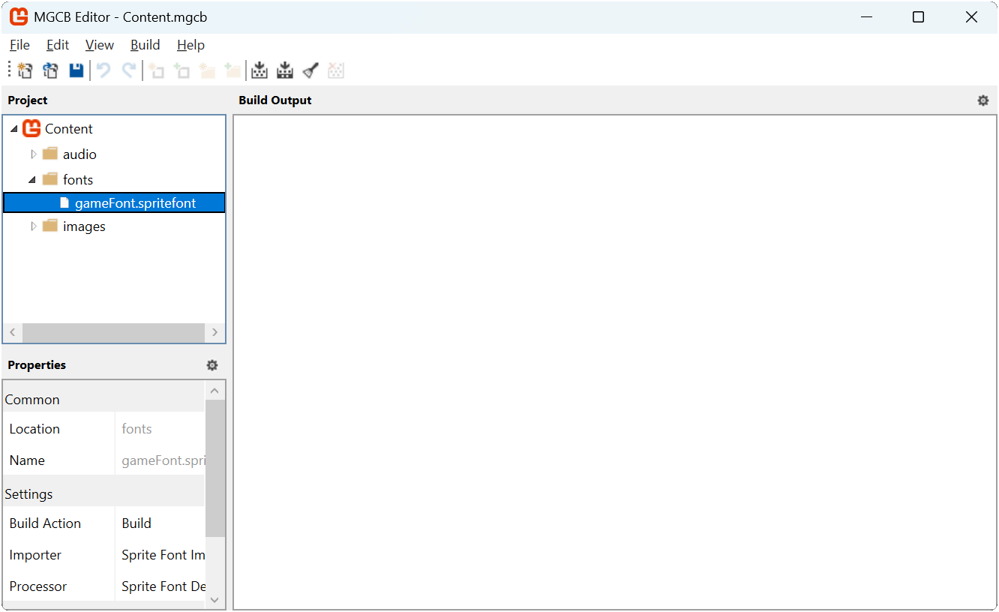

In [Chapter 06](../06_working_with_textures/index.md), you learned how to load and render textures to display sprites in your game. While images are essential for visual elements, most games also need text for things like scores, player instructions, dialogue, and UI elements. MonoGame provides the [**SpriteFont**](xref:Microsoft.Xna.Framework.Graphics.SpriteFont) class to handle text rendering, which works together with the familiar [**SpriteBatch**](xref:Microsoft.Xna.Framework.Graphics.SpriteBatch) we have been using for drawing textures.

In this chapter, you will:

- Learn how MonoGame handles text rendering with SpriteFonts.
- Create `SpriteFont` description using the MGCB Editor.
- Load custom fonts for use in your game.
- Render text using various parameters to control appearance.
- Implement text rendering in our game.

We will first start by understanding how text rendering works in MonoGame.

## Understanding SpriteFonts

MonoGame processes fonts through the content pipeline to create a texture atlas of font characters.  MonoGame uses the texture atlas approach rather than directly using system fonts for several important reasons:

- **Cross-platform Compatibility**: System fonts cannot be guaranteed to exist on all platforms.
- **Consistency**: Ensures that the text appears the same across all platforms.
- **GPU Rendering**: Graphics cards do not understand font formats directly; they can only render textures.
- **Performance**: Pre-rendering the glyphs to a texture atlas allow for faster rendering at runtime with no texture swapping.

A [**SpriteFont**](xref:Microsoft.Xna.Framework.Graphics.SpriteFont) in MonoGame consists of:

1. A texture atlas containing pre-rendered glyphs (characters).
2. Data that tracks the position, size, and spacing of each character.
3. Kerning information for adjusting spacing between specific character pairs.

The texture atlas approach means fonts are rendered as sprites, using the same [**SpriteBatch**](xref:Microsoft.Xna.Framework.Graphics.SpriteBatch) system you learned about for drawing textures ([Chapter 7: Optimized Texture Rendering](../07_optimizing_texture_rendering/index.md)).  When you draw text, MonoGame is actually drawing small portions of the texture atlas for each character assembled together to form complete words and sentences.

## Creating a SpriteFont Description

To use text in your game, you first need to create a SpriteFont Description file and process it through the Content Pipeline, thankfully the MGCB Editor makes this process straightforward.  

For example, in the MGCB Editor:

1. Right-click the content project node where the SpriteFont Description will be created and choose *Add* > *New Item...*.
2. Select `SpriteFont Description (.spritefont)` from the options.
3. Specify a name for the SpriteFont Description file and click `Create`.

This will create a default SpriteFont Description file that look something like this:

[!code-xml[](./snippets/spritefont_description.spritefont)]

When creating a SpriteFont Description for your game, you will need to make several important decisions about font selection, size, formatting, and licensing. The following sections will guide you through customizing the SpriteFont Description using these considerations.

### Customizing the SpriteFont

The SpriteFont Description file allows you to customize various aspects of how the font will be processed and appear in your game. Here are the key elements you can modify:

#### FontName

The `<FontName>` element specifies which font to use. By default, it references "Arial".  When a font name is specified just by name like this, it is required that the font be installed on the system where the content is built.

> [!IMPORTANT]
> MonoGame recommends changing the default Arial font if you are targeting any platforms other than Windows. Arial is a legacy from XNA and is only guaranteed to be available in Windows builds.  As an alternative, MonoGame currently recommends using [Roboto](https://fonts.google.com/specimen/Roboto).

Alternatively, for better portability across development environments, it is recommended instead to directly reference a TrueType (.ttf) or OpenType (.otf) font file.  To do this

1. Download or locate a TTF or OTF font file.
2. Place it in the **same folder** as the `.spritefont` file.

    > [!IMPORTANT]
    > You place the font file in the **same folder** as the `.spritefont` file directly, not through the MGCB Editor.

3. Update the `<FontName>` element to include the exact filename with extension.

> [!TIP]
> Use fonts with permissive licenses (like [SIL Open Font License](https://openfontlicense.org/)) to ensure you can **legally** use them in your game.
>
> **Always check the license of any font you use!**

#### Size

The `<Size>` element controls the font size in points. While it might seem straightforward, font sizing requires consideration and can be dependent on several factors.  When choosing a font size, consider:

- **Resolution impact**: Fonts that look good at 1080p may appear too small at 4K or too large at 720p.
- **Font style**: Pixel fonts look best with small sizes to preserve crispness.
- **Use case**: Different UI elements may require different sizes for proper hierarchy.

You may want to create multiple SpriteFont Description files for different use cases in your game such as:

- A larger font for headings and titles.
- A medium-sized font for standard UI elements.
- A smaller font for detailed information.

> [!TIP]
> Creating multiple SpriteFont Description files, however, can remove some of the benefits of fonts being a texture atlas since you will now have multiple atlases for each size. You will also now have multiple assets to manage both as asset files and references in code.
>
> An alternative approach is to create a single SpriteFont Description with a larger than needed size font, then scale it down during runtime in the game. This approach allows you to maintain the single SpriteFont Description file and single texture atlas, however, the size of the texture atlas will now be larger.
>
> There are tradeoffs to each approach and you should choose the one that works best for your game.

#### Spacing

The `<Spacing>` element adjusts the space between characters. The default value of 0 uses the font's built-in spacing. Positive values increase spacing, while negative values (though rarely used) can decrease it.

#### UseKerning

The `<UseKerning>` element determines whether to use kerning information from the font. Kerning adjusts the spacing between specific pairs of characters for more visually pleasing results. For most fonts, you will want to leave this as `true`.

> [!NOTE]
> While kerning typically improves text appearance, some fonts (including Arial) may not respond optimally to kerning adjustments. If you notice unusual character spacing with a particular font, try setting this value to `false`.

#### Style

The `<Style>` element sets the font style. Valid options are "Regular", "Bold", "Italic", or "Bold, Italic". Note that not all fonts have all styles available, and using a style that does not exist will fall back to Regular.

#### DefaultCharacter

The `<DefaultCharacter>` element (commented out by default) specifies what character to use as a fallback when trying to render a character that is not included in the font. This is useful for handling special characters or international text.

#### CharacterRegions

The `<CharacterRegions>` element defines which Unicode character ranges to include in the font. The default range (32-126) covers basic Latin characters, which is sufficient for English text. Including more characters increases the font texture size but allows support for more languages or special symbols.

For most games, the default range is sufficient.

> [!NOTE]
> Although for fun, TRY using the Wingdings font :D

## Loading a SpriteFont Description

To load a SpritFont Description, we use the [**ContentManager.Load**](xref:Microsoft.Xna.Framework.Content.ContentManager.Load%60%601(System.String)) method with the [**SpriteFont**](xref:Microsoft.Xna.Framework.Graphics.SpriteFont) type:

```cs
// Loading a SpriteFont Description using the content pipeline
SpriteFont font = Content.Load<SpriteFont>("font");
```

## Drawing Text with SpriteBatch

MonoGame's [**SpriteBatch**](xref:Microsoft.Xna.Framework.Graphics.SpriteBatch) class provides several overloads of the **DrawString** method to render text. The basic approach is similar to drawing textures, with a few unique parameters specific to text rendering.

The most basic DrawString overload looks like this:

[!code-csharp[](./snippets/drawstring_basic.cs)]

This overload contains the following parameters:

1. **font**: The [**SpriteFont**](xref:Microsoft.Xna.Framework.Graphics.SpriteFont) to use for rendering.
2. **text**: The text to display (as a string or `StringBuilder`).
3. **position**: A [**Vector2**](xref:Microsoft.Xna.Framework.Vector2) defining where to draw the text.
4. **color**: The [**Color**](xref:Microsoft.Xna.Framework.Color) to tint the text.

Just like with texture rendering, there are more advanced overloads that give you additional control:

[!code-csharp[](./snippets/drawstring_full.cs)]

> [!NOTE]
> Many of these parameters (`rotation`, `origin`, `scale`, `effects`, and `layerDepth`) work exactly the same way as they do for texture rendering, as explained in [Chapter 06](../06_working_with_textures/index.md). If you need a refresher on how these parameters affect rendering, refer back to that chapter.

## Calculating Text Dimensions

One common task when working with text is determining how much space it will occupy on screen. This is important for:

- Centering text
- Creating UI layouts
- Checking if text fits within a designated area
- Implementing text wrapping

MonoGame's [**SpriteFont**](xref:Microsoft.Xna.Framework.Graphics.SpriteFont) class provides the [**MeasureString**](xref:Microsoft.Xna.Framework.Graphics.SpriteFont.MeasureString(System.String)) method that returns the dimensions of rendered text:

[!code-csharp[](./snippets/measurestring.cs)]

The returned [**Vector2**](xref:Microsoft.Xna.Framework.Vector2) contains:

- `X`: The width of the text in pixels
- `Y`: The height of the text in pixels

Below is an example of centering text on the screen by drawing the text at the center of the screen and using [**MeasureString**](xref:Microsoft.Xna.Framework.Graphics.SpriteFont.MeasureString(System.String)) to calculate the center origin or the text

[!code-csharp[](./snippets/center_example.cs)]

## Implementing Text in Our Game

To explore implementing text, we will add text to our game to display information to the player.  We will add a score counter that increases when the slime eats the bat.

### Adding the SpriteFont Description

First, we will need to create a SpriteFont Definition.  Open the *Content.mgcb* content project file in the MGCB Editor and perform the following:

1. Create a new folder called `fonts` (right-click *Content* > *Add* > *New Folder*).
2. Right-click the new `fonts` folder and choose `Add > New Item...`.
3. Select `SpriteFont Description (.spritefont)` from the options.
4. Name the file `04B_30` and click `Create`.

|  |
| :--------------------------------------------------------------------------------------------: |
|             **Figure 16-1: The 04B_30.spritefont file created in the MGCB Editor**             |

> [!NOTE]
> We have named the SpriteFont Description file with the same name as the font we will be using.  This makes it easier to remember when updating the code later.

### Download the Font File

Next, right-click the following TTF font and choose "Save Link as..." and save it in the same folder as the *04B_30.spriteFont* file we just created.

- [04B_30.ttf](./files/04B_30.ttf){download}

### Update the SpriteFont Description

Next, open the *04B_30.spritefont* file in your code editor and make the following changes:

[!code-csharp[](./snippets/04B_30.spritefont?highlight=4,5)]

The key changes here are:

1. The `<FontName>` element was updated to `04B_30.ttf`, the exact filename with extension of the TTF font we just downloaded.
2. The `<Size>` element was updated to be `17.5`.

### Updating the Game

Finally, open the `Game1.cs` file and make the following changes:

[!code-csharp[](./snippets/game1.cs?highlight=48-58,93-99,129-130,244-245,389-400)]

The key changes made are:

1. The `_font` field was added to store the SpriteFont Description when loaded.
2. The `_score` field was added to track the player's score.
3. The `_scoreTextPosition` field was added to store the precalculated position to draw the score text at.
4. The `_scoreTextOrigin` field was added to store the origin to use when drawing the score text.
5. In [**Initialize**](xref:Microsoft.Xna.Framework.Game.Initialize)
   1. The position to draw the score text is precalculated to align with the left side of the room bounds horizontally and to vertically be at the center of the first tile at the top.
   2. The origin for the score text is precalculated by measuring the string `"Score"` and multiplying the `Y` component to get the vertical center of the text, then the origin is set so that it is at the left-center.
6. In [**LoadContent**](xref:Microsoft.Xna.Framework.Game.LoadContent), the font is loaded using the content manager.
7. In [**Update**](xref:Microsoft.Xna.Framework.Game.Update(Microsoft.Xna.Framework.GameTime)), the player's score is increased by `100` each time the slime eats the bat.
8. In [**Draw**](xref:Microsoft.Xna.Framework.Game.Draw(Microsoft.Xna.Framework.GameTime)), the score text is drawn at the precalculated position using the precalculated origin so that it aligns in the center of the tile on the blue strip using the sprite batch.

|  |
| :------------------------------------------------------------------------------------------: |
|            **Figure 16-2: The game with score displayed in the top-left corner**             |

## Conclusion

In this chapter, you accomplished the following:

- Learned how to create SpriteFont definitions with the MGCB Editor.
- Learned how to reference font files for better cross-platform compatibility.
- Learned how to load SpriteFonts through the content pipeline.
- Learned how to draw text with various parameters to control appearance.
- Learned how to measure text dimensions.
- Implementing a score display and boost indicator in our game.

In the next chapter we will discuss MonoGame's service container and how we can use it to start breaking our monolithic game file into modules for better maintainability.

## Test Your Knowledge

1. What are the key components of a SpriteFont in MonoGame?

    :::question-answer
    A SpriteFont in MonoGame consists of:
    1. A texture atlas containing pre-rendered glyphs (characters)
    2. Data that tracks the position, size, and spacing of each character
    3. Kerning information for adjusting spacing between specific character pairs
    :::

2. Why is it recommended to include the font file in your content project rather than referencing system fonts?

    :::question-answer
    Including the font file (TTF/OTF) directly in your content project and referencing it with the file extension ensures portability across different development environments. This approach does not depend on fonts being installed on the system where the content is built.
    :::

3. What method would you use to determine how much space a text string will occupy when rendered, and what does it return?

    :::question-answer
    The [**SpriteFont.MeasureString**](xref:Microsoft.Xna.Framework.Graphics.SpriteFont.MeasureString(System.String)) method is used to determine text dimensions. It returns a [**Vector2**](xref:Microsoft.Xna.Framework.Vector2) where the X component represents the width and the Y component represents the height of the rendered text in pixels.
    :::
