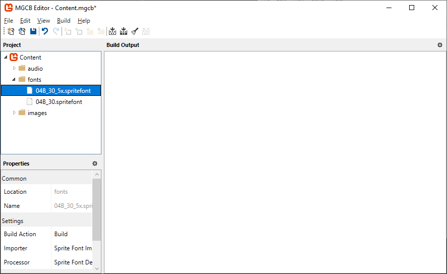

In game development, a scene (sometimes called a screen or state) represents a distinct section of the game.  Each scene typically has its own update and draw logic, as well as its own set of game objects.  Common examples of scenes include title screens, menus, gameplay screens, game over screens, and more.  Scenes help organize the game's code by separating different parts of the game into self-contained modules.  This makes the code more manageable as the game grows in complexity and offers several advantages:

1. **Improved organization**: Each scene contains only the code and assets relevant to that part of the game.
2. **Memory management**: Load assets only when needed and unload them when leaving a scene.
3. **Simplified state handling**: Each scene maintains its own state without affecting others.
4. **Code reusability**: Create reusable scene templates for common game screens.

Our game logic is currently contained within the single `Game1` class.  Adding more screens to it would make the code harder to manage, so instead we need to start thinking about breaking it down into scenes.

In this chapter, you will:

- Learn the concept of scene management and its benefits
- Create a base Scene class with a consistent lifecycle
- Implement scene transitions using a manager
- Create a title scene and gameplay scene for our game
- Refactor our existing game to use the scene system

We will begin by first defining the lifecycle of a scene that will be followed.

## Scene Lifecycle

In Chapter 03, you learned the basic [lifecycle of the `Game` class](../03_the_game1_file/index.md#exploring-the-game1-class).  To be consistent, we can borrow from this lifecycle and adapt it for our scenes. The order of operations for this lifecycle will be:

1. A scene is created and set as the active scene.
2. The first screen is made active and is initialized and content loaded.
3. The active scene is updated and drawn each cycle.
4. When transitioning to a new scene, or when the scene ends:
    1. The current scene is unloaded and disposed of.
    2. The new scene is initialized and content loaded.
    3. The new scene becomes the active scene and the cycle begins again until the game is told to exit.

## The Scene Base Class

The base `Scene` class is an abstract class for scenes that provides common functionality for all scenes.  In our actual game, we will create concrete implementations of this, like a title scene.

To get started, in the *MonoGameLibrary* project:

1. Create a new folder named `Scenes`.
2. Add a new class file named `Scene.cs` to the `Scenes` folder you just created.
3. Add the following code as the initial structure for the class:

    [!code-csharp]

    > [!NOTE]
    > Just like with the `AudioController` in [Chapter 15](../15_audio_controller/index.md#audiocontroller-idisposable-implementation), each `Scene` implements the `IDisposable` interface.  This provides a standardized in method to release the resources held by a scene when it is no longer needed.

### Scene Properties

Add the following properties to the `Scene` class:

[!code-csharp]

- The `Content` property is the scene's personal [**ContentManager**](xref:Microsoft.Xna.Framework.Content.ContentManager) that can be used to load scene specific content that will be unloaded when the scene ends.  This helps manage memory usage by only loading what is needed for a specific scene.
- The `IsDisposed` property is used to track if the scene has been disposed of since it implements the `IDisposable` interface.

### Scene Constructor

Add the following constructor and finalizer to the `Scene` class:

[!code-csharp]

- The constructor initializes the scene's content manager and sets the root folder to match that of the base game's content manager.
- The finalizer is called by the garbage collector automatically when a scene object is collected which just calls the `Dispose` method to ensure resources are disposed of properly.

### Scene Methods

Add the following methods to the `Scene` class:

[!code-csharp]

These methods are setup similar to how the `Game` class works to keep the workflow consistent:

- `Initialize` is called only once when the scene becomes the active scene.  It can be overridden by the derived class to provide scene specific initialization logic.  It also calls the `LoadContent` method the same way the `Game` class is done for consistency.
- `LoadContent` is called only once, at the end of the `Initialize` method.  It can be overridden by the derived class to load scene specific content.
- `UnloadContent` is called only once when a scene is ending due to a transition to a new scene.  It can be overridden by the derived class to perform unloading of any scene specific content.
- `Update` is called once at the start of every game cycle. It can be overridden to provide the update logic for the scene.
- `Draw` is called once every game cycle, directly after `Update`.  It can be overridden to provide the draw logic for the scene.

#### IDisposable Implementation

Add the following methods to the `Scene` class to complete the implementation of the `IDisposable` interface:

[!code-csharp]

With the Base scene implementation complete, we can now use it to create actual scenes for our project. The next step is to implement a manager that organizes and coordinates these scenes within the game.

## Scene Management

With the base `Scene` class defined, the `Core` class needs to be updated to handle management of the scenes, including update, drawing, and changing scenes.  Open the `Core.cs` file in the *MonoGameLibrary* project and make the following changes:

[!code-csharp]

The key changes here are:

1. The `using MonoGameLibrary.Scenes;` using directive was added so we have access to the `Scene` class.
2. The fields `_activeScene` and `_nextScene` were added to track which scene is currently active and which scene, if any, to switch to.
3. In `Update`:
   1. A check is made to see if there is a next scene, and if so, `TransitionScene` is called to gracefully switch from the current to the next.
   2. A check is made to see if there is an active scene, and if so, updates it.
4. An override for the `Draw` method was added where a check is made to see if there is an active scene, and if so, draws it.
5. The `ChangeScene` method was added which can be called when we want to tell the core to change from one scene to another one.
6. The `TransitionScene` method was added to gracefully switch from the current scene to the next by:
   1. Checking if there is an active scene, and disposing it if so.
   2. Triggering garbage collection to reclaim memory from the disposed scene.
   3. Assigning the next scene as the current scene.
   4. Checking if a current scene now exists, and initializing it if so.

> [!TIP]
> Notice that we use a two-step process for scene transitions with separate `_activeScene` and `_nextScene` fields. This design allows the current scene to complete its update/draw cycle before the transition occurs, preventing potential issues that could arise from changing scenes in the middle of processing. The actual transition happens at a controlled point in the game loop, ensuring clean disposal of the old scene before initializing the new one.

## Updating the Game

With the scene architecture in place, we are now ready to update the game by breaking it into separate scenes. We will create two scenes; a title scene and a gameplay scene.  First, however, we need to add an additional SpriteFont Description that will be used during the title scene to display the title of the game. Open the *Content.mgcb* content project file in the MGCB Editor and perform the following:

1. Right-click the `fonts` folder and choose `Add > New Item...`.
2. Select `SpriteFont Description (.spritefont)` from the options.
3. Name the file `04B_30_5x` and click `Create`.

|  |
| :-------------------------------------------------------------------------------------------------: |
|             **Figure 17-1: The *04B_30_5x.spritefont* file created in the MGCB Editor**             |

Next, open the *04B_30_5x.spritefont* file in your code editor and make the following changes:

[!code-xml]

### The Title Scene

The title scene serves as the game's initial starting point; the first impression the player gets when they launch the game.  For our game, the title scene will display the text for the title of the game and a prompt to inform the player what action to take to start the game.  We will use a simple trick for the title text in order to draw it with a drop shadow to add a bit of visual flair.

> [!NOTE]
> As the following screens are specific to our game and are not reusable bits, these will be added to your game project.
>
> Although, if you do end up making screens that are completely reusable, there is nothing wrong with putting them in your Game Library, it is completely up to you.

To get started, first:

1. In your Game project, create a new folder named `Scenes`.  We will put all of our game specific scenes here.
2. Add a new class file named `TitleScene.cs` to the `Scenes` folder you just created.
3. Add the following code as the initial structure for the class.

    [!code-csharp]

#### Title Scene Fields

Add the following fields to the `TitleScene` class:

[!code-csharp]

- Three `const` fields (`DUNGEON_TEXT`, `SLIME_TEXT`, `PRESS_ENTER_TEXT`) are added for the text that will be displayed on the title screen.
- The `_font` field stores a reference to the [**SpriteFont**](xref:Microsoft.Xna.Framework.Graphics.SpriteFont) we will use to draw the press enter prompt with.
- The `_font5x` field stores a reference to the [**SpriteFont**](xref:Microsoft.Xna.Framework.Graphics.SpriteFont) we will use to draw the dungeon and slime text with that will make up the title of the game.
- The `_dungeonTextPos` and `_dungeonTextOrigin` fields store the position and origin we will use to draw the "Dungeon" text at.
- The `_slimeTextPos` and `_slimeTextOrigin` fields store the position and origin we will draw the "Slime" text at.
- The `_pressEnterPos` and `_pressEnterOrigin` fields store the position and origin we will draw the "Press Enter To Start" text at.

#### Title Scene Methods

The `TitleScene` class will override the various methods from the base `Scene` class that it derives from to provide the initialization, content loading, update, and drawing logic.

##### Title Scene Initialize

Add the following override for the `Initialize` method to the `TitleScene` class:

[!code-csharp]

- We set the `Core.ExitOnEscape` to true to allow players to exit the game when on the title screen by pressing the escape key.
- The position and origin for the "Dungeon", "Slime", and "Press Enter To Start" texts are set.

> [!NOTE]
> You can see here we are using the [**MeasureString**](xref:Microsoft.Xna.Framework.Graphics.SpriteFont.MeasureString(System.String)) method for the font to work out how long the text to draw is, we then multiply this by `0.5` to work out the middle of the text so that we can properly set the origin of the text to its middle.

##### Title Scene LoadContent

Add the following override for the `LoadContent` method to the `TitleScene` class:

[!code-csharp]

- The [**SpriteFont**](xref:Microsoft.Xna.Framework.Graphics.SpriteFont) used to draw the "Press Enter To Start" text is loaded using the global content manager.
- The [**SpriteFont**](xref:Microsoft.Xna.Framework.Graphics.SpriteFont) used to draw the "Dungeon" and "Slime" text is loaded using the scene's content manager.

> [!TIP]
> Recall from [Chapter 05](../05_content_pipeline/index.md#contentmanager-methods) that when a [**ContentManager**](xref:Microsoft.Xna.Framework.Content.ContentManager) loads an asset for the first time, it caches it internally and the subsequent calls to load that asset will return the cached one instead of performing another disk read.  
>
> By using a global content manager here to load assets that are used in multiple scenes, when they loaded in a different scene later, the cached version is returned instead of having to do another disk read, making the content loading more efficient.

##### Title Scene Update

Add the following override for the `Update` method to the `TitleScene` class:

[!code-csharp]

- A check is made to see if the enter key is pressed, and if so, the `Core` is told to change to the game scene.  

> [!NOTE]
> Your editor might show an error here since we have not created the `GameScene` class yet.  We will create it in a moment after finishing the title scene.

> [!TIP]
> You will also notice the Title screen is only checking if the player hits the enter key to start the game, but we are not checking if they hit escape to quit the game, that is because it is already handled in the `Core` class `Update` method, if `ExitOnEscape` is true (as it is here), the game will automatically exit.

##### Title Scene Draw

For the final act, add the following override for the `Draw` method to the `TitleScene` class:

[!code-csharp]

- The back buffer is cleared.
- A `dropShadowColor` is created which is the color black with half transparency.
- The "Dungeon" text is drawn, first 10px down and to the left of the actual position using the drop shadow color, then again at its normal position overtop.  Layering this way creates the drop shadow effect.
- The "Slime" text is drawn, again offset from its position first using the drop shadow color and then drawn again at its normal position overtop.
- Finally, the "Press Enter To Start" text is drawn.

With our Title screen in place, it is time to get started with the Game Scene, lets play.

### The Game Scene

The Game Scene will contain our actual gameplay logic. This scene will handle updating and rendering the slime that the player controls, the bat the slime can eat, collision detection, score tracking, and input handling. Most of this logic has already been implemented in our `Game1` class in previous chapters, but now we will move it into a dedicated scene class. In the *Scenes* folder:

1. Add a new class file named `GameScene.cs` in the Game projects `Scenes` folder.
2. Add the following code as the initial structure for the class:

    [!code-csharp]

The following code is effectively replacing the code we have already written in the original `Game1.cs` class, so it should look very familiar.  Once complete, we can return to `Game1` and clear out all the redundant code because it is all nicely tidied up in the new `GameScene` class.

#### Game Scene Fields

Add the following fields to the `GameScene` class:

[!code-csharp]

- The `_slime` and `_bat` fields store the animated sprites for the player controlled slime and the bat.
- The `_slimePosition` and `_batPosition` fields track the current position of the slime and bat.
- The `MOVEMENT_SPEED` constant defines the base movement speed for both the slime and bat.
- The `_batVelocity` field tracks the current velocity of the bat as it moves around the screen.
- The `_tilemap` field stores the tilemap that we will load and draw for the level background environment.
- The `_roomBounds` field defines a rectangular boundary that represents the boundary of the room that the slime and bat stays within.
- The `_bounceSoundEffect` and `_collectSoundEffect` fields store the sound effects to play when the bat bounces off a screen edge or is eaten by the slime.
- The `_font` field stores the font used to display the player's score.
- The `_score` field tracks the player's current score, which increases when the slime eats a bat.
- The `_scoreTextPosition` and `_scoreTextOrigin` defines the position and origin to use when drawing the score text.

#### Game Scene Methods

The `GameScene` class will override the various methods from the base `Scene` class that it derives from to provide the initialization, content loading, update, and drawing logic.

##### Game Scene Initialize

Add the following override for the `Initialize` method to the `GameScene` class:

[!code-csharp]

- We set `Core.ExitOnEscape` to false because in the gameplay scene, we want to handle the escape key differently; instead of exiting the game, it will return to the title screen.
- The room bounds is calculated using the bounds of the screen and adjusting that so that it shrinks by one tile width and height on each edge, which will match with the tilemap wall boundary.
- The slime's initial position is set to be the center tile by calculating the center row and column.
- The bat's initial position is placed at the top left of the room bounds.
- The position and origin of the score text is precalculated.  The height of the text is measured to properly calculate the center origin for vertical positioning.
- The `AssignRandomBatVelocity` method is called to give the bat its initial velocity.

##### Game Scene LoadContent

Add the following override for the `LoadContent` method to the `GameScene` class:

[!code-csharp]

- The texture atlas is loaded using the global content manager, and the slime and bat animated sprites are created from it.
- The tilemap is loaded using the scene's content manager since they are specific to the gameplay scene.
- The sound effects are loaded using the scene's content manager since they are specific to the gameplay scene.
- The font is loaded using the global content manager since it is used in multiple scenes.

> [!TIP]
> Notice how we are following a consistent pattern across scenes: global assets are loaded with `Core.Instance.Content` while scene-specific assets are loaded with the scene's `Content` property.

##### Game Scene Update

Add the following override for the `Update` method to the `GameScene` class:

[!code-csharp]

- The animated sprites for the slime and bat are updated.
- Input from keyboard and gamepad is checked with dedicated methods `CheckKeyboardInput` and `CheckGamePadInput`.
- Collision detection is performed to:
  - Keep the slime within the room bounds.
  - Make the bat bounce off edges of the room bounds.
  - Detect when the slime eats the bat.
- When the slime eats the bat, the bat respawns in a random location within the room bounds, given a new velocity, the collect sound is played, and the score is increased.

##### Game Scene Helper Methods

Next, add these helper methods to the `GameScene` class:

[!code-csharp]

- `AssignRandomBatVelocity`: Calculates a random direction and applies it to the bat's velocity.
- `CheckKeyboardInput`: Handles keyboard controls for moving the slime, toggling audio settings, and returning to the title screen.
- `CheckGamePadInput`: Handles gamepad controls for moving the slime.

##### Game Scene Draw

Finally, add the following override for the `Draw` method to the `GameScene` class:

[!code-csharp]

- The back buffer is cleared.
- The tilemap is drawn.
- The slime and bat animated sprites are drawn at their current positions.
- The player's score is drawn at using its precalculated position and origin so that it is in the top left of the room bounds centered on the wall sprite.

This concludes the `GameScene` class.  With all the logic for our actual gameplay now housed in a single place, we can clean up our project to use it.

### Updating the Game1 Class

With our scene system and scene classes in place, we can now simplify our main `Game1` class to just initialize the game and start with the title scene. Open the `Game1.cs` file and replace its content with the following:

[!code-csharp]

> [!NOTE]
> Feel free to check your homework and compare the original `Game1` class with the updated version, as well as checking the `GameScene` class did not lose any functionality (it has not, but you have to be sure!).  Refactoring code to be cleaner and more organised is a careful task.

The `Game1` class is now much simpler as most of the game logic has been moved to the appropriate scene classes. 

The updates include:

1. Sets up the game window with the constructor parameters.
2. Overrides the `Initialize` method to set the title scene as the starting scene.
3. Overrides the `LoadContent` method to load the background theme song and start playing it.

Running the game now, we can see that once the game screen comes up, the title scene is displayed with the animated slime and the press enter prompt.  The background music starts playing on this scene as well.  Pressing enter from here will switch to the game scene where the game starts and we can play the game implemented thus far.

|  |
| :------------------------------------------------------------------------------------------------------------------------------------------------------: |
|            **Figure 17-2: The game launching with the title screen first, then transitioning to the game play screen when enter is pressed**             |

## Conclusion

In this chapter, you accomplished the following:

- Learned about scene management and why it is important for organizing game code.
- Created an abstract `Scene` base class that provides a consistent lifecycle similar to the MonoGame [**Game**](xref:Microsoft.Xna.Framework.Game) class.
- Implemented the `IDisposable` interface to properly handle resource cleanup.
- Extended the `Core` class to handle scene transitions and management.
- Created a `TitleScene` for the main menu with text prompts and animations.
- Created a `GameScene` that encapsulates the gameplay mechanics.
- Refactored the main `Game1` class to be much simpler by using the scene system.

The approach we have taken follows a common pattern in game development, where each scene has control over its own lifecycle and resources. This pattern simplify state management by isolating different game states from one another.  As your game grows in complexity, you could easily extend this system to include additional scenes like a pause menu or a game over screen.

In the next chapter, we will explore [**RenderTarget2D**](xref:Microsoft.Xna.Framework.Graphics.RenderTarget2D) and how we can use it to add different types of transitions when switching scenes.

## Test Your Knowledge

1. What are the main benefits of implementing a scene management system in a game?

    :::question-answer
    The main benefits include:

    - Improved organization by separating different parts of the game into self-contained modules.
    - Better memory management by loading assets only when needed and unloading them when leaving a scene.
    - Simplified state handling as each scene maintains its own state without affecting others.
    - Increased code reusability through the ability to create reusable scene templates.
    :::

2. How does the scene lifecycle in our implementation mirror the MonoGame Game class lifecycle?

    :::question-answer
    The scene lifecycle mirrors the MonoGame Game class lifecycle by implementing similar methods in the same order:

    - `Initialize` is called once when the scene becomes active.
    - `LoadContent` is called at the end of the `Initialize` method.
    - `Update` is called every frame to update game logic.
    - `Draw` is called every frame to render the scene.
    - `UnloadContent` is called when transitioning away from the scene.
    :::

3. What is the purpose of having a separate [**ContentManager**](xref:Microsoft.Xna.Framework.Content.ContentManager) for each scene?

    :::question-answer
    Having a separate [**ContentManager**](xref:Microsoft.Xna.Framework.Content.ContentManager) for each scene:

    - Allows scene-specific content to be automatically unloaded when the scene is disposed.
    - Provides better organization of which assets belong to which scenes.
    - Improves memory efficiency by only loading assets that are currently needed.
    - Makes it clear which assets are meant to be used globally versus locally to a scene.
    :::

4. When implementing scene transitions, why do we use a two-step process with `_nextScene` and `_activeScene`?

    :::question-answer
    The two-step process with `_nextScene` and `_activeScene` is used because:

    - It allows the current scene to complete its update/draw cycle before the transition occurs.
    - It provides a clean way to handle the disposal of the current scene before initializing the new one.
    - It ensures that scene transitions happen at a safe point in the game loop.
    - It prevents potential issues that could occur from immediately changing scenes in the middle of an update or draw operation.
    :::
