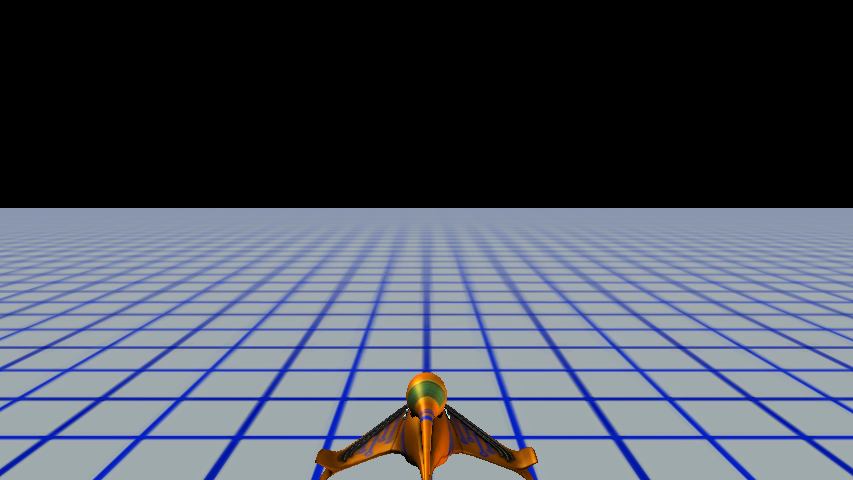
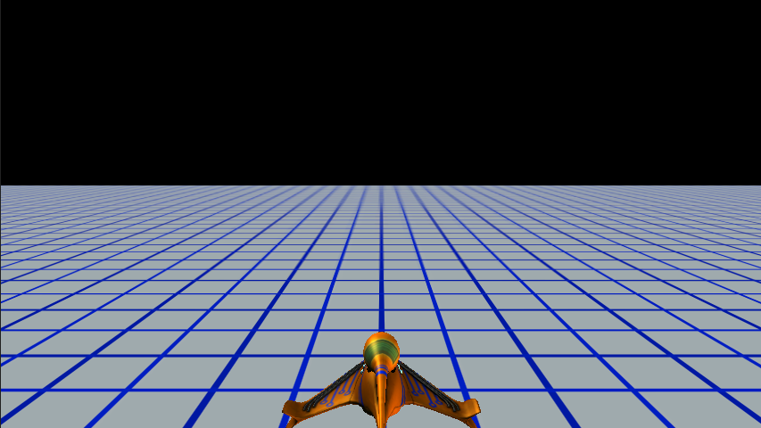
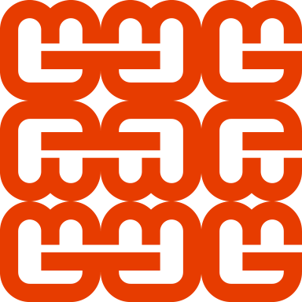
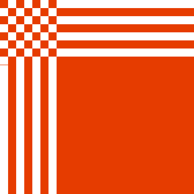
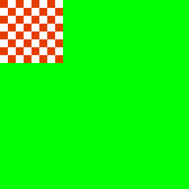
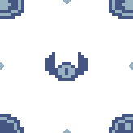
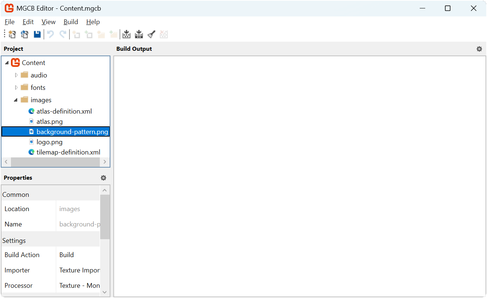

In previous chapters, we have [drawn individual sprites and textures](../08_the_sprite_class/index.md#using-the-sprite-class) with the sprite batch, but for creating repeating background patterns, we need a more efficient approach than manually drawing the same texture multiple times. We could reuse the [tilemap system](../13_working_with_tilemaps/index.md#the-tilemap-class) that was created to make repeated background patterns, but this has a limitation in that the tiles are stationary and would require constantly updating the tiles and positions if we wanted to animate it.  Instead, this chapter introduces texture sampling states, specifically focusing on how to create and animate tiled backgrounds using [**SamplerState.PointWrap**](xref:Microsoft.Xna.Framework.Graphics.SamplerState.PointWrap).

In this chapter, you will:

- Learn about texture sampling and sampler states in MonoGame.
- Understand how wrap mode allows efficient texture tiling.
- Implement a scrolling tiled background for the title screen.

## Understanding Texture Sampling

When a texture is drawn to the screen, MonoGame uses a process called "sampling" to determine which pixels from the texture should be displayed.  Sampling is the process by which a graphics pipeline determines what color value to use from a texture when mapping it onto a surface.  Think of it like placing a grid over an image and selecting which pixels to use when that image needs to be transformed in some way.  When textures are drawn at their exact pixel size and position, with no rotation, sampling is straightforward, a direct 1:1 mapping for each pixel.  However, when a texture is scaled, rotated, or only partially visible, the graphics hardware needs to decide how to interpret the texture data.

For example, if you draw a texture twice its size, there are not enough pixels to fill the new larger space, so the graphics hardware must determine how to fill those gaps.  Similarly, if you were to scale down a texture, multiple source pixels might map to a single output pixel, requiring the hardware to decide which ones to use or how to blend them.  The rules that govern these decisions are defined by sampler states.

### Texture Coordinates

In graphics programming, textures are addressed using a normalized coordinate system ranging from 0.0 to 1.0, regardless of the texture's actual pixel dimensions:

- The top-left corner of a texture is (0.0, 0.0)
- The bottom-right corner is (1.0, 1.0)
- The center is (0.5, 0.5)

This normalized system means that regardless of whether your texture is 32×32 pixels or 2048×2048 pixels, the coordinates to access the entire texture always range from 0.0 to 1.0. The graphics hardware automatically converts these normalized coordinates to the actual pixel locations within the texture.

When you use [**SpriteBatch**](xref:Microsoft.Xna.Framework.Graphics.SpriteBatch) to draw a texture with a source rectangle specified in pixels, MonoGame internally converts those pixel coordinates to normalized texture coordinates before sending them to the GPU. Similarly, when you specify a destination rectangle, MonoGame determines how the normalized texture coordinates should map to screen coordinates.

### What is a SamplerState

A SamplerState controls how textures are sampled during rendering. It determines several aspects of texture rendering:

- How textures are filtered when scaled (point/linear/anisotropic filtering).
- How texture coordinates outside the 0.0 to 1.0 range are handled (wrap/clamp/mirror).
- How mipmap levels are selected and blended.

In MonoGame, these sampler states are represented by the [**SamplerState**](xref:Microsoft.Xna.Framework.Graphics.SamplerState) class, which provides several predefined states for common scenarios.

### Filtering Modes

One aspect of sampler states if the filtering mode.  Filtering in computer graphics refers to how the graphics hardware decides to blend or select pixels when a texture is displayed at a different size than its original dimensions.  The filter mode determines how pixels are interpolated (calculated and combined) when a texture is scaled up or down.

Think of filtering as the graphics hardware's strategy for filling in missing information when a texture is transformed.  When you enlarge a texture, the system needs to create new pixels that did not exist in the original.  When you shrink a texture, multiple original pixels must be combined into fewer output pixels.  The filtering mode controls how this process happens.

There are three filtering modes available in MonoGame:

* Point
* Linear
* Anisotropic.

Each mode offers a different balance between performance and visual quality.

#### Point Filtering Mode

Point mode uses what is called nearest neighbor sampling.  This means that when a texture is scaled, the closest pixel is selected resulting in a pixelated appearance when scaled up.  This is typically the ideal mode to use for pixel-art games when you want to preserve the exact pixel appearance of a scaled texture.  Point filtering is the least computationally expensive filtering mode of the three since it only samples a single pixel without any blending calculations. This makes it the fastest option, especially on lower-end hardware or when rendering many textures simultaneously.

|  |
| :----------------------------------------------------------------------------------------------------------------------------------------------------------------------: |
|                **Figure 18-1: Illustration of using Point filtering mode. Left: MonoGame logo at 32x32 pixels.  Right: MonoGame logo at 128x128 pixels**                 |

#### Linear Filtering Mode

Linear filtering mode blends neighboring pixels when the texture is scaled.  This creates a smoother, but potentially blurrier appearance.  This is better for realistic or high-resolution textures.  Linear filtering requires more processing power than point filtering since it needs to sample multiple pixels and calculated weighted averages between them.  However, on modern hardware, this performance difference is usually negligible for 2D games, making it a good balance between quality and performance for most non-pixel art games or assets.

|  |
| :------------------------------------------------------------------------------------------------------------------------------------------------------------------------: |
|                 **Figure 18-2: Illustration of using Linear filtering mode. Left: MonoGame logo at 32x32 pixels.  Right: MonoGame logo at 128x128 pixels**                 |

#### Anisotropic Filtering Mode

Anisotropic filtering mode provides higher-quality filter for textures viewed from oblique angles.  This is primarily used in 3D rendering.  It helps textures look more detailed by reducing blur and aliasing that occurs when a surface is angled away from the viewer.  Anisotropic filtering is the most computationally intensive option, as it samples many more pixels and performs complex calculations to determine the appropriate blending.  The performance cost increases with the anisotropic level (typically 2x, 4x, 8x, or 16x), which determines how many samples are taken.  This can significantly impact frame rates in complex 3D scenes, especially on mobile or lower-end devices, so it should be used selectively where visual quality at angles is most important.

|  |  |
| :----------------------------------------------------------------------------------------------------------------------------------------: | :--------------------------------------------------------------------------------------------------------------------------------------: |
|                            **Figure 18-3: Illustration of the MonoGame Fuel cell demo using Linear filtering**                             |                         **Figure 18-4: Illustration of the MonoGame Fuel cell demo using Anisotropic filtering**                         |

### Addressing Modes

The other aspect is the addressing mode, which determines what happens when texture coordinates fall outside the normal 0.0 to 1.0 range.  When drawing textures, sometimes the calculated texture coordinates end up being less than 0.0 or greater than 1.0.  The addressing mode tells the graphics hardware what to do in these situations; whether to repeat the texture, mirror it, stretch the edge pixels, or use a specific border color.  Think of it as instructions for what to display in areas where the texture does not naturally exist.  These modes are particularly important for creating effects like seamless tiling backgrounds, scrolling texture, or handling the edges of transformed sprites properly.  There are four addressing modes available; Wrap, Mirror, Clamp, and Border Color:

#### Wrap Mode

When using Wrap mode, at every whole integer of the texture coordinates (0.0 and 1.0), the texture coordinate is wrapped to stay within the 0.0 to 1.0 range (i.e. if the texture coordinate is 1.2, then that wraps to become 0.2). This creates a tiled pattern.  

For example, if we were to take the MonoGame logo at 128x128 pixels and draw it to a destination rectangle that was three times the size at 384x384 pixels, then the texture coordinates of the destination rectangle become (0.0, 0.0) (top-left), (3.0, 0.0) (top-right), (0.0) (bottom-left), and (3.0, 3.0) bottom-right.  The MonoGame logo texture would repeat three times horizontally and vertically within the destination.

|  |
| :-------------------------------------------------------------------------------------------------------------------: |
|                **Figure 18-5: Illustration of the MonoGame logo drawn using wrapped addressing mode**                 |

#### Mirror Mode

Mirror mode is similar to Wrap mode.  However instead of repeating the texture at every whole integer of the texture coordinates (0.0 and 1.0), the texture is flipped, creating a mirror effect.

Using the same example as above, taking the MonoGame logo at 128x128 pixels and drawing it to a destination rectangle three times the size with Mirror mode would produce the following:

|  |
| :--------------------------------------------------------------------------------------------------------------------: |
|                 **Figure 18-6: Illustration of the MonoGame logo drawn using mirror addressing mode**                  |

#### Clamp Mode

When using Clamp mode, the texture coordinates are clamped to the 0.0 and 1.0 range.  Texture coordinates that would go beyond this (edge pixels) are smeared.

The simplest demonstration of this is to use a checkerboard pattern.  If we were to take a texture that was a checkerboard pattern at 128x128 pixels and draw it to a destination rectangle three times the size with Clamped mode, then any pixels that extend outside the clamped range would smeared, producing the following:

|  |
| :---------------------------------------------------------------------------------------------------------------------------: |
|                  **Figure 18-7: Illustration of a checkerboard pattern drawn using clamped addressing mode**                  |

#### Border Color

When using Border Color mode, similar to Clamped mode, the texture coordinates are clamped to the 0.0 and 1.0f range. However, in Border Color mode, texture coordinates that would go beyond this (edge pixels) are instead drawn using the color set as the border color for the sampler state.

For example, if we use the checkerboard pattern again, using Border Color mode with a border color of green, then it would produce the following:

|  |
| :------------------------------------------------------------------------------------------------------------------------------------------------------------: |
|                 **Figure 18-8: Illustration of a checkerboard pattern drawn using border addressing mode with the border color set to green**                  |

## Using SamplerStates

MonoGame offers several predefined sampler states as part of the [**SamplerState**](xref:Microsoft.Xna.Framework.Graphics.SamplerState) class that cover common scenarios:

| SamplerState                                                                                | Description                                                      | Common Use Case                                                                                                                             |
| ------------------------------------------------------------------------------------------- | ---------------------------------------------------------------- | ------------------------------------------------------------------------------------------------------------------------------------------- |
| [**AnisotropicClamp**](xref:Microsoft.Xna.Framework.Graphics.SamplerState.AnisotropicClamp) | Combines Anisotropic filter mode with the Clamp addressing mode. | 3D textures viewed at oblique angles, like ground textures in a 3D world where you want high-quality filtering but no repeating patterns.   |
| [**AnisotropicWrap**](xref:Microsoft.Xna.Framework.Graphics.SamplerState.AnisotropicWrap)   | Combines Anisotropic filter mode with the Wrap addressing mode.  | Terrain textures in 3D games where you need high-quality filtering and repeating patterns over large surfaces.                              |
| [**LinearClamp**](xref:Microsoft.Xna.Framework.Graphics.SamplerState.LinearClamp)           | Combines Linear filter mode with the Clamp addressing mode.      | UI elements and single sprites where you want smooth scaling but no repeating patterns. Good for realistic graphics that need to scale.     |
| [**LinearWrap**](xref:Microsoft.Xna.Framework.Graphics.SamplerState.LinearWrap)             | Combines Linear filter mode with the Wrap addressing mode.       | Scrolling backgrounds with smooth transitions, like water or cloud textures that need to tile seamlessly with blended edges.                |
| [**PointClamp**](xref:Microsoft.Xna.Framework.Graphics.SamplerState.PointClamp)             | Combines Point filter mode with the Clamp addressing mode.       | Pixel art sprites and UI elements where you want to preserve crisp pixel edges without any blurring when scaled. Default for most 2D games. |
| [**PointWrap**](xref:Microsoft.Xna.Framework.Graphics.SamplerState.PointWrap)               | Combines Point filter mode with the Wrap addressing mode.        | Tiled pixel art backgrounds and patterns where you want crisp pixels and repeating patterns                                                 |

When using the [**SpriteBatch**](xref:Microsoft.Xna.Framework.Graphics.SpriteBatch), you specify which sampler state you want to use as the `samplerState` parameter for the [**SpriteBatch.Begin**](xref:Microsoft.Xna.Framework.Graphics.SpriteBatch.Begin(Microsoft.Xna.Framework.Graphics.SpriteSortMode,Microsoft.Xna.Framework.Graphics.BlendState,Microsoft.Xna.Framework.Graphics.SamplerState,Microsoft.Xna.Framework.Graphics.DepthStencilState,Microsoft.Xna.Framework.Graphics.RasterizerState,Microsoft.Xna.Framework.Graphics.Effect,System.Nullable{Microsoft.Xna.Framework.Matrix})) method

```cs
// Example of using the Point Clamp sampler state
spriteBatch.Begin(samplerState: SamplerState.PointClamp);
```

> [!NOTE]
> The default sampler state for [**SpriteBatch**](xref:Microsoft.Xna.Framework.Graphics.SpriteBatch) is [**SamplerState.LinearClamp**](xref:Microsoft.Xna.Framework.Graphics.SamplerState.LinearClamp) in MonoGame, though [**SamplerState.PointClamp**](xref:Microsoft.Xna.Framework.Graphics.SamplerState.PointClamp) is often preferred for pixel art games to prevent blurring.

## Adding a Scrolling Background to the Title Scene

We will now update the title scene of our game by adding a scrolling background pattern using [**SamplerState.PointWrap**](xref:Microsoft.Xna.Framework.Graphics.SamplerState.PointWrap).  By using the Wrap addressing mode, we can create a large scrolling background using only a small texture.  When the texture is drawn with a destination rectangle larger than the texture itself, the Wrap mode will automatically tile the texture to fill the space.  By adjusting the source rectangle over time, we can create a scrolling effect with minimal effort.

First, download the following image of a repeatable background pattern by right-clicking it and saving it as `background-pattern.png` in the `Content/images` folder of the game project:

|  |
| :---------------------------------------------------------------------------------------------------------------:   |
|                 **Figure 18-9: The repeatable background pattern we will use for the title screen**                 |

Next, add this texture to your content project using the MGCB Editor:

1. Open the `Content.mgcb` content project file in the MGCB Editor.
2. Right-click the images folder and choose `Add > Existing item...`.
3. Navigate to and select the `background-pattern.png` file.
4. Save the changes and close the MGCB Editor.

|  |
| :-------------------------------------------------------------------------------------------------: |
|             **Figure 18-10: The MGCB Editor with the *background-pattern* image added**              |

### Updating the Title Scene

Now that we have the background pattern texture added, we can update the `TitleScene` class to implement the scrolling background. Open the `TitleScene.cs` file in the game project and update it to the following

[!code-csharp[](./snippets/titlescene.cs?highlight=39-50,76-81,92-93,104-113,120-123)]

The key changes here are

- The `_backgroundPattern` field was added to store a reference to the texture of the background pattern once its loaded.
- The `_backgroundDestination` field was added to define the destination rectangle to draw the background pattern to.
- The `_backgroundOffset` field was added to apply an offset to the source rectangle when rendering the background pattern to give it the appearance that it is scrolling.
- The `_scrollSpeed` field was added to set the speed at which the background pattern scrolls.
- In `Initialize`, the initial offset of the background is set to [**Vector2.Zero**](xref:Microsoft.Xna.Framework.Vector2.Zero) and the background destination rectangle is set to the bounds of the screen.
- In `LoadContent`, the *background-pattern* texture is loaded and stored in `_backgroundPattern`.
- In `Update`, the X and Y offset for the background source rectangle is calculated by adjusting the based on the scroll speed multiplied by the delta time.  Modulo division is then used to ensure that the new offset calculations remain within the width and height bounds of the background texture so that the wrap is seamless.
- In `Draw`, a new sprite batch begin/end block is added that uses [**SamplerState.PointWrap**](xref:Microsoft.Xna.Framework.Graphics.SamplerState.PointWrap) and draws the background pattern to the destination rectangle using a source rectangle with the offset calculations.

> [!NOTE]
> We use two separate sprite batch begin/end blocks for this.  The first uses [**SamplerState.PointWrap**](xref:Microsoft.Xna.Framework.Graphics.SamplerState.PointWrap) to draw the background and the second uses [**SamplerState.PointClamp**](xref:Microsoft.Xna.Framework.Graphics.SamplerState.PointClamp) to draw the rest of the scene.
>
> This separation is necessary because changing the sampler state requires ending the current sprite batch and beginning a new one.

Running the game now with these changes, the title screen now has a scroll background that adds more visual depth and interest to it than just the plain colored background we had before.

|  |
| :--------------------------------------------------------------------------------------------------------------------------------------------------------------------: |
|              **Figure 18-11: The title screen now with the repeating background texture of the slime and bat scrolling diagonally down and to the right**              |

## Conclusion

In this chapter, you accomplished the following:

- Learned about texture coordinates and how they map from normalized 0.0 to 1.0 space to actual pixel locations.
- Understood the difference between various filtering modes (Point, Linear, Anisotropic) and their visual impact.
- Explored different addressing modes (Wrap, Mirror, Clamp, Border) and when to use each.
- Discovered how to use predefined sampler states to simplify common rendering tasks.
- Implemented a scrolling background pattern using [**SamplerState.PointWrap**](xref:Microsoft.Xna.Framework.Graphics.SamplerState.PointWrap).

## Test Your Knowledge

1. What is the difference between normalized texture coordinates and pixel coordinates?

    :::question-answer
    Normalized texture coordinates always range from 0.0 to 1.0 regardless of the texture's actual pixel dimensions. The top-left corner is (0.0, 0.0) and the bottom-right is (1.0, 1.0). Pixel coordinates, on the other hand, directly reference specific pixel locations within the texture using integer values based on the actual texture dimensions. MonoGame automatically converts between these coordinate systems when drawing textures.
    :::

2. Which filtering mode would be most appropriate for a pixel art game, and why?

    :::question-answer
    Point filtering (also called nearest neighbor) is most appropriate for pixel art games. It selects the closest pixel when scaling rather than blending neighboring pixels, which preserves the crisp, pixelated aesthetic that defines pixel art. Linear or Anisotropic filtering would blur the intentionally sharp edges of pixel art graphics.
    :::

3. Why do we use modulo (%) operation on the background offset values when implementing the scrolling background?

    :::question-answer
    The modulo operation ensures that the offset values always remain within the bounds of the original texture dimensions. This prevents potential graphical artifacts that could appear when the offset exceeds the texture size, and it guarantees seamless wrapping as the background continuously scrolls. Without this, the background pattern might show visible seams or discontinuities when it repeats.
    :::

4. Why do we need to use two separate sprite batch begin/end blocks when drawing the background and the other elements in the title scene?

    :::question-answer
    We need separate blocks because changing the sampler state requires ending the current batch and beginning a new one. Since we want to use [**SamplerState.PointWrap**](xref:Microsoft.Xna.Framework.Graphics.SamplerState.PointWrap) for the tiling background but [**SamplerState.PointClamp**](xref:Microsoft.Xna.Framework.Graphics.SamplerState.PointClamp) for the UI elements, we must use two distinct sprite batch blocks with different sampler state settings. Using a single batch would apply the same sampler state to all drawn elements.
    :::

5. How does using a tiled background with [**SamplerState.PointWrap**](xref:Microsoft.Xna.Framework.Graphics.SamplerState.PointWrap) compare to manually drawing multiple copies of a texture to create a background?

    :::question-answer
    Using [**SamplerState.PointWrap**](xref:Microsoft.Xna.Framework.Graphics.SamplerState.PointWrap) offers several advantages:

    - It requires only a single draw call instead of multiple calls for each tile.
    - No need to calculate positions for each individual tile
    - Manually drawing multiple copies would be more code-intensive, less performant, and harder to maintain, especially for animations.

    :::
