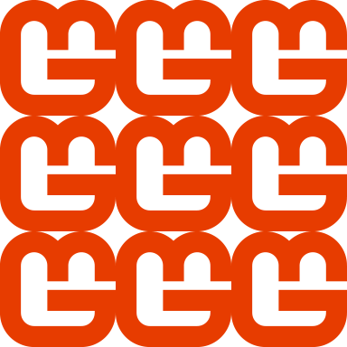

In previous chapters, we've drawn individual sprites and textures with the sprite batch, but for creating repeating background patterns, we need a more efficient approach than manually drawing the same texture multiple times. We could reuse the tilemap system that was created to make repeated background patterns, but this has a limitation in that the tiles are stationary and would require constantly updating the tiles and positions if we wanted to animate it.  Instead, this chapter introduces texture sampling states, specifically focusing on how to create and animate tiled backgrounds using [**SamplerState.PointWrap**](xref:Microsoft.Xna.Framework.Graphics.SamplerState.PointWrap).

In this chapter, you will:

- Learn about texture sampling and sampler states in MonoGame.
- Understand how wrap mode allows efficient texture tiling.
- Implement a scrolling tiled background for the title screen.

## Understanding Texture Sampling

When a texture is drawn to the screen, MonoGame uses a process called "sampling" to determine which pixels from the texture should be displayed, especially when the texture is scaled, rotated, or only partially visible. The rules governing this process are defined by sampler states.

### Texture Coordinates

In graphics programming, textures are addressed using a normalized coordinate system ranging from 0.0 to 1.0, regardless of the texture's actual pixel dimensions:

- The top-left corner of a texture is (0.0, 0.0)
- The bottom-right corner is (1.0, 1.0)
- The center is (0.5, 0.5)

This normalized system means that regardless of whether your texture is 32×32 pixels or 2048×2048 pixels, the coordinates to access the entire texture always range from 0.0 to 1.0. The graphics hardware automatically converts these normalized coordinates to the actual pixel locations within the texture.

When you use SpriteBatch to draw a texture with a source rectangle specified in pixels, MonoGame internally converts those pixel coordinates to normalized texture coordinates before sending them to the GPU. Similarly, when you specify a destination rectangle, MonoGame determines how the normalized texture coordinates should map to screen coordinates.

### What is a SampleState

A SamplerState controls how textures are sampled during rendering. It determines several aspects of texture rendering:

- How textures are filtered when scaled (point/linear/anisotropic filtering).
- How texture coordinates outside the 0.0 to 1.0 range are handled (wrap/clamp/mirror).
- How mipmap levels are selected and blended.

In MonoGame, these sampler states are represented by the [**SamplerState**](xref:Microsoft.Xna.Framework.Graphics.SamplerState) class, which provides several predefined states for common scenarios.

### Filtering Modes

One aspect of sampler states if the filtering mode.  The filter mode used determines how pixels are interpolated when a texture is scaled.  There are three filtering modes available; Point, Linear, and Anisotropic.

#### Point Filtering Mode

Point mode uses what is called nearest neighbor sampling.  This means that when a texture is scaled, the closest pixel is selected resulting in a pixelated appearance when scaled up.  This is typically the ideal mode to use for pixel-art games when you want to preserve the exact pixel appearance of a scaled texture.

|  |
| :----------------------------------------------------------------------------------------------------------------------------------------------------------------------: |
|                **Figure 18-1: Illustration of using Point filtering mode. Left: MonoGame logo at 32x32 pixels.  Right: MonoGame logo at 128x128 pixels**                 |

#### Linear Filtering Mode

Linear filtering mode blends neighboring pixels when the texture is scaled.  This creates a smoother, but potentially blurrier appearance.  This is better for realistic or high-resolution textures.

|  |
| :------------------------------------------------------------------------------------------------------------------------------------------------------------------------: |
|                 **Figure 18-2: Illustration of using Linear filtering mode. Left: MonoGame logo at 32x32 pixels.  Right: MonoGame logo at 128x128 pixels**                 |

#### Anisotropic Filtering Mode

Anisotropic filtering mode provides higher-quality filter for textures viewed from oblique angles.  This is primarily used in 3D rendering.  It helps textures look more detailed by reducing blur and aliasing that occurs when a surface is angled away from the viewer. 

|  |
| :-------------------------------------------------------------------------------------------------------------------------------------------------------------------------: |
|                   **Figure 18-2: Illustration of using Anisotropic filtering mode. Left: Sphere using Point filtering  Right: Sphere using Anisotropic**                    |

### Addressing Modes

The other aspect is the addressing mode, which determines what happens when texture coordinates fall outside the normal 0.0 to 1.0 range.  There are four addressing modes available; Wrap, Mirror, Clamp, and Border Color:

#### Wrap Mode

When using Wrap mode, at every whole integer of the texture coordinates (0.0 and 1.0), the texture coordinate is wrapped to stay within the 0.0 to 1.0 range (i.e. if the texture coordinate is 1.2, then that wraps to become 0.2). This creates a tiled pattern.  

For example, if we were to take the MonoGame logo at 128x128 pixels and draw it to a destination rectangle that was three times the size at 384x384 pixels, then the texture coordinates of the destination rectangle become (0.0, 0.0) (top-left), (3.0, 0.0) (top-right), (0.0) (bottom-left), and (3.0, 3.0) bottom-right.  The MonoGame logo texture would repeat three times horizontally and vertically within the destination.

|  |
| :-------------------------------------------------------------------------------------------------------------------: |
|                **Figure 18-1: Illustration of the MonoGame logo drawn using wrapped addressing mode**                 |

#### Mirror Mode

Mirror mode is similar to Wrap mode.  However instead of repeating the texture at every whole integer of the texture coordinates (0.0 and 1.0), the texture is flipped, creating a mirror effect.

Using the same example as above, taking the MonoGame logo at 128x128 pixels and drawing it to a destination rectangle three times the size with Mirror mode would produce the following:

|  |
| :--------------------------------------------------------------------------------------------------------------------: |
|                 **Figure 18-2: Illustration of the MonoGame logo drawn using mirror addressing mode**                  |

#### Clamp Mode

When using Clamp mode, the texture coordinates are clamped to the 0.0 and 1.0 range.  Texture coordinates that would go beyond this (edge pixels) are smeared.

The simplest demonstration of this is to use a checkerboard pattern.  If we were to take a texture that was a checkerboard pattern at 128x128 pixels and draw it to a destination rectangle three times the size with Clamped mode, then any pixels that extend outside the clamped range would smeared, producing the following:

|  |
| :---------------------------------------------------------------------------------------------------------------------------: |
|                  **Figure 18-3: Illustration of a checkerboard pattern drawn using clamped addressing mode**                  |

#### Border Color

When using Border Color mode, similar to Clamped mode, the texture coordinates are clamped to the 0.0 and 1.0f range. However, in Border Color mode, texture coordinates that would go beyond this (edge pixels) are instead drawn using the color set as the border color for the sampler state.

For example, if we use the checkerboard pattern again, using Border Color mode with a border color of red, then it would produce the following:

|  |
| :------------------------------------------------------------------------------------------------------------------------------------------------------------: |
|                 **Figure 18-4: Illustration of a checkerboard pattern drawn using border addressing mode with the border color set to green**                  |
