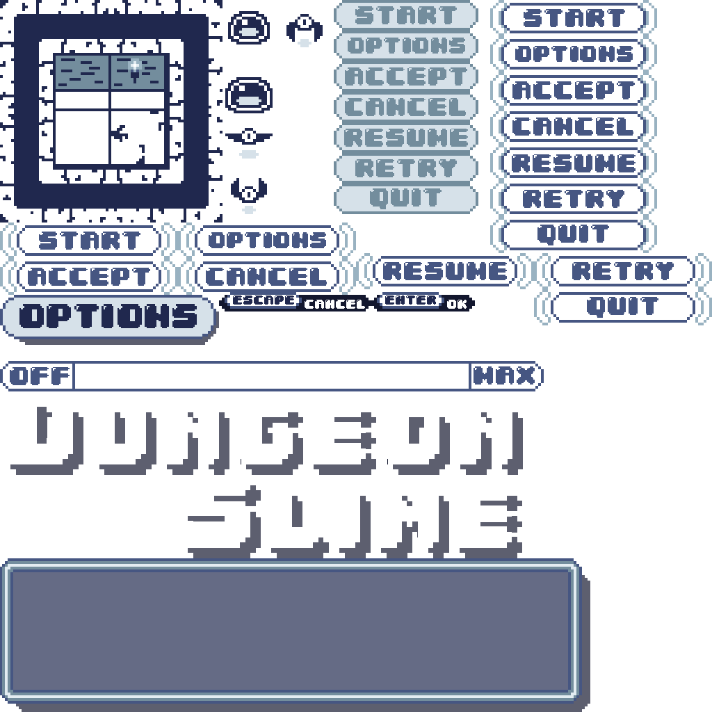

A critical component of any game is the user interface (UI) that allows players to interact with the game beyond just controlling the the character.  UI elements include menus, buttons, panels, labels, and various other interactive components that provide information and control options to the player.

In this chapter you will

- Learn the basics of user interface design in games.
- Understand the parent-child relationship for UI elements.
- Create reusable UI components for the MonoGameLibrary.
- Implement a device-agnostic input system for UI navigation.
- Build complete game menus including title, options, and pause screens.
- Implement a UI component hierarchy for flexible layouts.
- Learn about accessibility considerations in game UI development.

Let's start by understanding what a user interface is and how it functions in game development.

## Understanding Game User Interfaces

A user interface in games serves as the bridge between the player and the game's systems.  Well designed UIs help players navigate the games's mechanics, understand their current status, and make informed decisions. For new game developers, understanding UI principles is crucial because even the most mechanically sound game can fail if players can't effectively interact with it.

Game UIs consist of various visual elements that serve different purposes:

1. **Information Display**: Elements like health bars, score counters, or minimap displays provide players with game state information.  These elements help players understand their progress, resources, and current status without interrupting gameplay.
2. **Interactive Controls**: Buttons, sliders, checkboxes, and other interactive elements allow players to make choices, adjust settings, or navigate through different sections of the game.  These elements should provide clear visual feedback when interacted with to confirm the player's actions.
3. **Feedback Mechanisms**: Visual effects like highlighting, color changes, or animations that respond to player actions help confirm that input was received.  This feedback loop creates an intuitive and responsive feel for the UI in your game.

User interfaces for games can be categorized into two main types, each with its own design considerations

- **Diegetic UI**: These elements exist within the game world itself and are often part of the narrative.  Examples include a health meter integrated into a character's suit, ammunition displayed on a weapon's holographic sight, or the dashboard instruments in the cockpit of a racing game.  A Diegetic UI can enhance immersion by making interface elements feel like natural parts of the game world.
- **Non-diegetic UI**: These elements exist outside the game world, overlaid on top of the gameplay.  Traditional menus, health bars in the corner of the screen, and score displays are common examples.  While less immersive than a diegetic UI, non-diegetic elements are often clearer and easier to read.

For our game project, we'll focus on creating non-diegetic UI elements, specifically menu screens that allow players to navigate between different parts of the game and adjust settings.  This approach provides a solid foundation for understanding UI concepts that you can later expand upon in more complex games.

### UI Layout Systems

When designing and implementing game UI systems, developers must decide how UI elements will be positioned on the screen. Two primary approaches exist, each with distinct advantages and trade-offs;

1. **Absolute Positioning**:  In this approach, each UI element is placed at specific coordinates on the screen.  Elements are positioned using exact locations, which gives precise control over the layout.  This approach is straightforward to implement and works well for static layouts where elements don't need to adjust based on screen size or content changes.  The main disadvantage of absolute positioning is its lack of flexibility.  If the screen resolution changes or if an element's size changes, manual adjustments to positions are often necessary to maintain the desired layout.

2. **Layout engines**: These system position UI elements relative to one another using rules and constraints.  Elements might be positioned using concepts like "center", "align to parent", or "flow horizontally with spacing".  Layout engines add complexity but provide flexibility.  The advantage of layout engines is adaptability to different screen sizes and content changes.  However, they require more initial setup and can be more complex to implement from scratch.

For our implementation we'll take a middle ground approach.  We'll primarily use absolute positioning for simplicity but will build a parent-child relationship system that provides some of the flexibility found in layout engines.  This hybrid approach gives us reasonable control without adding a lot of complexity.

Child elements will be positioned relative to their parent's position, forming a hierarchial structure.  When a parent element moves, all its children move with it, maintaining their relative positions.  This approach simplifies the management of grouped elements without requiring a full layout engine.

### Parent-Child Relationships

Parent-child relationships are part of many UI system, including the one we'll build in this chapter.  In this model, UI elements can contain other UI elements, creating a tree-like structure. This hierarchial approach mirrors how interface elements naturally group together in designs.

For example, a settings panel might contain multiple buttons, labels, and sliders.  By making these elements children of the panel, they can be managed as a cohesive unit.  This organizational structure provides several significant advantages:

- **Inheritance of Properties**: Child elements can automatically inherit certain properties from their parents.  For instance, if a parent element is hidden or disabled, all its children can be hidden or disabled as well. This cascading behavior simplifies state management across complex interfaces.
- **Relative Positioning**: Child elements can be positioned relative to their parents rather than relative to the screen.  This means you can place elements within a contain and then move the entire container as a unit without having to update ach child's position individually.
- **Simplified State Management**:  Actions on parent elements can automatically propagate to their children.  For example, disabling a menu panel can automatically disable all buttons within it, preventing interaction with elements that should be active.
- **Batch Operations**: Operations like drawing and updating can be performed on a parent element and automatically cascade to all children, reducing the need for repetitive code.
- **Logical Grouping**: The hierarchy naturally models the conceptual grouping of UI elements, making the code structure more intuitive and easier to maintain.

## Creating a UI System

With an understanding of the core concepts behind game user interfaces, let's build our own UI system for MonoGame.  We'll implement a set of reusable classes that can be extended and combined to create various UI elements for our game.

Our UI system will consist of the following key components:

1. `UIElement`: The base class that handles the parent-child relationship, positioning, visibility, and enabled states.
2. `UISprite`: Extends the `UIElement` to include visual representation using our existing `Sprite` class.
3. `UIButton`: Extends `UIElement` to provide interactive buttons with different visual states for normal and selected.
4. `UISlider`: Extends `UIElement` to implement adjustable controls for values like volume.
5. `IUIElementController`: An interface for handling UI navigation through different input devices.

This hierarchical design allows each class to focus on a specific aspect of UI functionality while building on the capabilities of its parent class.

### The UIElement Class

In this section, we'll create the `UIElement` class, which will be the foundation of our UI system.  This class will handle the core functionality that all UI components need, including:

- **Parent-Child Relationships**: UI elements can be nested, allowing for logical grouping and relative positioning.
- **Positioning**: Elements track their relative and absolute positions, enabling flexibility in layout design.
- **Visibility and Interaction States**: Elements can be enabled, disabled, shown, or hidden, with state inheritance from parent elements.
- **Navigation Handling**: Actions for directional input (up, down, left, right) and menu commands (confirm, cancel) allow for structured UI navigation.

#### Creating the `UIElement.cs` File

First, in the *MonoGameLibrary* project, create a new directory named *UI*, then create a new class file named *UIElement.cs* inside that directory.  We'll use this *UI* directory to keep our UI-related classes organized.

Open the the *UIElement.cs* class file you just created and and add the following code:

[!code-csharp[](./snippets/uielement.cs)]

> [!NOTE]
> The `UIElement` class implements the [`IEnumerable<T>`](https://learn.microsoft.com/en-us/dotnet/api/system.collections.generic.ienumerable-1?view=net-9.0) interface.  Using this interface provides an enumerator for the `UIElement` class that we can use to iterate each of the child elements without directly exposing the internal collection.

#### Understanding the UIElement Class

Let's break down each part of the class so that it is clear how everything works.

##### Fields

The following fields store the internal state of the UI element

[!code-csharp[](./snippets/uielement.cs?start=15&end=21)]

- `_isEnabled` determines whether the element should be updated.
- `_isVisible` determines whether the element should be drawn to the screen.
- `_isSelected` tracks whether the element is currently selected.
- `_wasSelectedThisFrame` tracks whether the element was just selected during the current update frame.  This is to help with input debouncing.
- `_enabledColor` is the color tint that should be applied when the element is drawn while it is enabled.
- `_disabledColor` is the color tint that should be applied when the element is drawn while it is disabled.

##### Properties

The first property is the `Parent` property.  This stores a reference to the parent UI element, if there is one.

[!code-csharp[](./snippets/uielement.cs?start=23&end=26)]

Next are the positioning properties

[!code-csharp[](./snippets/uielement.cs?start=28&end=48)]

- `Position` is the local position of the UI element relative to its parent.  If it has no parent, then this is the position relative to the screen.
- `AbsolutePosition` calculates the absolute position of the UI element to be drawn at by adding the absolute position of the parent element to the relative position of the element.

Following these are the state tracking properties:

[!code-csharp[](./snippets/uielement.cs?start=50&end=98)]

- `IsEnabled` first checks to see if the element has a parent element.  If it does, and that parent element is disabled, then the element is automatically considered disabled.  Otherwise, it just returns back the internal `_isEnabled` state of the element.
- `IsVisible` performs the same check that `IsEnabled` does to determine if the element is visible.
- `IsSelected` simply returns the internal `_isSelected` state of the element, however when setting the value, the `_wasSelectedThisFrame` field is flipped to true.

Up next are the color properties:

[!code-csharp[](./snippets/uielement.cs?start=100&end=134)]

- `EnabledColor` first checks to see if the element has a parent element.  If it does, it returns back the enabled color of the parent element in order to maintain visual consistency with grouped elements.  If it does not, then the elements internal `_enabledColor` is returned.
- `DisabledColor` performs the the same check that `EnabledColor` does for the disabled color of the element.

Finally there is the navigation properties:

[!code-csharp[](./snippets/uielement.cs?start=136&end=169)]

- `Controller` stores a reference to the `IUIElementController` instance that is used to determine when actions are performed on this element such as navigating up, down, left, or right, or performing a confirm or cancel action.  By using this interface, which we'll create in a moment, it allows us to create an device agnostic method of navigation for UI elements.
- `UpAction`, `DownAction`, `LeftAction`, `RightAction`, `ConfirmAction`, and `CancelAction` actions that are invoked when the element is selected and the controller detects that one of those actions has occurred.  We can use these to provide navigational logic to the elements when they are created.

##### Constructor

The constructor simply creates a new instance of the UI element and sets the defaults for the properties

[!code-csharp[](./snippets/uielement.cs?start=171&end=181)]

##### Methods

First is the `CreateChild<T>` method method:

[!code-csharp[](./snippets/uielement.cs?start=183&end=194)]

This is a generic method where the type `T` has to be defined when it is called and has a constraint that the type of `T` must be a `UIElement` and also must contain a default parameterless constructor.  It then creates a new instance of that type, adds it to the child collection of the UI element, sets the parent of the child to the UI element, then returns the child created back so that further configurations can be done on it.

Next is the `Update` and `HandleNavigation` methods:

[!code-csharp[](./snippets/uielement.cs?start=196&end=251)]

The `Update` method:

1. First checks to see if the element is enabled.  If it is not, it short circuits the method and returns back early since a disabled element should not be updated.
2. Next, it determines if the element is selected, has a controller, and was not just selected on the current frame. If this is all true, then `HandleNavigation` is called.
3. Finally, it iterates through all child elements and calls `Update` on them.

The `HandleNavigation` method makes a check for each of the controller navigation methods, and if they are true, invokes the appropriate action.

After these is the `Draw` method:

[!code-csharp[](./snippets/uielement.cs?start=253&end=263)]

Similar to `Update`, the `Draw` method first makes a check to see if the element is visible. If it is not, it short circuits the method and returns back early since non-visible elements should not be drawn.  After this, it iterates through each of the child elements and calls `Draw` on them.

Finally, are the methods for implementing the `IEnumerable<T>` interface:

[!code-csharp[](./snippets/uielement.cs?start=265&end=274)]

These methods just return the enumerator for the internal list of children for the element.

### The IUIElementController Interface

Before we move on to creating implementations of the `UIElement` class, we need to create the `IUIElementController` interface that is used.  This interface provides a device agnostic method of creating navigational controls for the UI elements which we'll explore more in moment when we start implementing the UI in our game.  For now, in the *UI* directory of the *MonoGameLibrary* project, create a new file named *IUIElementController.cs* and add the following code:

[!code-csharp[](./snippets/iuielementcontroller.cs)]

The interface defines the following methods:

- `NavigateUp`:
- `NavigateDown`:
- `NavigateLeft`:
- `NavigateRight:`
- `Confirm`:
- `Cancel`:

For example, if we wanted to implement a controller that uses the arrow keys on the keyboard for directional navigation, the enter key for confirm, and the escape key for cancel, it would look something like the following:`

```cs
public class UIElementController : IUIElementController
{
    private KeyboardInfo _keyboard;

    public UIElementController() => _keyboard = Core.Input.Keyboard;

    public bool NavigateUp() => _keyboard.WasKeyJustPressed(Keys.Up);
    public bool NavigateDown() => _keyboard.WasKeyJustPressed(Keys.Down);
    public bool NavigateLeft() => _keyboard.WasKeyJustPressed(Keys.Left);
    public bool NavigateRight() => _keyboard.WasKeyJustPressed(Keys.Right);
    public bool Confirm() => _keyboard.WasKeyJustPressed(Keys.Enter);
    public bool Cancel() => _keyboard.WasKeyJustPressed(Keys.Escape);
}
```

> [!NOTE]
> This is just an example, we'll create a more complete implementation of this for our game later in this chapter.

### The UISprite Class

With the base `UIElement` class and the `IUIElementController` interface, we can start implementing types that extend the `UIElement` class to provide specific functionality.  In this section we'll create the `UISprite` class.  This class is a UI element that draw an image to the screen using the `Sprite` class we created earlier.  This can be used for various UI element such as labels, panels, and even text.

This can be used for various UI elements such as labels, panels, and even static text.

> [!TIP]
> For text that never changes in your UI (like menu titles or button labels), consider "baking" it into your texture atlas rather than rendering it with the [**SpriteBatch**](xref:Microsoft.Xna.Framework.Graphics.SpriteBatch) and a [**SpriteFont**](xref:Microsoft.Xna.Framework.Graphics.SpriteFont). As we learned in [Chapter 16](../16_working_with_spritefonts/index.md#understanding-spritefonts), MonoGame converts fonts into texture atlases. When drawing text with a [**SpriteFont**](xref:Microsoft.Xna.Framework.Graphics.SpriteFont), the renderer must switch from your texture atlas to the font texture atlas, causing a texture swap as explained in [Chapter 07](../07_optimizing_texture_rendering/index.md#texture-swapping). Including static text directly in your texture atlas eliminates these swaps, improving rendering performance.
>
> Of course, this approach only works for fixed text. For dynamic content like scores or timer displays, you'll still need to use [**SpriteFont**](xref:Microsoft.Xna.Framework.Graphics.SpriteFont) for rendering.

The first one we'll create is the `UISprite` class. This class will be a UI element that draws an image to the screen using the `Sprite` class we created in [Chapter 08](../08_the_sprite_class/index.md#the-sprite-class).

#### Creating the `UISprite.cs` File

In the *UI* directory of the *MonoGameLibrary* project, create a new class file named *UISprite.cs*.  Open the *UISprite.cs* file you just created and add the following code:

[!code-csharp[](./snippets/uisprite.cs)]

#### Understanding the UISprite Class

Let's examine how this class works by breaking down its main components.

##### Properties

The `UISprite` class has a single property:

[!code-csharp[](./snippets/uisprite.cs?start=13&end=16)]

This property stores a reference to the `Sprite` that is drawn when this element is draw to visually represent it.

##### Methods

The `UISprite` class overrides both the `Update` and the `Draw` methods from the base `UIElement` class.

First, the `Update` method:

[!code-csharp[](./snippets/uisprite.cs?start=18&end=57)]

The `Update` method:

1. First checks if the element is enabled.  If not, it returns early without performing any updates.
2. Checks if the `Sprite` to draw is actually an `AnimatedSprite` instance, and if so, updates it.
3. Finally, it calls the base `Update` method to handle updating for navigation and updating any child elements.

Next, the `Draw` method:

1. First checks if the element is visible.  If not, it returns early without drawing anything.
2. If the element has a sprite assigned, it sets the sprite's `Color` property value based on whether the element is enabled or disabled.
3. It then draws the sprite at the elements `AbsolutePosition`.
4. Finally, it calls the base `Draw` method to draw any child elements.

### The UIButton Class

Next up is the `UIButton` class.  Unlike the `UISprite` class that has only one visual representation, the `UIButton` class maintains two different sprites:

1. One for when the button is in its normal, unselected state.
2. Another for when the button is selected (focused by the user).

This visual feedback helps players understand which button is currently selected in the menu navigation, creating a more intuitive user experience.

#### Creating the `UIButton.cs` File

In the *UI* directory of the *MonoGameLibrary* project, create a new class file named *UIButton.cs*. Open this file and add the following code:

[!code-csharp[](./snippets/uibutton.cs)]

#### Understanding the UIButton Class

Let's break down how this class works to better understand its functionality.

##### Properties

The `UIButton` class has two important properties:

[!code-csharp[](./snippets/uibutton.cs?start=13&end=21)]

- `NotSelectedSprite`: The sprite to display when the button is not selected (the button's default appearance).
- `SelectedSprite`: The sprite to display when the button is selected (the highlighted appearance when the button has focus).

##### Methods

The `UIButton` class overrides the `Update` and `Draw` methods from the base `UIElement` class.

First, let's look at the `Update` method:

[!code-csharp[](./snippets/uibutton.cs?start=23&end=67)]

The `Update` method handles both sprites:

1. It checks if the `NotSelectedSprite` is an `AnimatedSprite`, and if so, updates its animation.
2. Similarly, it checks if the `SelectedSprite` is an `AnimatedSprite`, and updates it as well.
3. Finally, it calls the base `Update` method to update any child elements.

This ensures that both sprites continue to animate when appropriate, regardless of which one is currently being displayed.

Next, let's examine the `Draw` method:

[!code-csharp[](./snippets/uibutton.cs?start=27&end=46)]

The `Draw` method:

1. First checks if the button is visible. If not, it returns early without drawing anything.
2. If the button is selected (has focus), it:
   - Sets the `SelectedSprite` color based on whether the button is enabled or disabled.
   - Draws the `SelectedSprite` at the button's absolute position.
3. If the button is not selected, it:
   - Sets the `NotSelectedSprite` color based on whether the button is enabled or disabled.
   - Draws the `NotSelectedSprite` at the button's absolute position.
4. Finally, it calls the base `Draw` method to draw any child elements.

The `UIButton` class is particularly useful for menu systems where players need to navigate between options. By leveraging the action properties from the `UIElement` base class (like `ConfirmAction`), buttons can react to player input in a consistent way across different input devices.

For example, a button might change the current scene when selected and confirmed:

```cs
UIButton startButton = menuElement.CreateChild<UIButton>();

// When this button is selected and the confirm action is triggered,
// change to the game scene
menu.ConfirmAction = () =>
{
    if (startButton.IsSelected)
    {
        Core.ChangeScene(new GameScene());
    }
};
```

### The UISlider Class

The next component in our UI system is the `UISlider` class. Unlike buttons that are either selected or not, sliders represent a continuous range of values that can be adjusted. These are perfect for volume controls, brightness settings, or any parameter that needs gradual adjustment.

#### Creating the `UISlider.cs` File

In the *UI* directory of the *MonoGameLibrary* project, create a new class file named *UISlider.cs*. Open this file and add the following code:

[!code-csharp[](./snippets/uislider.cs)]

#### Understanding the UISlider Class

Let's explore the key components of the `UISlider` class to understand how it works.

##### Properties

[!code-csharp[](./snippets/uislider.cs?start=14&end=48)]

- `SliderSprite`: The background sprite that represents the entire slider track.
- `FillSprite`: The sprite that shows how much of the value range is currently selected (the filled portion).
- `FillBounds`: A rectangle defining where within the slider the fill should appear.
- `MinValue`: The minimum value the slider can represent.
- `MaxValue`: The maximum value the slider can represent.
- `Value`: The current value selected on the slider.
- `Step`: How much the value changes with each adjustment.

##### Methods

The `UISlider` class includes methods for adjusting the value and keeping it within bounds:

[!code-csharp[](./snippets/uislider.cs?start=50&end=68)]

- `StepUp`: Increases the current value by the step amount and ensures it stays within bounds.
- `StepDown`: Decreases the current value by the step amount and ensures it stays within bounds.

Finally, the class overrides the `Draw` method:

[!code-csharp[](./snippets/uislider.cs?start=70&end=93)]

The `Draw` method:

1. Calculates the position where the fill sprite should be rendered (based on the slider's absolute position and the fill bounds).
2. Converts the current value, minimum, and maximum to float values to calculate the percentage of the slider that should be filled.
3. Scales the fill sprite horizontally based on this percentage, creating a visual representation of the current value.
4. Applies the appropriate color to both sprites based on whether the slider is enabled or disabled.
5. Draws both the fill sprite and the slider background sprite.
6. Calls the base `Draw` method to render any child elements.

This implementation creates a horizontal slider where the filled portion grows from left to right as the value increases, providing an intuitive visual representation of the selected value.

## Implementing a UI System In Our Game

Now that we have the foundation for our UI system with the base classes and components, let's implement them in our game to create menus.  We will create a UI controller that translates player input into UI navigation actions, then build menus for the title screen and gameplay screen.

### Creating a UI Controller

The first step in implementing the UI system is to create a controller that translates player input into navigation actions for the UI elements.  This controller will implement the `IUIElementController` interface defined earlier.

In the game project, create a new directory named *UI*, then create a new file named *UIElementController.cs* with the following code:

[!code-csharp[](./snippets/uielementcontroller.cs)]

This controller implementation bridges the gap between the input management system from [Chapter 11](../11_input_management/index.md#implementing-the-inputmanager-class) and the UI navigation system. It detects:

- Navigation in four direction (up, down, left, and right) using either arrow keys, WASD keys, or gamepad controls.
- Confirmation action (Enter key or gamepad A button).
- Cancellation action (Escape key or gamepad B button).

#### Updating the Texture Atlas

Before we can create the menus, we need visual assets for the UI elements, including buttons, panels, and labels.  Let's update the texture atlas asset for our game to include these.  Download the new texture atlas below by right-clicking the following image and saving it as *atlas.png* in the *Content/images* directory of the game project, overwriting the existing one.

|  |
| :-----------------------------------------------------------------------------------------------: |
| **Figure 19-1: The texture atlas for our game updated to include the graphical assets for the UI**  |

Since the texture atlas image has been updated, we also need to update the atlas configuration file.  Open the *atlas-definition.xml* configuration file and update it to the following:

[!code-xml[](./snippets/atlas-definition.xml?highlight=10-42)]

This change adds the regions for all of the UI elements and the animations for the buttons including:

- `*-button` regions to represent the default state of each button
- `*-button-selected-1` regions to represent the first frame of each button's animated sprite
- `*-button-selected-2` regions to represent the second frame of each button's animated sprite.
- `*-label` regions to represent the text labels to render
- `slider` region for the UI slider
- `title` region to represent the game title during the title scene.
- `panel` region to represent the image for the panels that group elements together.
- `white-pixel` region that represents a 1x1 white pixel from the texture atlas that we can use to fill the slider container with.
- `overlay-pixel` region that represents a 1x1 opaque blue pixel from the texture atlas we can use to overlay the game scene when the game is paused to visually represent the game is paused/disabled.

### Updating the Title Scene

The title scene is the player's first point of interaction with the game.  Currently it just displays the text to "Press Enter To Stat".  Let's update it to instead include a main menu with "Start" and "Options" buttons, and an options menu for adjusting game settings. Open the *TitleScene.cs* file in the game project and update it to the following:

[!code-csharp[](./snippets/titlescene.cs?highlight=27-39,45-49,67-77,80-174,176-479,507-510)]

The key changes made here are:

- The fields associated with the "Press enter to start" text have been removed and replaced with proper UI elements.
- New fields `_titleMenu` and `_optionsMenu` were added to serve as root `UIElement` containers for each menu.
- Fields `_previousSongVolume` and `_previousSoundEffectVolume` were added to track audio settings, allowing players to cancel changes.
- In `Initialize`, `Core.ExistOnEscape` is explicitly set to `false` so that the Escape key can be integrated with the UI navigation.
- The `LoadContent` method now 
  - Loads the assets used for the UI such as the UI sound effect.
  - Calls the `CreateTitleMenu` and `CreateOptionsMenu` methods to create the menus.
- The `CreateTitleMenu` and `CreateOptionsMenu` methods were added which construct the title and options menu UI elements.
- The `Update` method: 
  - No longer checks for the Enter key to switch to the game scene, as this is no handled by the UI system, specifically the `_titleMenu`.
  - Calls `Update` for both the title and options menu.  We don't need to check the enabled stated here before updating since a `UIElement` will not run its update method if its already disabled.
- The `Draw` method draws both UI elements, though one will always be set as not visible so we don't have both drawing at the same time overlapping each other visually.

Running the game now, the title scene loads and presents the user with two buttons to navigate through, "Start" and "Options".  The button that is currently selected will animate using its animated sprite to provide visual feedback to the player.  When pressing left or right to navigate between the two, the UI sound effect is played to give auditory feedback to the player.  Selecting the "Options" button and pressing the Enter key on the keyboard will hide the title menu and show the options menu where players can adjust the volume levels of the music and sound effects.

|  |
| :-----------------------------------------------------------------------------------------------: |
| **Figure 19-2: The title scene now with the title menu buttons and the options menu for adjusting music and sound effect volume**  |

### Building UI Hierarchies

Let's examine how the title scene UI is constructed through a breakdown of the `CreateOptionsMenu` method.  This approach illustrates how a complete UI menu is built with a parent-child relationship hierarchy.

#### Step 1. Creating the Root Container

First, we create a root element to serve as the main container for all elements of that menu.

[!code-csharp[](./snippets/titlescene.cs?start=178&end=182)]

This root element:

- Holds a reference to the UI controller for navigation
- Is initially disabled and invisible (since it's the options menu it only appears when the player selects "Options").
- Services as the parent for all other elements in this menu.

#### Step 2. Adding Primary UI Elements

Next, we create the main visual elements of the menu as children of the root container:

[!code-csharp[](./snippets/titlescene.cs?start=184&end=225)]

This establishes:

- Labels for the options screen and navigation hints.
- Panels that will contain the volume controls for music and sound effects.
- Buttons for accepting or cancelling changes.
- Initial select state (music panel is selected first).

each of these elements is positioned relative to the root container using absolute coordinates, but benefits from the parent-child relationship for visibility and enabled state inheritance.

#### Step 3. Building Nested Controls

For complex elements like panels that contain their own controls, we create child elements of those panels:

[!code-csharp[](./snippets/titlescene.cs?start=227&end=257)]

This creates:

- Text labels inside each panel.
- Volume sliders with appropriate min/max values and initial values that are set to the current audio volume settings.

The nested structure demonstrates an advantage of our UI system: elements added as children of the music panel are automatically positioned relative to that panel, making the layout simpler and more maintainable.

#### Step 4. Setting Shared Visual Properties

With the UI structure established, we set shared visual properties that apply to the entire hierarchy:

[!code-csharp[](./snippets/titlescene.cs?start=259&end=261)]

This demonstrates a key another advantage of the parent-child relationship: properties like `DisabledColor` can be set once at the parent level and automatically cascade to all children.

#### Step 5. Implementing Navigation Logic

Finally, we wire up the navigation logic through the action handlers:

[!code-csharp[](./snippets/titlescene.cs?start=263&end=478)]

For each potential navigation direction (up, down, left, right) and action (confirm, cancel) we:

1. Provide auditory feedback to the player by playing the UI sound effect.
2. Determine which element is currently selected.
3. Update selections states to move between elements.
4. Perform actions like adjusting volume or transitioning between menus.

This creates a complete navigation flow where the player can

- Move between different UI elements.
- Adjust settings with immediate audible and visual feedback.
- Accept changes or cancel changes and go back to the previous menu.

#### UI Flow and State Management

An important aspect of this menu system is how it manages the state transitions between menus.  When the player selects the "Options" button in the title menu and confirms:

1. The title menu is disabled and hidden.
2. The current audio volume settings are saved.
3. Selection states are reset for when the player returns back to the title menu.
4. The options menu is enabled and becomes visible and selected.

Similarly, when accepting or canceling from the options menu:

1. The options menu is disabled and hidden.
2. If canceled, the previous audio settings are restored.
3. Default selection states are reset in case the player returns back to the options menu.
4. The title menu is re-enabled and becomes visible again.

This state management creates a smooth flow between different UI screens without having to create entirely new scenes for each menu.

### Updating the Game Scene

The game scene as it is right now is lacking two important UI elements for players; a pause menu and a game over menu.  Let's add these in now.  Open the *GameScene.cs* file and update it to the following

[!code-csharp[](./snippets/gamescene.cs?highlight=17-18,123-133,136-331,333-341,343-454,478,538-541,622-623)]

The key changes made here are:

- New fields `_pauseMenu` and `gameOverMenu` were added to serve as root `UIElement` containers for each menu.
- The `LoadContent` method now loads the UI assets and creates the necessary menus.
- The `Update` method updates both the pause and game over panels.  Internally, if these panels are disabled, no actual update happens to them so we don't need to check for the `IsEnabled` state explicitly.  However, we do perform a check to see if either menu is enabled before updating the game.  We do not want the actual game updating if either the pause or game over menu is enabled.
- The game update code was moved to its own function called `UpdateGame`.
- When keyboard input is checked, if the Escape key is pressed, the game will now enable the pause menu instead of exiting back to the title scene.  The same was updated for gamepad input when the Start button is pressed.
- In `Draw` both the pause menu and the game over menu are drawn.  Same as with update, we do not need to explicitly check if they are visible first, as internally they will not draw if not visible.

Running the game now, when selecting the "Start" button on the title scene and pressing the Enter key, the game starts as expected.  Now, if you press the Escape key on the keyboard, instead of exiting back to the title scene as before, the pause menu will be shown.  From here, players can choose to either resume gameplay or quit back to the title menu.

|  |
| :-----------------------------------------------------------------------------------------------: |
| **Figure 19-3: The game scene now with a pause menu when the user presses the Escape key where they can resume gameplay from or quit back to the title scene**  |

> [!NOTE]
> While we did implement a game over menu, currently our game has no game over condition, so it won't be shown.  We'll implement the rest of the game in the next chapter, including a game over condition, where the game over menu will then be shown.

## Accessibility in Game UI

Creating accessible user interfaces is an essential aspect of inclusive game design.  Accessibility ensures that your game can be played by a broader audience, including players with visual acuity or other specific needs.  When designing your UI system, consider some of these key accessibility principles:

### Visual Accessibility

- **Color contrast**: Ensure sufficient contrast between text and backgrounds
- **Use shapes**: Don't rely solely on color to convey important information; add shapes, patterns, or text labels as well.  For example, if displaying warning text, also use something such as the common warning sign ⚠️.
- **Text size and scaling**: Allow players to adjust text size or implement a UI scaling option.  In MonoGame, this can be achieved by applying scaling factors to your UI elements or by having multiple font sizes available.
- **Internationalization (i18n)**: Consider how your UI might be interpreted across different cultures and regions. Number formatting can vary significantly - some regions use periods for thousands separators (1.000.000) while others use commas (1,000,000). Control symbolism also differs culturally; for example, on console controllers, the Cross button typically means "Select" in Western regions but "Cancel" in Japan, with Circle having the opposite meaning.

### Input Accessibility

- **Input redundancy**: Support multiple input methods for the same action. Our `IUIElementController` interface already provides a foundation for this by abstracting input detection.

- **Reduce input precision requirements**: While our UI system does not use mouse input, when creating oen that does, implement generous hitboxes for clickable UI elements to help players with motor control difficulties.

### Implementation in Our UI System

Our current UI system already has a foundation that can be expanded to support more accessibility features such as scaling the UI elements:

```cs
// Example of adding an accessible ui element that has a scale factor.
public class AccessibleUIElement : UIElement
{
    
    public float ScaleFactor {get; set;}

    public float AbsoluteScaleFactor
    {
        get
        {
            if (Parent is UIElement parent)
            {
                return parent.AbsoluteScaleFactor * ScaleFactor;
            }

            return ScaleFactor;
        }
    }
}
```

### Testing for Accessibility

The most effect way to ensure accessibility is through testing under different circumstances and with diverse users:

- Test your Ui using only keyboard navigation.
- Try playing without sound.
- Check your UI with a color blindness simulator.
- Adjust the display scale to simulate low vision.
- Get feedback from player with different abilities.

By considering accessibility early in development rather than as an afterthought, you create games that can be enjoyed by more players while also often improving the experience for everyone.

## Conclusion

In this chapter, you accomplished the following:

- Created a flexible `UIElement` base class that establishes a parent-child hierarchy for organizing UI components.
- Implemented specialized UI components including sprites, buttons, and sliders.
- Developed an input-agnostic control system through the `IUIElementController` interface.
- Built interactive menus for our game; a title menu with options screen and a pause menu.
- Applied navigation logic to create a complete keyboard/gamepad friendly interface.
- Discussed accessibility considerations for inclusive game design.

In the next chapter, we'll complete our game by polishing the gameplay experience and implementing win and loss conditions.

## Test Your Knowledge

1. What are the some advantages of using a parent-child relationship in UI systems?

   :::question-answer
   - Inheritance of properties: visual states cascade parent to children.
   - Relative positioning: Child elements are positioned relative to their parents.
   - Simplified state management: Parent states affect children automatically.
   - Batch operations: Update and draw calls propagate through the hierarchy.
   - Logical grouping: Mirrors the conceptual organization of UI elements.
   :::

2. In the UI system we implemented, how does a `UIElement` determine if it should be enabled or visible?

    :::question-answer
    The `UIElement` class first checks if it has a parent element.  If it does and that parent element is disabled or invisible, then the child element is automatically considered disabled or invisible, regardless of its own internal state.  Otherwise, it returns its own internal enabled or visible state.  This creates a cascade effect where disabling or hiding a parent automatically disables or hides its children.
    :::

3. In the UI system we implemented, what is the purposed of the `IUIElementController` interface?

    :::question-answer
    The `IUIElementController` interface provides a device agnostic method for handling UI navigation.  It abstracts input detection (keyboard, gamepad, touch, etc) into a consistent set of navigation and action methods.  This allows UI elements to respond to user input without being tied to specific input devices, making it a more flexible and maintainable system.
    :::

4. What are some accessibility considerations that should be implemented in game UI systems?

    :::question-answer
    - Visual accessibility: High contrast colors, not relying solely on color for information, adjustable text size and UI scaling, and internationalization support.
    - Input accessibility: Support for multiple input methods and reduced precision requirements.
    - Testing practices: Ensure the UI works with keyboard only navigation, without sound, and with simulated visual impairments.  

    Implementing these considerations makes games playable by a wider audience and often improves the experience for all players.
    :::
