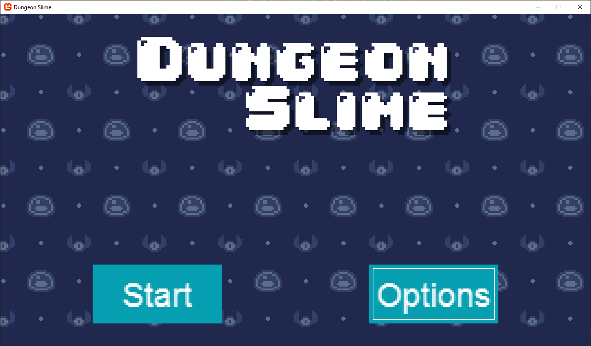

A game's user interface (UI) allows players to interact with the game beyond just controlling the character.  UI elements include menus, buttons, panels, labels, and various other interactive components that provide information and control options to the player.

In this chapter you will

- Learn the basics of user interface design in games.
- Understand the parent-child relationship for UI elements.
- Install and configure Gum, a specialized UI library.
- Learn how to work with *form* controls like buttons and sliders.
- Customize forms control appearance by modifying the Visual property
- Write code to handle input from keyboard, mouse, and gamepads.
- Integrate the UI system with our existing game architecture.

> [!IMPORTANT]
> This tutorial uses the Gum NuGet package to help with layout and responding to user interactions.  This tutorial does not require the use of the Gum tool - we'll be doing everything in code.
>
> Keep in mind that while it is possible to build a full UI system without any external dependencies, creating a layout engine is complicated and beyond the scope of this tutorial series.  Instead, we'll be taking advantage of the Gum NuGet package.
>
> Gum is a powerful system enabling the creation of virtually any game UI.  We will be covering some of the basics in this tutorial.  The full Gum documentation can be found here: [https://docs.flatredball.com/gum/code/monogame](https://docs.flatredball.com/gum/code/monogame)

Let's start by understanding what a user interface is and how it functions in game development.

## Understanding Game User Interfaces

A user interface serves as the bridge between the player and the game's systems.  Well designed UIs help players navigate the games's mechanics, understand their current status, and make informed decisions. For new game developers, understanding UI principles is crucial because even the most mechanically sound game can fail if players can't effectively interact with it.

Game UIs consist of various visual elements that serve different purposes:

1. **Information Display**: Elements like health bars, score counters, or minimap displays provide players with game state information.  These elements help players understand their progress, resources, and current status without interrupting gameplay.
2. **Interactive Controls**: Buttons, sliders, checkboxes, and other interactive elements allow players to make choices, adjust settings, or navigate through different sections of the game.  These elements should provide clear visual feedback when interacted with to confirm the player's actions.

   > [!NOTE]
   > Gum refers to these as *forms* controls.

3. **Feedback Mechanisms**: Visual effects like highlighting, color changes, or animations that respond to player actions help confirm that input was received.  This feedback loop creates an intuitive and responsive feel for the UI in your game.

User interfaces for games can be categorized into two main types, each with their own design considerations:

- **Diegetic UI**: These elements exist within the game world itself and are often part of the narrative.  Examples include a health meter integrated into a character's suit, ammunition displayed on a weapon's holographic sight, or the dashboard instruments in the cockpit of a racing game.  A Diegetic UI can enhance immersion by making interface elements feel like natural parts of the game world.
- **Non-diegetic UI**: These elements exist outside the game world, overlaid on top of the gameplay.  Traditional menus, health bars in the corner of the screen, and score displays are common examples.  While less immersive than a diegetic UI, non-diegetic elements are often clearer and easier to read.

We will focus on creating non-diegetic UI elements for our game project, specifically menu screens that allow players to navigate between different parts of the game and adjust volume.  This approach provides a solid foundation for understanding UI concepts that you can later expand upon in more complex games.

### UI Layout Systems

When designing and implementing game UI systems, developers must decide how UI elements will be positioned on the screen. Two primary approaches exist, each with distinct advantages and trade-offs;

1. **Absolute Positioning**:  In this approach, each UI element is placed at specific coordinates on the screen.  Elements are positioned using exact locations, which gives precise control over the layout.  This approach is straightforward to implement and works well for static layouts where elements don't need to adjust based on screen size or content changes.  The main disadvantage of absolute positioning is its lack of flexibility, as iterating on design can be more difficult since one change may have cascading effects on other elements.  If the screen resolution changes or if an element's size changes, manual adjustments to positions are often necessary to maintain the desired layout.

2. **Layout engines**: These system position UI elements relative to one another using rules and constraints.  Elements might be positioned using concepts like "center", "align to parent", or "flow horizontally with spacing".  Layout engines add complexity but provide flexibility.  The advantage of layout engines is adaptability to different screen sizes and content changes.  However, they require more initial setup and can be more complex to implement from scratch.

For our implementation we'll use the Gum layout engine to simplify our layout. Even though our game is built for a fixed resolution, using layouts that Gum provides can simplify initial layout. A full game will likely benefit from using a layout engine like Gum since it may need to consider different resolutions, aspect ratios, or other accessibility considerations.

### Parent-Child Relationships

Parent-child relationships are part of many UI system. This relationship is implemented with UI elements containing other UI elements, creating a tree-like structure. This hierarchial approach mirrors how interface elements naturally group together in designs.

For example, a settings panel might contain multiple buttons, labels, and sliders.  By making these elements children of the panel, they can be managed as a cohesive unit.  This organizational structure provides several significant advantages:

- **Inheritance of Properties**: Child elements can automatically inherit certain properties from their parents.  For instance, if a parent element is hidden or disabled, all its children can be hidden or disabled as well. This cascading behavior simplifies state management across complex interfaces.
- **Relative Positioning**: Child elements can be positioned relative to their parents rather than relative to the screen.  This means you can place elements within a contain and then move the entire container as a unit without having to update ach child's position individually.
- **Simplified State Management**:  Actions on parent elements can automatically propagate to their children.  For example, disabling a menu panel can automatically disable all buttons within it, preventing interaction with elements that should be active.
- **Batch Operations**: Operations like drawing and updating can be performed on a parent element and automatically cascade to all children, reducing the need for repetitive code.
- **Logical Grouping**: The hierarchy naturally models the conceptual grouping of UI elements, making the code structure more intuitive and easier to maintain.

## Gum Concepts

Now that we understand these fundamental UI principles, we will explore Gum, a specialized UI framework that implements many of these concepts while adding other features of its own.  Gum simplifies UI development by providing ready-made controls and layout systems that would otherwise require significant effort to build from scratch. We will first cover the concepts specific to Gum at a high level, then dive into more detail during implementation.

### Forms and Visuals

Gum provides two types of objects: **Forms** and **Visuals**.  Forms controls are typical interactive UI elements such as buttons, sliders, and text boxes that handle user interaction through mouse, gamepad, and keyboard inputs.  These controls come with built-in functionality; a button responds visually when focused, while a slider changes its value when clicked on its *track*.  By using these standardized components, you can maintain consistency throughout your UI implementation.

All Forms controls provide customization through their `Visual` property, which serves as a gateway to modifying their appearance and layout. With this property, you can move, resize, restyle, and even completely replace visuals through code.  As we'll see when building our UI, this separation between functionality and presentation allows us to create consistent behaviors while adapting the visual style to match our game's aesthetic.

Each Forms control contains one or more visual items. For example, a simple `Button` might contain a text instance (of type `TextRuntime`) and a background (of type `ColoredRectangleRuntime`). More complex Forms controls may contain many more visual objects, as we will see later when we create our own custom `Slider`.

Initially we weill work with unstyled controls first, then do a customization pass so that our controls match our game's visual style.

This tutorial uses the following Forms control types:

- `Button`:  An interactive control that responds to clicks and provides visual feedback when focused.
- `Slider`:  An interactive control that allows players to select a numeric value within a defined range by dragging the thumb element.
- `Panel`: A container element that organizes and groups related controls together, helping to structure the UI layout.

This tutorial also uses the following Visual types:

- `ContainerRuntime`: An invisible container that can hold other visual elements or forms, providing structural organization without a visual presence.
- `NineSliceRuntime`: A special visual element divided into nine sections that can stretch while maintaining the integrity of its corners and edges; ideal for frames and backgrounds.
- `TextRuntime`: A visual element that renders text strings with configurable properties like font, size, and color.
- `ColoredRectangleRuntime`: A simple rectangular visual element with a solid color fill, commonly used for backgrounds.

### Property Changes vs States

Gum allows you to customize visuals in two ways: through direct property assignment and through states.  For simple property changes, you can directly assign values in code. For example, the following code example changes the width of a button.

```cs
MyButton.Visual.Width = 100;
```

Direct property assignment works well for initial setup, such as positioning elements or setting their dimensions when first creating your UI.  However, when you need visual elements to respond to user interactions (like highlighting a button when it is focused), a different approach is required.

For these dynamic changes, Gum uses a system of **states** (implemented as `StateSave` objects).  Each Forms control maintains a collection of named states that are automatically applied in response to specific user actions.  When a button becomes focused, for instance, Gum looks for and applies a state named "Focused" to alter its appearance.

> [!TIP]
> This state-based approach separates the visual response logic from the game's core logic.  Later in this chapter during the customization pass, we'll create states to visually indicate when controls are focused, providing clear feedback to the player.

### Anchors and Docks

Gum provides a flexible layout system that simplifies positioning UI elements relative to each other.  While Gum offers many layout options, we will focus on the most common and useful approaches for our game.

By default, all elements in Gum are positioned based on their top-left corner, relative to their parent's top-left corner.  For example, if a parent panel has an X position of 5 and its child button has an X position of 12, the button's absolute screen position would be 17 (5 + 12).

#### Anchoring Elements

The `Anchor` function, accessed through the element's `Visual` property, allows you to position elements relative to any of nine reference points on their parent:

- TopLeft
- Top
- TopRight
- Left
- Center
- Right
- BottomLeft
- Bottom
- BottomRight

|  |
| :------------------------------------------------------------------------------: |
|           **Figure 19-1: Diagram showing the different anchor points**           |

When you set an anchor point, the element's position coordinates become relative to that anchor point.  For example, with a `Right` anchor and an X value of -5, your element would position itself 5 pixels to the left of the parent's right edge, creating a consistent margin regardless of the paren'ts size.

> [!NOTE]
> The `Anchor` function resets the X and Y values when called, so always set position coordinates *after* calling the `Anchor` function, not before.

#### Docking Elements

While anchoring sets a reference point, the `Dock` function, also accessed through the `Visual` property of the element, goes further by also adjusting an element's size to fill available space.  Docking provides the following options:

- Top: Anchors to top edge and fills horizontally.
- Left: Anchors to left edge and fills vertically.
- Right: Anchors to right edge and fills vertically.
- Bottom: Anchors to bottom edge and fills horizontally.
- Fill: Anchors to the center and fills the entire parent area vertically and horizontally.
- FillHorizontally: Stretches across parent's width, filling horizontally.
- FillVertically: Stretches across parent's height, filling vertically.
- SizeToChildren: Automatically sizes vertically and horizontally based on contained child elements.

|  |
| :--------------------------------------------------------------------: |
|          **Figure 19-2: Diagram showing the different docks**          |

> [!NOTE]
> Just like with the `Anchor` function, the `Dock` function resets the X and Y values when called, so always set position coordinates *after* calling and not before.

These layout functions simplify UI positioning, though you can still use direct property values when needed for more flexibility.  Throughout this chapter, we'll use both approaches where appropriate for different elements of our game's UI.

## Adding the Gum NuGet Package

Before we can use Gum in our project, we first need to add it using NuGet.  NuGet is a package manager for .NEt projects that allows you to add third-party libraries into your project, similar to how we [created and added our own class library](../04_creating_a_class_library/index.md).

To add the Gum NuGet package to our game project, follow the instructions below based on your development environment:

### [Visual Studio Code](#tab/vscode)

To add the Gum NuGet package in Visual Studio Code:

1. In the *Solution Explorer* panel, right-click the *DungeonSlime* project.
2. Choose *Add NuGet Package* from the context menu.
3. Enter "Gum.MonoGame" in the *Add NuGet Package* search prompt and press Enter.
4. When the search finishes, select the *Gum.MonoGame* package in the results
5. When prompted for a version, choose the latest version ("2024.1.25.1" as of this writing").

### [Visual Studio 2022](#tab/vs2022)

To Add the Gum NuGet package in Visual Studio 2022:

1. In the *Solution Explorer* panel, right-click the *DungeonSlime* project.
2. Choose *Manage Nuget Packages...* from the context menu.
3. In the NuGet Package Manager window, select the *Browse* tab if it is not already selected.
4. In the search box, enter "Gum.MonoGame".
5. Select the "Gum.MonoGame" package from the search results.
6. Ensure the latest version is selected in the dropdown menu ("2024.1.25.1" as of this writing") and click the *Install* button.

### [dotnet CLI](#tab/dotnetcli)

To add the Gum NuGet package using the dotnet CLI:

1. Open a Command Prompt or Terminal window in the same directory as the *DungeonSlime.csproj* project file.
2. Enter the following command:

    ```sh
    dotnet add DungeonSlime.csproj package Gum.MonoGame
    ```

This will install the latest version of the package, which is "2024.1.25.1" as of this writing.

---

> [!TIP]
> You can verify the package was successfully added by examining your *DungeonSlime.csproj* file, which should now contain a reference like:
>
> ```xml
> <PackageReference Include="Gum.MonoGame" Version="2025.4.19.1" />
> ```

## Initializing Gum

With the Gum NuGet package added to our project, we need to initialize Gum in our game.  This will enable the UI system and configure input handling for our controls.  Since this is an initialization that only needs to happen once, let's make the necessary changes to the `Game1` class.

First, open the *Game1.cs* file and add the following using statements to the top:

```cs
using MonoGameGum;
using MonoGameGum.Forms.Controls;
```

Next, update the [**Initialize**](xref:Microsoft.Xna.Framework.Game.Initialize) method to configure the Gum system:

[!code-csharp[](./snippets/game1_initialize.cs?highlight=8-37)]

Let's take a look at the key changes made to the [**Initialize**](xref:Microsoft.Xna.Framework.Game.Initialize) method:

- GumService.Default.Initialize - This line of code is used to initialize all Gum system. Any game using Gum needs to make this call. Since we're not using the editor, we only need to pass our Game instance. Games which load a Gum project also need to include the Gum project file.
- XnaContentManager - This line of code tells Gum which ContentManager to use when loading from the content pipeline. Gum supports both from-file and content pipeline loading, but we'll use the content pipeline on this project so we can access our already-loaded atlas texture.
- KeyboardsForUiControl and GamePadsForUiControl - These properties specify which input devices are used globally by our forms controls. All forms controls automatically respond to the mouse and touch screen so we only need to specify keyboard and gamepads to use.
- TabReverseKeyCombos and TabKeyCombos - These properties indicate which key combinations are used for tabbing. By default all controls respond to tab and shift-tab, but we can add additional key combinations for tabbing. These properties can also be cleared to remove default tabbing.
- Canvas size and zoom - Our game runs at a resolution of 1280x720, but Gum allows us to independently scale our UI. We'll scale our UI by 4x so that we can use smaller textures when we perform our styling later.

Gum is now fully initialized and we can use it in our scenes to add UI to our game.

## Adding TitleScene UI

With Gum added and initialized in our game, let's implement UI elements for our title scene.  We will create panels for both the main menu and options menu, implement the necessary event handlers, and integrate everything with our existing title scene.

First, open the *TitleScene.cs* file in the game project and add the following using declarations to the top of the `TitleScene` class:

```cs
using MonoGameGum;
using MonoGameGum.Forms;
using MonoGameGum.Forms.Controls;
using MonoGameGum.GueDeriving;
using MonoGameLibrary;
using MonoGameLibrary.Scenes;
using System;
```

Next, add the following fields:

```cs
private SoundEffect _uiSoundEffect;
private Panel _titleScreenButtonsPanel;
private Panel _optionsPanel;
private Button _optionsButton;
private Button _optionsBackButton;
```

### Creating the Title Panel

First, let's create a method that builds our main menu panel with start and options buttons.  Add the following method to the `TitleScene` class:

```cs
private void CreateTitlePanel()
{
    // Create a container to hold all of our buttons
    _titleScreenButtonsPanel = new Panel();
    _titleScreenButtonsPanel.Visual.Dock(Gum.Wireframe.Dock.Fill);
    _titleScreenButtonsPanel.AddToRoot();

    var startButton = new Button();
    startButton.Visual.Anchor(Gum.Wireframe.Anchor.BottomLeft);
    startButton.Visual.X = 50;
    startButton.Visual.Y = -12;
    startButton.Visual.Width = 70;
    startButton.Text = "Start";
    startButton.Click += HandleStartClicked;
    _titleScreenButtonsPanel.AddChild(startButton);

    _optionsButton = new Button();
    _optionsButton.Visual.Anchor(Gum.Wireframe.Anchor.BottomRight);
    _optionsButton.Visual.X = -50;
    _optionsButton.Visual.Y = -12;
    _optionsButton.Visual.Width = 70;
    _optionsButton.Text = "Options";
    _optionsButton.Click += HandleOptionsClicked;
    _titleScreenButtonsPanel.AddChild(_optionsButton);

    startButton.IsFocused = true;
}
```

Our title panel includes two buttons positioned at the bottom corners of the screen.  The "Start" button will allow players to begin the game while the "Options" button will hide the main menu and display the options menu.

> [!NOTE]
> Notice how we use `Anchor` to position the buttons relative to the panel's edges, with the "Start" button anchored at the bottom left and the "Options" button anchored at the bottom right.  Then the positioning of the elements is adjusted relative to its anchor point.

Each button registers a `Click` event handler to respond when the players selects it. Let's implement the vent handler method for these buttons next.  Add the following methods to the `TitleScene` class:

```cs
private void HandleStartClicked(object sender, EventArgs e)
{
    Core.ChangeScene(new GameScene());
}

private void HandleOptionsClicked(object sender, EventArgs e)
{
    _titleScreenButtonsPanel.IsVisible = false;
    
    _optionsPanel.IsVisible = true;
    _optionsBackButton.IsFocused = true;
}
```

These handlers are called when when the `Click` event is triggered for each button.  The handler for the "Start" button changes to the game scene, while the handler for the options button toggles the visibility between the main menu and the options panel.

### Creating the Options Panel

Next, we'll create the options panel with sliders to adjust the volume for music and sound effects.  Add the following method to the `TitleScene` class:

```cs
private void CreateOptionsPanel()
{
    _optionsPanel = new Panel();
    _optionsPanel.Visual.Dock(Gum.Wireframe.Dock.Fill);
    _optionsPanel.IsVisible = false;
    _optionsPanel.AddToRoot();

    var optionsText = new TextRuntime();
    optionsText.X = 10;
    optionsText.Y = 10;
    optionsText.Text = "OPTIONS";
    _optionsPanel.AddChild(optionsText);

    var musicSlider = new Slider();
    musicSlider.Visual.Anchor(Gum.Wireframe.Anchor.Top);
    musicSlider.Visual.Y = 30f;
    musicSlider.Minimum = 0;
    musicSlider.Maximum = 1;
    musicSlider.Value = Core.Audio.SongVolume;
    musicSlider.SmallChange = .1;
    musicSlider.LargeChange = .2;
    musicSlider.ValueChanged += HandleMusicSliderValueChanged;
    _optionsPanel.AddChild(musicSlider);

    var sfxSlider = new Slider();
    sfxSlider.Visual.Anchor(Gum.Wireframe.Anchor.Top);
    sfxSlider.Visual.Y = 93;
    sfxSlider.Minimum = 0;
    sfxSlider.Maximum = 1;
    sfxSlider.Value = Core.Audio.SoundEffectVolume;
    sfxSlider.SmallChange = .1;
    sfxSlider.LargeChange = .2;
    sfxSlider.ValueChanged += HandleSfxSliderChanged;
    sfxSlider.ValueChangeCompleted += HandleSfxSliderChangeCompleted;
    _optionsPanel.AddChild(sfxSlider);

    _optionsBackButton = new Button();
    _optionsBackButton.Text = "BACK";
    _optionsBackButton.Visual.Anchor(Gum.Wireframe.Anchor.BottomRight);
    _optionsBackButton.X = -28f;
    _optionsBackButton.Y = -10f;
    _optionsBackButton.Click += HandleOptionsButtonBack;
    _optionsPanel.AddChild(_optionsBackButton);
}
```

This panel includes a text label, two sliders for adjusting audio volumes, and a back button for returning to the main menu. The panel is initially invisible since we start on the main menu.  Both the "Music Volume" slider and the "Sound Effects Volume" slider register events to be called when the value of the sliders change and when the value change has been completed.  The "Back" button registers a click event similar to the ones from the main menu.

Now let's implement the event handlers for these controls

```cs
private void HandleSfxSliderChangeCompleted(object sender, EventArgs e)
{
    Core.Audio.PlaySoundEffect(_uiSoundEffect);
}

private void HandleSfxSliderChanged(object sender, EventArgs args)
{
    var slider = (Slider)sender;
    Core.Audio.SoundEffectVolume = (float)slider.Value;
}

private static void HandleMusicSliderValueChanged(object sender, EventArgs args)
{
    var slider = (Slider)sender;
    Core.Audio.SongVolume = (float)slider.Value;
}

private void HandleOptionsButtonBack(object sender, EventArgs e)
{
    _titleScreenButtonsPanel.IsVisible = true;
    _optionsPanel.IsVisible = false;

    _optionsButton.IsFocused = true;
}
```

These handlers update our audio settings in real-time as the player adjusts the sliders.

> [!TIP]
> Notice that for the "Sound Effect Slider", we registered a method for the `ValueChangeCompleted` event.  This is so we can play the UI sound effect only when the player has finished adjusting the sound effect volume. This provide immediate auditory feedback to the new sound level and also prevents the UI sound effect from constantly being played over and over while the slider is being adjusted if they are using a mouse to drag it.

### Initializing the UI

Now that we've implemented the methods that will create both the main menu panel and the options menu panel, let's implement the main UI initializations method that will call them.  Add the following method to the `TitleScene` class:

```cs
private void InitializeUi()
{
    // Clear out any previous UI in case we came here from
    // a different screen:
    GumService.Default.Root.Children.Clear();

    CreateTitlePanel();
    CreateOptionsPanel();
}
```

This method first clears any existing UI elements from Gum's root contain to prevent duplication, then calls our panel creation methods to build the complete interface.

### Integrating with the Game Loop

Finally, we need to integrate our UI initialization, update, and draw with the scene's lifecycle.  First, add the call to `InitializeUI()` in the `Initialize` method:

```cs
public override void Initialize()
{
    // LoadContent is called during base.Initialize().
    base.Initialize();

    // While on the title screen, we can enable exit on escape so the player
    // can close the game by pressing the escape key.
    Core.ExitOnEscape = true;

    // Set the position and origin for the Dungeon text.
    Vector2 size = _font5x.MeasureString(DUNGEON_TEXT);
    _dungeonTextPos = new Vector2(640, 100);
    _dungeonTextOrigin = size * 0.5f;

    // Set the position and origin for the Slime text.
    size = _font5x.MeasureString(SLIME_TEXT);
    _slimeTextPos = new Vector2(757, 207);
    _slimeTextOrigin = size * 0.5f;

    // Initialize the offset of the background pattern at zero
    _backgroundOffset = Vector2.Zero;

    // Set the background pattern destination rectangle to fill the entire
    // screen background
    _backgroundDestination = Core.GraphicsDevice.PresentationParameters.Bounds;

    InitializeUi();
}
```

Next, update the `LoadContent` method to load the sound effect that will be used as auditory feedback for the UI:

```cs
public override void LoadContent()
{
   // Load the font for the standard text.
   _font = Core.Content.Load<SpriteFont>("fonts/04B_30");

   // Load the font for the title text
   _font5x = Content.Load<SpriteFont>("fonts/04B_30_5x");

   // Load the background pattern texture.
   _backgroundPattern = Content.Load<Texture2D>("images/background-pattern");

   // Load the sound effect to play when ui actions occur.
   _uiSoundEffect = Core.Content.Load<SoundEffect>("audio/ui");
}
```

Next update the `Update` method to include Gum's update logic:

```cs
public override void Update(GameTime gameTime)
{
    // Update the offsets for the background pattern wrapping so that it
    // scrolls down and to the right.
    float offset = _scrollSpeed * (float)gameTime.ElapsedGameTime.TotalSeconds;
    _backgroundOffset.X -= offset;
    _backgroundOffset.Y -= offset;

    // Ensure that the offsets do not go beyond the texture bounds so it is
    // a seamless wrap
    _backgroundOffset.X %= _backgroundPattern.Width;
    _backgroundOffset.Y %= _backgroundPattern.Height;

    GumService.Default.Update(gameTime);
}
```

Finally, add Gum's drawing call to the end of the `Draw` method:

```cs
public override void Draw(GameTime gameTime)
{
    Core.GraphicsDevice.Clear(new Color(32, 40, 78, 255));

    // Draw the background pattern first using the PointWrap sampler state.
    Core.SpriteBatch.Begin(samplerState: SamplerState.PointWrap);
    Core.SpriteBatch.Draw(_backgroundPattern, _backgroundDestination, new Rectangle(_backgroundOffset.ToPoint(), _backgroundDestination.Size), Color.White * 0.5f);
    Core.SpriteBatch.End();

    if (_titleScreenButtonsPanel.IsVisible)
    {
        // Begin the sprite batch to prepare for rendering.
        Core.SpriteBatch.Begin(samplerState: SamplerState.PointClamp);

        // The color to use for the drop shadow text.
        Color dropShadowColor = Color.Black * 0.5f;

        // Draw the Dungeon text slightly offset from it's original position and
        // with a transparent color to give it a drop shadow
        Core.SpriteBatch.DrawString(_font5x, DUNGEON_TEXT, _dungeonTextPos + new Vector2(10, 10), dropShadowColor, 0.0f, _dungeonTextOrigin, 1.0f, SpriteEffects.None, 1.0f);

        // Draw the Dungeon text on top of that at its original position
        Core.SpriteBatch.DrawString(_font5x, DUNGEON_TEXT, _dungeonTextPos, Color.White, 0.0f, _dungeonTextOrigin, 1.0f, SpriteEffects.None, 1.0f);

        // Draw the Slime text slightly offset from it's original position and
        // with a transparent color to give it a drop shadow
        Core.SpriteBatch.DrawString(_font5x, SLIME_TEXT, _slimeTextPos + new Vector2(10, 10), dropShadowColor, 0.0f, _slimeTextOrigin, 1.0f, SpriteEffects.None, 1.0f);

        // Draw the Slime text on top of that at its original position
        Core.SpriteBatch.DrawString(_font5x, SLIME_TEXT, _slimeTextPos, Color.White, 0.0f, _slimeTextOrigin, 1.0f, SpriteEffects.None, 1.0f);

        // Always end the sprite batch when finished.
        Core.SpriteBatch.End();
    }

    GumService.Default.Draw();
}
```

With these changes, our UI system is now fully integrated into the scene's game loop.  Gum will update its controls during the `Update` method and draw them during the `Draw` method.  This produces a fully functional title screen with buttons that allows players to start the game or adjust audio settings.  

|  |
| :-----------------------------------------------------: |
| **Figure 19-2: Title screen with default Gum buttons**  |

> [!NOTE]
> You may notice that the UI elements currently use Gum's default styling, which does not match our game's visual theme.  We'll explore customizing these controls to match our game's visual style in a moment.

The UI uses several forms controls:

- `Panel`: Container elements that hold other UI controls.
- `Button`: Interactive controls that respond to clicks.
- `Slider` Controls that allow selecting a value with a range.
- `TextRuntime` Visual elements that display text.

Let's take a look at the implementation details for some of the form controls included with Gum.

<!--
Note from Chris
I had to stop here, I haven't finished reviewing the sections below. I'll get to them later tonight
-->

### Panel

A `Panel` is an invisible container for other Gum elements.Since our TitleScene can display either the Start/Options button, or the Options UI for changing volume, we use two separate `Panel` instances. By toggling the visibility of each we can switch between the two parts of the Title screen. As mentioned above, if a `Panel` is made invisible, then all of its children also become invisible.

All Gum elements must be directly or indirectly added to the root Gum element to be drawn and to have every-frame activity such as responding to clicks. In our case, we add our panel to the root using the `AddToRoot` method. Any controls added to the panel are automatically drawn and automatically perform their normal logic.

The Root can be cleared at any time to remove all UI elements. We do this at the beginning of our `InitializeUi` method to remove any existing UI from previous scenes. This is not important when the game first launches, but prevents UI from building up if the user navigates between multiple scenes.

Note that we use use a Fill Dock for our `Panel`, so all children can position themselves relative to the entire screen.

### Button

The `Button` forms type is used to receive clicks from a mouse, touch screen, keyboard, or gamepads. The mouse and touch screen can directly click on a button, but the keyboard and gamepads can only raise a `Button` instance's `Click` event when the button has focus.

All of our buttons are positioned relative to the bottom of the screen. The start button is anchored to the bottom left of the screen, while the other buttons are anchored to the bottom right. Notice that this anchoring allows us to assign a *margin* relative to the edges of the screen without needing to consider the absolute position of the button.

The `Click` event is raised whenever a button is clicked with any input device. We can write a Click handler without needing to consider the input hardware being used.

### Slider

The `Slider` forms type is used to display and allow the user to change a `Value` property which is constrained between the `Minimum` and `Maximum` values, inclusively.

Initially each slider is set to the volume provided by `Core.Audio`. Since our volume values are between 0 and 1, we specify these values as our `Minimum` and `Maximum` values.

The `SmallChange` property sets the amount to change the `Slider` `Value` in response to keyboard and gamepad left/right presses. The `LargeChange` property sets the amount to change the `Slider` `Value` in response to clicking on the *track* (the bar on the slider behind the movable *thumb*).

`Slider` provides multiple events for responding to `Value` changes. We use `ValueChanged` to modify `SongVolume` or `SoundEffectValue` immediately. `ValueChangeCompleted` is used to respond to a change that has completed rather than every time the value is changed so `_uiSoundEffect` is not played repeatedly as the user drags over the `Slider`.

### TextRuntime

Our options `Panel` also includes a `TextRuntime` instance which is used to display the word "OPTIONS". As mentioned above, visual objects have the `Runtime` suffix, indicating that this is not a forms control. Instead it is a visual element with no default functionality.

We will use more visual (Runtime) elements later in this tutorial in the `GameScene` and when we are customizing our buttons and sliders.

## Adding GameScene UI

Next we'll add UI to our `GameScene` for the pause menu. This UI starts out invisible, but it's shown when the user presses the escape key. We'll be using most of the same controls and concepts as in `TitleScene`.

First add the following using statements to GameScene.cs:

[Using statements for GameScene]

Next add the following fields which we'll be accessing in our event handlers.

[fields]

Add the following to Initialize:

[InitializeUi call]

We need to modify our `Update` and `Draw` methods just like in `TitleScene`:

[GumServices.Default.Update]

[GumServices.Update.Draw]

Finally, add the UI implementation:

[InitializeUi and its event handlers]

### InitializeUi

The UI in `GameScreen` is simpler than the UI in TitleScreen since it only contains one `Panel` which displays when the game is paused.

The Panel and Buttons are created using similar code, but the size and position differ slightly. Notice that the Panel does not `Dock` itself to fill the entire screen, but instead uses a `Center` `Anchor` with explicitly set `Width` and `Height` which are measured in pixels. Keep in mind that everything is drawn at four times (4x) resulting from the calls made in `Game1`.

`InitializeUi` also uses a `ColoredRectangleRuntime` to draw a solid background, which is a visual object. This background uses a `Fill` `Dock` to occupy the entire space specified by its parent `Panel`.

The `Button` click handlers work similarly to the `TitleScene`, either setting `IsVisible` on the main `Panel` or moving back to the `TitleScene`.

## Styling UI

So far we have two screens with functional UI, but the style of this UI does not match the style of our game. We'll be updating our UI style to match the visuals in our game. These changes include:

- Changing fonts to use the same font used in our game's title and HUD
- Using the atlas.png file to style our button's background
- Adding additional visuals to our slider to including a custom background, text, and fill bar
- Modifying our GameScene's pause UI to include a styled background and label

We will be creating reusable, styled components which inherit from Button and Slider, then we'll modify our scenes to use these custom classes rather than the built-in types with default styles. We'll inherit from the base forms classes so that we get all of the built-in functionality while providing our own customized styles.

The steps for creating a customized forms class are:

1. Create a new class that inherits from the desired base type, such as from `Button`
2. Create a container (of type `ContainerRuntime`) which serves as the top level container for all other visuals.
3. Create additional visuals such as texts (`TextRuntime`) or nine slices (`NineSliceRuntime`) and add them as children to the top level container created earlier. Adjust the properties on these instances to match the desired state for the control.
4. Create new states (`StateSave`) for each of the visual states you are handling. For example, we will be creating states to indicate that a control is focused or unfocused. Forms supports many states, but you only need to implement the ones that are needed for your game. For example, we will not be implementing states for when an element is disabled.
5. Assign the `Visual` property to the top level container. This should be done after all visuals have been created and attached to the top level container as we'll discuss later in this tutorial.
6. Assign events to provide additional behavior, such as tabbing in response to certain key presses.

> [!TIP]
> Styling is often an iterative process, requiring making changes then running the game to verify that the UI looks as intended. Sometimes these iterations happen for the smallest of adjustments, such as changing an object's position or width by a single pixel. As mentioned above this tutorial focuses on working with Gum in code. As you develop larger games, you may want to look at using the Gum tool which can significantly reduce the amount of manual code needed when creating and styling UI.

## Gum Fonts (.fnt)

Gum natively uses .fnt files produced by Bitmap Font Generator. For this tutorial we'll use a pre-made .fnt file.

1. Create a **fonts** folder in your project
2. Save the 04b_30.fnt file in this folder
3. Open the Content.mgcb file
4. Add the 04b_30.fnt file to the content project, and set the **Build Action** to **Copy** so the .fnt file is copied to the output directory.

This .fnt file is especially made to reference the existing atlas.png file which is already in the **images** folder, so we only need to add the .fnt file to our project. If you create additional fonts in the future, you need to add all files to the project. Also, note that Gum supports loading `Texture2D` instances from content pipeline, so we do not need to make any changes to our atlas.png entry in the content project.

## AnimatedButton

First we'll create a replacement for our default `Button` named `AnimatedButton`. As the name suggests `AnimatedButton` plays an animation when it has focus. We'll be creating the animations in code and playing them whenever the button has focus.

Create a new folder in your project called Components, and add a new file called AnimatedButton.cs. Paste the following code in your new AnimatedButton.cs file.

[Link entire AnimatedButton code]

Let's take a look at some of the most important parts of the code.

### topLevelContainer

Every component must have a top level container which holds all other children. Usually this container is of type `ContainerRuntime`. This type is similar to the `Panel` type we used earlier, but `ContainerRuntime` is used instead when building visuals for controls.

Notice that `topLevelContainer` has a `Width` value of `21` and `WidthUnits` of `RelativeToChildren`. This means that the `topLevelContainer` sizes itself so that it is 21 pixels larger than its children. In other words, it looks at the size of all of its children, finds the largest one, and then sets its own size to be 21 pixels larger. The width relationship between the `topLevelContainer` and its children is discussed in more detail below.

All other visuals defined in the constructor will be added as a direct or indirect child to `topLevelContainer`.

### NineSliceRuntime

`AnimatedButton` uses a `NineSliceRuntime` instance for its background. Conceptually nine slices contain nine sprites, each of which scales independently to preserve borders. `NineSliceRuntime` instances can display a static image or a can reference an animation (`AnimationChain`). In our case we will always display an animation, but the unfocused states display an animation with a single frame, so the nine slice behaves as if it is not animated.

Notice that the nine slice assigns its `SourceFileName` to the name of the atlas texture. This immediately loads the file if it is not already loaded, and assigns the nine slice's `Texture` property which is used later in the constructor. Internally this uses the content manager assigned in the `Game1.Initialize`, so it does not re-read the png file from disk.

We must also assign the TextureAddress to Custom so that the nine slice uses the custom texture coordinates when it is animated rather than displaying the entire texture. Conceptually this is similar to using a source rectangle when drawing with `SpriteBatch`.

### TextRuntime

We used a TextRuntime earlier when we were setting up TitleScene and GameScene, but this time we specify the text's color and font values. Color values can be assigned by assigning `Red`, `Green`, and `Blue` individually or by assigning the `Color` value.

Font values are assigned by first setting `UseCustomFont` to `true` and then setting the `CustomFontFile` value to the desired font. Gum internally caches font values, so assigning fonts multiple times does not result in the same file being loaded from disk.

Our font file includes a font with a large size relative to our resolution so it can be scaled down using the `FontScale` property.

Our text also uses a `Width` of `0` and `WidthUnits` of `RelativeToChildren`. This combination of values means that the text should be exactly the same size as its children. In this case, the term *children* refers to the individual letters, so the text is sized according to the text it is displaying. As mentioned earlier, the width relationship between the `AnimatedButton` visuals is discussed below.

### Width and WidthUnits

`AnimatedButton` contains three visual instances in a hierarchy:

- `topLevelContainer`
  - `nineSliceInstance`
  - `textInstance`

By using various Anchor and WidthUnit values, we can create size dependencies that flow from parent to child, child to parent, and even dependencies which go both up and down the hierarchy.

In this case, we have set up a dependency on each of our children:

- `textInstance` depends on its children, which are the individual letters. Since it does not depend on any other visuals, other visuals can depend on the size of `textInstance`.
- `nineSliceInstance` uses a Fill Dock which means it depends on its parents' size. Therefore, it sizes itself according to its parent's size.
- `topLevelContainer` depends on its children (`textInstance` and `nineSliceInstance`). However, as mentioned above, `nineSliceInstance` also depends on its parent which creates a circular dependency. When this type of circular relationship occurs, the child ultimate depends on its parent and the parent ignores the child. The result is that `topLevelContainer` only depends on `textInstance` for its size.

Although this relationship may seem complex, it is quite powerful since it allows `textInstance` to determine the size of the entire `AnimatedButton` including the `nineSliceInstance`. By changing the button's text property, the button automatically resizes itself to prevent the text from spilling over the edges.

[Show image of different sized buttons]

### AnimationChain and AnimationFrame

The animation in our `AnimatedButton` is defined by `AnimationChain` and `AnimationFrame` instances. Each `AnimationChain` contains one or more `AnimationFrame` instances which are played in sequence, looping after the last one.Each `AnimationFrame` contains by four texture coordinate values, a texture, and a frame length.

- Texture coordinates - the four texture coordinates define the top, bottom, left, and right values for the frame of animation. These values are *normalized coordinates* which means they are between 0 (left or top) and 1 (right or bottom), so the pixel values must be divided by the texture's width or height. Notice that the `textureWidth` and `textureHeight` are float values so that float division is performed.
- `FrameLength` - the amount of time in seconds to display the animation frame. Increasing this value makes the frame display for a longer period of time.
- `Texture` - the texture to use for this frame. `AnimationChains` can display frames from different textures, although usually all frames reference the same.

The `AnimatedButton` defines one `AnimationChain` when the button is unfocused and one for when it is focused. These are assigned below in the appropriate states.

### States and Categories

As mentioned earlier in this tutorial, visual customization can be done by directly assigning visual properties or it can be done through states. To make the `AnimatedButton` display a different animation when it has focus, we need to assign the CurrentChainName in response to the component receiving focus.

All button-related states must exist in a category (`StateSaveCategory`) with the name `Button.ButtonCategoryName`. Therefore, we first create a category with this name and add it to the `topLevelContainer` by calling `AddCategory`. As we'll see later when we create a custom `Slider` implementation, every forms type has its own reserved category name.

Once we create our category, we can add states to it, where each state must have one of the names provided by the base `FrameworkElement` class. We don't need to add states for every possible state name in `FrameworkElement`, only the ones that we expect to use in our game. For simplicity we will only worry about focused and unfocused states. The normal unfocused state is referred to as *enabled*. We also need to handle the *highlighted* states, which are states when the cursor is hovering over the button. We'll make these states identical to their non-highlighted versions, so we can call `Clone` to create copies and assign them.

Each state has an `Apply` delegate which can assign values on the visuals. In this case we are only changing the animations on our `nineSliceInstance`, but in theory any change is possible.

### KeyDown Event

Element customization is not limited to visuals only - we can also add additional behavior to our components by internally subscribing to events. For example, our `AnimatedButton` allows tabbing when pressing the left and right keys on the keyboard. Notice that we are specifying this behavior on the `AnimatedButton` rather than globally on `FrameworkElement.TabKeyCombos` and `FrameworkElement.TabReverseKeyCombos` because we do not want to tab to the next control when the right or left arrows are pressed while focused on a `Slider` instance.

### HandleRollOn and IsFocused

Gum differentiates between a highlighted and focused element. Highlighted elements respond visually to the cursor moving over an element's visuals, but this highlighting does not change the element's behavior. Focused elements receive input from the keyboard and gamepads (assuming `FrameworkElement.KeyboardsForUiControl` and `FrameworkElement.GamePadsForUiControl` have been added).

Games which support mouse, keyboard, and gamepad UI should consider how these devices can interact with each other. Specifically, by default highlighting a button with the mouse does not give it focus, which can create a confusing visual state if one button has focus while a different button is highlighted.

To address this problem, our `AnimatedButton` steals focus if the cursor rolls on the button. This allows users to focus buttons by moving the cursor over the button's visuals while also allowing a user to tab between controls with the keyboard or gamepad.

## Replacing Button with AnimatedButton

Since `AnimatedButton` inherits from `Button`, then we only need to replace `Button` with `AnimatedButton` and our game should still function properly. Keep in mind that the previous un-styled implementation of `Button` instances also explicitly set the `Width` property. We no longer need to explicitly set `Width` since `AnimatedButton` automatically determines its own `Width` based on its `Text` property.

[Show where the button has been replaced in GameScene and TitleScene]

If we run our game now, we see that our buttons have all been replaced by `AnimatedButton`.

[Show screenshot or gif or movie of the game].

## OptionsSlider

Next we'll create a new control named `OptionsSlider` which will replace our default `Slider` usage. The `OptionsSlider` constructor requires more code than the `AnimatedButton` because it contains more visual instances, but the concepts are the same.

Add a new file named **OptionsSlider.cs** to the **Components** folder created earlier. Paste the following code in your new **OptionsSlider.cs** file.

[Link to OptionsSlider.cs].

Since much of the code is similar, we'll focus on new concepts, and concepts which differ from the `AnimatedButton`.

### Text Property

Normally `Slider` instances do not have a Text property, but we've added one so that each `OptionsSlider` instance can have a custom label. The `Text` property wraps the internal `_textInstance.Text` property so that it can be customized per slider instance.

### background NineSliceRuntime

The `background` `NineSliceRuntime` uses a frame in the atlas by setting its texture coordinates explicitly. Previously we used the `NineSliceRuntime` type to set the background for our `AnimatedButton`, but this time we are directly setting coordinates rather than using an `AnimationChain`. Just like before we must set the `TextureAddress` property to `Custom` so that the four texture coordinate values apply.

### innerContainer ContainerRuntime

The `OptionsSlider` has an `innerContainer` which stores visuals specifically for the bar. Note that this container has children that it holds, which means this control has multiple parent/child relationships. In fact, `innerContainer` is the parent to `middleBackground`, which itself is the parent to `trackInstance`. Parent/child relationships can go many levels deep and in some cases this is necessary to achieve the desired layout.

### trackInstance ContainerRuntime

The `trackInstance` is a special instance because it is assigned a name. Of course, all visual instances can be assigned names, but the `Slider` class requires that one of its children should have a `Name` set to `"TrackInstance"`. `TrackInstance` is used internally by the `Slider` logic to adjust the value on a mouse click or drag.

### _fillRectangle ColoredRectangleRuntime

The `_fillRectangle` visual is slightly different from our other visuals because we use it to display the slider's value. Since it is referenced in the `HandleValueChanged` method, we must create a field at class scope. To make width assignment simpler, we assign `_fillRectangle.WidthUnits` to `PercentageOfParent` so that we can use a `Width` value between 0 and 100 in response to changes in our `Value` property. This event handler is discussed below.

### States and Categories

`OptionsSlider` responds to being focused and unfocused, just like `AnimatedButton`. You may notice that the state assignment code is similar - we have two states which have an `Apply` delegate assigned: `FrameworkElement.EnabledStateName` and `FrameworkElement.FocusedStateName`. Just like before, we also need to handle the highlighted versions of these two, so we clone the two states, assign the appropriate names, and add them to the category.

### IsMoveToPointEnabled

The `IsMoveToPointEnabled` property controls whether clicking on the track moves the value immediately to the clicked position.

If this value is true, then a click moves exactly where the cursor is positioned. If this value is false then a click shifts the value up or down by the slider's `LargeChange` value. For our slider, we set the value to true so the user can change the value precisely.

### Events

`OptionsSlider` adds a custom handler to the `Visual.RollOn` event so that the slider is immediately focused when the cursor moves over its visual bounds. As mentioned earlier in the `AnimatedButton` section, this behavior resolves ambiguity between highlight and focus when using multiple input devices such as a mouse and keyboard by unifying highlight and focus.

The `HandleValueChanged` method provides special logic for adjusting the `_fillRectangle.Width` property in response to the value. Keep in mind that the default `Slider` behavior translates input and clicks on the track into changes on the `Value` property, but we must modify our visuals in response to changes on `Value`. In this case we convert the `Value` into a percent value which is assigned on the `_fillRectangle`.

## Accessibility in Game UI

Creating accessible user interfaces is an essential aspect of inclusive game design.  Accessibility ensures that your game can be played by a broader audience, including players with visual acuity or other specific needs.  When designing your UI system, consider some of these key accessibility principles:

### Visual Accessibility

- **Color contrast**: Ensure sufficient contrast between text and backgrounds
- **Use shapes**: Don't rely solely on color to convey important information; add shapes, patterns, or text labels as well.  For example, if displaying warning text, also use something such as the common warning sign .
- **Text size and scaling**: Allow players to adjust text size or implement a UI scaling option.  In Gum, this can be achieved by applying scaling factors to your UI elements or by having multiple font sizes available. Also, Gum provides font scaling support, although we do not cover this topic here.
- **Internationalization (i18n)**: Consider how your UI might be interpreted across different cultures and regions. Number formatting can vary significantly - some regions use periods for thousands separators (1.000.000) while others use commas (1,000,000). Control symbolism also differs culturally; for example, on console controllers, the Cross button typically means "Select" in Western regions but "Cancel" in Japan, with Circle having the opposite meaning.

### Input Accessibility

- **Input redundancy**: Support multiple input methods for the same action. In our case button `Click` events can be invoked by the mouse, touch screen, keyboard, and gamepads.
- **Reduce input precision requirements**: Implement generous hitboxes for clickable UI elements to help players with motor control difficulties.

### Testing for Accessibility

The most effect way to ensure accessibility is through testing under different circumstances and with diverse users:

- Test your Ui using only keyboard navigation.
- Try playing without sound.
- Check your UI with a color blindness simulator.
- Adjust the display scale to simulate low vision.
- Get feedback from player with different abilities.

By considering accessibility early in development rather than as an afterthought, you create games that can be enjoyed by more players while also often improving the experience for everyone.

## Conclusion

In this chapter, you accomplished the following:

- TODO: Write once vic finishes coauthoring
  
In the next chapter, we'll complete our game by finalizing the game mechanics to update our current demo into a snake-like inspired game.

## Test Your Knowledge

1. What are the some advantages of using a parent-child relationship in UI systems?

   :::question-answer
   - Inheritance of properties: visual states cascade parent to children.
   - Relative positioning: Child elements are positioned relative to their parents.
   - Simplified state management: Parent states affect children automatically.
   - Batch operations: Update and draw calls propagate through the hierarchy.
   - Logical grouping: Mirrors the conceptual organization of UI elements.
   :::

2. What are some accessibility considerations that should be implemented in game UI systems?

    :::question-answer
    - Visual accessibility: High contrast colors, not relying solely on color for information, adjustable text size and UI scaling, and internationalization support.
    - Input accessibility: Support for multiple input methods and reduced precision requirements.
    - Testing practices: Ensure the UI works with keyboard only navigation, without sound, and with simulated visual impairments.  

    Implementing these considerations makes games playable by a wider audience and often improves the experience for all players.
    :::
