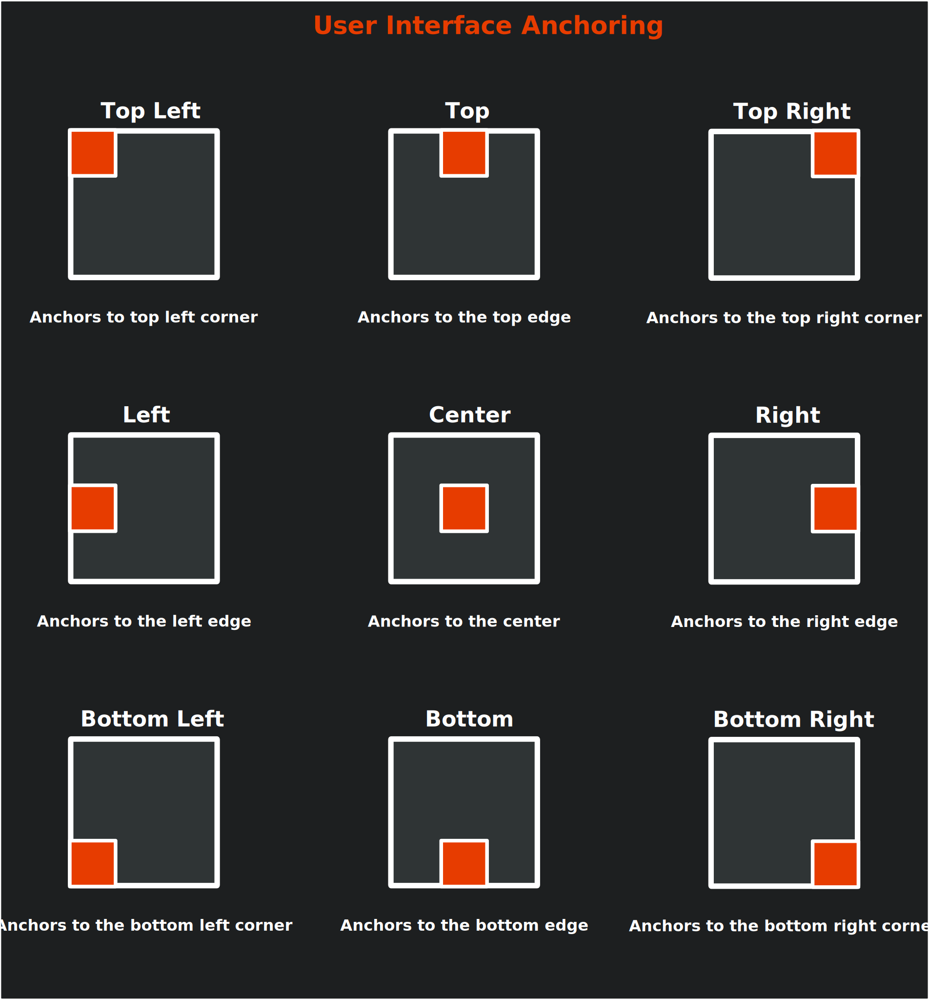
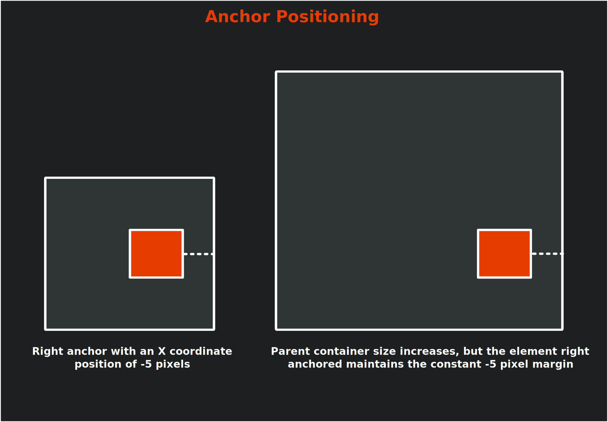
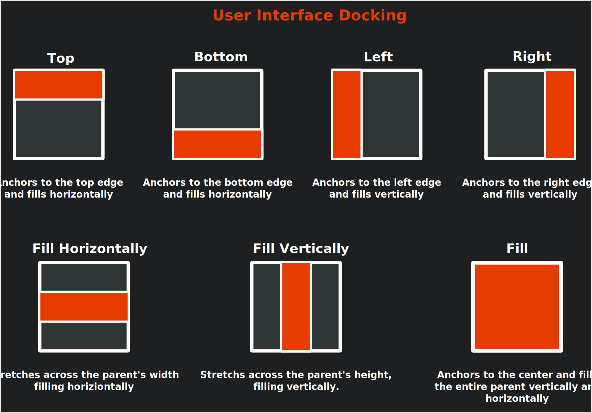

A game's user interface (UI) allows players to interact with the game beyond just controlling the character.  UI elements include menus, buttons, panels, labels, and various other interactive components that provide information and control options to the player.

In this chapter you will:

- Learn the basics of user interface design in games.
- Understand different UI types and their purposes.
- Explore UI layout approaches and positioning strategies.
- Understand the parent-child relationship for UI elements.
- Learn about accessibility considerations in game UI design.

We will first start by understanding what a user interface is and how it functions in game development.

## Understanding Game User Interfaces

A user interface in games serves as a bridge between the player and the game's systems.  Well designed UIs help players navigate the game's mechanics, understand their current status, and make informed decisions.  For new game developers, understanding UI principles is crucial because even the most mechanically sound game can fail if players can not effectively interact with it.

Game UIs consist of various visual elements that serve different purposes:

1. **Information Display**: Elements like health bars, score counters, or minimap displays provide players with game state information.  These elements help players understand their progress, resources, and current status without interrupting gameplay.
2. **Interactive Controls**: Buttons, sliders, checkboxes, and other interactive elements allow players to make choices, adjust settings, or navigate through different sections of the game.  These elements should provide clear visual feedback when interacted with to confirm the player's actions.
3. **Feedback Mechanisms**: Visual effects like highlighting, color changes, or animations that respond to player actions help confirm that input was received.  This feedback loop creates an intuitive and responsive feel for the UI in your game.

User interfaces for games can be categorized into two main types, each with their own design considerations:

- **Diegetic UI**: These elements exist within the game world itself and are often part of the narrative.  Examples include a health meter integrated into a character's suit, ammunition displayed on a weapon's holographic sight, or the dashboard instruments in the cockpit of a racing game.  A Diegetic UI can enhance immersion by making interface elements feel like natural parts of the game world.
- **Non-diegetic UI**: These elements exist outside the game world, overlaid on top of the gameplay.  Traditional menus, health bars in the corner of the screen, and score displays are common examples.  While less immersive than a diegetic UI, non-diegetic elements are often clearer and easier to read.

## UI Layout Systems

When designing and implementing game UI systems, developers must decide how UI elements will be positioned on the screen.  Two primary approaches exist, each with distinct advantages and trade-offs:

1. **Absolute Positioning**:  In this approach, each UI element is placed at specific coordinates on the screen.  Elements are positioned using exact locations, which gives precise control over the layout.  This approach is straightforward to implement and works well for static layouts where elements do not need to adjust based on screen size or content changes.  The main disadvantage of absolute positioning is its lack of flexibility, as iterating on design can be more difficult since one change may have cascading effects on other elements.  If the screen resolution changes or if an element's size changes, manual adjustments to positions are often necessary to maintain the desired layout.

2. **Layout engines**: These system position UI elements relative to one another using rules and constraints.  Elements might be positioned using concepts like "center", "align to parent", or "flow horizontally with spacing".  Layout engines add complexity but provide flexibility.  The advantage of layout engines is adaptability to different screen sizes and content changes.  However, they require more initial setup and can be more complex to implement from scratch.

## Parent-Child Relationships

Parent-child relationships are a part of many UI system. This relationship is implemented with UI elements containing other UI elements, creating a tree-like structure. This hierarchial approach mirrors how interface elements naturally group together in designs.

For example, a settings panel might contain multiple buttons, labels, and sliders.  By making these elements children of the panel, they can be managed as a cohesive unit.  This organizational structure provides several significant advantages:

- **Inheritance of Properties**: Child elements can automatically inherit certain properties from their parents.  For instance, if a parent element is hidden or disabled, all its children can be hidden or disabled as well. This cascading behavior simplifies state management across complex interfaces.
- **Relative Positioning**: Child elements can be positioned relative to their parents rather than relative to the screen.  This means you can place elements within a container and then move the entire container as a unit without having to update each child's position individually.
- **Simplified State Management**:  Actions on parent elements can automatically propagate to their children.  For example, disabling a menu panel can automatically disable all buttons within it, preventing interaction with elements that should not be active.
- **Batch Operations**: Operations like drawing and updating can be performed on a parent element and automatically cascade to all children, reducing the need for repetitive code.
- **Logical Grouping**: The hierarchy naturally models the conceptual grouping of UI elements, making the code structure more intuitive and easier to maintain.

## Anchoring and Docking

In UI systems, two important concepts help with positioning elements: anchoring and docking.

### Anchoring

Anchoring allows you to position UI elements relative to specific reference points on their parents. The following diagram demonstrates common anchor points:

|  |
| :--------------------------------------------------------------------------------------: |
|                  **Figure 19-1: Diagram showing common anchor points**                   |

When you set an anchor point, the elements' position coordinates become relative to that anchor point.  For example with a "Right" anchor and an X value of *-5*, you element would position itself *5 pixels* to the left of the parent's right edge, creating a consistent margin regardless of the parent's size, as demonstrated in the following diagram:

|  |
| :-------------------------------------------------------------------------------------------------------------------------------------------------------: |
|                        **Figure 19-2: Diagram showing anchored element positioning relative to anchor regardless of parent size**                         |

### Docking

Docking takes anchoring a step further by also adjusting an element's size to fill available space.  The following diagram demonstrates common docking options:

|  |
| :------------------------------------------------------------------------------------------: |
|                 **Figure 19-3: Diagram showing the common docking options**                  |

These positioning strategies enable you to create layouts that can maintain their visual relationships even when parent elements change size or position.

## Accessibility in Game UI

Creating accessible user interfaces is an essential aspect of inclusive game design.  Accessibility ensures that your game can be played by a broader audience, including players with visual acuity or other specific needs.  When designing your UI system, consider some of these key accessibility principles:

### Visual Accessibility

- **Color contrast**: Ensure sufficient contrast between text and backgrounds.
- **Use shapes**: Do not rely solely on color to convey important information; add shapes, patterns, or text labels as well.  For example, if displaying warning text, also use something such as the common warning sign ⚠️.
- **Text size and scaling**: Allow players to adjust text size or implement a UI scaling option.
- **Internationalization (i18n)**: Consider how your UI might be interpreted across different cultures and regions. Number formatting can vary significantly - some regions use periods for thousands separators (1.000.000) while others use commas (1,000,000). Control symbolism also differs culturally; for example, on console controllers, the Cross button typically means "Select" in Western regions but "Cancel" in Japan, with Circle having the opposite meaning.

### Input Accessibility

- **Input redundancy**: Support multiple input methods for the same action.  This ensures players can interact with UI elements using their preferred input devices.
- **Reduce input precision requirements**: Implement generous hitboxes for clickable UI elements to help players with motor control difficulties.

### Testing for Accessibility

The most effect way to ensure accessibility is through testing under different circumstances and with diverse users:

- Test your Ui using only keyboard navigation.
- Try playing without sound.
- Check your UI with a color blindness simulator.
- Adjust the display scale to simulate low vision.
- Get feedback from player with different abilities.

By considering accessibility early in development rather than as an afterthought, you create games that can be enjoyed by more players while also often improving the experience for everyone.

## Conclusion

In this chapter, you learned the fundamentals of user interface design for games. You explored the different types of UI elements and their purposes, understood the benefits of parent-child relationships in UI hierarchies, and learned about different positioning strategies like anchoring and docking.

You also discovered the importance of accessible UI design and how to implement practices that make your game playable for a wider audience. These foundational concepts will serve as the building blocks for implementing the UI in our game.

In the next chapter, we will put these concepts into practice by implementing a UI system using Gum, a specialized UI framework that will help us create interactive menus, buttons, and other UI elements for our game.

## Test Your Knowledge

1. What are the two main types of game user interfaces, and how do they differ?

    :::question-answer
    The two main types are:
    - **Diegetic UI**: Elements that exist within the game world itself and are part of the narrative (like health meters integrated into a character's suit or cockpit instruments in racing games). These enhance immersion by making UI feel like a natural part of the game world.
    - **Non-diegetic UI**: Elements that exist outside the game world, overlaid on top of gameplay (like traditional menus, health bars in screen corners, score displays). While less immersive, they are often clearer and easier to read.
    :::

2. What are some advantages of using a parent-child relationship in UI systems?

   :::question-answer
   - **Inheritance of properties**: visual states cascade parent to children.
   - **Relative positioning**: Child elements are positioned relative to their parents.
   - **Simplified state management**: Parent states affect children automatically.
   - **Batch operations**: Update and draw calls propagate through the hierarchy.
   - **Logical grouping**: Mirrors the conceptual organization of UI elements.
   :::

3. How do anchoring and docking differ in UI layout systems?

    :::question-answer
    - **Anchoring**: Positions UI elements relative to specific reference points on their parent (like TopLeft, Center, BottomRight) without changing the element's size. An element's position coordinates become relative to the chosen anchor point.
    - **Docking**: Takes anchoring further by also adjusting an element's size to fill available space. For example, docking to the top means the element fills the parent horizontally while staying at the top, while "Fill" docking means the element expands to fill the entire parent area.
    :::

4. What are some accessibility considerations that should be implemented in game UI systems?

    :::question-answer
    - **Visual accessibility**: High contrast colors, not relying solely on color for information, adjustable text size and UI scaling, and internationalization support.
    - **Input accessibility**: Support for multiple input methods and reduced precision requirements.
    - **Testing practices**: Ensure the UI works with keyboard only navigation, without sound, and with simulated visual impairments.  
    :::
