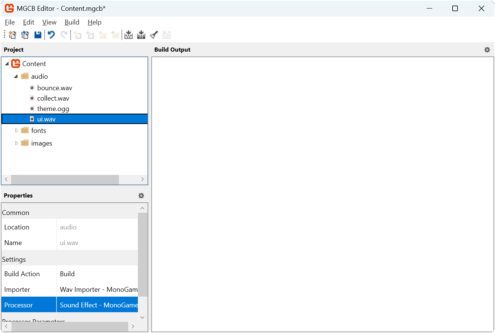
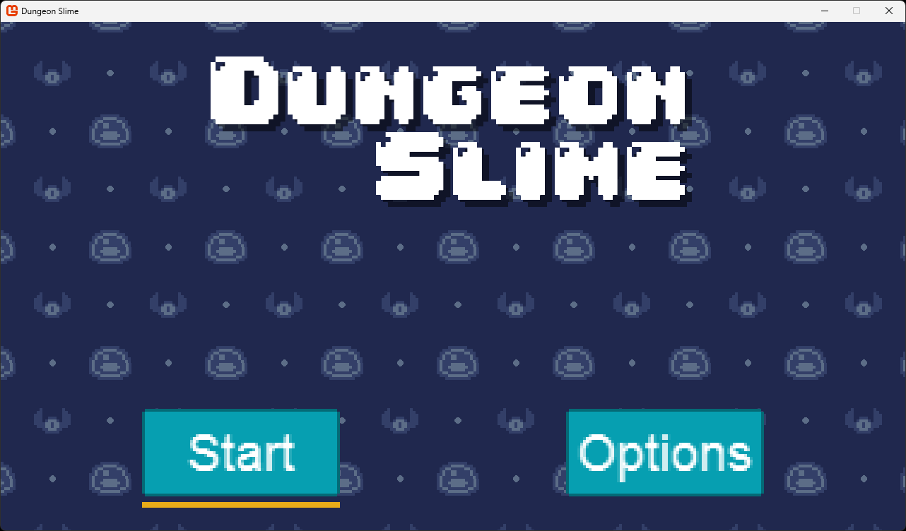
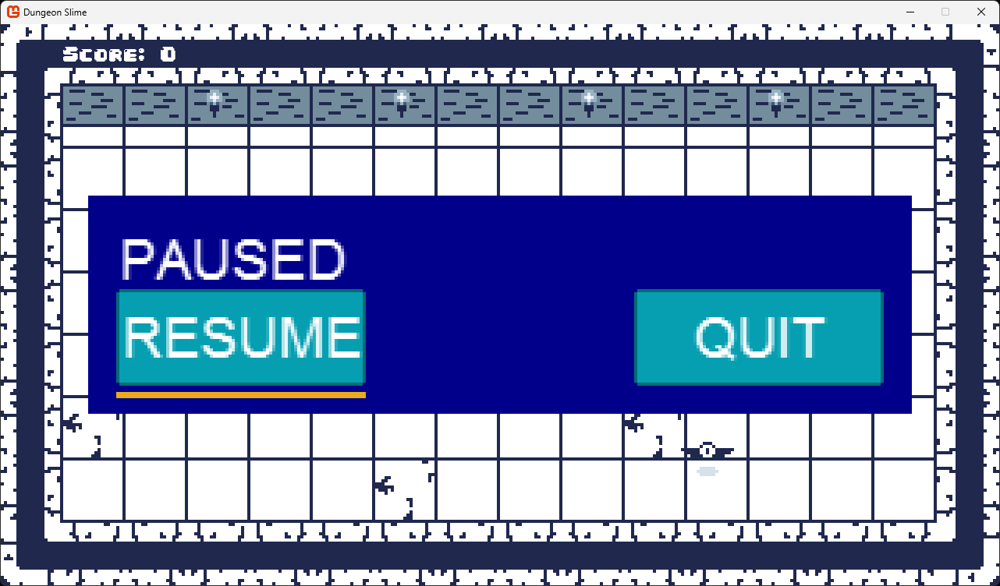

In the [previous chapter](../19_user_interface_fundamentals/index.md) we explored the fundamental concepts of user interface design. Now we are ready to put these principles into practice by implementing a UI system for our game. While it is possible to build a UI system from scratch, we will take advantage of Gum, a specialized UI framework that simplifies many of the complex aspects of UI implementation.

In this chapter you will:

* Install and configure the Gum NuGet package.
* Learn about Gum's core concepts including Forms and Visuals
* Implement UI elements for our game's title scene.
* Create a pause menu for the gameplay scene.
* Handle input from keyboard, mouse, and gamepads
* Integrate the UI system with our existing game architecture.

> [!IMPORTANT]
> While GUM is used in this tutorial it is only one of many UI libraries available to the MonoGame community, some notable others are [EmptyKeys](https://github.com/EmptyKeys/UI_Engines), [GeonBit.UI](https://github.com/RonenNess/GeonBit.UI), as well as entire Game Frameworks/Engines like [Nez](https://github.com/prime31/Nez) that have their own built in UI systems.
>
> Check out the [MonoGame Resources](https://monogame.net/resources/) page, as well as [awesome-monogame](https://github.com/aloisdeniel/awesome-monogame) from [Alois Deniel](https://github.com/aloisdeniel) for even more community offerings.

## What is Gum?

Gum is a powerful UI layout engine and framework. It provides a flexible, efficient system capable of producing virtually any UI layout you might need in your games. While originally developed alongside the FlatRedBall game engine, Gum has evolved to work seamlessly with multiple platforms, including MonoGame, which we will be using in this tutorial.

### Why Use Gum?

Creating a UI system from scratch requires solving many complex problems:

1. **Layout Management**: Calculating positions for elements that need to adapt to different screen sizes or content changes.
2. **Input Handling**: Detecting and responding to mouse, keyboard, and gamepad inputs across multiple UI elements.
3. **Visual State Management**: Changing appearances based on user interactions (hovering, focusing, clicking).
4. **Component Hierarchy**: Managing parent-child relationships between elements.

Gum addresses these challenges with ready-made solutions, allowing us to focus on the specific needs of our game rather than reinventing the UI wheel. While MonoGame provides the basic tools for drawing graphics and detecting input, it does not include high-level UI abstractions; this is where tools like Gum fill the gap.

> [!IMPORTANT]
> This tutorial uses the Gum NuGet package to help with layout and responding to user interactions. This tutorial does not require the use of the Gum editor, we will be doing everything in code.
>
> Keep in mind that while it is possible to build a full UI system without any external dependencies, creating a layout engine is complicated and beyond the scope of this tutorial. Instead, we will be taking advantage of the Gum NuGet package.
>
> Gum is a powerful system enabling the creation of virtually any game UI, and we will be covering some of the basics of its use in this tutorial. The full Gum documentation can be found here: [https://docs.flatredball.com/gum/code/monogame](https://docs.flatredball.com/gum/code/monogame)

## Gum Concepts

Before we dive into implementation, we will explore the core concepts that Gum provides.  Gum simplifies UI development by providing ready-made controls and layout systems that would otherwise require significant effort to build from scratch.

### Understanding Gum's Structure

Gum organizes UI elements in a hierarchical tree structure, similar to how HTML organizes web elements or how GUI frameworks like WPF or JavaFX structure their interfaces. This hierarchy consists of:

1. **The Root Element**: The topmost container in the hierarchy that serves as the entry point for all UI elements.
2. **Containers**: Elements that can hold other elements (like panels or screens).
3. **Controls**: Interactive elements that respond to user input (like buttons or sliders).
4. **Visuals**: The actual graphical representations of UI elements (like text, images, or shapes).

When a game using Gum runs, this hierarchy is maintained in memory, with each element knowing its parent and children. The framework automatically handles the flow of events through this hierarchy and manages the drawing of elements according to their positions in the tree.

### Gum Root Element

All Gum elements must be directly or indirectly added to Gum's root container. This can be done directly wth the `AddToRoot()` method:

```cs
// Creating a panel and adding it to the root
Panel mainMenuPanel = new Panel();
mainMenuPanel.AddToRoot();
```

Or it can be done indirectly by adding a control as a child of an element that has been added to Gum's root container:

```cs
// Creating a panel and adding it to the root
Panel mainMenuPanel = new Panel();
mainMenuPanel.AddToRoot();

// Creating a button and adding it as a child element of the panel
// which indirectly connects it to Gum's root container
Button startButton = new Button();
mainMenuPanel.AddChild(startButton);
```

Gum's root element can also be cleared at any time to remove all UI elements:

```cs
// Clear all children from Gum's root container.
GumService.Default.Root.Children.Clear();
```

This can be useful when navigating between different scenes to ensure UI elements do not persist from previous scenes:

```cs
public class GameScene
{
    public override void Initialize()
    {
        // Clear all children from Gum's root container that may have been added
        // during the previous scene
        GumService.Default.Root.Children.Clear();

        // Now that it has been cleared, initialize the UI for this scene
        InitializeUI();
    }
}
```

### Anchoring

In the previous chapter we discussed [anchoring](../19_user_interface_fundamentals/index.md#anchoring), a fundamental UI concept that allows you to position elements relative to specific reference points of their parents.  Gum supports anchoring of Forms controls through the `Anchor()` method.

```cs
// Creating a panel and adding it to the root
Panel mainMenuPanel = new Panel();
mainMenuPanel.AddToRoot();

// Creating a button and adding it as a child of the panel
// anchored ot the bottom-left of the panel
Button startButton = new Button();
startButton.Anchor(Gum.Wireframe.Anchor.BottomLeft);
mainMenuPanel.AddChild(startButton);
```

The following anchor types are supported by Gum:

| Anchor      | Gum Value                          |
| ----------- | ---------------------------------- |
| TopLeft     | `Gum.Wireframe.Anchor.TopLeft`     |
| Top         | `Gum.Wireframe.Anchor.Top`         |
| TopRight    | `Gum.Wireframe.Anchor.TopRight`    |
| Left        | `Gum.Wireframe.Anchor.Left`        |
| Center      | `Gum.Wireframe.Anchor.Center`      |
| Right       | `Gum.Wireframe.Anchor.Right`       |
| BottomLeft  | `Gum.Wireframe.Anchor.BottomLeft`  |
| Bottom      | `Gum.Wireframe.Anchor.Bottom`      |
| BottomRight | `Gum.Wireframe.Anchor.BottomRight` |

### Docking

In the previous chapter, we also discussed [docking](../19_user_interface_fundamentals/index.md#docking), a fundamental UI concept that adjusts an element's size to fill the available space.  Gum supports the docking of Forms controls through their `Dock()` method.

```cs
// Creating a panel and adding it to the root
Panel mainMenuPanel = new Panel();
mainMenuPanel.AddToRoot();

// Docking the panel to fill the entire root space
mainMenuPanel.Dock(Gum.Wireframe.Dock.Fill);
```

The following docking modes are supported by Gum:

| Anchor           | Gum Value                             | Description                                                                         |
| ---------------- | ------------------------------------- | ----------------------------------------------------------------------------------- |
| Top              | `Gum.Wireframe.Dock.Top`              | Anchors to the top edge and fills horizontally.                                     |
| Left             | `Gum.Wireframe.Dock.Left`             | Anchors to the left edge and fills vertically.                                      |
| Right            | `Gum.Wireframe.Dock.Right`            | Anchors to the ridge edge and fills vertically.                                     |
| Bottom           | `Gum.Wireframe.Dock.Bottom`           | Anchors to the bottom edge and fills horizontally.                                  |
| Fill             | `Gum.Wireframe.Dock.Fill`             | Anchors to the center and fills the entire parent area vertically and horizontally. |
| FillHorizontally | `Gum.Wireframe.Dock.FillHorizontally` | Stretches across the parent's width, filling horizontally.                          |
| FillVertically   | `Gum.Wireframe.Dock.FillVertically`   | Stretches across the parent's height, filling vertically.                           |
| SizeToChildren   | `Gum.Wireframe.Dock.SizeToChildren`   | Automatically sizes vertically and horizontally based on contained child element.   |

### Forms and Visuals

Two concepts are important when working with Gum: **Forms** and **Visuals**.

* **Forms** controls are typical interactive UI elements such as buttons, sliders, and text boxes that handle user interaction through mouse, gamepad, and keyboard inputs.  These controls come with built-in functionality; a button responds visually when focused, while a slider changes its value when clicked on its *track*.  By using these standardized components, you can maintain consistency throughout your UI implementation.

* **Visuals** are the graphical display elements that render the actual appearance of UI components. In Gum, Visual elements have the *Runtime suffix (like TextRuntime, ColoredRectangleRuntime, and NineSliceRuntime) and are used to render graphics. They handle the visual representation but have no built-in interaction behavior on their own.

Forms controls provide customization through their `Visual` property, which serves as a gateway to modifying their appearance and layout. With this property, you can move, resize, restyle, and even completely replace visuals through code.  As we will see when building our UI in the next chapter, this separation between functionality and presentation allows us to create consistent behaviors while adapting the visual style to match our game's aesthetic.

For now, we will examine some of the Forms control types we will use in this chapter.

#### Panel

Panels serve as invisible containers that group related UI elements together.  Unlike visible elements that display graphics, panels focus on organization and layout management.

A panel provides several key functions:

* Groups related elements for easier management.
* Controls visibility for entire sections of UI at once.
* Establishes a coordinate system for child elements.
* Provides a foundation for layout management.

Panels are especially useful for creating distinct UI screens, by toggling the visibility of different panels you can implement complete UI state changes with minimal code:

```cs
// Change the state of the UI by hiding one panel and showing another.
mainMenuPanel.IsVisible = false;
optionsPanel.IsVisible = true;
```

A common pattern is to set a panel's docking to `Fill`, which makes it span the entire available area:

```cs
// Make the panel fill the entire screen
mainMenuPanel.Dock(Gum.Wireframe.Dock.Fill);
```

This creates a consistent coordinate space for all child elements, allowing them to be positioned relative to the screen.

#### Button

The `Button` Forms control type is the primary interactive control for triggering actions in your UI.

Buttons provide:

* Responses to clicks from mouse, touch, keyboard, or gamepad input.
* Visual feedback when focused or hovered.
* Raises a `Click` event when activated.

Buttons can be positioned using anchoring to create layouts that adapt to different screen sizes:

```cs
// Creating a button that is anchored to the bottom left.
Button startButton = new Button;
startButton.Anchor(Gum.Wireframe.Anchor.BottomLeft);

// Set the X and Y position so it is 20px from the left edge
// and 20px from the bottom edge.
startButton.Visual.X = 20;
startButton.Visual.Y = -20;
```

The `Click` event is raised whenever the button is activated and provides a standard way to respond regardless of input device:

```cs
startButton.Click += (sender, args) =>
{
    // Handle button click...
    StartGame();
};
```

> [!NOTE]
> The `Click` event for a button is triggered automatically when it is left-clicked by a mouse or pushed via touch controls.  For keyboard and gamepad input, it can only be triggered when the button has focus, which typically happens when the player navigates to it using the tab key or controller.

#### Slider

The `Slider` Forms control type allows users to select a numeric value from a continuous range.  A slider:

* Displays and modifies a `Value` property constrained between a `Minimum` and `Maximum` value.
* Responds to mouse clicks on its track or by dragging its thumb.
* Supports keyboard and gamepad input for incremental adjustments.
* Raises events when its value changes.

Basic slider setup includes defining its range and establishing event handlers:

```cs
Slider volumeSlider = new Slider();
volumeSlider.Minimum = 0.0f;
volumeSlider.Maximum = 1.0f;
volumeSlider.Value = 0.5f;
volumeSlider.SmallChange = 0.1f;
volumeSlider.LargeChange = 0.2f;
```

The `SmallChange` property sets the increment for keyboard and gamepad adjustments, while the `LargeChange` property determines the increment when clicking directly on the slider *track*.

Sliders provide several events for different interaction scenarios:

* `ValueChanged`: Fires continuously as the value changes (useful for live previews).
* `ValueChangeCompleted`: Fires once when the user finishes adjusting the value (useful for applying final settings).

```cs
volumeSlider.ValueChanged += (sender, arg) =>
{
    // Handle value changed event...
    UpdateVolume(volumeSlider.Value);
};

volumeSlider.ValueChangedCompleted += (sender, arg) =>
{
    // Handle value change completed event...
    UpdateVolume(volumeSlider.Value);

    // Useful to do things like this here since this fires once
    // the slider value change has completed so it is not constantly
    // triggering ui sound effects.
    PlayUISoundEffect();
};
```

### Property Changes vs States

Gum allows you to customize visuals in two ways:

* Direct property assignment
* Using states.

With simple property changes, you can directly assign values in code.  For example, the following code example changes the width of a button:

```cs
startButton.Visual.Width = 100;
```

Direct property assignment works well for initial setup, such as positioning elements or setting their dimensions when first creating your UI.  However, when you need visual elements to respond to user interactions (like highlighting a button when it is focused), a different approach is required.

For these dynamic changes, Gum uses a system of **states** (implemented as `StateSave` objects), each Forms control maintains a collection of named states that are automatically applied in response to specific user interactions.  When a button becomes focused, for instance, Gum looks for and applies a state named "Focused" to alter its appearance.

> [!NOTE]
> In the next chapter during the customization pass, we will create states to visually indicate when controls are focused, providing clear feedback to the player.

## Updating Our Game To Use Gum

Now that we have covered the core UI concepts and how Gum will help implement them, we can integrate Gum into our game project.  We will add the framework, initialize it, and prepare it for use in our scenes.

For now we will use the default styling in Gum to quickly iterate and build the UI and do a customization styling pass in the next chapter.

### Adding the Gum NuGet Package

Before we can use Gum in our project, we first need to add it using NuGet.  NuGet is a package manager for .NET projects that allows you to add third-party libraries into your project, similar to how we [created and added our own class library](../04_creating_a_class_library/index.md).

To add the Gum NuGet package to our game project, follow the instructions below based on your development environment:

#### [Visual Studio Code](#tab/vscode)

To add the Gum NuGet package in Visual Studio Code:

1. In the [*Solution Explorer*](../02_getting_started/index.md#install-the-c-dev-kit-extension) panel, right-click the `DungeonSlime` project.
2. Choose `Add NuGet Package` from the context menu.
3. Enter `Gum.MonoGame` in the `Add NuGet Package` search prompt and press Enter.
4. When the search finishes, select the `Gum.MonoGame` package in the results
5. When prompted for a version choose version `2025.8.3.3`.

#### [Visual Studio 2022](#tab/vs2022)

To Add the Gum NuGet package in Visual Studio 2022:

1. In the *Solution Explorer* panel, right-click the *DungeonSlime* project.
2. Choose `Manage Nuget Packages...` from the context menu.
3. In the NuGet Package Manager window, select the `Browse` tab if it is not already selected.
4. In the search box, enter `Gum.MonoGame`.
5. Select the "Gum.MonoGame" package from the search results.
6. On the right, in the version dropdown, select version `2025.8.3.3` and click the "Install" button.

#### [dotnet CLI](#tab/dotnetcli)

To add the Gum NuGet package using the dotnet CLI:

1. Open a Command Prompt or Terminal window in the same folder as the `DungeonSlime.csproj` project file.
2. Enter the following command:

    ```sh
    dotnet add DungeonSlime.csproj package Gum.MonoGame --version 2025.8.3.3
    ```

---

> [!TIP]
> You can verify the package was successfully added by examining your `DungeonSlime.csproj` file, which should now contain a reference like:
>
> ```xml
> <PackageReference Include="Gum.MonoGame" Version="2025.8.3.3" />
> ```

> [!IMPORTANT]
> This tutorial uses version `2025.8.3.3` of Gum, which is the latest version of Gum as of this writing.  That exact version is specified to use in the section above when installing the NuGet package to ensure compatibility throughout this tutorial.  If there are newer versions of Gum available, please consult the [Gum documentation](https://docs.flatredball.com/gum/gum-tool/upgrading) before updating in case there are any breaking changes from the code that is presented in this tutorial.

### Adding UI Sound Effect

To make our UI more responsive and engaging, we will add audio feedback that plays when players interact with buttons and other UI elements. Sound effects provide immediate confirmation that an input has been recognized, creating a more engaging experience.

First, download the UI sound effect by right-clicking the following link and saving it as `ui.wav` in the game project's `Content/audio` folder:

* [ui.wav](./files/ui.wav){download}

Next, add this sound effect to your content project using the MGCB Editor:

1. Open the `Content.mgcb` content project file in the MGCB Editor.
2. Right-click the `audio` folder and choose `Add > Existing Item...`.
3. Navigate to and select the `ui.wav` file you just downloaded.
4. In the Properties panel, verify that the `Processor` is set to `Sound Effect`.
5. Save the changes and close the MGCB Editor.

|  |
| :---------------------------------------------------------------------------------------------: |
|             **Figure 20-1: The MGCB Editor with ui.wav added to the audio folder**              |

We will load and use this sound effect in our UI implementation to provide auditory feedback when players interact with buttons and sliders.

### Initializing Gum

With the Gum NuGet package added to our project, we need to initialize Gum in our game, this will enable the UI system and configure input handling for our controls.  Since this is an initialization that only needs to happen once, we can make the necessary changes to the `Game1` class.

First, open the `Game1.cs` file and add the following new using statements to the top:

[!code-csharp[](./snippets/game1/usings.cs?highlight=2-5)]

Next, add the following method to the `Game1` class to encapsulate the initializations of the Gum UI service:

[!code-csharp[](./snippets/game1/initializegum.cs)]

Finally, update the [**Initialize**](xref:Microsoft.Xna.Framework.Game.Initialize) method to call the `InitializeGum` method we just created:

[!code-csharp[](./snippets/game1/initialize.cs?highlight=8-9)]

The following is a breakdown of this initialization process:

1. **Basic Initialization**: `GumService.Default.Initialize(this, DefaultVisualsVersion.V2)` sets up the Gum system with our game instance.  This is required for any gum project. The second parameter specifies the default visual styling. V2 is the latest version which makes it easy to style the default controls.

    > [!NOTE]
    > We only need to pass our [**Game**](xref:Microsoft.Xna.Framework.Game) instance and the visuals version since we are using Gum as a code-first approach.  Gum also offers a visual editor that creates Gum project files. When using the editor, you will need to also pass the Gum Project file to `Initialize`. For more information on how to use the Gum visual editor, see the [Gum Project Forms Tutorial](https://docs.flatredball.com/gum/code/monogame/tutorials/gum-project-forms-tutorial).

2. **Content Loading**: Gum needs to be made aware of which content manager to use to load assets through the content pipeline.  By setting `GumService.Default.ContentLoader.XnaContentManager = Core.Content`, we tell Gum to use our game's content manager when loading assets.  By using the game's existing content manager, Gum also gets the benefit of the caching that the content manager performs when loading assets.
3. **Input Configuration**:
   * By default, all Forms controls automatically respond to mouse and touch screen input devices.  We need to explicitly register keyboard and gamepad input devices by using th `FrameworkElement.KeyboardsForUiControl` and `Framework.GamePadsForUiControl` properties.
   * By default, Forms controls will automatically respond to tab and shift-tab for navigation. By using the `FrameworkElement.TabKeyCombos` and `FrameworkElement.TabReverseKeyCombos` properties, we can add additional key combinations for tabbing.  Here we map the Up arrow for reverse tabbing and the Down arrow for forward tabbing.  

   > [!TIP]
   > If you prefer different navigation keys, you can remove the built-in Tab/Shift+Tab navigation.
   >
   > Simply call these methods before adding your custom combinations:
   >
   > ```cs
   > FrameworkElement.TabKeyCombos.Clear();
   > FrameworkElement.TabReverseKeyCombos.Clear();
   > ```

4. **UI Scaling**:  Gum allows us to independently scale the UI regardless of the resolution of the game.  Our game is set to a resolution of 1280x720, however as we will see during the styling section later, the UI assets created were done at one-fourth the size to reduce the size of the texture atlas.  Here, we use the `GumService.Default.CanvasWidth` and `GumService.Default.CanvasHeight`  properties to set the canvas size to one-fourth that of our game's resolution. Then using by setting the `GumService.Default.Renderer.Camera.Zoom` property to four, we effectively make it render the UI at full resolution.

Gum is now fully initialized and we can use it in our scenes to add UI to our game.

### Adding TitleScene UI

With Gum added and initialized in our game, we can now implement UI elements for our title scene.  We will create panels for both the main menu and options menu, implement the necessary event handlers, and integrate everything with our existing title scene.

> [!NOTE]
> When adding these sections one by one, you may see compiler errors until all sections are in place. This is normal, as some parts of the code will reference fields or methods that haven't been added yet. Once all sections are complete, these errors will resolve.

First, open the *TitleScene.cs* file in the game project and add the following using declarations to the top of the `TitleScene` class:

[!code-csharp[](./snippets/titlescene/usings.cs?highlight=1,3,6-8)]

Next, add the following fields to the `TitleScene` class:

[!code-csharp[](./snippets/titlescene/fields.cs)]

#### Creating the Title Panel

First, create a new method that builds our main menu panel with start and options buttons.

Add the following method to the `TitleScene` class:

[!code-csharp[](./snippets/titlescene/createtitlepanel.cs)]

Our title panel includes two buttons positioned at the bottom corners of the screen.  The "Start" button will allow players to begin the game while the "Options" button will hide the main menu and display the options menu.

> [!NOTE]
> Notice how we use `Anchor` to position the buttons relative to the panel's edges, with the "Start" button anchored at the bottom left and the "Options" button anchored at the bottom right.  Then the positioning of the elements is adjusted relative to its anchor point.

Each button registers a `Click` event handler to respond when the players selects it, we should implement the event handler method for these buttons next.  First we will implement the handler for the "Start" button.  Add the following method to the `TitleScene` class after the `CreateTitlePanel` method:

[!code-csharp[](./snippets/titlescene/handlestartclicked.cs)]

When the "Start" button is clicked and this method is called, it will play the UI sound effect for auditory feedback then change the scene to the game scene so the player can start playing the game.

Next is the handler for the "Options" button.  Add the following method to the `TitleScene` class after the `HandleStartClicked` method:

[!code-csharp[](./snippets/titlescene/handleoptionsclicked.cs)]

When the "Options" button is clicked and this method is called, it will play the UI sound effect for auditory feedback then hide the title panel and show the options panel.  

#### Creating the Options Panel

Next, we will create the options panel with sliders to adjust the volume for music and sound effects.

Add the following method to the `TitleScene` class:

[!code-csharp[](./snippets/titlescene/createoptionspanel.cs)]

This panel includes a text label, two sliders for adjusting audio volumes, and a back button for returning to the main menu. The panel is initially invisible since we start on the main menu.  Both the "Music Volume" slider and the "Sound Effects Volume" slider register events to be called when the value of the sliders change and when the value change has been completed.  The "Back" button registers a click event similar to the ones from the main menu.

Now we should implement the event handlers for these controls.  First, we will implement the handler for when the value of the sound effect volume slider changes.  Add the following method to the `TitleScene` class after the `CreateOptionsPanel` method:

[!code-csharp[](./snippets/titlescene/handlesfxsliderchanged.cs)]

When the value of the "Sound Effects Volume" slider changes and this method is called, a reference to the slider is captured and then the the global sound effect volume is adjusted based on the value of the slider.

Next is the handler when the "Sound Effects Volume" slider has completed a value change.  Add the following method to the `TitleScene` class after the `HandleSfxSliderChanged` method:

[!code-csharp[](./snippets/titlescene/handlesfxsliderchangecompleted.cs)]

When the value of the "Sound Effects Volume" slider has completed a change and this method is called, it plays the UI sound effect to provide auditory feedback so the player can hear the difference in volume.

Next, add the handler for changes to the 'Music Volume' slider. Place the following method in the TitleScene class, directly after the HandleSfxSliderChangeCompleted method:

[!code-csharp[](./snippets/titlescene/handlemusicslidervaluechanged.cs)]

Similar to how we handled the "Sound Effect Volume" slider value changes, when the "Music Volume" slider value changes and this method is called, a reference to the slider is captured and then the global music volume is adjusted based on the value of the slider.

Next is the handler when the "Music Volume" slider value has completed a value change.  Add the following method to the `TitleScene` class after the `HandleMusicSliderValueChanged` method:

[!code-csharp[](./snippets/titlescene/handlemusicslidervaluechangecompleted.cs)]

When the value of the "Music Volume" slider has completed a change, the UI sound effect is played to provide auditory feedback.

Finally, we need to add the handler for when the "Back" button is clicked on the options panel.  Add the following method to the `TitleScene` class after the `HandleMusicSliderValueChangeCompleted` method:

[!code-csharp[](./snippets/titlescene/handleoptionsbuttonback.cs)]

This method plays the UI sound effect for auditory feedback, then hides the options panel and shows the title panel.

> [!TIP]
> Notice that for both sliders, we registered a method for the `ValueChangeCompleted` event.  This is so we can play the UI sound effect only when the player has finished adjusting the slider value. If we had instead played the UI sound effect in the `ValueChanged` event, then the UI sound effect would trigger constantly while the slider is being adjusted if using a mouse to drag it.

#### Initializing the UI

Now that we have implemented the methods that will create both the main menu panel and the options menu panel, we need to implement the main UI initializations method that will call them.  Add the following method to the `TitleScene` class after the `HandleOptionsButtonBack` method:

[!code-csharp[](./snippets/titlescene/initializeui.cs)]

This method first clears any existing UI elements from Gum's root container to prevent duplication, then calls our panel creation methods to build the complete interface.

#### Integrating with the Game Loop

Finally, we need to integrate our UI initialization, update, and draw with the scene's lifecycle.  First, add the call to `InitializeUI()` in the `Initialize` method by updating it to the following:

[!code[](./snippets/titlescene/initialize.cs?highlight=27)]

Next, update the `LoadContent` method to load the sound effect that will be used as auditory feedback for the UI:

[!code[](./snippets/titlescene/loadcontent.cs?highlight=12-13)]

Next modify the `Update` method to include Gum's update logic:

[!code[](./snippets/titlescene/update.cs?highlight=14)]

Finally, the `Draw` method needs to be updated to:

1. Only show the text for the game title when the title panel is visible
2. Add Gum's drawing call to draw the user interface

Update the `Draw` method to the following:

[!code[](./snippets/titlescene/draw.cs?highlight=10-34,36)]

With these changes, our UI system is now fully integrated into the scene's game loop.  Gum updates its controls in the `Update` method and draws them in the `Draw` method.  This produces a fully functional title screen with buttons that allows players to start the game or adjust audio settings.  

|  |
| :--------------------------------------------------------------------------------: |
|               **Figure 20-2: Title screen with default Gum buttons**               |

> [!NOTE]
> You may notice that the UI elements currently use Gum's default styling, which does not match our game's visual theme.  We will explore customizing these controls to match our game's visual style in the next chapter.

### Adding GameScene UI

Now that we have setup the UI for the title scene, we will add a pause menu to our game scene.  This UI will start invisible but will be shown when the player presses the escape key.  For consistency, we will implement the UI for the game scene in the same order that we implemented the UI for the title scene.

> [!NOTE]
> When adding these sections one by one, you may see compiler errors until all sections are in place. This is normal, as some parts of the code will reference fields or methods that haven't been added yet. Once all sections are complete, these errors will resolve.

First, open the *GameScene.cs* file in the game project and add the following using declarations to the top of the `GameScene` class.

[!code-csharp[](./snippets/gamescene/usings.cs?highlight=2-3,8-10)]

Next, add the following fields to the `GameScene` class:

[!code-csharp[](./snippets/gamescene/fields.cs)]

#### Pausing the Game

To pause the game, first we will create a method that makes the pause panel visible.  Add the following method to the `GameScene` class after the `CheckGamePadInput` method:

[!code-csharp[](./snippets/gamescene/pausegame.cs)]

Next, update the `CheckKeyboardInput` method so that when the escape key is pressed, instead of returning to the title scene, we now pause the game:

[!code-csharp[](./snippets/gamescene/checkkeyboardinput.cs?highlight=6-10)]

Finally, update the `CheckGamePadInput` method so that when the start button is pressed, it pauses the game:

[!code-csharp[](./snippets/gamescene/checkgamepadinput.cs?highlight=6-10)]

#### Creating the Pause Panel

Next, we will create a method that builds our pause panel with resume and quit buttons. Add the following method to the `GameScene` class after the `LoadContent` method:

[!code-csharp[](./snippets/gamescene/createpausepanel.cs)]

Now we should implement the event handlers for these controls. First, we will implement the handler for the "Resume" button. Add the following method to the `GameScene` class after the `CreatePausePanel` method:

[!code-csharp[](./snippets/gamescene/handleresumebuttonclicked.cs)]

This method plays the UI sound effect for auditory feedback and then hides the pause panel so that the game can resume.

Next is the handler for the "Quit" button.  Add the following method to the `GameScene` class after the `HandleResumeButtonClicked` method:

[!code-csharp[](./snippets/gamescene/handlequitbuttonclicked.cs)]

This method as well plays the UI sound effect for auditory feedback, then quits the game by changing scenes back to the title scene.

#### Initializing the Game UI

Now that we have implemented the method to create the pause panel, we can implement the main UI initializations method that will call them.   Add the following method to the `GameScene` class after the `HandleQuitButtonClicked` method:

[!code-csharp[](./snippets/gamescene/initializeui.cs)]

Just like with the `TitleScene`, we first clear any existing UI elements from Gum's root before creating the UI elements for this scene.

#### Integrating with the Game Loop for the GameScreen

Finally, we need to integrate our UI initialization, update, and draw with the scene's lifecycle.  First add the call to `InitializeUI()` in the `Initialize` method by updating it to the following:

[!code-csharp[](./snippets/gamescene/initialize.cs?highlight=38)]

Next, update the `LoadContent` method to load the sound effect that will be used as auditory feedback for the UI:

[!code-csharp[](./snippets/gamescene/loadcontent.cs?highlight=27-28)]

Next, modify the `Update` method to include Gum's update logic and to only update the game if it is not paused.  We will use the visibility of the pause menu to determine if the game is paused or not:

[!code-csharp[](./snippets/gamescene/update.cs?highlight=3-10)]

Finally, add Gum's drawing call to the end fo the `Draw` method:

[!code-csharp[](./snippets/gamescene/draw.cs?highlight=9-10)]

With these changes, the pause menu is now fully integrated into the game scene's game loop.  Gum updates its controls during the `Update` method and draws them during the `Draw` method.  If the game is paused, as determined by the `IsVisible` property of the pause menu, then updating the actual game logic is skipped.

|  |
| :---------------------------------------------------------------------------------------------------------: |
|               **Figure 20-3: The pause menu during the game scene with default Gum buttons**               |

## Conclusion

In this chapter, you accomplished the following:

* Add and configure the Gum NuGet package in your project.
* Understand key Gum concepts like Forms controls and Visuals.
* Create and position UI elements using anchoring and docking.
* Implement interactive controls like buttons and sliders.
* Handle user input from various input devices.
* Create transitions between different UI screens.
* Integrate the UI system with the game's scene architecture.
  
While this UI is now functional, you may have noticed that it uses Gum's default styling which does not match our game's visual theme.  In the next chapter, we will learn how to customize the appearance of our UI elements to create a cohesive visual style that complements our game's aesthetic.

## Test Your Knowledge

1. What are the two main types of objects in Gum, and how do they differ?

    :::question-answer
    The two main types are:

    * **Forms**: Interactive UI elements like buttons, sliders, and panels that handle user input. They provide built-in functionality for common UI interactions.
    * **Visuals**: Display elements like TextRuntime, ColoredRectangleRuntime, and NineSliceRuntime that are used to render graphics. They have no built-in interaction behavior but can be customized visually.
  
    Forms controls contain Visuals, accessible through the `Visual` property, creating a separation between functionality and presentation.
    :::

2. How does Gum handle the parent-child relationship of UI elements, and why is this important?

    :::question-answer
    Gum implements parent-child relationships through a hierarchical structure where:

    * UI elements must be connected to the root container to be visible
    * Children can be added directly to a parent's Visual.Children collection
    * Position coordinates of child elements are relative to their parent
    * Property changes like visibility cascade from parent to children

    This relationship is important because it allows for organizing related UI elements as groups, controlling entire sections of UI with a single property change, and positioning elements relative to their container rather than absolute screen coordinates.
    :::

3. What are the two ways to customize the appearance of Gum UI elements?

    :::question-answer
    The two ways to customize Gum UI elements are:

    1. **Direct property assignment**: Setting properties directly in code (like `MyButton.Visual.Width = 100`). This works well for initial setup and static properties.
    2. **States**: Using Gum's state system (`StateSave` objects) to define different visual states that can be applied in response to specific conditions or events. States are automatically applied by Forms controls in response to user interactions (like focus or highlighting).

    States are useful for dynamic changes that occur during gameplay, as they separate visual response logic from game logic.
    :::

4. What steps are necessary to integrate Gum's UI system with MonoGame's game loop?

    :::question-answer
    To integrate Gum with MonoGame's game loop:

    1. Initialize Gum in the game's Initialize method with `GumService.Default.Initialize(this)`
    2. Configure content loading by setting `GumService.Default.ContentLoader.XnaContentManager`
    3. Set up input handling by adding keyboards and gamepads to `FrameworkElement.KeyboardsForUiControl` and `FrameworkElement.GamePadsForUiControl`
    4. Call `GumService.Default.Update()` in the game's Update method
    5. Call `GumService.Default.Draw()` in the game's Draw method
    6. For scene transitions, clear existing UI elements with `GumService.Default.Root.Children.Clear()`

    This ensures Gum can update and render UI elements in sync with the game's main loop.
    :::
