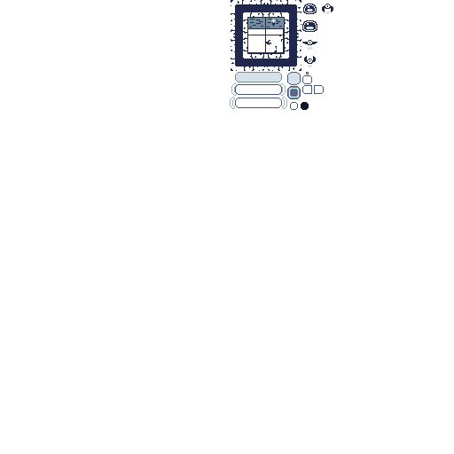
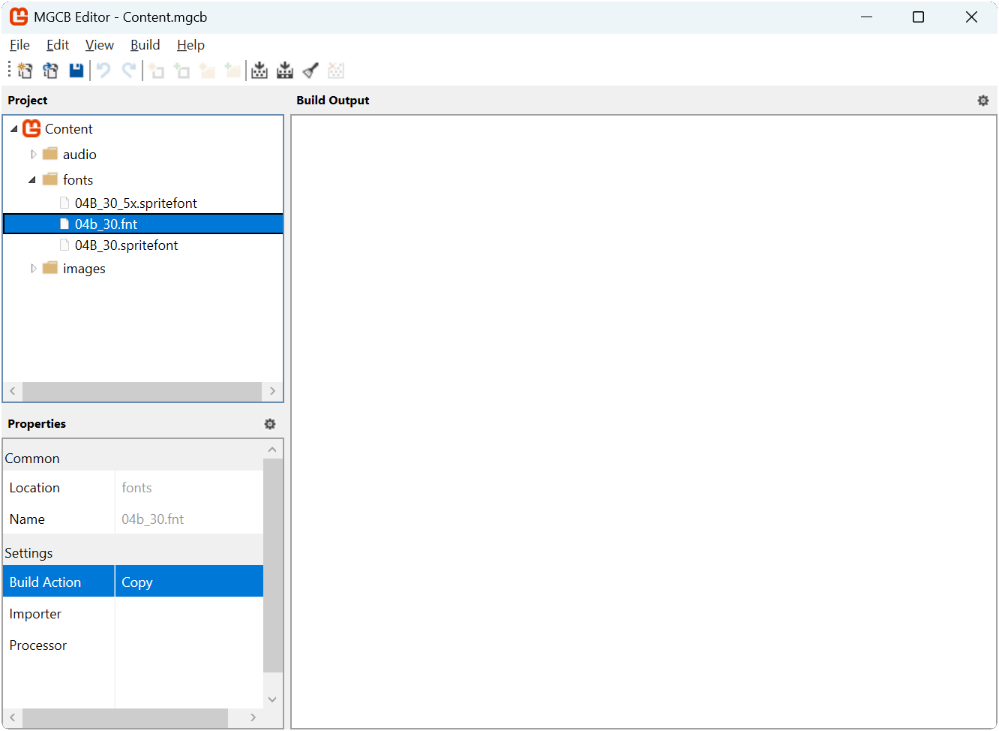

In the [previous chapter](../20_implementing_ui_with_gum/index.md), we implemented a functional UI system for our game using the Gum framework. While the UI is now fully operational, it uses Gum's default styling.  This default styling is good for quickly iterating when building the UI, but it does not match the game's visuals.  A well designed UI should not only be functional but also complement the game's overall visual style to create a cohesive experience.

In this chapter you will:

- Learn about Gum's visual customization system and component hierarchy.
- Understand how animation chains and visual states work in Gum.
- Create custom styled button and slider components.
- Update the game's texture atlas to include UI graphics.
- Implement responsive visual feedback for player interactions.
- Apply your custom components to the game's UI screens.

## Understanding Gum's Customization System

Gum provides a powerful customization system that separates a UI element's functionality from its appearance.  This allows you to maintain the built-in behavior of standard controls while completely changing their visual representation.

### Container Hierarchy

Every customized UI component in Gum starts with a top-level container that holds all other visual elements. This container is typically of type `ContainerRuntime`, which is similar to the `Panel` type we used earlier, but specifically designed for building custom visuals.

The container hierarchy follows a parent-child relationship:

- The top-level container manages the overall size and positioning of the component.
- Visual elements like backgrounds, text, and icons are added as children.
- Child elements can be positioned relative to their parent container.
- Child elements can also be nested within other children, creating deeper hierarchies.

This hierarchical structure allows you to build complex UI components from simpler parts, with each part playing a specific role in the overall design.

### Size Relationships with Width and WidthUnits

One powerful feature of Gum is how it handles size relationships between parent and child elements. By using different `WidthUnits` values, you can create dependencies that flow in different directions:

- **RelativeToChildren**: A parent container can size itself based on its children.
- **PercentageOfParent**: A child element can size itself as a percentage of its parent.
- **Absolute**: An element can have a fixed pixel size.
- **RelativeToParent**: An element can size itself relative to a specific container.

For example:

- A button might use a text element with `WidthUnits` set to `RelativeToChildren`, which means the text will be exactly the size needed to display its content.
- The button's container might use `RelativeToChildren` with some additional padding, allowing the button to automatically resize based on its text content.

Although we have not explicitly assigned WidthUnits and HeightUnits in our code, we have indirectly set these values by calling the Visual's `Dock` method. Specifically, by passing `Dock.Fill` as the parameter, `WidthUnits` and `HeightUnits` are both set to `RelativeToParent`.

> [!NOTE]
> These size relationships can create circular dependencies when a child depends on its parent and the parent depends on the child. In such cases, Gum resolves the conflict by making the child depend on the parent, and the parent ignores that particular child when calculating its size.

### Visual Elements

Gum provides several visual element types that we can use to build our custom components:

- **ContainerRuntime**: An invisible container for organizing other elements.
- **NineSliceRuntime**: A special graphic that can stretch while preserving its corners and edges.
- **TextRuntime**: An element for displaying text with custom fonts.
- **ColoredRectangleRuntime**: A simple colored rectangle for backgrounds or fills.

The `NineSliceRuntime` is particularly useful for UI elements that need to resize dynamically. It divides a graphic into nine sections (four corners, four edges, and a center), allowing the element to stretch without distorting its borders.

> [!NOTE]
> A MonoGame and Gum community member Kaltinril also has a video series discussing Gum.  With permission, the following video segment is included to demonstrate the advantages of using a *Nineslice* when creating UI elements.
> 

> <iframe width="560" height="315" src="https://www.youtube.com/embed/pI8yxdaGSVU?si=1wKj6EPkryepxVmg&amp;start=1114&amp;end=1209" title="Nineslice Overview" frameborder="0" allowfullscreen></iframe>
> 

#### Animation Chains

An `AnimationChain` is a sequence of animation frames that play in order, typically looping after the last frame. Each frame in the chain defines:

- Which part of a texture to display (using texture coordinates).
- How long to display that frame (using a frame length value).
- Which texture to use for the frame.

Texture coordinates in Gum use normalized values (0.0 to 1.0) rather than pixel coordinates, where:

- 0.0 represents the left or top edge of the texture.
- 1.0 represents the right or bottom edge of the texture.

To convert from pixel coordinates to normalized values, you divide the pixel position by the texture's width or height.

#### Visual States

Rather than directly modifying properties when UI elements change state (like when a button is focused), Gum uses a state-based system. Each control type has a specific category name that identifies its collection of states:

- Buttons use `Button.ButtonCategoryName`.
- Sliders use `Slider.SliderCategoryName`.
- Other control types have their own category names.

Within each category, you define named states that correspond to the control's possible conditions:

- "Enabled" (the normal, unfocused state).
- "Focused" (when the control has focus).
- "Highlighted" (when the mouse hovers over the control).
- "Disabled" (when the control cannot be interacted with).

Each state contains an `Apply` action that defines what visual changes occur when that state becomes active. For example, when a button becomes focused, its state might change the background color or switch to an animated version.

### Input and Focus Handling

Custom UI components can enhance their interactivity by handling specific input events:

- The `KeyDown` event can be used to add custom keyboard navigation.
- The `RollOn` event can detect when the mouse moves over the component.
- The `Click` event can respond to mouse clicks or gamepad button presses.

Gum distinguishes between highlighting (visual response to mouse hover) and focus (ability to receive keyboard/gamepad input). For a seamless experience across input devices, a common pattern is to automatically focus elements when the mouse hovers over them, ensuring that visual highlighting and input focus remain synchronized.

Now that we understand the key concepts behind Gum's customization system, we can apply them to create custom UI components for our game.

## Updating the Game Resources

Before we create our custom components, we need to update the game's resources to include UI graphics and fonts.

### Update the Texture Atlas

First need to update the *atlas.png* texture atlas file for the game. This new version of the texture atlas includes:

- The characters for the font, generated using Bitmap Font Generator (BMFont)
- The sprites for the UI components we will create

Download the new texture atlas below by right-clicking the following image and saving it as *atlas.png* in the *Content/images* folder of the game project, overwriting the existing one.

|  |
| :--------------------------------------------------------------------------------------------------: |
|          **Figure 21-1: The texture atlas for the game updated to include the UI sprites**           |

The slime and bat sprites are no longer in the same position, and we have some new regions to define for our UI sprites. This means we need to update the texture atlas XML configuration file as well. Open the *atlas-definition.xml* configuration file and update it to the following:

[!code-csharp]

The same is now true for the tiles in the texture atlas.  Since they have been repositioned in the new texture atlas, we need to update the `region` attribute for the tilemap XML configuration file.  Open the `tilemap-definition.xml` configuration file and update it to the following:

[!code-csharp]

### Adding Bitmap Fonts

While MonoGame natively uses [**SpriteFont**](xref:Microsoft.Xna.Framework.Graphics.SpriteFont) to draw text, Gum uses the [AngelCode Bitmap Font (.fnt)](https://www.angelcode.com/products/bmfont/) font file format. This means we will need to supply Gum with the *.fnt* file that defines our font.  

> [!NOTE]
> For this tutorial, a pregenerated *.fnt* file is supplied below.  For more information on creating *.fnt* files for Gum, see the [Create Fonts with BitmapFontGenerator](https://docs.flatredball.com/gum/gum-tool/gum-elements/text/use-custom-font#creating-fonts-with-bitmapfontgenerator) section of the Gum documentation. 

Download the *.fnt* file below by right-clicking the following link and saving it as *04b_30.fnt* in the game project's *Content/fonts* folder:

- [04b_30.fnt](./files/04b_30.fnt){download}

Next, add this font file to your content project using the MGCB Editor:

1. Open the `Content.mgcb` content project file in the MGCB Editor.
2. Right-click the `fonts` folder and choose `Add > Existing Item...`.
3. Navigate to and select the `04b_30.fnt` file you just downloaded.
4. In the Properties panel, change the `Build Action` to `Copy`. The MonoGame Content Pipeline cannot process *.fnt* files; we just need it to copy it so we can give it to Gum.
5. **Save the changes and close the MGCB Editor.**

|  |
| :----------------------------------------------------------------------------------------------------------------------------------------: |
|             **Figure 21-2: The MGCB Editor with the 04b_30.fnt added to the fonts folder and the Build property set to Copy**              |

> [!NOTE]
> When the *.fnt* font file was generated using the [AngelCode Bitmap Font Generator](https://www.angelcode.com/products/bmfont/), the graphics from the *.png* file that it produces was copied over into our existing texture atlas. By doing this, it allows Gum to render the visuals for elements and the text from the same atlas, reducing texture swapping.
>
> The font file references our existing texture atlas using a relative path that points to the atlas image.
>
> The best practice when using this method is to ensure that when you copy the graphics from the generated *.png* file to your texture atlas, you place the generated character glyph graphics in the top-left of your texture atlas. This means all of the coordinates in the *.fnt* file will correctly reference the character glyphs without additional manual changes.

## Updating the TextureRegion Class

In [Chapter 18](../18_texture_sampling/index.md#texture-coordinates) we discussed texture coordinates and that graphic devices use a normalized coordinate system between 0.0 and 1.0.

Since [Gum also uses this coordinate system](#animation-chains), we will update the `TextureRegion` class to easily provide these values for any given region.

Open the `TextureRegion.cs` file in the *MonoGameLibrary* project and add the following properties to the `TextureRegion` class:

[!code-csharp]

## Creating Custom UI Components

Now that we have all our resources prepared, we can create custom versions of the UI controls we are using in our game. We will start with an animated button that uses our game's visual style, then move on to creating a custom slider.

### The AnimatedButton Class

Our first custom component is an `AnimatedButton` that inherits from Gum's base `Button` class. This button uses the game's existing texture atlas for its visual appearance and animates when focused.

By default all Gum components provide a Visual property which can be cast to a type specific to the particular control. By convention the visual type is named the same as the component with the word `Visual` appened. For example, we will be casting the AnimatedButton's Visual property to `ButtonVisual` to access button-specific properties.

This new `AnimatedButton` class casts the Visual property to `ButtonVisual` and modifies the button-specific properties such as background and text.

First, in the *DungeonSlime* project (your main game project), create a new folder named `UI` to store our custom UI components.  Next, in that `UI` folder, create a new file called `AnimatedButton.cs` and add the following code to it:

[!code-csharp]

Next, we will examine the key aspects of this new `AnimatedButton` implementation:

#### ButtonVisual

As mentioned earlier, we first access the `Visual` object and cast it to a `ButtonVisual`. Doing so gives us access to button-specific properties including individual elements (such as the text and background visuals) as well as the states that are applied when the button is hovered or pressed.

We can modify the Visual to give it the appropriate size.

[!code-csharp]

The `WidthUnits` property set to `RelativeToChildren` means the container  automatically sizes itself based on its child elements, with 21 pixels of additional space.  This allows the button to adapt its size depending on the text content.

#### Nine-slice Background

`ButtonVisual` provides a `Background` which we can modify. This is of type `NineSliceRuntime` which is a special graphic that can be stretch while preserving its corners and edges:

[!code-csharp]

The `TextureAddress` property is set to `Custom` so we can specify exactly which portion of the atlas texture to use, while `Dock(Dock.Fill)` ensure the background fills the entire button area. The portion of the atlas is assigned using AnimationChains, which are discussed later in this tutorial.

#### Text

`ButtonVisual` also provides a customizable `Text` property. In this case we assign the font, color, and size.

[!code-csharp]

#### Animated Chains

The most distinctive feature of our animated button is its ability to change appearance when focused.  We achieve this by creating two animation chains:

1. An "unfocused" animation with a single static frame.
2. A "focused" animation with two alternating frames that create a visual effect.

Each animation frame specifies the coordinates within our texture atlas to display:

[!code-csharp]

#### States and Categories

In Gum, each control type has a specific category name that identifies its state collection. `ButtonVisual` provides access to ready-made states and catgories which we can modify. Before we speicfy how a state should modify the button's appearance, we clear out all existing functionality so that we can fully control the states:

[!code-csharp]

Each of the button's states can be accessed through `ButtonVisual`. Since the states were cleared previously, the code assigns only the necessary property assignments in the `Apply` delegate. In our case, we switch between animation chains to create the desired visual effect.

[!code-csharp]

#### Custom Input Handling

We add custom keyboard navigation to our button by handling the `KeyDown` event:

[!code-csharp]

[!code-csharp]

This allows players to navigate between buttons using the left and right arrow keys, providing additional control options beyond the default tab navigation.

#### Focus Management

We also add a `RollOn` event handler to ensure the button gets focus when the mouse hovers over it:

[!code-csharp]

[!code-csharp]

This creates a more responsive interface by immediately focusing elements that the player interacts with using the mouse.

### The OptionsSlider Class

Now we will create a custom `OptionsSlider` class to style the volume sliders.  This class inherits from Gum's base `Slider` class and provides a styled appearance consistent with the game's visual theme.

Unlike `AnimatedButton`, the `OptionsSlider` creates a Visual completely from scratch. This class provides an example for how to completely customize a Forms control by recreating its Visual object entirely. We do this because the desired appearance and behavior of our `OptionsSlider` is differs enough from the existing Slider that it is easier to replace its `Visual` entirely.

In the `UI` folder of the *DungeonSlime* project (your main game project), create a new file called `OptionsSlider.cs` and add the following code to it:

[!code-csharp]

The `OptionsSlider` is more complex than then [`AnimatedButton`](#the-animatedbutton-class) because it contains more visual elements.  Below are the key aspects of this implementation:

#### Slider Components

Walking through the `OptionsSlider` implementation, it consists of several components

1. A background container with a label for the slider.
2. An inner container that holds the slider track.
3. "OFF" and "MAX" section at each end of the slider.
4. A track where the thumb moves.
5. A fill rectangle that shows the current value visually.

Each of these elements is styled to match the game's visual theme using sprites from our atlas.

#### Custom Text Property

We add a custom `Text` property to set the slider's label:

[!code-csharp]

This allows us to easily customize the label for each slider instance we create.

#### Visual Feedback

The slider uses color changes to provide visual feedback:

[!code-csharp]

[!code-csharp]

When the slider is focused, all its elements change from gray to white, making it clear to the player which UI element currently has focus.

#### Fill Visualization

One of the most important aspects of a slider is the visual representation of its value.  We achieve this by updating the width of the `_fillRectangle` element:

[!code-csharp]

This method converts the slider's current value to a percentage and applies it to the fill rectangle's width, creating a visual indicator of the current setting.

## Updating the Scenes to Use Custom Controls

Now that we have created our custom controls, we need to update our game scenes to use them instead of the default Gum controls.

### Updating the TitleScene

First, open the `TitleScene.cs` file in the game project and add the following using declaration to the top of the `TitleScene` class:

[!code-csharp]

Next, update both the `_optionsButton` and the `_optionsBackButton` fields to be of our new [`AnimatedButton`](#the-animatedbutton-class) type, and add a new field to store a reference to the texture atlas in.

[!code-csharp]

Next, in the `LoadContent` method, we need to update it so that it loads the texture atlas from the XML configuration file and stores it in the new `_atlas` field:

[!code-csharp]

Next, update the `CreateTitlePanel` method so that instead of using the default Gum `Button` Forms controls it now uses our custom [`AnimatedButton`](#the-animatedbutton-class) control and remove the explicit setting of the `Visual.Width` property since this is managed by the [`AnimatedButton`](#the-animatedbutton-class) now:

[!code-csharp]

Finally, update the `CreateOptionsPanel` method so that:

- It uses a `TextRuntime` to display the text "OPTIONS" using the bitmap font
- Instead of using the default Gum `Button` and `Slider` Forms controls, it now uses our custom [`AnimatedButton`](#the-animatedbutton-class) and [`OptionsSlider`](#the-optionsslider-class) controls.
- Both the `musicSlider` and `sfxSlider` have been given `Name` and `Text` properties.

[!code-csharp]

### Updating the GameScene

Next, open the `GameScene.cs` file in the game project and add the following using declaration to the top of the `GameScene` class:

[!code-csharp]

Next, update the `_resumeButton` field to be of our new [`AnimatedButton`](#the-animatedbutton-class) type and add a field to store a reference to the texture atlas in.

[!code-csharp]

Next, in the `LoadContent` method, we need to update it so that it stores the texture atlas once loaded in the new `_atlas` field.

[!code-csharp]

Finally, update the `CreatePausePanel` method so that

1. Instead of using a [`ColoredRectangleRuntime`](#visual-elements) for the background of the pause panel, it now uses a [`NineSliceRuntime`](#visual-elements) that uses the sprite from the texture atlas.
2. The `textInstance` is updated so that it uses the custom bitmap font file.
3. The `_resumeButton` and `quiteButton` are updated to use our custom [`AnimatedButton`](#the-animatedbutton-class) control instead of the default Gum `Button` Forms control.

[!code-csharp]

## Testing the Styled UI

When you run the game now, you will see a dramatic improvement in the visual appearance of the UI:

1. The buttons now use our custom animated background that pulses when focused.
2. The sliders have a cleaner, mores stylized appearance with the OFF and MAX labels.
3. All text uses our custom bitmap font.
4. Visual feedback clearly indicates which element has focus.

|  |
| :---------------------------------------------------------------------------------------------: |
|            **Figure 21-3: The game using Gum now with custom styled UI components**             |

The entire UI now has a cohesive style that matches the rest of the game.

## Conclusion

In this chapter, you learned how to transform basic UI components into custom, styled elements that match the game's visual theme. You explored several key aspects of UI customization:

- How container hierarchies and size relationships work in Gum.
- Creating animation chains for visual feedback.
- Using the state system to respond to user interactions.
- Building complex custom controls by extending base classes.
- Integrating custom fonts and graphics from a texture atlas.

By creating reusable custom controls, you have not only improved the look of your game, but you have also developed components that can be used in future projects. This approach of separating functionality from appearance allows you to maintain consistent behavior while completely changing the visual style to match different games.

The principles you have learned in this chapter extend beyond the specific components we created. You can apply the same techniques to create other custom UI elements like checkboxes, radio buttons, scroll panels, and more. By understanding how to build on Gum's foundation, you have the tools to create any UI component your game might need.

## Test Your Knowledge

1. What are the two main approaches to customizing visuals in Gum, and when would you use each one?

    :::question-answer
    The two main approaches are:

    - **Direct property assignment**: Setting properties directly in code (like `button.Visual.Width = 100`). This approach is best for initial setup of UI elements and static properties that do not change during gameplay.
    - **States (StateSave objects)**: Defining different visual states that are applied automatically in response to interactions. This approach is best for dynamic changes that happen during gameplay, like highlighting a button when it is focused or changing colors when a slider is adjusted.

    :::

2. What is the purpose of using a top-level container in a custom Gum control?

    :::question-answer
    A top-level container in a custom Gum control serves several purposes:

    - It provides a single parent element that holds all visual components of the control.
    - It establishes the coordinate system for positioning child elements.
    - It can manage the overall size of the control (often using `RelativeToChildren` sizing).
    - It serves as the attachment point for states and categories.
    - It creates a clear separation between the control's visuals and its functionality.

    :::

3. How do animation chains work in Gum, and what are the key components needed to create one?

    :::question-answer
    Animation chains in Gum work by displaying a sequence of frames in order, typically looping after the last frame. The key components needed to create an animation chain are:
    1. An `AnimationChain` object to hold the sequence of frames
    2. Multiple `AnimationFrame` objects, each with:
       - Texture coordinates (left, right, top, bottom) defining which part of the texture to display
       - A frame length value determining how long to display the frame
       - A reference to the texture where the frame appears
    3. A method to add the animation to a visual element (like assigning to a NineSliceRuntime's CurrentChainName)

    The animation system uses normalized texture coordinates (0.0 to 1.0) rather than pixel coordinates.
    :::

4. What is the relationship between Gum's state system and Forms controls, and why is it important?

    :::question-answer
    Gum's state system links with Forms controls through specifically named categories and states:

    - Each Forms control type has a reserved category name (e.g., Button.ButtonCategoryName)
    - Within that category, the control looks for states with specific names (Enabled, Focused, Highlighted, etc.)
    - When the control's state changes (like gaining focus), it automatically applies the corresponding visual state

    This relationship is important because it:

    - Separates the control's functionality from its appearance
    - Enables consistent behavior while allowing complete visual customization
    - Provides automatic visual feedback in response to user interactions without requiring manual state management
    - Makes it easier to create controls that work with mouse, keyboard, and gamepad input.

    :::
