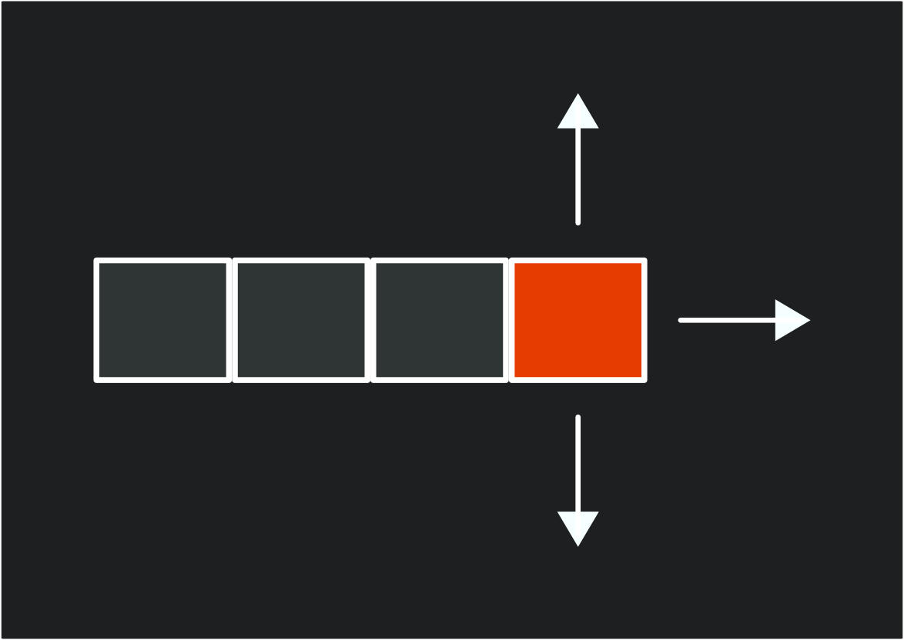

In the previous chapters, we've built all the fundamental systems needed for our game: [graphics](../07_optimizing_texture_rendering/index.md), [input](../11_input_management/index.md), [collision detection](../12_collision_detection/index.md), [audio](../15_audio_controller/index.md), [scene management](../17_scenes/index.md), and a [user interface](../19_user_interface/index.html).   Now it's time to transform our demo into a complete experience by implementing classic snake game mechanics. Before we do that, we first need to define what mechanics make a snake game.

In this chapter you will:

- Understand the core mechanics that define a classic snake-like game.
- Learn how to implement grid-based movement with timed intervals.
- Create a segmented character that grows when collecting objects.
- Implement game state management for playing, paused, and game over conditions.
- Encapsulate related fields and properties into game components.
- Build a complete game loop with clear objectives and increasing difficulty.

## Understanding Snake Game Mechanics

In a classic snake-like game, the mechanics follow a set of simple but engaging rules:

1. The player controls a snake by telling it to move in one of four cardinal directions (up, down, left, and right).
2. The actual movement of the snake occurs at regular timed intervals, creating a grid-based movement pattern.
3. When the snake eats food, it grows longer by adding a new segment to its tail.
4. If the snake collides with a wall or its own body, the game ends.

The mechanics create an increasingly challenging experience as the snake grows longer, requiring planning and reflexes to avoid collision.

### Directions

In snake, players input a cardinal direction (up, down, left or right), to indicate which direction the snake will move during the next movement cycle.  When direction input occurs, it must be checked against the current direction to determine if the move is valid.

For example, if the snake is currently moving to the right, an invalid input would be to allow a player to move it to the left.  Doing so would cause the head of the snake to reverse direction and immediately collide with the first body segment. This means the only valid inputs are those where the next direction would the same as the current direction or perpendicular to the current direction.

|  |
| :--------------------------------------------------------------------------------: |
|                **Figure 22-1: Valid directions for snake movement**                |

### Movement Cycle

Instead of moving every update frame as a directional input is being pressed, the snake instead only moves during regular timed intervals.  A timer is used to determine how much time has passed since the last movement cycle, and when it reaches a set threshold, the next movement cycle occurs.  During this movement cycle, the snake should move forward in the direction that was input by the player between the last and current movement cycles.  This creates the grid-based movement system typically found in snake games.

There are various methods for handling the movement, such as iterating through each segment of the snake and updating the position of that segment to move forward.  Methods such as this though are wasteful, since visually the only parts of the snake that actually move on the screen are the head and the tail.  

Instead, a more common approach is to:

1. Make a copy of the head segment.
2. Update the properties of the copy so that it is positioned where the original head segment would have moved to
3. Insert the copy at the front of the segment collection.
4. Remove the tail segment.

By doing this, no matter how may segments the snake body has, we only ever need to update two of them, the head and the tail. This is demonstrated in the following diagram:

|  |
| :-----------------------------------------------------------------------------------------------------: |
|               **Figure 22-2: Diagram of the steps during the movement cycle for a snake**               |

### Growth

The next core mechanic for a snake-like game is the growth of the snake.  Typically, somewhere in the game is an objective for the snake to eat, such as an apple.  When the head of the snake reaches this objective, a new segment is added to the snake's body, making it longer, the player's score is increased, and a new objective is spawned at a random location within the game.

This mechanic also acts as an artificial difficulty curve for the game.  As the body of the snake grows longer, it requires planning to avoid creating situations where the snake becomes trapped by its own body making it impossible to avoid a collision.

### Game Over

The challenge in a snake-like game is to avoid colliding with either a wall or another segment of the snake body.  Doing so will cause a game over condition as the snake can no longer continue moving forward.

## Implementing Snake-Like Mechanics In Our Game

Now that we have a foundational set of rules in place for the mechanics of a snake-like game, let's implement them into the current demo we've been building up. Our game will adapt these mechanics to fit them into our existing game structure:

- Instead of a snake, we will use the slime and create a chain of slime segments that are following the slime at the front.
- The player will control the direction of the slime segment
- The bat will serve as the objective to acquire to grow the slime segment.
- Collisions with either the walls of the room or a slime segment will result in a game over state.

As we implement these mechanics, we're also going to be creating classes that encapsulate the properties and functions of existing implementations in the game scene, such as the slime and the bat.  For example, currently the game scene tracks fields for the `AnimatedSprite` and position of the slime, as well as updating, input handling, and drawing the slime.  These can be moved into their own dedicated classes encapsulate the functionality and to also clean up the code in the game scene that has grown quite large.

### The GameController Class

Currently, we have two methods dedicated to handling input in the game scene, `CheckKeyboardInput` and `CheckGamePadInput`.  Both of these methods essentially perform the same logic across different input devices. This presents an opportunity to improve our code.

To simplify input handling for the game, we can create a dedicated class that consolidates the input methods, providing a unified input profile for the game.  This pattern is widely used in game development to separate the "what" (game actions) from the "how" (specific input devices and buttons).

In the game project, create a new file named **GameController.cs** and add the following code:

```cs
using Microsoft.Xna.Framework.Input;
using MonoGameLibrary;
using MonoGameLibrary.Input;

namespace DungeonSlime;

/// <summary>
/// Provides a game-specific input abstraction that maps physical inputs
/// to game actions, bridging our input system with game-specific functionality.
/// </summary>
public class GameController
{
    private KeyboardInfo _keyboard;
    private GamePadInfo _gamePad;

    /// <summary>
    /// Creates a new GameController that handles input for the game.
    /// </summary>
    public GameController()
    {
        _keyboard = Core.Input.Keyboard;
        _gamePad = Core.Input.GamePads[0];
    }

    /// <summary>
    /// Returns true if the player has triggered the "move up" action.
    /// </summary>
    public bool MoveUp()
    {
        return _keyboard.WasKeyJustPressed(Keys.Up) ||
               _keyboard.WasKeyJustPressed(Keys.W) ||
               _gamePad.WasButtonJustPressed(Buttons.DPadUp) ||
               _gamePad.WasButtonJustPressed(Buttons.LeftThumbstickUp);
    }

    /// <summary>
    /// Returns true if the player has triggered the "move down" action.
    /// </summary>
    public bool MoveDown()
    {
        return _keyboard.WasKeyJustPressed(Keys.Down) ||
               _keyboard.WasKeyJustPressed(Keys.S) ||
               _gamePad.WasButtonJustPressed(Buttons.DPadDown) ||
               _gamePad.WasButtonJustPressed(Buttons.LeftThumbstickDown);
    }

    /// <summary>
    /// Returns true if the player has triggered the "move left" action.
    /// </summary>
    public bool MoveLeft()
    {
        return _keyboard.WasKeyJustPressed(Keys.Left) ||
               _keyboard.WasKeyJustPressed(Keys.A) ||
               _gamePad.WasButtonJustPressed(Buttons.DPadLeft) ||
               _gamePad.WasButtonJustPressed(Buttons.LeftThumbstickLeft);
    }

    /// <summary>
    /// Returns true if the player has triggered the "move right" action.
    /// </summary>
    public bool MoveRight()
    {
        return _keyboard.WasKeyJustPressed(Keys.Right) ||
               _keyboard.WasKeyJustPressed(Keys.D) ||
               _gamePad.WasButtonJustPressed(Buttons.DPadRight) ||
               _gamePad.WasButtonJustPressed(Buttons.LeftThumbstickRight);
    }

    /// <summary>
    /// Returns true if the player has triggered the "pause" action.
    /// </summary>
    public bool Pause()
    {
        return _keyboard.WasKeyJustPressed(Keys.Escape) ||
               _gamePad.WasButtonJustPressed(Buttons.Start);
    }

    /// <summary>
    /// Returns true if the player has triggered the "action" button,
    /// typically used for menu confirmation.
    /// </summary>
    public bool Action()
    {
        return _keyboard.WasKeyJustPressed(Keys.Enter) ||
               _gamePad.WasButtonJustPressed(Buttons.A);
    }
}
```

The `GameController` class implements an important design pattern in game development known as "Input Abstraction" or "Command" pattern.  This pattern separates what happens in the game (the actions) from how players trigger those actions (the inputs).

This separation provides several benefits, including:

1. **Input Device Independence**: The game logic doesn't need to know which input device the player is using. Whether they're playing with a keyboard, gamepad, or touch screen, the game only cares that a "move up" action was triggered, not which specific button or key caused it.
2. **Simplified Input Handling**: Instead of checking multiple input combinations throughout the codebase, game objects can simply ask "should i move up?" through a clean API call.
3. **Easy Rebinding**: If you want to add key rebinding features, you only need to modify the `GameController` class, not every piece of code that uses input.
4. **Consistent Input Logic**: The rules for determining if an action occurred (like checking if a button was just pressed version being held down) are defined in one place.
5. **Cross-Platform Compatibility**: When porting to different platforms with different input methods, you only need to update the `GameController` class to map the new input devices to your existing game actions.

By implementing this pattern in our game, we are not only making our current input handling cleaner, but we are also establishing a foundation that would make it easier to add features like input customization or support for new input devices in the future.

### The SlimeSegment Struct

Next, we will need to implement a structure that can represent each segment of the slime.  This structure will store the position and movement data for each segment.

In the game project, create a new directory named *GameObjects*.  We will be putting all of our code related to the objects within the game here.  Next, create a new file named *SlimeSegment.cs* inside the *GameObjects* directory you just created and add the following code:

```cs
using Microsoft.Xna.Framework;

namespace DungeonSlime;

public struct SlimeSegment
{
    /// <summary>
    /// The position this slime segment is at before the movement cycle occurs.
    /// </summary>
    public Vector2 At;

    /// <summary>
    /// The position this slime segment should move to during the next movement cycle.
    /// </summary>
    public Vector2 To;

    /// <summary>
    /// The direction this slime segment is moving.
    /// </summary>
    public Vector2 Direction;

    /// <summary>
    /// The opposite direction this slime segment is moving.
    /// </summary>
    public Vector2 ReverseDirection => new Vector2(-Direction.X, -Direction.Y);
}
```

This structure contains fields to track:

- `At`: The current position of the segment.
- `To`: The position the segment will move to during the next movement cycle if it is the head segment.
- `Direction`: A normalized vector representing the direction the segment is moving in.
- `ReverseDirection`: A computed property that returns the opposite of the `Direction` property.

By tracking both the current (`At`) and target (`To`) positions, we can implement smooth visual movement between grid positions, creating more fluid animations than the traditional stutter step movement seen in classic snake games.  We will explore this concept a little further in this chapter.

### The Slime Class

Next, let's implement a class to encapsulate the properties and functionality of our snake-like slime.  In the *GameObjects* directory, create a new file named *Slime.cs* and add the following initial code:

```cs
using System;
using System.Collections.Generic;
using Microsoft.Xna.Framework;
using MonoGameLibrary;
using MonoGameLibrary.Graphics;

namespace DungeonSlime.GameObjects;

public class Slime
{

}
```

#### Slime Fields

Add the following fields to the `Slime` class:

```cs
// A constant value that represents the amount of time to wait between
// movement updates.
private static readonly TimeSpan s_movementTime = TimeSpan.FromMilliseconds(10000);

// The amount of time that has elapsed since the last movement update.
private TimeSpan _movementTimer;

// Normalized value (0-1) representing progress between movement ticks for visual interpolation
private float _movementProgress;

// The next direction to apply to the head of the slime chain during the
// next movement update.
private Vector2 _nextDirection;

// The number of pixels to move the head segment during the movement cycle.
private float _stride;

// Tracks the segments of the slime chain.
private List<SlimeSegment> _segments;

// The AnimatedSprite used when drawing each slime segment
private AnimatedSprite _sprite;
```

Let's breakdown what each of these fields is responsible for:

- `s_movementTime`: This constant represents how long the slime waits between movement cycles (300ms). This creates the classic snake game's grid-based movement feel, where the snake moves at regular intervals rather than continuously.
- `_movementTime`: This field accumulates elapsed time until it reaches the movement threshold. When it does, the slime moves one grid cell and the timer resets.
- `_movementProgress`: This normalized value (0-1) represents progress between movement ticks and is used for visual interpolation. It allows us to smoothly animate the slime's movement between grid positions.
- `_nextDirection`: This stores the direction that will be applied to the head segment during the next movement cycle.
- `_stride`: This represents the total number of pixels the head segment should move during movement cycles.
- `_segments`: This collection holds all the `SlimeSegment` structures that make up the slime's body. The first segment is the head, and the rest form the trailing body.
- `_sprite`: This stores the `AnimatedSprite` that is used to draw each segment of the slime.

These fields implement core snake-like mechanics - the timed interval movement, direction control, and the segmented body that forms the snake.

#### Slime Events

Next, add the following event to the `Slime` class:

```cs
/// <summary>
/// Event that is raised if it is detected that the head segment of the slime
/// has collided with a body segment.
/// </summary>
public event EventHandler BodyCollision;
```

This event will allow the `Slime` class to notify the game scene when the head of the slime collides with another segment, triggering a game over.

#### Slime Constructor

Next, add the following constructor to the `Slime` class:

```cs
/// <summary>
/// Creates a new Slime using the specified animated sprite.
/// </summary>
/// <param name="sprite">The AnimatedSprite to use when drawing the slime.</param>
public Slime(AnimatedSprite sprite)
{
    _sprite = sprite;
}
```

This is a simple constructor that requires the slime be given the `AnimatedSprite` that will be used to draw each of the slime segments.

#### Slime Initialization

Add the following `Initialization` method to the `Slime` class:

```cs
/// <summary>
/// Initializes the slime, can be used to reset it back to an initial state.
/// </summary>
/// <param name="startingPosition">The position the slime should start at.</param>
/// <param name="stride">The total number of pixels to move the head segment during each movement cycle.</param>
public void Initialize(Vector2 startingPosition, float stride)
{
    // Initialize the segment collection.
    _segments = new List<SlimeSegment>();

    // Set the stride
    _stride = stride;

    // Create the initial head of the slime chain.
    SlimeSegment head = new SlimeSegment();
    head.At = startingPosition;
    head.To = startingPosition + new Vector2(_stride, 0);
    head.Direction = Vector2.UnitX;

    // Add it to the segment collection.
    _segments.Add(head);

    // Set the initial next direction as the same direction the head is
    // moving.
    _nextDirection = head.Direction;

    // Zero out the movement timer.
    _movementTimer = TimeSpan.Zero;
}
```

With this method we can initialize, or reset the, state of slime.  It:

- Instantiates a new segment collection.
- Creates the initial head segment and positions it at the specific `startingPosition`.
- Sets the initial direction to be to the right.
- Initializes the movement timer to zero.

#### Slime Input Handling

Next, let's add the method that will handle input for the `Slime` class:

```cs
private void HandleInput()
{
    Vector2 potentialNextDirection = _nextDirection;

    if (GameController.MoveUp())
    {
        potentialNextDirection = -Vector2.UnitY;
    }
    else if (GameController.MoveDown())
    {
        potentialNextDirection = Vector2.UnitY;
    }
    else if (GameController.MoveLeft())
    {
        potentialNextDirection = -Vector2.UnitX;
    }
    else if (GameController.MoveRight())
    {
        potentialNextDirection = Vector2.UnitX;
    }

    // Only allow direction change if it is not reversing the current
    // direction.  This prevents the slime from backing into itself.
    float dot = Vector2.Dot(potentialNextDirection, _segments[0].Direction);
    if (dot >= 0)
    {
        _nextDirection = potentialNextDirection;
    }
}
```

This method will:

1. Determine if the player is attempting to change directions instead of directly moving the slime.  This direction change will get applied later during the movement cycle update.
2. Uses [**Vector2.Dot**](xref:xref:Microsoft.Xna.Framework.Vector2.Dot(Microsoft.Xna.Framework.Vector2,Microsoft.Xna.Framework.Vector2)) to prevent the slime from reversing into itself, causing an immediate collision and game over state.
3. Updates the `_nextDirection` value only if the direction input is valid.

> [!NOTE]
> The dot product measures how much two vectors point in the same direction. It is:
>
> - Positive if they are pointing in the same direction.
> - Negative if they are pointing in opposite directions.
> - Zero when they are perpendicular.
>
> By using dot product here, this effectively implements the classic snake-like game rule that you cannot turn 180° into yourself.

#### Slime Movement Cycle

Next, we will add the method to perform the logic for the snake-like movement cycle of the slime.  Add the following methods to the `Slime` class:

```cs
private void Move()
{
    // Capture the value of the head segment
    SlimeSegment head = _segments[0];

    // Update the direction the head is supposed to move in to the
    // next direction cached.
    head.Direction = _nextDirection;

    // Update the head's "at" position to be where it was moving "to"
    head.At = head.To;

    // Update the head's "to" position to the next tile in the direction
    // it is moving.
    head.To = head.At + head.Direction * _stride;

    // Insert the new adjusted value for the head at the front of the
    // segments and remove the tail segment. This effectively moves
    // the entire chain forward without needing to loop through every
    // segment and update its "at" and "to" positions.
    _segments.Insert(0, head);
    _segments.RemoveAt(_segments.Count - 1);

    // Iterate through all of the segments except the head and check
    // if they are at the same position as the head. If they are, then
    // the head is colliding with a body segment and a body collision
    // has occurred.
    for (int i = 1; i < _segments.Count; i++)
    {
        SlimeSegment segment = _segments[i];

        if (head.At == segment.At)
        {
            if(BodyCollision != null)
            {
                BodyCollision.Invoke(this, EventArgs.Empty);
            }

            return;
        }
    }
}
```

This method performs the core snake-like movement cycle logic by:

1. Copying the value of the current head segment.
2. Updating the copy's position (`At`) to where the head was moving to and updating the position it is moving to (`To`).
3. Inserts the copy into the front of the segment collection and removes the tail.
4. Checks if the head is now at the same position as any body segments, which would cause a collision and trigger a game over.

> [!NOTE]
> By inserting a new head segment at the front of the chain and removing the last segment, this creates the illusion of the entire chain moving forward as one using, even though we're only actually moving the head forward and removing the tail.
>
> This follows the common snake movement pattern as discussed in the [Understanding Snake Game Mechanics: Movement Cycle](#movement-cycle) section above.

#### Slime Growth

Next, we will add the following method to the `Slime` class to implement the snake-like growth method:

```cs
/// <summary>
/// Informs the slime to grow by one segment.
/// </summary>
public void Grow()
{
    // Capture the value of the tail segment
    SlimeSegment tail = _segments[_segments.Count - 1];

    // Create a new tail segment that is positioned a grid cell in the
    // reverse direction from the tail moving to the tail.
    SlimeSegment newTail = new SlimeSegment();
    newTail.At = tail.To + tail.ReverseDirection * _stride;
    newTail.To = tail.At;
    newTail.Direction = Vector2.Normalize(tail.At - newTail.At);

    // Add the new tail segment
    _segments.Add(newTail);
}
```

Let's breakdown how this method works

1. First it creates a copy of the current tail value.
2. It then adjusts the values of the copy so that it is now position behind the current tail by using the `ReverseDirection` value of the tail.
3. Finally, it inserts this new tail into the segments collection.

#### Slime Update

Next, we will add the method to update the slime each game update cycle.  Add the following method to the `Slime` class:

```cs
/// <summary>
/// Updates the slime.
/// </summary>
/// <param name="gameTime">A snapshot of the timing values for the current update cycle.</param>
public void Update(GameTime gameTime)
{
    // Update the animated sprite.
    _sprite.Update(gameTime);

    // Handle any player input
    HandleInput();

    // Increment the movement timer by the frame elapsed time.
    _movementTimer += gameTime.ElapsedGameTime;

    // If the movement timer has accumulated enough time to be greater than
    // the movement time threshold, then perform a full movement.
    if (_movementTimer >= s_movementTime)
    {
        _movementTimer -= s_movementTime;
        Move();
    }

    // Update the movement lerp offset amount
    _movementProgress = (float)(_movementTimer.TotalSeconds / s_movementTime.TotalSeconds);
}
```

This update method:

1. Updates the slime's `AnimatedSprite` to ensure the sprite animations occur.
2. Calls `HandleInput` to check for player input
3. Increments the movement timer by the amount of time that has elapsed between the game's update cycles.
4. Performs a check to see if the movement timer has accumulated more time than the threshold to perform a movement cycle update.  If it has then
   1. The movement timer is reduced by the threshold time.
   2. The `Move` method is called to perform a movement cycle update.
5. Finally, the movement progress amount is calculated by dividing the number of seconds accumulated for the movement timer by the number of seconds for the threshold.  This gives us a normalized value between 0.0 and 1.0 that we can use for visual interpolation for fluid movement.

> [!TIP]
> In games, frame rates can vary based on system performance, causing inconsistent update intervals.  If we simply reset the movement timer to zero after each movement cycle, we would lose any excess time that accumulated beyond the movement threshold.
>
> For example:
>
> - Our movement threshold is 300ms.
> - The game runs at 60fps (16.67ms per frame).
> - After 18 frames, we have accumulated 300.06ms.
> - If we reset to zero, we lose 0.06ms.
> - Over time, these small losses can add up and causing inconsistent movement.
>
> By subtracting the threshold instead of resetting to zero, we "bank" the excess time (0.06ms in this example) for th next movement cycle.  This ensures that:
>
> 1. Movement happens exactly at the intended frequency, maintaining consistent game speed.
> 2. The visual smoothness of movement remains intact even if the game occasionally drops frames.
> 3. Players experience the same game timing regardless of their hardware's performance.
>
> This technique is standard practice in game development, especially for timing-sensitive mechanics like rhythmic games, animations, and movement systems.  It is a simple solution that significantly improves gameplay consistency.

#### Slime Draw

Next, we need a method to call to draw the slime to the game screen.  Add the following method to the `Slime` class:

```cs
 /// <summary>
/// Draws the slime.
/// </summary>
public void Draw()
{
    // Iterate through each segment and draw it
    foreach (SlimeSegment segment in _segments)
    {
        // Calculate the visual position of the segment at the moment by
        // lerping between its "at" and "to" position by the movement
        // offset lerp amount
        Vector2 pos = Vector2.Lerp(segment.At, segment.To, _movementProgress);

        // Draw the slime sprite at the calculated visual position of this
        // segment
        _sprite.Draw(Core.SpriteBatch, pos);
    }
}
```

This draw method iterates each segment of the slime and calculates the visual position to draw each segment at by performing linear interpolation (lerp) to determine the position of the segment between its current position (`At`) and the position it is moving to (`To`) based on the `_movementProgress` calculation.

> [!NOTE]
> [**Vector2.Lerp**](xref:Microsoft.Xna.Framework.Vector2.Lerp(Microsoft.Xna.Framework.Vector2,Microsoft.Xna.Framework.Vector2,System.Single)) performs a linear interpolation between two vectors, creating a smooth transition from start to end based on an amount parameter.  The formula is:
>
> $\text{result} = \text{start} + (\text{end} - \text{start}) \cdot \text{amount}$
>
> Where the amount parameter ranges from 0.0 (returns the start position) to 1.0 (returns the end position).  Values between 0.0 and 1.0 give positions along the straight line between start and end.
>
> In our game, this is used to create a visual fluid movement illusion by interpolating between a segment's current position (`At`) and its target position (`To`) based on the elapsed time, rather than having the segments abruptly jump from one grid position to the next after each movement update.

#### Slime Bounds

For the game scene to detect collisions between the slime and other elements (walls or the bat), we need a method to calculate the current collision bounds. Add the following method to the `Slime` class:

```cs
/// <summary>
/// Returns a Circle value that represents collision bounds of the slime.
/// </summary>
/// <returns>A Circle value.</returns>
public Circle GetBounds()
{
    SlimeSegment head = _segments[0];

    // Calculate the visual position of the head at the moment of this
    // method call by lerping between the "at" and "to" position by the
    // movement offset lerp amount
    Vector2 pos = Vector2.Lerp(head.At, head.To, _movementProgress);

    // Create the bounds using the calculated visual position of the head.
    Circle bounds = new Circle(
        (int)(pos.X + (_sprite.Width * 0.5f)),
        (int)(pos.Y + (_sprite.Height * 0.5f)),
        (int)(_sprite.Width * 0.5f)
    );

    return bounds;
}
```

This method takes the current head segment (the first segment in our collection), calculates its visual position using linear interpolation, then creates a `Circle` value to represent its collision boundary. Using the interpolated position ensures that collision detection aligns with what the player sees on screen.

> [!NOTE]
> We only need collision bounds for the slime's head for interactions with the bat and walls, as this matches the classic snake game mechanic where only the head's collisions matter for gameplay. For detecting collisions between the head and body segments, we use a simpler position-based check in the `Move` method since those positions are always aligned to the grid.

### The Bat Class

Next is the `Bat` class that will encapsulate the properties and functionality of the bat. In the *GameObjects* directory, create a new file named *Bat.cs* and add the following initial code:

```cs
using System;
using Microsoft.Xna.Framework;
using Microsoft.Xna.Framework.Audio;
using MonoGameLibrary;
using MonoGameLibrary.Graphics;

namespace DungeonSlime.GameObjects;

public class Bat
{

}
```

#### Bat Fields

Add the following fields to the `Bat` class:

```cs
private const float MOVEMENT_SPEED = 5.0f;

// The velocity of the bat that defines the direction and how much in that
// direction to update the bats position each update cycle.
private Vector2 _velocity;

// The AnimatedSprite used when drawing the bat.
private AnimatedSprite _sprite;

// The sound effect to play when the bat bounces off the edge of the room.
private SoundEffect _bounceSoundEffect;
```

Let's breakdown what each of these fields is responsible for:

- `MOVEMENT_SPEED`: This constant represents the factor to multiply the velocity vector by to determine how fast the bat is moving.
- `_velocity`: A vector that defines the direction and how much in that direction to update the position of the bat each update cycle.
- `_sprite`: This stores the `AnimatedSprite` that is used to draw bat.
- `_bounceSoundEffect`: This store the [**SoundEffect**](xref:Microsoft.Xna.Framework.Audio.SoundEffect) to play when the bat is told to bounce.

#### Bat Properties

Add the following property to the `Bat` class:

```cs
/// <summary>
/// Gets or Sets the position of the bat.
/// </summary>
public Vector2 Position { get; set;}
```

This property exposes the position of the bat so it can be used for calculations in the game scene when determining where to place the bat after the slime eats it.

#### Bat Constructor

Next, add the following constructor to the `Slime` class:

```cs
/// <summary>
/// Creates a new Bat using the specified animated sprite and sound effect.
/// </summary>
/// <param name="sprite">The AnimatedSprite ot use when drawing the bat.</param>
/// <param name="bounceSoundEffect">The sound effect to play when the bat bounces off a wall.</param>
public Bat(AnimatedSprite sprite, SoundEffect bounceSoundEffect)
{
    _sprite = sprite;
    _bounceSoundEffect = bounceSoundEffect;
}
```

This is a simple constructor that requires the bat be given the `AnimatedSprite` that will be used to draw the bat and the [**SoundEffect**](xref:Microsoft.Xna.Framework.Audio.SoundEffect) to be played when the bat bounces off a wall.

#### Bat Randomize Velocity

Next, we need a method that the game scene can call to randomize the velocity of the bat after it has been eaten by the slime.  To do this, we can take the `AssignRandomVelocity` method we originally added to the `GameScene` and move it here.  Add the following method to the `Bat` class:

```cs
/// <summary>
/// Randomizes the velocity of the bat.
/// </summary>
public void RandomizeVelocity()
{
    // Generate a random angle
    float angle = (float)(Random.Shared.NextDouble() * MathHelper.TwoPi);

    // Convert the angle to a direction vector
    float x = (float)Math.Cos(angle);
    float y = (float)Math.Sin(angle);
    Vector2 direction = new Vector2(x, y);

    // Multiply the direction vector by the movement speed to get the
    // final velocity
    _velocity = direction * MOVEMENT_SPEED;
}
```

#### Bat Bounce

Next is the `Bounce` method. This method can be called from the game scene to inform the bat that is should bounce off of a wall.  Add the following method to the `Bat` class:

```cs
/// <summary>
/// Handles a bounce event when the bat collides with a wall or boundary.
/// </summary>
/// <param name="normal">The normal vector of the surface the bat is bouncing against.</param>
public void Bounce(Vector2 normal)
{
    Vector2 newPosition = Position;

    // Adjust the position based on the normal to prevent sticking to walls.
    if(normal.X != 0)
    {
        // We are bouncing off a vertical wall (left/right).
        // Move slightly away from the wall in the direction of the normal.
        newPosition.X += normal.X * (_sprite.Width * 0.1f);
    }

    if(normal.Y != 0)
    {
        // We are bouncing off a horizontal wall (top/bottom).
        // Move slightly way from the wall in the direction of the normal.
        newPosition.Y += normal.Y * (_sprite.Height * 0.1f);
    }

    // Apply the new position
    Position = newPosition;

    // Apply reflection based on the normal.
    _velocity = Vector2.Reflect(_velocity, normal);

    // Play the bounce sound effect.
    Core.Audio.PlaySoundEffect(_bounceSoundEffect);
}
```

This method only takes a single parameter, the [normal vector](../12_collision_detection/index.md#bounce-collision-response) of the surface the bat is bouncing against.  Based on the X and Y components of the normal vector, we can determine which wall the bat bounced against and adjust the position of the bat so that it doesn't stick to the wall.

#### Bat Bounds

Similar to the [`Slime` class](#slime-bounds), for the game scene to detect collision between the bat and other elements, we need a method to calculate the current collision bounds of the bat.  Add the following method to the `Bat` class:

```cs
/// <summary>
/// Returns a Circle value that represents collision bounds of the bat.
/// </summary>
/// <returns>A Circle value.</returns>
public Circle GetBounds()
{
    int x = (int)(Position.X + _sprite.Width * 0.5f);
    int y = (int)(Position.Y + _sprite.Height * 0.5f);
    int radius = (int)(_sprite.Width * 0.25f);

    return new Circle(x, y, radius);
}
```

#### Bat Update

Next, add the following `Update` method to the `Bat` class:

```cs
/// <summary>
/// Updates the bat.
/// </summary>
/// <param name="gameTime">A snapshot of the timing values for the current update cycle.</param>
public void Update(GameTime gameTime)
{
    // Update the animated sprite
    _sprite.Update(gameTime);

    // Update the position of the bat based on the velocity.
    Position += _velocity;
}
```

This method simply updates the bat's `AnimatedSprite` to ensure animations occur and adjusts the position of the bat based on the current velocity.

> [!NOTE]
> The continuous movement of the bat contrasts with the grid-based interval movement of the slime, creating different gameplay dynamics for the player to consider.  This makes catching the bat challenging without requiring any complex behaviors.

#### Bat Draw

Finally, add the following `Draw` method to the `Bat` class:

```cs
/// <summary>
/// Draws the bat.
/// </summary>
public void Draw()
{
    _sprite.Draw(Core.SpriteBatch, Position);
}
```

This method simply draws the bat's `AnimatedSprite` at the bat's current position.

### The GameSceneUI Class

Currently the `GameScene` class contains the methods for initializing and creating the pause menu.  However, now that we have a defined condition for game over, we need to create a game over menu as well.  To do this, we could create the game over menu directly inside the `GameScene` class the same way we did with the pause menu, or we can take this as another opportunity to refactor the code and pull the UI specific code into its own class.

In the *UI* directory of the game project, create a new file named *GameSceneUI* and add the following initial code:

```cs
using System;
using Gum.DataTypes;
using Gum.Managers;
using Microsoft.Xna.Framework;
using Microsoft.Xna.Framework.Audio;
using Microsoft.Xna.Framework.Content;
using MonoGameGum;
using MonoGameGum.Forms.Controls;
using MonoGameGum.GueDeriving;
using MonoGameLibrary;
using MonoGameLibrary.Graphics;

namespace DungeonSlime.UI;

public class GameSceneUI : ContainerRuntime
{

}
```

#### GameSceneUI Fields

Add the following fields to the `GameSceneUI` class:

```cs
// The string format to use when updating the text for the score display.
private static readonly string s_scoreFormat = "SCORE: {0:D6}";

// The sound effect to play for auditory feedback of the user interface.
private SoundEffect _uiSoundEffect;

// A colored rectangle used to overlay the game scene when the pause or
// game over panels are visible.
private ColoredRectangleRuntime _overlay;

// The pause panel
private Panel _pausePanel;

// The resume button on the pause panel. Field is used to track reference so
// focus can be set when the pause panel is shown.
private AnimatedButton _resumeButton;

// The game over panel.
private Panel _gameOverPanel;

// The retry button on the game over panel. Field is used to track reference
// so focus can be set when the game over panel is shown.
private AnimatedButton _retryButton;

// The text runtime used to display the players score on the game screen.
private TextRuntime _scoreText;
```

Let's breakdown what each of these fields is responsible for:

- `s_scoreFormat`: A string format template used to display the player's score with leading zeros.
- `_uiSoundEffect`: Stores the sound effect played for UI interactions like button clicks and focus changes.
- `_overlay`: A semi-transparent overlay that darkens the game screen when a menu is displayed.
- `_pausePanel`: The panel containing the UI elements shown when the game is paused.
- `_resumeButton`: A reference to the resume button, allowing us to set focus on it when the pause panel is shown.
- `_gameOverPanel`: The panel containing the UI elements shown when a game over occurs.
- `_retryButton`: A reference to the retry button, allowing us to set focus to it when the game over panel is shown.
- `_scoreText`: The text display showing the player's current score.

#### GameSceneUI Events

Add the following events to the `GameSceneUI` class:

```cs
/// <summary>
/// Event invoked when the Resume button on the Pause panel is clicked.
/// </summary>
public event EventHandler ResumeButtonClick;

/// <summary>
/// Event invoked when the Quit button on either the Pause panel or the
/// Game Over panel is clicked.
/// </summary>
public event EventHandler QuitButtonClick;

/// <summary>
/// Event invoked when the Retry button on the Game Over panel is clicked.
/// </summary>
public event EventHandler RetryButtonClick;
```

These events allow the `GameSceneUI` class to notify the `GameScene` when important UI actions occur:

- `ResumeButtonClick`: Triggered when the player click the Resume button on the pause panel.
- `QuitButtonClick`: Triggered when the player clicks the Quit button on either panel.
- `RetryButtonClick`: Triggered when the player clicks the Retry button on the game over panel.

#### GameSceneUI Constructor

Add the following constructor to the `GameSceneUI` class:

```cs
/// <summary>
/// Creates a new GameSceneUI instance.
/// </summary>
public GameSceneUI()
{
    // The game scene UI inherits from ContainerRuntime, so we set its
    // dock to fill so it fills the entire screen.
    Dock(Gum.Wireframe.Dock.Fill);

    // Add it to the root element.
    this.AddToRoot();

    // Get a reference to the content manager that was registered with the
    // GumService when it was original initialized.
    ContentManager content = GumService.Default.ContentLoader.XnaContentManager;

    // Use that content manager to load the sound effect and atlas for the
    // user interface elements
    _uiSoundEffect = content.Load<SoundEffect>("audio/ui");
    TextureAtlas atlas = TextureAtlas.FromFile(content, "images/atlas-definition.xml");

    // Create the text that will display the players score and add it as
    // a child to this container.
    CreateScoreText();
    AddChild(_scoreText);

    // Create the background overlay that fills the container with a
    // transparent blue background when the pause panel or game over
    // panel is shown to visually take focus away from the active game and
    // add it as a child to this container.
    CreateOverlay();
    AddChild(_overlay);

    // Create the Pause panel that is displayed when the game is paused and
    // add it as a child to this container
    CreatePausePanel(atlas);
    AddChild(_pausePanel.Visual);

    // Create the Game Over panel that is displayed when a game over occurs
    // and add it as a child to this container
    CreateGameOverPanel(atlas);
    AddChild(_gameOverPanel.Visual);
}
```

This constructor initializes all UI components:

1. Sets the container to fill the entire screen.
2. Adds itself to Gum's root element.
3. Loads necessary assets (sound effect and texture atlas).
4. Creates and adds child elements in the correct order.

#### GameSceneUI UI Creation Methods

Now let's add the methods to create the various UI elements.  First, the method to create the score text display:

```cs
private void CreateScoreText()
{
    _scoreText = new TextRuntime();
    _scoreText.Anchor(Gum.Wireframe.Anchor.TopLeft);
    _scoreText.WidthUnits = DimensionUnitType.RelativeToChildren;
    _scoreText.X = 20.0f;
    _scoreText.Y = 5.0f;
    _scoreText.UseCustomFont = true;
    _scoreText.CustomFontFile = @"fonts/04b_30.fnt";
    _scoreText.FontScale = 0.25f;
    _scoreText.Text = string.Format(s_scoreFormat, 0);
}
```

Next, add the method to create the semi-transparent overlay:

```cs
private void CreateOverlay()
{
    _overlay = new ColoredRectangleRuntime();
    _overlay.Dock(Gum.Wireframe.Dock.Fill);
    _overlay.Red = 20;
    _overlay.Green = 23;
    _overlay.Blue = 47;
    _overlay.Alpha = 175;
    _overlay.Visible = false;
}
```

The, add the method to create the pause panel:

```cs
private void CreatePausePanel(TextureAtlas atlas)
{
    _pausePanel = new Panel();
    _pausePanel.Anchor(Gum.Wireframe.Anchor.Center);
    _pausePanel.Visual.WidthUnits = DimensionUnitType.Absolute;
    _pausePanel.Visual.HeightUnits = DimensionUnitType.Absolute;
    _pausePanel.Visual.Width = 264.0f;
    _pausePanel.Visual.Height = 70.0f;
    _pausePanel.IsVisible = false;

    TextureRegion backgroundRegion = atlas.GetRegion("panel-background");

    NineSliceRuntime background = new NineSliceRuntime();
    background.Dock(Gum.Wireframe.Dock.Fill);
    background.Texture = backgroundRegion.Texture;
    background.TextureAddress = TextureAddress.Custom;
    background.TextureHeight = backgroundRegion.Height;
    background.TextureWidth = backgroundRegion.Width;
    background.TextureTop = backgroundRegion.SourceRectangle.Top;
    background.TextureLeft = backgroundRegion.SourceRectangle.Left;
    _pausePanel.AddChild(background);

    TextRuntime text = new TextRuntime();
    text.Text = "PAUSED";
    text.UseCustomFont = true;
    text.CustomFontFile = "fonts/04b_30.fnt";
    text.FontScale = 0.5f;
    text.X = 10.0f;
    text.Y = 10.0f;
    _pausePanel.AddChild(text);

    _resumeButton = new AnimatedButton(atlas);
    _resumeButton.Text = "RESUME";
    _resumeButton.Anchor(Gum.Wireframe.Anchor.BottomLeft);
    _resumeButton.Visual.X = 9.0f;
    _resumeButton.Visual.Y = -9.0f;

    _resumeButton.Click += OnResumeButtonClicked;
    _resumeButton.GotFocus += OnElementGotFocus;

    _pausePanel.AddChild(_resumeButton);

    AnimatedButton quitButton = new AnimatedButton(atlas);
    quitButton.Text = "QUIT";
    quitButton.Anchor(Gum.Wireframe.Anchor.BottomRight);
    quitButton.Visual.X = -9.0f;
    quitButton.Visual.Y = -9.0f;

    quitButton.Click += OnQuitButtonClicked;
    quitButton.GotFocus += OnElementGotFocus;

    _pausePanel.AddChild(quitButton);
}
```

Finally, add the method to create the game over panel:

```cs
private void CreateGameOverPanel(TextureAtlas atlas)
{
    _gameOverPanel = new Panel();
    _gameOverPanel.Anchor(Gum.Wireframe.Anchor.Center);
    _gameOverPanel.Visual.WidthUnits = DimensionUnitType.Absolute;
    _gameOverPanel.Visual.HeightUnits = DimensionUnitType.Absolute;
    _gameOverPanel.Visual.Width = 264.0f;
    _gameOverPanel.Visual.Height = 70.0f;
    _gameOverPanel.IsVisible = false;

    TextureRegion backgroundRegion = atlas.GetRegion("panel-background");

    NineSliceRuntime background = new NineSliceRuntime();
    background.Dock(Gum.Wireframe.Dock.Fill);
    background.Texture = backgroundRegion.Texture;
    background.TextureAddress = TextureAddress.Custom;
    background.TextureHeight = backgroundRegion.Height;
    background.TextureWidth = backgroundRegion.Width;
    background.TextureTop = backgroundRegion.SourceRectangle.Top;
    background.TextureLeft = backgroundRegion.SourceRectangle.Left;
    _gameOverPanel.AddChild(background);

    TextRuntime text = new TextRuntime();
    text.Text = "GAME OVER";
    text.UseCustomFont = true;
    text.CustomFontFile = "fonts/04b_30.fnt";
    text.FontScale = 0.5f;
    text.X = 10.0f;
    text.Y = 10.0f;
    _gameOverPanel.AddChild(text);

    _retryButton = new AnimatedButton(atlas);
    _retryButton.Text = "RETRY";
    _retryButton.Anchor(Gum.Wireframe.Anchor.BottomLeft);
    _retryButton.Visual.X = 9.0f;
    _retryButton.Visual.Y = -9.0f;

    _retryButton.Click += OnRetryButtonClicked;
    _retryButton.GotFocus += OnElementGotFocus;

    _gameOverPanel.AddChild(_retryButton);

    AnimatedButton quitButton = new AnimatedButton(atlas);
    quitButton.Text = "QUIT";
    quitButton.Anchor(Gum.Wireframe.Anchor.BottomRight);
    quitButton.Visual.X = -9.0f;
    quitButton.Visual.Y = -9.0f;

    quitButton.Click += OnQuitButtonClicked;
    quitButton.GotFocus += OnElementGotFocus;

    _gameOverPanel.AddChild(quitButton);
}
```

Each of these methods builds a specific part of the UI:

- `CreateScoreText`: Creates a text element to display the player's score.
- `CreateOverlay`: Creates a semi-transparent background to dim the game when panels are shown.
- `CreatePausePanel`: Builds the panel shown when the game is paused, including "Resume" and "Quit" buttons.
- `CreateGameOverPanel`: Builds the panel shown when a game over occurs, including "Retry" and "Quit" buttons.

#### GameSceneUI Event Handlers

Add the following event handler methods to the `GameSceneUI` class:

```cs
private void OnResumeButtonClicked(object sender, EventArgs args)
{
    // Button was clicked, play the ui sound effect for auditory feedback.
    Core.Audio.PlaySoundEffect(_uiSoundEffect);

    // Since the resume button was clicked, we need to hide the pause panel.
    HidePausePanel();

    // Invoke the ResumeButtonClick event
    if(ResumeButtonClick != null)
    {
        ResumeButtonClick(sender, args);
    }
}

private void OnRetryButtonClicked(object sender, EventArgs args)
{
    // Button was clicked, play the ui sound effect for auditory feedback.
    Core.Audio.PlaySoundEffect(_uiSoundEffect);

    // Since the retry button was clicked, we need to hide the game over panel.
    HideGameOverPanel();

    // Invoke the RetryButtonClick event.
    if(RetryButtonClick != null)
    {
        RetryButtonClick(sender, args);
    }
}

private void OnQuitButtonClicked(object sender, EventArgs args)
{
    // Button was clicked, play the ui sound effect for auditory feedback.
    Core.Audio.PlaySoundEffect(_uiSoundEffect);

    // Both panels have a quit button, so hide both panels
    HidePausePanel();
    HideGameOverPanel();

    // Invoke the QuitButtonClick event.
    if(QuitButtonClick != null)
    {
        QuitButtonClick(sender, args);
    }
}

private void OnElementGotFocus(object sender, EventArgs args)
{
    // A ui element that can receive focus has received focus, play the
    // ui sound effect for auditory feedback.
    Core.Audio.PlaySoundEffect(_uiSoundEffect);
}
```

These event handlers provide audio feedback and appropriate UI updates when buttons are clicked or UI elements receive focus.

#### GameSceneUI Public Methods

Finally, add the following public methods to the `GameSceneUI` class:

```cs
/// <summary>
/// Updates the text on the score display.
/// </summary>
/// <param name="score">The score to display.</param>
public void UpdateScoreText(int score)
{
    _scoreText.Text = string.Format(s_scoreFormat, score);
}

/// <summary>
/// Tells the game scene ui to show the pause panel.
/// </summary>
public void ShowPausePanel()
{
    // Make the overlay and the pause panel visible.
    _overlay.Visible = true;
    _pausePanel.IsVisible = true;

    // Give the resume button focus for keyboard/gamepad input.
    _resumeButton.IsFocused = true;

    // Ensure the game over panel isn't visible.
    _gameOverPanel.IsVisible = false;
}

/// <summary>
/// Tells the game scene ui to hide the pause panel.
/// </summary>
public void HidePausePanel()
{
    // Hide the overlay and the pause panel.
    _overlay.Visible = false;
    _pausePanel.IsVisible = false;
}

/// <summary>
/// Tells the game scene ui to show the game over panel.
/// </summary>
public void ShowGameOverPanel()
{
    // Make the overlay and the game over panel visible.
    _overlay.Visible = true;
    _gameOverPanel.IsVisible = true;

    // Give the retry button focus for keyboard/gamepad input.
    _retryButton.IsFocused =true;

    // Ensure the pause panel isn't visible.
    _pausePanel.IsVisible = false;
}

/// <summary>
/// Tells the game scene ui to hide the game over panel.
/// </summary>
public void HideGameOverPanel()
{
    // Hide the overlay and game over panel.
    _overlay.Visible = false;
    _gameOverPanel.IsVisible = false;
}

/// <summary>
/// Updates the game scene ui.
/// </summary>
/// <param name="gameTime">A snapshot of the timing values for the current update cycle.</param>
public void Update(GameTime gameTime)
{
    GumService.Default.Update(gameTime);
}

/// <summary>
/// Draws the game scene ui.
/// </summary>
public void Draw()
{
    GumService.Default.Draw();
}
```

These public methods provide the interface for the `GameScene` to:

- UPdate the score display.
- Show or hide the pause menu.
- Show or hide the game over menu.
- Update and draw the UI components.

By using this class, we encapsulate all UI-related functionality ina  single component that can easily be integrated with the game scene.

### The GameScene Class

Now that we have created the encapsulated [`Slime`](#the-slime-class), [`Bat`](#the-bat-class), and [`GameSceneUI`](#the-gamesceneui-class) classes, we can refactor the `GameScene` class to leverage these new components.  This will make our code more maintainable and allow use to focus on the game logic within the scene itself.  We will rebuild the `GameScene` class to coordinate the interactions between the components.

In the *Scenes* directory of the game project, open the *GameScene.cs*  file and replace the code with the following initial code:

```cs
using System;
using DungeonSlime.GameObjects;
using DungeonSlime.UI;
using Microsoft.Xna.Framework;
using Microsoft.Xna.Framework.Audio;
using Microsoft.Xna.Framework.Graphics;
using MonoGameGum;
using MonoGameLibrary;
using MonoGameLibrary.Graphics;
using MonoGameLibrary.Scenes;

namespace DungeonSlime.Scenes;

public class GameScene : Scene
{
    private enum GameState
    {
        Playing,
        Paused,
        GameOver
    }

    // Reference to the slime.
    private Slime _slime;

    // Reference to the bat.
    private Bat _bat;

    // Defines the tilemap to draw.
    private Tilemap _tilemap;

    // Defines the bounds of the room that the slime and bat are contained within.
    private Rectangle _roomBounds;

    // The sound effect to play when the slime eats a bat.
    private SoundEffect _collectSoundEffect;

    // Tracks the players score.
    private int _score;

    private GameSceneUI _ui;

    private GameState _state;
}
```

The `GameScene` class now contains the following key fields

- `GameState`: An enum that defines the different states that the game can be ing (playing, paused, or game over).
- `_slime`: A reference to the slime (snake-like player character) instance.
- `_bat`: A reference to the bat (food) instance.
- `_tilemap`: The tilemap that defines the level layout.
- `_roomBounds`: A rectangle defining the playable area within the walls.
- `_collectSoundEffect`: The sound effect played when the slime eats a bat.
- `_score`: Tracks the player's current score.
- `_ui`: A reference to the game scene UI component.
- `_state`: The current state of the game represented by the `GameState` enum.

#### GameScene Initialize Method

Add the following `Initialize` method to setup the scene:

```cs
public override void Initialize()
{
    // LoadContent is called during base.Initialize().
    base.Initialize();

    // During the game scene, we want to disable exit on escape. Instead,
    // the escape key will be used to return back to the title screen
    Core.ExitOnEscape = false;

    // Create the room bounds by getting the bounds of the screen then
    // using the Inflate method to "Deflate" the bounds by the width and
    // height of a tile so that the bounds only covers the inside room of
    // the dungeon tilemap.
    _roomBounds = Core.GraphicsDevice.PresentationParameters.Bounds;
    _roomBounds.Inflate(-_tilemap.TileWidth, -_tilemap.TileHeight);

    // Subscribe to the slime's BodyCollision event so that a game over
    // can be triggered when this event is raised.
    _slime.BodyCollision += OnSlimeBodyCollision;

    // Create any UI elements from the root element created in previous
    // scenes
    GumService.Default.Root.Children.Clear();

    // Initialize the user interface for the game scene.
    InitializeUI();

    // Initialize a new game to be played.
    InitializeNewGame();
}
```

This method sets up the initial sate of the game scene:

1. Disables the "exit on escape" behavior so we can use the escape key for pausing.
2. Calculates the playable area within the tilemap walls.
3. Subscribes to the slime's body collision event to detect when the player collides with itself triggering a game over state.
4. Initializes the UI components.
5. Sets up a new game.

#### GameScene InitializeUI Method

Add the following method to setup the user interface:

```cs
private void InitializeUI()
{
    // Clear out any previous UI element incase we came here
    // from a different scene.
    GumService.Default.Root.Children.Clear();

    // Create the game scene ui instance.
    _ui = new GameSceneUI();

    // Subscribe to the events from the game scene ui.
    _ui.ResumeButtonClick += OnResumeButtonClicked;
    _ui.RetryButtonClick += OnRetryButtonClicked;
    _ui.QuitButtonClick += OnQuitButtonClicked;
}
```

This method creates the UI components and subscribes to its events to respond to button clicks.

#### GameScene UI Event Handlers

Add the following event handler methods for the UI buttons:

```cs
private void OnResumeButtonClicked(object sender, EventArgs args)
{
    // Change the game state back to playing
    _state = GameState.Playing;
}

private void OnRetryButtonClicked(object sender, EventArgs args)
{
    // Player has chosen to retry, so initialize a new game
    InitializeNewGame();
}

private void OnQuitButtonClicked(object sender, EventArgs args)
{
    // Player has chosen to quit, so return back to the title scene
    Core.ChangeScene(new TitleScene());
}
```

These methods respond to the UI events:

- `OnResumeButtonClicked`: Resumes the game from a paused state.
- `OnRetryButtonClicked`: Restarts the game after a game over.
- `OnQuitButtonClicked`: Quits the game by returning to the title scene.

#### GameScene InitializeNewGame Method

Add the following method to setup a new game session:

```cs
private void InitializeNewGame()
{
    // Calculate the position for the slime, which will be at the center
    // tile of the tile map.
    Vector2 slimePos = new Vector2();
    slimePos.X = (_tilemap.Columns / 2) * _tilemap.TileWidth;
    slimePos.Y = (_tilemap.Rows / 2) * _tilemap.TileHeight;

    // Initialize the slime
    _slime.Initialize(slimePos, _tilemap.TileWidth);

    // Initialize the bat
    _bat.RandomizeVelocity();
    PositionBatAwayFromSlime();

    // Reset the score
    _score = 0;

    // Set the game state to playing
    _state = GameState.Playing;
}
```

This method:

1. Positions the slime in the center of the map.
2. Initializes the slime with its starting position and movement stride.
3. Randomizes the bat's velocity and positions it away from the slime.
4. Resets the player's score.
5. Sets the game state to "Playing".

#### GameScene LoadContent Method

Add the `LoadContent` method to load game assets for the scene:

```cs
public override void LoadContent()
{
    // Create the texture atlas from the XML configuration file
    TextureAtlas atlas = TextureAtlas.FromFile(Core.Content, "images/atlas-definition.xml");

    // Create the tilemap from the XML configuration file.
    _tilemap = Tilemap.FromFile(Content, "images/tilemap-definition.xml");
    _tilemap.Scale = new Vector2(4.0f, 4.0f);

    // Create the animated sprite for the slime from the atlas.
    AnimatedSprite slimeAnimation = atlas.CreateAnimatedSprite("slime-animation");
    slimeAnimation.Scale = new Vector2(4.0f, 4.0f);

    // Create the slime
    _slime = new Slime(slimeAnimation);

    // Create the animated sprite for the bat from the atlas.
    AnimatedSprite batAnimation = atlas.CreateAnimatedSprite("bat-animation");
    batAnimation.Scale = new Vector2(4.0f, 4.0f);

    // Load the bounce sound effect for the bat
    SoundEffect bounceSoundEffect = Content.Load<SoundEffect>("audio/bounce");

    // Create the bat
    _bat = new Bat(batAnimation, bounceSoundEffect);

    // Load the collect sound effect
    _collectSoundEffect = Content.Load<SoundEffect>("audio/collect");
}
```

This method loads all necessary assets for the game scene:

1. The texture atlas containing the sprite graphics
2. The tilemap that defines the level layout.
3. The animated sprites for the slime and bat.
4. Sound effects for the bat bouncing and collecting.

#### GameScene Update Method

Add the `Update` method to handle game state updates:

```cs
public override void Update(GameTime gameTime)
{
    // Ensure the UI is always updated
    _ui.Update(gameTime);

    // If the game is in a game over state, immediately return back
    // here
    if (_state == GameState.GameOver)
    {
        return;
    }

    // If the pause button is pressed, toggle the pause state
    if (GameController.Pause())
    {
        TogglePause();
    }

    // At this point, if the game is paused, just return back early
    if (_state == GameState.Paused)
    {
        return;
    }

    // Update the slime;
    _slime.Update(gameTime);

    // Update the bat;
    _bat.Update(gameTime);

    // Perform collision checks
    CollisionChecks();
}
```

This method updates the scene each frame by:

1. Always updating the UI, regardless of game state.
2. Returns early if the game is over.
3. Checks for pause input and toggles the pause state if needed.
4. Returns early if the game is paused.
5. Updates the slime and bat.
6. Checks for collisions between the game objects.

#### GameScene CollisionChecks Method

Add the following method to handle collision detection:

```cs
private void CollisionChecks()
{
    // Capture the current bounds of the slime and bat
    Circle slimeBounds = _slime.GetBounds();
    Circle batBounds = _bat.GetBounds();

    // FIrst perform a collision check to see if the slime is colliding with
    // the bat, which means the slime eats the bat.
    if (slimeBounds.Intersects(batBounds))
    {
        // Move the bat to a new position away from the slime.
        PositionBatAwayFromSlime();

        // Randomize the velocity of the bat.
        _bat.RandomizeVelocity();

        // Tell the slime to grow.
        _slime.Grow();

        // Increment the score.
        _score += 100;

        // Update the score display on the UI.
        _ui.UpdateScoreText(_score);

        // Play the collect sound effect
        Core.Audio.PlaySoundEffect(_collectSoundEffect);
    }

    // Next check if the slime is colliding with the wall by validating if
    // it is within the bounds of the room.  If it is outside the room
    // bounds, then it collided with a wall which triggers a game over.
    if (slimeBounds.Top < _roomBounds.Top ||
       slimeBounds.Bottom > _roomBounds.Bottom ||
       slimeBounds.Left < _roomBounds.Left ||
       slimeBounds.Right > _roomBounds.Right)
    {
        GameOver();
        return;
    }

    // Finally, check if the bat is colliding with a wall by validating if
    // it is within the bounds of the room.  If it is outside the room
    // bounds, then it collided with a wall, and the bat should bounce
    // off of that wall.
    if (batBounds.Top < _roomBounds.Top)
    {
        _bat.Bounce(Vector2.UnitY);
    }
    else if (batBounds.Bottom > _roomBounds.Bottom)
    {
        _bat.Bounce(-Vector2.UnitY);
    }

    if (batBounds.Left < _roomBounds.Left)
    {
        _bat.Bounce(Vector2.UnitX);
    }
    else if (batBounds.Right > _roomBounds.Right)
    {
        _bat.Bounce(-Vector2.UnitX);
    }
}
```

This method checks for three types of collisions:

1. Slime-Bat collision: The slime "eats" the bat, gains points, grows, and the bat respawns.
2. Slime-Wall collision: Triggers a game over if the slime hits a wall.
3. Bat-Wall collision: Causes the bat to bounce off the walls.

#### GameScene PositionBatAwayFromSlimeMethod

Previously, when we needed to set the position of the bat when it respawns, we simply chose a random tile within the tilemap to move it too.  By choosing a completely random location, it could on top of the head segment of the slime, forcing an instance collision, or it could spawn very close to the head segment, which adds no challenge for the player.

To ensure the bat appears in a random but strategic location, we can instead set it to position away from the slime on the opposite side of the room.  Add the following method to the `GameScene` class:

```cs
private void PositionBatAwayFromSlime()
{
    // Get the bounds of the slime and the bat.
    Circle slimeBounds = _slime.GetBounds();
    Circle batBounds = _bat.GetBounds();

    // Get the center of the room bounds
    float centerX = _roomBounds.X + _roomBounds.Width * 0.5f;
    float centerY = _roomBounds.Y + _roomBounds.Height * 0.5f;
    Vector2 center = new Vector2(centerX, centerY);

    // Get the center of the slime bounds
    Vector2 slimePos = new Vector2(slimeBounds.X, slimeBounds.Y);

    // Calculate the vector from the center of the room to the slime.
    Vector2 centerToSlime = slimePos - center;

    // Get the current position of the bat so we can adjust it.
    Vector2 newBatPosition = _bat.Position;

    // Determine the furthest wall by finding which component (x or y) is
    // larger and in which direction
    if (Math.Abs(centerToSlime.X) > Math.Abs(centerToSlime.Y))
    {
        // Slime is closer to either the left or right wall, so the Y position
        // will be the center Y position
        newBatPosition.Y = center.Y;

        // Now determine the X position based on which wall the slime is
        // closest to.
        if (centerToSlime.X > 0)
        {
            // Slime is on the right side, place the bat on the left wall
            newBatPosition.X = _roomBounds.Left;
        }
        else
        {
            // Slime is on the left side, place the bat on the right wall
            newBatPosition.X = _roomBounds.Right - batBounds.Radius * 2.0f;
        }
    }
    else
    {
        // Slime is closer to either the top or bottom wall, so the X position
        // will be the center X position
        newBatPosition.X = center.X;

        // Now determine the Y position based on which wall the slime is
        // closest to.
        if (centerToSlime.Y > 0)
        {
            // Slime is closer to the bottom, place the bat on the top wall.
            newBatPosition.Y = _roomBounds.Top;
        }
        else
        {
            // Slime is closer to the top, place the bat on the bottom wall.
            newBatPosition.Y = _roomBounds.Bottom - batBounds.Radius * 2.0f;
        }
    }

    // Assign the new bat position
    _bat.Position = newBatPosition;
}
```

This method positions the bat after it's been eaten:

1. Determines which wall (top, bottom, left, or right) is furthest from the slime.
2. Places the bat near that wall, making it more challenging for the player to reach.

#### GameScene Event handler and Game State Methods

Add the following methods to handle game events and state changes:

```cs
private void OnSlimeBodyCollision(object sender, EventArgs args)
{
    GameOver();
}

private void TogglePause()
{
    if (_state == GameState.Paused)
    {
        // We're now unpausing the game, so hide the pause panel
        _ui.HidePausePanel();

        // And set the state back to playing
        _state = GameState.Playing;
    }
    else
    {
        // We're now pausing the game, so show the pause panel
        _ui.ShowPausePanel();

        // And set the state to paused
        _state = GameState.Paused;
    }
}

private void GameOver()
{
    // Show the game over panel
    _ui.ShowGameOverPanel();

    // Set the game state to game over
    _state = GameState.GameOver;
}
```

These methods handle specific game events:

- `OnSlimeBodyCollision`: Called when the slime collides with itself, triggering a game over.
- `TogglePause`: Switches between paused and playing states.
- `GameOver` Called when a game over condition is met, showing the game over UI.

#### GameScene Draw Method

Finally, add the `Draw` method to draw the scene:

```cs
public override void Draw(GameTime gameTime)
{
    // Clear the back buffer.
    Core.GraphicsDevice.Clear(Color.CornflowerBlue);

    // Begin the sprite batch to prepare for rendering.
    Core.SpriteBatch.Begin(samplerState: SamplerState.PointClamp);

    // Draw the tilemap
    _tilemap.Draw(Core.SpriteBatch);

    // Draw the slime.
    _slime.Draw();

    // Draw the bat.
    _bat.Draw();

    // Always end the sprite batch when finished.
    Core.SpriteBatch.End();

    // Draw the UI
    _ui.Draw();
}
```

This method handles drawing all the scene by:

1. Clearing the screen.
2. Drawing the tilemap as the background.
3. Drawing the slime and bat sprites.
4. Drawing the UI elements on top.

By refactoring our game into these encapsulated components, we have created a more maintainable codebase with clear separation of concerns:

- The `Slime` class handles snake-like movement and growth.
- The `Bat` class manages its own movement and bouncing.
- The `GameSceneUI` class manages all UI components.
- The `GameScene` class coordinates between these components and manages the game state.

This architecture makes it easier to add new features or fix bugs, as changes to one component are less likely to affect others.

## Putting It All Together

With all of these components now in place, our Dungeon Slime game has transformed from a simple demo built on learning MonoGame concepts into a complete snake-style game experience.  The player controls the slime that moves through the dungeon, consuming bats to grow longer.  If the slime collides with the wall or its own body, the game ends.

Let's see how it all looks and plays:

|  |
| :---------------------------------------------------------------------------------------------------------------------------------------------------------------------------------------------------: |
|             **Figure 22-3: Gameplay demonstration of the completed Dungeon Slime game showing the snake-like slime growing as it eats bats and a game over when colliding with the wall**             |

1. The game starts with a single slime segment in the center of the room.
2. The player controls the direction of the slime by using the keyboard (arrow keys or WASD) or by using a game pad (DPad or left thumbstick).
3. The slime moves at regular intervals, creating a grid-based movement pattern.
4. When the slime eats a bat, it grows longer by adding a new segment to its tail.
5. The bat respawns at a strategic location after being eaten.
6. The player's score increases with each bat consumed.
7. If the slime collides with a wall or its own body, the game over panel appears.
8. On the game over panel, the player can choose to retry or return to the title scene.

With these mechanics implemented, Dungeon Slime is now a complete game with clear objectives, escalating difficulty, and a game feedback loop.

## Conclusion

In this chapter, we've transformed our technical demo into a complete game by implementing classic snake-like mechanics. We've learned how to:

- Create a grid-based movement system with timed intervals.
- Build a segmented character that grows when consuming objectives.
- Implement collision detection for walls and self-collision.
- Manage game states for playing, pausing, and game over conditions.
- Encapsulate functionality into reusable, maintainable components.

By applying these mechanics, our Dungeon Slime game now offers players a clear objective (grow the slime by eating bats), an increasing challenge (avoiding collision with walls and the growing body), and a complete game loop with scoring and restart options.

The refactoring process we undertook demonstrates an important game development principle: separating concerns into specialized components makes code more maintainable and easier to extend. The `Slime` class manages snake-like behavior, the `Bat` class handles movement and collision response, and the `GameSceneUI` class encapsulates all UI-related functionality.

## Test Your Knowledge

1. Why must a snake-like game prevent the player from reversing direction?

    :::question-answer
    Preventing reverse movement is necessary because it would cause an immediate collision between the snake's head and the first body segment.
    :::

2. How does the movement cycle for a snake work, and why is it more efficient than updating each segment individually?

    :::question-answer
    The snake movement cycle works by:

    1. Creating a copy of the head segment.
    2. Positioning the copy one grid cell ahead in the current direction
    3. Inserting this copy at the front of the segment collection
    4. Removing the last segment.

    This approach is more efficient because it only requires manipulating two segments (adding a new head and removing the tail) regardless of how long the snake becomes, rather than iterating through and updating every segment individually.
    :::

3. What are the benefits of encapsulating game objects like the `Slime` and `Bat` into their own classes?

    :::question-answer
    Encapsulating game objects into dedicated classes provides several benefits:

    - Clearer separation of concerns where each class manages its own functionality.
    - Better code organization making it easier to find and modify specific behaviors.
    - Reduced complexity in the main game scene, which now coordinates between components.
    - Improved maintainability as changes to one component are less likely to affect others.
    - Enhanced reusability of code for future projects or different game modes.

    :::

4. How does the implementation use [**Vector2.Lerp**](xref:Microsoft.Xna.Framework.Vector2.Lerp(Microsoft.Xna.Framework.Vector2,Microsoft.Xna.Framework.Vector2,System.Single)) to create smooth visual movement, and why is this important?

    :::question-answer
    The implementation uses [**Vector2.Lerp**](xref:Microsoft.Xna.Framework.Vector2.Lerp(Microsoft.Xna.Framework.Vector2,Microsoft.Xna.Framework.Vector2,System.Single)) to interpolate between a segment's current position (At) and its target position (To) based on a normalized movement progress value. This creates smooth visual movement by rendering the segments at intermediate positions between grid points rather than abruptly jumping from one grid position to the next. This is important because it provides more fluid animation while maintaining the logical grid-based movement, enhancing the visual quality of the game without changing the core mechanics.
    :::
