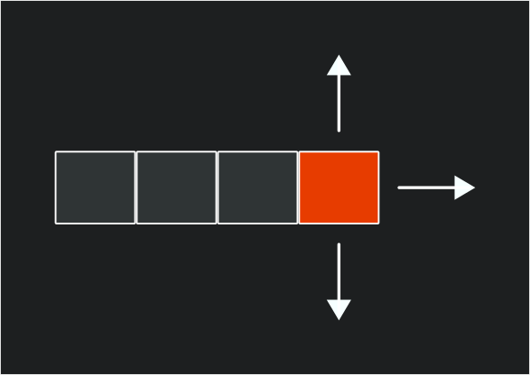
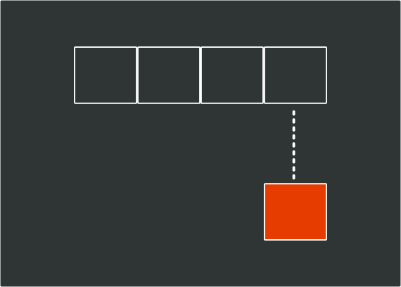
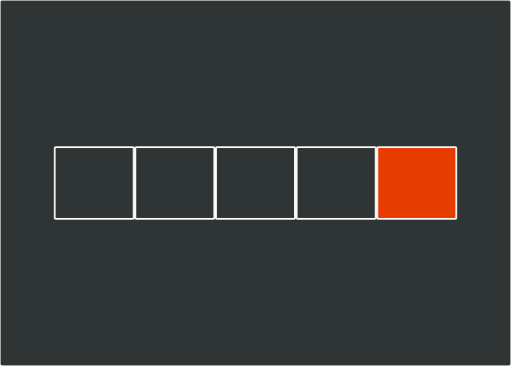
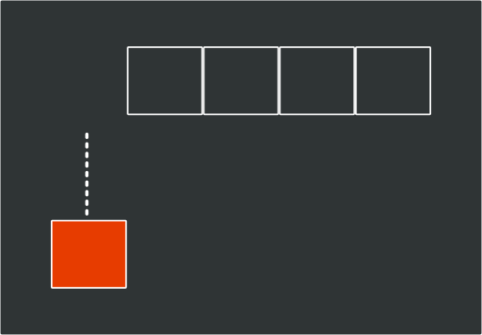

In the previous chapters, we have built all the fundamental systems needed for our game: [graphics](../07_optimizing_texture_rendering/index.md), [input](../11_input_management/index.md), [collision detection](../12_collision_detection/index.md), [audio](../15_audio_controller/index.md), [scene management](../17_scenes/index.md), and a [user interface](../19_user_interface_fundamentals/index.md).  Now it is time to transform our demo into a complete experience by implementing classic snake-like game mechanics. Before we do that, we first need to define what mechanics make a snake game.

In this chapter, you will:

- Understand the core mechanics that define a classic snake-like game.
- Learn how to implement grid-based movement with timed intervals.
- Create a segmented character that grows when collecting objects.
- Implement a unified input controller for game actions.
- Build the `SlimeSegment` struct for storing segment data.
- Create the `Slime` class to manage all snake-like behavior for the slime.
- Create the `Bat` class as the collectable object.

> [!NOTE]
> This chapter will not focus much on MonoGame itself, but rather our implementation of the mechanics to transform our current game into a snake-like game.

## Understanding Snake Game Mechanics

In a classic snake-like game, the mechanics follow a set of simple but engaging rules:

1. The player controls a snake by telling it to move in one of four cardinal directions (up, down, left, and right).
2. The snake cannot reverse into itself, only moving forward or perpendicular to its current direction.
3. The actual movement of the snake occurs at regular timed intervals, creating a grid-based movement pattern.
4. When the snake eats food, it grows longer by adding a new segment to its tail.
5. If the snake collides with a wall or its own body, the game ends.

The mechanics create an increasingly challenging experience as the snake grows longer, requiring planning and reflexes to avoid collision.

### Directions

In snake, players input a cardinal direction (up, down, left, and right), to indicate which direction the snake will move during the next movement cycle.  When direction input occurs, it must be checked against the current direction to determine if the move is valid.

For example, if the snake is moving to the right, an invalid input would allow a player to move it to the left.  Doing so would cause the head of the snake to reverse direction and immediately collide with the first body segment. This means the only valid inputs are those where the next direction would be the same as the current direction or perpendicular to the current direction.

|  |
| :--------------------------------------------------------------------------------------------------------------------------------------------------------------------------------------------------------------------------------------------------------------------------: |
|                **Figure 22-1: An example snake with four segments, the head segment highlighted in orange, moving to the right.  Arrows show that the only valid movements for the head segment are up or down (perpendicular) or to continue to the right.**                |

### Movement Cycle

Instead of moving every update frame while a directional input is being pressed,  the snake moves only at fixed time intervals.  A timer is used to determine how much time has passed since the last movement cycle, and when it reaches a set threshold, the next movement cycle occurs.  During this movement cycle, the snake should move forward in the direction that was input by the player between the last and current movement cycles.  This creates the grid-based movement system typically found in snake-like games.

There are various methods for handling the movement, such as iterating through each segment of the snake and updating the position of that segment to move forward.  Methods such as this though are wasteful, since visually the only parts of the snake that move on the screen are the head and the tail.  

Instead, a more common approach is to:

1. Make a copy of the head segment.

    |  |
    | :------------------------------------------------------------------------------------------------------------------------------------------------: |
    |                **Figure 22-2 From a snake with four segments, a copy of the head segment is made, represented by the orange block**                |

2. Update the properties of the copy so that it is positioned where the original head segment would have moved to.
3. Insert the copy at the front of the segment collection.

    |  |
    | :--------------------------------------------------------------------------------------------------------------------------------------------------------------------------------------------------------------------------------: |
    |                **Figure 22-3: The copy of the head segment, represented by the orange block, is inserted at the front of the segment collection as the new head, which now makes it five segments (one too many)**                 |

4. Remove the tail segment.

    |  |
    | :------------------------------------------------------------------------------------------------------------------------------------------------------------------------------------------------: |
    |                 **Figure 22-4: The tail segment of the snake is removed, bringing it back to the original four segments, giving the illusion that the entire snake moved forward**                 |

By doing this, no matter how many segments the snake body has, we only ever need to update two of them, the head and the tail.

### Growth

The next core mechanic for a snake-like game is the growth of the snake.  Typically, somewhere in the game is an objective for the snake to eat, such as an apple.  When the head of the snake reaches this objective, a new segment is added to the snake's body, making it longer, the player's score is increased, and a new objective is spawned at a random location within the game.

This mechanic also acts as an artificial difficulty curve for the game.  As the body of the snake grows longer, it requires planning to avoid creating situations where the snake becomes trapped by its own body making it impossible to avoid a collision.

### Game Over

The challenge in a snake-like game is to avoid colliding with either a wall or another segment of the snake body.  Doing so will cause a game over condition as the snake can no longer continue moving forward.

## Implementing Snake-Like Mechanics In Our Game

Now that we have a foundational set of rules in place for the mechanics of a snake-like game, we will implement them into the current demo we have been building up. Our game will adapt these mechanics to fit them into our existing game structure:

- Instead of a snake, we will use the slime and create a chain of slime segments that follow the slime at the front.
- The player will control the direction of the slime segment
- The bat will serve as the objective to acquire to grow the slime segment.
- Collisions with either the walls of the room or a slime segment will result in a game over state.

As we implement these mechanics, we are also going to be creating classes that encapsulate the properties and functions of existing implementations in the game scene, such as the slime and the bat.  For example, currently, the game scene tracks fields for the `AnimatedSprite` and the position of the slime, as well as updating, input handling, and drawing the slime.  These can be moved into their dedicated classes encapsulating the functionality and also cleaning up the code in the game scene that has grown quite large.

### The GameController Class

Currently, we have two methods dedicated to handling input in the game scene, `CheckKeyboardInput` and `CheckGamePadInput`, both of these methods essentially perform the same logic across different input devices. This presents an opportunity to improve our code.

To simplify input handling for the game, we can create a dedicated class that consolidates the input methods, providing a unified input profile for the game.  This pattern is widely used in game development to separate the "what" (game actions) from the "how" (specific input devices and buttons).

Create a new file named `GameController.cs` in the root of the `DungeonSlime` project (your main game project) and add the following code:

[!code-csharp]

The `GameController` class implements an important design pattern in game development known as **"Input Abstraction"** or the **"Command"** pattern.  This pattern separates what happens in the game (the actions) from how players trigger those actions (the inputs).

This separation provides several benefits, including:

1. **Input Device Independence**: The game logic does not need to know which input device the player is using. Whether they are playing with a keyboard, gamepad, or touch screen, the game only cares that a "move up" action was triggered, not which specific button or key caused it.
2. **Simplified Input Handling**: Instead of checking multiple input combinations throughout the codebase, game objects can simply ask "Should I move up?" through a clean API call.
3. **Easy Rebinding**: If you want to add key rebinding features, you only need to modify the `GameController` class, not every piece of code that uses input.
4. **Consistent Input Logic**: The rules for determining if an action occurred (like checking if a button was just pressed versus being held down) are defined in one place.
5. **Cross-Platform Compatibility**: When porting to different platforms with different input methods, you only need to update the `GameController` class to map the new input devices to your existing game actions.

By implementing this pattern in our game, we are not only making our current input handling cleaner, but we are also establishing a foundation that would make it easier to add features like input customization or support for new input devices in the future.

With our input handling system in place, now we can turn our attention to implementing the core mechanics of our snake-like game. First, we need to create a structure that will represent each segment of the slime's body.

### The SlimeSegment Struct

We will need to implement a structure that can represent each segment of the slime, this structure will store the position and movement data for each segment.

In the *DungeonSlime* project (your main game project), create a new folder named `GameObjects`. We will be putting all of our code related to the objects within the game here.
Then create a new file named `SlimeSegment.cs` inside the `GameObjects` folder you just created and add the following code:

[!code-csharp]

This structure contains fields to track:

- `At`: The current position of the segment.
- `To`: The position the segment will move to during the next movement cycle if it is the head segment.
- `Direction`: A normalized vector representing the direction the segment is moving in.
- `ReverseDirection`: A computed property that returns the opposite of the `Direction` property.

> [!NOTE]
> We are implementing this as a struct rather than a class because SlimeSegment is a small, simple data container with value semantics. Structs are more efficient for small data structures since they are allocated on the [stack rather than the heap](https://learn.microsoft.com/en-us/dotnet/standard/automatic-memory-management), reducing garbage collection overhead. Since our game will potentially create many segments as the snake grows, using a struct can provide better performance, especially when we will be copying segment data during movement operations.

> [!IMPORTANT]
> Structs work best with value types (like int, float, [**Vector2**](xref:Microsoft.Xna.Framework.Vector2)); using reference types in structs can cause boxing operations that negate the performance benefits. For more information on structs, refer to the [Structure Types - C# Reference](https://learn.microsoft.com/en-us/dotnet/csharp/language-reference/builtin-types/struct) documentation on Microsoft Learn.

By tracking both the current (`At`) and target (`To`) positions, we can implement smooth visual movement between grid positions, creating more fluid animations than the traditional stutter step movement seen in classic snake games.  We will explore this concept a little further in this chapter.

### The Slime Class

Next, we can implement a class to encapsulate the properties and functionality of our snake-like slime.

In the `GameObjects` folder of the *DungeonSlime* project (your main game project), create a new file named `Slime.cs` and add the following initial code:

[!code-csharp]

This code sets up the basic structure for our `Slime` class. We have added the necessary using statements to access MonoGame's framework components and placed the class in the `DungeonSlime.GameObjects` namespace to keep our code organized. The empty class will serve as our foundation, and we will build it up piece by piece in the following sections.

Each section below should be added to the `Slime` class in the order presented. As we go through each part, the class will gradually take shape to handle all the snake-like behavior we need.

> [!NOTE]
> When adding these sections one by one, you may see compiler errors until all sections are in place. This is normal, as some parts of the code will reference fields or methods that have not been added yet. Once all sections are complete, these errors will resolve.

#### Slime Fields

Add the following fields to the `Slime` class:

[!code-csharp]

Each of these fields is responsible for:

- `s_movementTime`: This constant represents how long the slime waits between movement cycles (300ms). This creates the classic snake game's grid-based movement feel, where the snake moves at regular intervals rather than continuously.
- `_movementTime`: This field accumulates elapsed time until it reaches the movement threshold. When it does, the slime moves one grid cell and the timer resets.
- `_movementProgress`: This normalized value (0-1) represents progress between movement ticks and is used for visual interpolation. It allows us to smoothly animate the slime's movement between grid positions.
- `_nextDirection`: This stores the direction that will be applied to the head segment during the next movement cycle.
- `_stride`: This represents the total number of pixels the head segment should move during movement cycles.
- `_segments`: This collection holds all the `SlimeSegment` structures that make up the slime's body. The first segment is the head, and the rest form the trailing body.
- `_sprite`: This stores the `AnimatedSprite` that is used to draw each segment of the slime.

These fields implement core snake-like mechanics - the timed interval movement, direction control, and the segmented body that forms the snake.

#### Slime Events

Next, add the following event to the `Slime` class after the fields:

[!code-csharp]

This event will allow the `Slime` class to notify the game scene when the head of the slime collides with another segment, triggering a game over.

#### Slime Constructor

After the event, add the following constructor to the `Slime` class:

[!code-csharp]

This is a simple constructor that requires the slime to be given the `AnimatedSprite` that will be used to draw each of the slime segments.

#### Slime Initialization

Add the following `Initialization` method to the `Slime` class after the constructor:

[!code-csharp]

With this method, we can initialize, or reset the state of slime.  It:

- Instantiates a new segment collection.
- Creates the initial head segment and positions it at the specific `startingPosition`.
- Sets the initial direction to be to the right.
- Initialize the movement timer to zero.

#### Slime Input Handling

Next, add the `HandleInput` method to process player input after the `Initialize` method:

[!code-csharp]

This method implements the following:

1. Determine if the player is attempting to change directions instead of directly moving the slime.  This direction change will be applied later during the movement cycle update.
2. Uses [**Vector2.Dot**](xref:Microsoft.Xna.Framework.Vector2.Dot(Microsoft.Xna.Framework.Vector2,Microsoft.Xna.Framework.Vector2)) to prevent the slime from reversing into itself, causing an immediate collision and game over state.
3. Updates the `_nextDirection` value only if the direction input is valid.

> [!NOTE]
> The dot product measures how much two vectors point in the same direction. It is:
>
> - Positive if they are pointing in the same direction.
> - Negative if they are pointing in opposite directions.
> - Zero when they are perpendicular.
>
> By using dot product here, this effectively implements the classic snake-like game rule that you cannot turn 180° into yourself.

#### Slime Movement Cycle

To handle the snake-like movement cycle of the slime, we will create a method called `Move`.

Add the following method to the `Slime` class after the `HandleInput` method:

[!code-csharp]

This method performs the core snake-like movement cycle logic by:

1. Copying the value of the current head segment.
2. Updating the copy's position (`At`) to where the head was moving to and updating the position it is moving to (`To`).
3. Insert the copy into the front of the segment collection and remove the tail.
4. Check if the head is now in the same position as any body segments, which would cause a collision and trigger a game over.

> [!NOTE]
> By inserting a new head segment at the front of the chain and removing the last segment, this creates the illusion of the entire chain moving forward as one, even though we are only actually moving the head forward and removing the tail.
>
> This follows the common snake movement pattern as discussed in the [Understanding Snake Game Mechanics: Movement Cycle](#movement-cycle) section above.

#### Slime Growth

To handle the snake-like growth of the slime, we will create a new method called `Grow`.

Add the following method to the `Slime` class after the `Move` method:

[!code-csharp]

The `Grow` method works as follows:

1. First it creates a copy of the current tail value.
2. It then adjusts the values of the copy so that it is now positioned behind the current tail by using the `ReverseDirection` value of the tail.
3. Finally, it inserts this new tail into the segments collection.

#### Slime Update

With most of the core snake-like mechanics now added to the `Slime` class within their own methods we can now work on what happens while the slime is operating.

Add the following `Update` method to the `Slime` class after the `Grow` method:

[!code-csharp]

This update method:

1. Updates the slime's `AnimatedSprite` to ensure the sprite animations occur.
2. Calls `HandleInput` to check for player input.
3. Increments the movement timer by the amount of time that has elapsed between the game's update cycles.
4. Performs a check to see if the movement timer has accumulated more time than the threshold to perform a movement cycle update. If it has then:
   1. The movement timer is reduced by the threshold time.
   2. The `Move` method is called to perform a movement cycle update.
5. Finally, the movement progress amount is calculated by dividing the number of seconds accumulated for the movement timer by the number of seconds for the threshold.  This gives us a normalized value between 0.0 and 1.0 that we can use for visual interpolation for fluid movement.

> [!TIP]
> In games, frame rates can vary based on system performance, causing inconsistent update intervals.  If we simply reset the movement timer to zero after each movement cycle, we would lose any excess time that accumulated beyond the movement threshold.
>
> For example:
>
> - Our movement threshold is 200ms.
> - The game runs at 60fps (16.67ms per frame).
> - After 12 frames, we have accumulated 200.04ms.
> - If we reset to zero, we lose 0.04ms.
> - Over time, these small losses can add up and cause inconsistent movement.
>
> By subtracting the threshold instead of resetting to zero, we "bank" the excess time (0.06ms in this example) for the next movement cycle.  This ensures that:
>
> 1. Movement happens exactly at the intended frequency, maintaining consistent game speed.
> 2. The visual smoothness of movement remains intact even if the game occasionally drops frames.
> 3. Players experience the same game timing regardless of their hardware's performance.
>
> This technique is standard practice in game development, especially for timing-sensitive mechanics like rhythmic games, animations, and movement systems.  It is a simple solution that significantly improves gameplay consistency.

#### Slime Draw

We also need a method to handle drawing the slime and all of its segments.

Add the following `Draw` method after the `Update` method to the `Slime` class:

[!code-csharp]

This draw method iterates each segment of the slime and calculates the visual position to draw each segment at by performing [linear interpolation (lerp)](https://www.corykoseck.com/2018/08/29/programming-in-c-lerp/) to determine the position of the segment between its current position (`At`) and the position it is moving to (`To`) based on the `_movementProgress` calculation.

> [!NOTE]
> [**Vector2.Lerp**](xref:Microsoft.Xna.Framework.Vector2.Lerp(Microsoft.Xna.Framework.Vector2,Microsoft.Xna.Framework.Vector2,System.Single)) performs a linear interpolation between two vectors, creating a smooth transition from start to end based on an amount parameter.  The formula is:
>
> $\text{result} = \text{start} + (\text{end} - \text{start}) \cdot \text{amount}$
>
> Where the amount parameter ranges from 0.0 (returns the start position) to 1.0 (returns the end position).  Values between 0.0 and 1.0 give positions along the straight line between start and end.
>
> In our game, this is used to create a visual fluid movement illusion by interpolating between a segment's current position (`At`) and its target position (`To`) based on the elapsed time, rather than having the segments abruptly jump from one grid position to the next after each movement update.

#### Slime Bounds

For the game scene to detect collisions between the slime and other elements (walls or the bat), we need a method to calculate the current collision bounds.

Add the following method to the `Slime` class after the `Draw` method:

[!code-csharp]

This method takes the current head segment (the first segment in our collection), calculates its visual position using linear interpolation, and then creates a `Circle` value to represent its collision boundary. Using the interpolated position ensures that collision detection aligns with what the player sees on screen.

> [!NOTE]
> We only need collision bounds for the slime's head for interactions with the bat and walls, as this matches the classic snake game mechanic where only the head's collisions matter for gameplay. For detecting collisions between the head and body segments, we use a simpler position-based check in the `Move` method since those positions are always aligned to the grid.

With all these methods in place, our Slime class now fully implements the snake-like mechanics we need.

It handles:

- Movement on a grid.
- Prevents invalid direction changes
- Detects self-collisions
- Provides smooth visual movement between grid positions.

This encapsulation allows us to manage all slime-related behavior in one place while exposing only the necessary interfaces to the game scene.

Now that we have our player-controlled character implemented, we can create the object that the slime will try to collect; the bat.

### The Bat Class

In the `GameObjects` folder of the *DungeonSlime* project (your main game project), create a new file named `Bat.cs` and add the following initial code:

[!code-csharp]

This code establishes the foundation for our `Bat` class. We have included the necessary using statements for MonoGame components, audio functionality, and our library references. The class is placed in the same `DungeonSlime.GameObjects` namespace as our Slime class to maintain a consistent organization.

Now we will build this class step by step, adding all the functionality needed for the bat to serve as the collectible object in our game.  Add each of the following sections to the `Bat` class in the order they are presented.

> [!NOTE]
> As with the Slime class, you may encounter compiler errors until all sections are in place. These errors will be resolved once all components of the class have been added.

#### Bat Fields

Add the following fields to the `Bat` class:

[!code-csharp]

Each of these fields is responsible for:

- `MOVEMENT_SPEED`: This constant represents the factor to multiply the velocity vector by to determine how fast the bat is moving.
- `_velocity`: A vector that defines the direction and how much in that direction to update the position of the bat each update cycle.
- `_sprite`: This stores the `AnimatedSprite` that is used to draw the bat.
- `_bounceSoundEffect`: This store the [**SoundEffect**](xref:Microsoft.Xna.Framework.Audio.SoundEffect) to play when the bat is told to bounce.

#### Bat Properties

Next, add the following property to the `Bat` class after the fields:

[!code-csharp]

This property exposes the position of the bat so it can be used for calculations in the game scene when determining where to place the bat after the slime eats it.

#### Bat Constructor

After the property, add the following constructor to the `Bat` class:

[!code-csharp]

This is a simple constructor that requires the bat to be given the `AnimatedSprite` that will be used to draw the bat and the [**SoundEffect**](xref:Microsoft.Xna.Framework.Audio.SoundEffect) to be played when the bat bounces off a wall.

#### Bat Randomize Velocity

Currently, we have the `AssignRandomVelocity` method in the `GameScene` that we call to randomize the velocity of the bat after it has been eaten by the slime.  We can take this method out of the `GameScene` class and put it directly into the `Bat` class itself.

Add the following method to the `Bat` class after the constructor:

[!code-csharp]

#### Bat Bounce

We are also going to take the logic from the `GameScene` class that bounces the bat off the walls and move it into a dedicated method in the `Bat` class.

Add the following method to the `Bat` class after the `RandomizeVelocity` method:

[!code-csharp]

This method only takes a single parameter, the [normal vector](../12_collision_detection/index.md#bounce-collision-response) of the surface the bat is bouncing against.  Based on the X and Y components of the normal vector, we can determine which wall the bat bounced against and adjust the position of the bat so that it does not stick to the wall.

#### Bat Bounds

Similar to the [`Slime` class](#slime-bounds), for the game scene to detect collision between the bat and other elements, we need a method to calculate the current collision bounds of the bat.

Add the following method to the `Bat` class after the `Bounce` method:

[!code-csharp]

#### Bat Update

The `Bat` class will also need to be updated.

Add the following `Update` method to the `Bat` class after the `GetBounds` method:

[!code-csharp]

This method simply updates the bat's `AnimatedSprite` to ensure animations occur and adjusts the position of the bat based on the current velocity.

> [!NOTE]
> The continuous movement of the bat contrasts with the grid-based interval movement of the slime, creating different gameplay dynamics for the player to consider.  This makes catching the bat challenging without requiring any complex behaviors.

#### Bat Draw

Finally, we need a method to draw the bat.

Add the following `Draw` method to the `Bat` class after the `Update` method:

[!code-csharp]

This method simply draws the bat's `AnimatedSprite` at the bat's current position.

With the `Bat` class complete, we have now encapsulated all the behavior needed for the collectible element in our game. The bat moves continuously around the screen and can bounce off walls, adding a twist on the classic snake-like mechanic by creating a target for the player to chase.

## Conclusion

> [!NOTE]
> To the observant, you should notice that the main game screen has not been updated and therefore nothing has changed if we run the game at this point.  In the next chapter we will finalize the gameplay.

In this chapter, we have learned about and implemented the core mechanics of a class snake-like game.  We created:

- A [`GameController`](#the-gamecontroller-class) class that provides a unified input interface, separating game actions from specific input devices.
- A [`SlimeSegment`](#the-slimesegment-struct) struct to efficiently store and manage individual segments of our snake-like character.
- A [`Slime`](#the-slime-class) class that implements grid-based movement, segment management and self-collision detection.
- A [`Bat`](#the-bat-class) class that serves as the collectible object with continuous movement and wall bouncing.

These implementations encapsulate the core gameplay mechanics into reusable, maintainable objects.

In the next chapter, we will build on these mechanics by updating the `GameScene` to implement game state management and a new UI element for the game over state to create a complete game experience.

## Test Your Knowledge

1. Why must a snake-like game prevent the player from reversing direction?

    :::question-answer
    Preventing reverse movement is necessary because it would cause an immediate collision between the snake's head and the first body segment, resulting in an unfair game over.
    :::

2. How does the movement cycle for a snake work, and why is it more efficient than updating each segment individually?

    :::question-answer
    The snake movement cycle works by:

    1. Creating a copy of the head segment.
    2. Positioning the copy one grid cell ahead in the current direction
    3. Inserting this copy at the front of the segment collection
    4. Removing the last segment.

    This approach is more efficient because it only requires manipulating two segments (adding a new head and removing the tail) regardless of how long the snake becomes, rather than iterating through and updating every segment individually.
    :::

3. What are the benefits of using the Input Abstraction pattern implemented in the `GameController` class?

    :::question-answer
    The Input Abstraction pattern provides several benefits:

    - Input device independence, allowing the game to handle keyboard, gamepad, or other inputs through a unified interface
    - Simplified input handling through clean API calls rather than checking multiple input combinations
    - Easier implementation of key rebinding features by only needing to modify the GameController class
    - Consistent input logic defined in a single location
    - Better cross-platform compatibility by centralizing platform-specific input handling

    :::

4. How does the implementation use [**Vector2.Lerp**](xref:Microsoft.Xna.Framework.Vector2.Lerp(Microsoft.Xna.Framework.Vector2,Microsoft.Xna.Framework.Vector2,System.Single)) to create smooth visual movement, and why is this important?

    :::question-answer
    The implementation uses [**Vector2.Lerp**](xref:Microsoft.Xna.Framework.Vector2.Lerp(Microsoft.Xna.Framework.Vector2,Microsoft.Xna.Framework.Vector2,System.Single)) to interpolate between a segment's current position (`At`) and its target position (`To`) based on a normalized movement progress value. This creates smooth visual movement by drawing the segments at intermediate positions between grid points rather than abruptly jumping from one grid position to the next.

    This is important because it provides more fluid animation while maintaining the logical grid-based movement, enhancing the visual quality of the game without changing the core mechanics.
    :::
