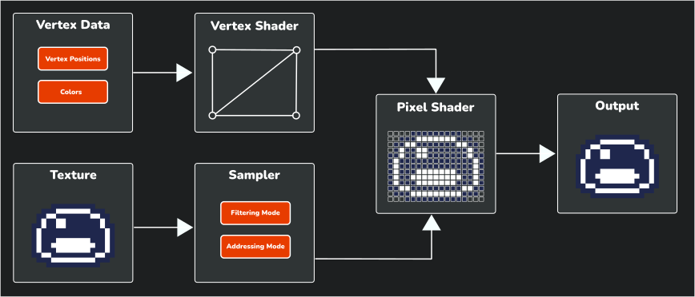

In the previous chapters, we have built a complete snake-style game with animations, collision detection, audio, and scene management. While our game is fully functional, we can enhance the visual experience by implementing special effects to provide additional feedback to players. One powerful way to create these effects is through shaders.

In this chapter, you will:

- Understand what shaders are and how they function in MonoGame.
- Learn about different types of shaders including vertex and pixel shaders.
- Explore shader models and cross-platform considerations.
- Analyze the default shader template used in MonoGame.
- Create a custom grayscale shader for visual feedback.

> [!IMPORTANT]
> This chapter is an introduction to shaders in MonoGame and will focus on the basic foundation of understanding how to create shader effect (*.fx*) files, loading them through the content pipeline, and using them in your game.
>
> If you want to learn more about the shader language itself, a good place to start would be the [High-level shader language (HLSL)](https://learn.microsoft.com/en-us/windows/win32/direct3dhlsl/dx-graphics-hlsl) documentation on Microsoft Learn.  
>
> For inspiration on what can be achieved with shaders, check out [ShaderToy](https://www.shadertoy.com), which showcases real-time shader effects created by others.  Note that ShaderToy uses [OpenGL Shading Language (GLSL)](https://www.khronos.org/opengl/wiki/OpenGL_Shading_Language) which has some syntactic differences from HLSL, but the underlying concepts and mathematics are very similar.

We can begin by understanding what shaders are and how they work in MonoGame.

## Understanding Shaders

Shaders are small programs that run directly on your graphics card (GPU) instead of your computer's main processor (CPU). While traditional game code runs on the CPU and handles things like game logic and physics, shaders run on the GPU and focus specifically on how things are drawn to the screen. This separation allows for efficient processing and enables visual effects that would be too performance-intensive to calculate on the CPU.

Think of shaders as special instructions that tell your GPU exactly how to display each pixel or transform each vertex in your game. By customizing these instructions, you can create a wide variety of visual effects without having to change your original artwork.

### Types of Shaders

There are two main types of shaders that you will work with in MonoGame:

#### Vertex Shaders

Vertex shaders process the corners ([vertices](https://www.mathsisfun.com/geometry/vertices-faces-edges.html)) of the shapes that make up your game objects. They determine where these points should be positioned on the screen and can manipulate their positions to create effects like:

- Waves or ripples in water
- Swaying grass or trees
- Character deformation for animations

Vertex shaders are especially important in 3D games, but they can also be used in 2D games for special effects that involve moving or distorting sprite positions.

> [!NOTE]
> Even in 2D games like ours, MonoGame actually draws sprites by mapping textures onto simple 3D shapes called quads (rectangles made of two triangles). Each quad has four vertices, one at each corner. While we do not normally think about these vertices in 2D development, they are still there behind the scenes, and vertex shaders process them before rendering.

#### Pixel Shaders

Pixel shaders (also sometimes called fragment shaders) determine the actual color of each pixel that gets drawn to the screen. After the GPU figures out which pixels need to be drawn based on your geometry, the pixel shader calculates the final color for each of those pixels.

Pixel shaders are useful in 2D games for creating effects like:

- Color adjustments (brightness, contrast, saturation)
- Visual filters (grayscale, sepia, negative)
- Special transitions (fades, dissolves, color shifts)
- Dynamic lighting effects

For our Dungeon Slime game, we will focus primarily on pixel shaders since we want to create a color effect for our game over state.

> [!NOTE]
> There are other types of shaders beyond vertex and pixel shaders, such as compute shaders, geometry shaders, and hull/domain shaders.  These more advanced shader types enable powerful features like physics simulations, procedural geometry, and complex post-processing effects.  However, they are not currently supported in the standard MonoGame implementation and are beyond the scope of this beginner tutorial.  As the MonoGame graphics pipeline evolves, support for these advanced shader types may be added in future versions.

### The Shader Pipeline

To understand how shaders work, it helps to visualize how data flows through the rendering pipeline.

|  |
| :----------------------------------------------------------------------------------------------------------------------: |
|               **Figure 24-1: Basic shader pipeline showing how data flows through the rendering process**                |

This diagram illustrates the fundamental steps of the shader pipeline:

1. **Input Data**: The process begins with input data that is sent to the GPU to render:
   1. **Vertex Data**: The vertex data (positions, colors, etc.) that define the geometry of what is being drawn.
   2. **Texture**: The image data that will be applied to the geometry.
2. **Vertex Shader**: Processes each vertex, calculating its final position on the screen and passing the data to the next stage.
3. **Sampler**: Controls how texture data is accessed, applying [filtering](../18_texture_sampling/index.md#filtering-modes) (how pixels blend when scaled) and [addressing](../18_texture_sampling/index.md#addressing-modes) (what happens at texture edges).
4. **Pixel Shader**: Takes the transformed vertices and sampled texture data to calculate the final color of each pixel.
5. **Output**: The final rendered image that appears on your screen.

> [!NOTE]
> When working with [**SpriteBatch**](xref:Microsoft.Xna.Framework.Graphics.SpriteBatch) (2D) in MonoGame, the framework handles most of the vertex shader work automatically, which is why we will focus primarily on writing pixel shaders for visual effects.

### Shader Languages and Cross-Platform Considerations

MonoGame uses the [High-Level Shader Language (HLSL)](https://learn.microsoft.com/en-us/windows/win32/direct3dhlsl/dx-graphics-hlsl) for writing shader effects. **HLSL** is a C-like programming language developed by Microsoft for DirectX. As MonoGame also supports OpenGL which uses the [OpenGL Shading Language (GLSL)](https://www.khronos.org/opengl/wiki/OpenGL_Shading_Language) instead of DirectX as it needs a way to make shaders work everywhere.

This is where MojoShader comes in. MojoShader is a library that automatically translates your **HLSL** shader code into whatever format the target platform requires (like **GLSL** for OpenGL platforms), this translation happens during the content build process when you compile your game.

### Shader Models and Compatibility

Different platforms support different shader capabilities, known as "shader profiles." (Also known as "Shader Models" in some circles).  When writing shaders for MonoGame, you need to consider compatibility across platforms.

MonoGame supports the following shader models when targeting DirectX platforms:

| Vertex Shader Profile | Pixel Shader Profile |
| --------------------- | -------------------- |
| `vs_4_0_level_9_1`    | `ps_4_0_level_9_1`   |
| `vs_4_0_level_9_3`    | `ps_4_0_level_9_3`   |
| `vs_4_0`              | `ps_4_0`             |
| `vs_4_1`              | `ps_4_1`             |
| `vs_5_0`              | `ps_5_0`             |

When targeting OpenGL platforms, MonoGame supports:

| Vertex Shader Profile | Pixel Shader Profile |
| --------------------- | -------------------- |
| `vs_2_0`              | `ps_2_0`             |
| `vs_3_0`              | `ps_3_0`             |

For maximum compatibility, it is best to target the following shader models:

- For DirectX platforms: `vs_4_0_level_9_1` (vertex) and `ps_4_0_level_9_1` (pixel)
- For OpenGL platforms: `vs_3_0` (vertex) and `ps_3_0` (pixel)

> [!NOTE]
> In shader model notation, "vs" stands for "vertex shader" and "ps" stands for "pixel shader". The numbers represent the version and feature level of the shader model, with higher numbers indicating more advanced capabilities.

> [!NOTE]
> MonoGame is currently planning to upgrade its graphics pipeline to support Vulkan and DirectX 12, which will significantly enhance graphical capabilities and shader support across platforms, enabling more advanced visual effects and better performance in future versions.

## Understanding the Default Shader Template

When you create a new `Sprite Effect (.fx)` file in MonoGame using the MGCB Editor, it generates a default template file.  To get a feel for the language used in shaders we can use this template to understand the foundation that we will build upon:

[!code-c[](./snippets/defaultshader.fx)]

Breaking down what each section of this template we can see:

1. **Platform compatibility defines**: The first block created defines for different shader model versions based on the target platform the shader gets compiled for (OpenGL vs DirectX).

    [!code-c[](./snippets/defaultshader.fx?start=1&end=8)]

    > [!IMPORTANT]
    > These preprocessor directives ensure your shader works across different platforms by defining appropriate shader models and semantics.  When MonoGame compiles your shader:
    >
    > - On OpenGL platforms (macOS, Linux, etc.), it uses the `OPENGL` definition, setting shader models to `vs_3_0` and `ps_3_0`.
    > - On DirectX platforms (Windows, Xbox), it uses the DirectX path, setting shader models to `vs_4_0_level_9_1` and `ps_4_0_level_9_1`.
    >
    > This compatibility block directly impacts which **HLSL** features you can use in your shader.  To maintain cross-platform compatibility, you should restrict yourself to features available at the lowest shader model you target.  Using advanced features only available in higher shader models will require additional conditional compilation blocks and platform-specific code paths.

2. **Texture declaration**: This declares a `Texture2D` variable called `SpriteTexture` that will receive the texture being drawn by the [**SpriteBatch**](xref:Microsoft.Xna.Framework.Graphics.SpriteBatch).

    [!code-c[](./snippets/defaultshader.fx?start=10&end=10)]

3. **Sampler state**: This creates a `sampler2D` called `SpriteTextureSampler` that controls how the shader reads pixel data from the texture received from the [**SpriteBatch**](xref:Microsoft.Xna.Framework.Graphics.SpriteBatch).  It defines properties like [filtering](../18_texture_sampling/index.md#filtering-modes) and [addressing](../18_texture_sampling/index.md#addressing-modes) modes for texture sampling, similar to the [**SamplerState**](xref:Microsoft.Xna.Framework.Graphics.SamplerState) we discussed in [Chapter 18](../18_texture_sampling/index.md).

    [!code-c[](./snippets/defaultshader.fx?start=12&end=15)]

4. **Vertex shader output structure**: This defines a struct called `VertexShaderOutput` with three fields; `Position`, `Color`, and `TextureCoordinates`.  This struct represents the data that is passed from the **Vertex Shader** function to the **Pixel Shader** function.

    [!code-c[](./snippets/defaultshader.fx?start=17&end=22)]

    This struct defines the passing of:

    - The position of the vertex in homogeneous coordinates (x, y, z, w).
    - The RGBA color of the vertex.
    - The [UV coordinates for texture mapping](https://inspirationtuts.com/what-is-uv-mapping-and-unwrapping/).

    > [!TIP]
    > Notice the unusual syntax like `float4 Position : SV_POSITION` where there is a colon followed by something after each variable declaration.  These are called [*semantics*](https://learn.microsoft.com/en-us/windows/win32/direct3dhlsl/dx-graphics-hlsl-semantics) in HLSL and they are special labels that define how the data should be used by the graphics hardware or passed between shader stages (like from vertex shader to pixel shader).
    >
    > For example, `SV_POSITION` tells the system "this contains the final screen position," `COLOR0` means "this contains color data," and `TEXCOORD0` means "this contains texture coordinates."
    >
    > Semantics are required in HLSL to connect your shader variables with the graphics pipeline.  Without them, the GPU would not know what each piece of data represents or how to use it correctly.

5. **Pixel shader function**: `MainPS` is the main **Pixel Shader** function that determines the color of each pixel.  The default implementation simply samples the texture at the current texture coordinates and multiplies it by the vertex color, which is the color value supplied in the [**SpriteBatch.Draw**](xref:Microsoft.Xna.Framework.Graphics.SpriteBatch.Draw(Microsoft.Xna.Framework.Graphics.Texture2D,Microsoft.Xna.Framework.Vector2,System.Nullable{Microsoft.Xna.Framework.Rectangle},Microsoft.Xna.Framework.Color,System.Single,Microsoft.Xna.Framework.Vector2,System.Single,Microsoft.Xna.Framework.Graphics.SpriteEffects,System.Single)) method call.

    [!code-c[](./snippets/defaultshader.fx?start=24&end=27)]

6. **Technique and pass**: This block defines a technique called `SpriteDrawing` with a single pass called `P0`.  The pass itself defines which shader functions to use.

    [!code-c[](./snippets/defaultshader.fx?start=29&end=35)]

> [!NOTE]
> You may have noticed that the default shader does not define a vertex shader method that would execute and return back the `VertexShaderOutput` value that is used as the input for the **Pixel Shader** function.
>
> When you are using [**SpriteBatch**](xref:Microsoft.Xna.Framework.Graphics.SpriteBatch), MonoGame uses a built-in vertex shader under the hood that executes and creates this value to pass to the pixel shader function.

### Understanding Techniques and Passes

The `technique` and `pass` sections might seem a bit confusing at first, but they are actually quite straightforward:

- A **technique** is like a recipe for rendering something.  Each technique has a name (in this case `SpriteDrawing`) and contains one or more passes.
- A **pass** is a single step in that recipe.  For simple effects, you often need just one pass (which is why the template only has `P0`), but more complex effects might use multiple passes to build up a final result.

Think of it like baking a cake:

- The technique is the overall cake recipe.
- Each pass is a step in that recipe (mix ingredients, bake, add frosting, etc).

In simple shaders, such as a grayscale shader, you would only need one technique with one pass.  For more complex effects like blur, you might use multiple passes: one to blur horizontally and another to blur vertically.

> [!TIP]
> For a real-world example of a blur shader with multiple techniques and passes, take a look at the [Blur shader from the MonoGme Ship Game](https://github.com/MonoGame/MonoGame.Samples/blob/3.8.2/ShipGame/ShipGame.Core/Content/shaders/Blur.fx) sample.  This shader demonstrates how visual effects can be built by combining multiple rendering passes, with separate horizontal and vertical blur passes that work together to create a final blur effect.

The line `PixelShader = compile PS_SHADERMODEL MainPS();` simply tells the GPU which pixel shader function to use for this pass (in this case the `MainPS` function) and compiles it using the appropriate shader model defined earlier.

## Using Shaders in MonoGame

Now that we understand what shaders are, we can explore how to integrate them into a MonoGame project. Before implementing a shader in our game, we will first take a look at the process of loading and using shaders with [**SpriteBatch**](xref:Microsoft.Xna.Framework.Graphics.SpriteBatch).

To understand, we will start with a basic example (not for the game itself):

### Loading Shader Effects

Like other game assets such as textures and sounds, shader effects are loaded through the content pipeline using the [**ContentManager**](xref:Microsoft.Xna.Framework.Content.ContentManager).  When loading a shader, we specify [**Effect**](xref:Microsoft.Xna.Framework.Graphics.Effect) as the target type.

```cs
// Example of loading an effect
Effect exampleEffect = Content.Load<Effect>("exampleEffect");
```

You should typically load shader effects during your game's [**LoadContent**](xref:Microsoft.Xna.Framework.Game.LoadContent) method along with other game assets, and store them in class fields so they can be accessed during the [**Draw**](xref:Microsoft.Xna.Framework.Game.Draw(Microsoft.Xna.Framework.GameTime)) method.

### Using Effects With SpriteBatch

Once you have loaded a shader effect, applying it to your game's visuals requires integrating it with the [**SpriteBatch**](xref:Microsoft.Xna.Framework.Graphics.SpriteBatch). The effect is specified during the `Begin` call, **but is actually applied during drawing operations or when `End` is called (depending on the SpriteSortMode)**.

```cs
// Specify the effect during Begin
spriteBatch.Begin(effect: exampleEffect);

// The effect will be applied when these draw calls are processed
spriteBatch.Draw(exampleTexture, texturePosition, Color.White);
spriteBatch.DrawString(exampleFont, "Hello World", textPosition, Color.White);

// For most SpriteSortMode values, actual drawing with the effect happens here
spriteBatch.End();
```

### Setting Effect Parameters

Most shader effects have parameters that you can adjust to control their behavior. For example, the shader we will create for our game will have a `Saturation` parameter. You should set these parameters before the actual drawing occurs:

```cs
// Update the parameter value
exampleEffect.Parameters["Saturation"].SetValue(0.5f);

// Specify the effect during Begin
spriteBatch.Begin(effect: exampleEffect);

// Draw calls will use the effect with Saturation = 0.5f when processed
```

## Implementing a Shader In Our Game

Now it is time to implement a shader for our game.  The shader we will create is a simple grayscale effect that can be applied when the game is paused or there is a game over to provide visual feedback to the player that the game is inactive, the background will become grey offsetting the color of the Pause menu or other prompt.

### Creating the Shader File

First, we need to create a new shader effect file and add it to our content project.  

1. In the *DungeonSlime* project (your main game project), open the `/Content/Content.mgcb` content project file in the **MGCB** Editor.
2. In the MGCB Editor, right-click the `Content` now and choose `Add > New Folder...`.
3. Give the new folder the name `effects` and click the `Ok` button.
4. Right-click on the new `effects` folder in the MGCB Editor and choose `Add > New Item...`.
5. Choose `Sprite Effect (.fx)` from the type list and name the file `grayscaleEffect`, then click the `Ok` button.
6. **Save the changes in the MGCB Editor then close it.**

The steps above will create a new shader effect (*.fx*) file with the default template we discussed earlier.  Now, we need to modify this template to create our grayscale effect.

### Writing the Grayscale Shader

In the *DungeonSlime* project (your main game project), open the `Content/effects/grayscaleEffect.fx` file that we just created in your code editor and modify it as follows:

[!code-c[](./snippets/grayscaleeffect.fx?highlight=12-14,30-44)]

The key modifications made to create this grayscale effect include:

1. **Added a Parameter**: A `Saturation` parameter was added that controls the intensity of the grayscale effect.  

   - When set to **0**, the image will be fully grayscale.  
   - When set to **1**, the image will be its original color.  
   - Values in between create a partial grayscale effect.

2. **Modified the Pixel Shader**: The `MainPS` function has been updated to:

   - Sample the original color from the texture.
   - Calculate a grayscale value by taking a weighted average of the RGB components.
   - Create a grayscale color vector from this single brightness value.
   - Use `lerp` (linear interpolation) to blend between the grayscale and original color's rgb values based on the `Saturation` parameter.
   - Preserve the original alpha (transparency) value.
   - Output the new color value with the grayscale effect for the pixel.

#### Understanding the Shader Code

The heart of the grayscale effect is this line:

[!code-c[](./snippets/grayscaleeffect.fx?start=33&end=34)]

This uses the [`dot`](https://learn.microsoft.com/en-us/windows/win32/direct3dhlsl/dx-graphics-hlsl-dot) function to calculate the dot product between the color's RGB values and the vector $(0.3, 0.59, 0.11)$.  This effectively calculates a weighted average where:

- Red contributes 30%.
- Green contributes 59%.
- Blue contributes 11%.

> [!NOTE]
> These specific weights are based on how the human eye perceives brightness in different colors.  Green appears brighter to us than red, which appears brighter than blue.  
>
> The weighted values themselves are based on the formula that represents the luma component from the [ITU-R BT.601](https://en.wikipedia.org/wiki/Rec._601) standard, which is commonly used for converting RGB images to grayscale based on human perception where:
>
> $Y'_{601} = 0.299R' + 0.587G' + 0.114B'$
>
> By using these weights, we get a natural looking grayscale conversion.

Then, we use linear interpolation with the [`lerp`](https://learn.microsoft.com/en-us/windows/win32/direct3dhlsl/dx-graphics-hlsl-lerp) function to blend between this grayscale value and the original color's RGB values:

[!code-c[](./snippets/grayscaleeffect.fx?start=39&end=41)]

The `lerp` function blends between the first two parameters based on the third parameter (`Saturation`).  When `Saturation` is **0**, we get full grayscale, when it is **1**, we get the original color.

### Implementing the Grayscale Shader

Now that we have our grayscale shader, we can implement it in our game when the game is paused or a game over state occurs.  In the *DungeonSlime* project (your main game project), open the `Scenes/GameScene.cs` file and perform the following:

1. First, add these fields to the `GameScene` class after the `private GameState _state` property:

    [!code-csharp[](./snippets/gamescene/fields.cs)]

2. Next, update the `LoadContent` method to load the grayscale shader:

    [!code-csharp[](./snippets/gamescene/loadcontent.cs?highlight=30-31)]

3. Next, update the `TogglePause` method so that when the game is paused, it sets the saturation value to **1.0f**:

    [!code-csharp[](./snippets/gamescene/togglepause.cs?highlight=19-20)]

4. We also need to update the `GameOver` method so that when a game over state occurs, it sets the saturation value to **1.0f**:

    [!code-csharp[](./snippets/gamescene/gameover.cs?highlight=9-10)]

5. Next, modify the `Update` method to handle the grayscale transition:

    [!code-csharp[](./snippets/gamescene/update.cs?highlight=6-17)]

6. Finally, update the `Draw` method to apply the shader when the game is paused or in a game over state:

    [!code-csharp[](./snippets/gamescene/draw.cs?highlight=6-18)]

    > [!NOTE]
    > Notice how we set the shader parameters with the current saturation value every frame before beginning the sprite batch.  This is because shaders are stateless; they do not remember any values from the previous draw cycle.  Each time the GPU processes a shader, it only works with the parameters provided in that specific frame.  Even if the saturation value has not changed since the last frame, we still need to send it to the shader again to apply it.  This is why we constantly update the shader parameters in the `Draw` method rather than only when the value is changed.

With these changes, when the game enters a paused or game over state, the screen will gradually fade to gray using the grayscale shader effect.  This provides a clear indication that the game is inactive during these states.  

|  |
| :-------------------------------------------------------------------------------------------------------------------------------------------------------------------: |
|            **Figure 24-2: The game, now using a grayscale effect when paused or a game over state occurs to visually indicate that the game is inactive**             |

## Important Considerations

When working with effects in [**SpriteBatch**](xref:Microsoft.Xna.Framework.Graphics.SpriteBatch), there are some important points to keep in mind:

1. Only one effect can be applied to a [**SpriteBatch.Begin**](xref:Microsoft.Xna.Framework.Graphics.SpriteBatch.Begin(Microsoft.Xna.Framework.Graphics.SpriteSortMode,Microsoft.Xna.Framework.Graphics.BlendState,Microsoft.Xna.Framework.Graphics.SamplerState,Microsoft.Xna.Framework.Graphics.DepthStencilState,Microsoft.Xna.Framework.Graphics.RasterizerState,Microsoft.Xna.Framework.Graphics.Effect,System.Nullable{Microsoft.Xna.Framework.Matrix}))/[**SpriteBatch.End**](xref:Microsoft.Xna.Framework.Graphics.SpriteBatch.End) at a time.  If you need to use multiple effects for different sprites, you will need multiple [**SpriteBatch.Begin**](xref:Microsoft.Xna.Framework.Graphics.SpriteBatch.Begin(Microsoft.Xna.Framework.Graphics.SpriteSortMode,Microsoft.Xna.Framework.Graphics.BlendState,Microsoft.Xna.Framework.Graphics.SamplerState,Microsoft.Xna.Framework.Graphics.DepthStencilState,Microsoft.Xna.Framework.Graphics.RasterizerState,Microsoft.Xna.Framework.Graphics.Effect,System.Nullable{Microsoft.Xna.Framework.Matrix}))/[**SpriteBatch.End**](xref:Microsoft.Xna.Framework.Graphics.SpriteBatch.End) blocks.

    ```cs
    // Begin sprite batch with effect.  All draw calls made within this begin/end block will have the effect applied.
    spriteBatch.Begin(effect: exampleEffect1)
    spriteBatch.Draw(texture, position, color);
    spriteBatch.End();

    // Begins sprite batch with a different effect.  All draw calls made within this begin/end block will have the specified effect applied.
    spriteBatch.Begin(effect: exampleEffect2)
    spriteBatch.Draw(texture, position, color);
    spriteBatch.End();
    ```

2. Along with #1 above, if you want to be selective and only have the effect apply to some sprites and not others, you will still need to use multiple [**SpriteBatch.Begin**](xref:Microsoft.Xna.Framework.Graphics.SpriteBatch.Begin(Microsoft.Xna.Framework.Graphics.SpriteSortMode,Microsoft.Xna.Framework.Graphics.BlendState,Microsoft.Xna.Framework.Graphics.SamplerState,Microsoft.Xna.Framework.Graphics.DepthStencilState,Microsoft.Xna.Framework.Graphics.RasterizerState,Microsoft.Xna.Framework.Graphics.Effect,System.Nullable{Microsoft.Xna.Framework.Matrix}))/[**SpriteBatch.End**](xref:Microsoft.Xna.Framework.Graphics.SpriteBatch.End) blocks

    ```cs
    // Begin sprite batch with effect.  All draw calls made within this begin/end block will have the specified effect applied.
    spriteBatch.Begin(effect: exampleEffect)
    spriteBatch.Draw(texture, position, color);
    spriteBatch.End();

    // Begin sprite batch without effect so that draw calls made here have no effect applied.
    spriteBatch.Begin();
    spriteBatch.Draw(texture, position, color);
    spriteBatch.End();
    ```  

3. Even though the effect to use is specified during the [**SpriteBatch.Begin**](xref:Microsoft.Xna.Framework.Graphics.SpriteBatch.Begin(Microsoft.Xna.Framework.Graphics.SpriteSortMode,Microsoft.Xna.Framework.Graphics.BlendState,Microsoft.Xna.Framework.Graphics.SamplerState,Microsoft.Xna.Framework.Graphics.DepthStencilState,Microsoft.Xna.Framework.Graphics.RasterizerState,Microsoft.Xna.Framework.Graphics.Effect,System.Nullable{Microsoft.Xna.Framework.Matrix})) call, the actual effect is not applied until all batched items are processed when [**SpriteBatch.End**](xref:Microsoft.Xna.Framework.Graphics.SpriteBatch.End) is called.  This means if you adjust parameter values of the effect between draw calls, **only the last parameter value set** is what is applied to all draw calls within the [**SpriteBatch.Begin**](xref:Microsoft.Xna.Framework.Graphics.SpriteBatch.Begin(Microsoft.Xna.Framework.Graphics.SpriteSortMode,Microsoft.Xna.Framework.Graphics.BlendState,Microsoft.Xna.Framework.Graphics.SamplerState,Microsoft.Xna.Framework.Graphics.DepthStencilState,Microsoft.Xna.Framework.Graphics.RasterizerState,Microsoft.Xna.Framework.Graphics.Effect,System.Nullable{Microsoft.Xna.Framework.Matrix})).

    ```cs
    // Begin sprite batch with effect.
    // Specifying the effect here is only specifying what effect to apply when batching ends
    spriteBatch.Begin(effect: exampleEffect);
    
    // Change a parameter and draw something
    exampleEffect.Parameters["ExampleParameter"].SetValue(1.0f);
    spriteBatch.Draw(texture1, position, color);

    // Change the parameter to a different value and draw something else.
    exampleEffect.Parameters["ExampleParameter"].SetValue(0.5f);
    spriteBatch.Draw(texture2, position, color);

    // The actual effect is applied to the draw calls here, when End is called.
    // This means the value of the parameter that will be used in the effect
    // is the last parameter value set (0.5f) which will be applied to both
    // draw calls instead of each of them having different parameter values.
    spriteBatch.End();
    ```

4. There is an exception to #2 above.  In [Chapter 06: Working with Textures](../06_working_with_textures/index.md#layer-depth), we discussed the different [**SpriteSortMode**](xref:Microsoft.Xna.Framework.Graphics.SpriteSortMode) values that can be used when rendering.  From this chapter, we learned that when using [**SpriteSortMode.Immediate**](xref:Microsoft.Xna.Framework.Graphics.SpriteSortMode) that when a draw call is made, it is immediately flushed to the GPU and rendered to the screen, ignoring batching.  This means that if you are using [**SpriteSortMode.Immediate**](xref:Microsoft.Xna.Framework.Graphics.SpriteSortMode) then changing parameters between draw calls will apply the parameter change after it is made for the next draw call.  

    > [!IMPORTANT]
    > As mentioned in [Chapter 06](../06_working_with_textures/index.md#layer-depth), [**SpriteSortMode.Immediate**](xref:Microsoft.Xna.Framework.Graphics.SpriteSortMode) can cause performance issues and should only be used when absolutely necessary, as `Immediate` mode effectively disables batching.

    ```cs
    // Begins sprite batch with the effect AND intentionally specifying SpriteSortMode.Immediate
    spriteBatch.Begin(effect: exampleEffect, sortMode: SpriteSortMode.Immediate);
    
    // Change a parameter and draw something.  Since we are in immediate mode, the value of the parameter is used because the shader is immediately applied to the draw call.
    exampleEffect.Parameters["ExampleParameter"].SetValue(1.0f);
    spriteBatch.Draw(texture1, position, color);

    // Change the parameter to something else.  Since we are in immediate mode, the new value of the parameter is used because the shader is immediately applied to the draw call.
    exampleEffect.Parameters["ExampleParameter"].SetValue(0.5f);
    spriteBatch.Draw(texture2, position, color);

    // Since immediate mode is used, batching is not performed so the effect was applied immediately on the draw calls above and not here during the end call.
    spriteBatch.End();
    ```

## Conclusion

This chapter explored the fundamentals of creating and adding a shader to MonoGame by implementing a grayscale shader effect.  We covered several important concepts:

- Shaders are specialized programs that run directly on the GPU, allowing for efficient visual effects that would be too performance-intensive to calculate on the CPU.
- Effect parameters allow runtime control of shader behavior.
- In MonoGame, shaders are written in High-Level Shader Language (HLSL) and can be loaded through the content pipeline like other game assets.
- Pixel shaders determine the color of each rendered pixel, making them ideal for effects like our grayscale shader.
- The timing of the shader application depends on the [**SpriteSortMode**](xref:Microsoft.Xna.Framework.Graphics.SpriteSortMode) used with [**SpriteBatch**](xref:Microsoft.Xna.Framework.Graphics.SpriteBatch), with most effects being applied during the [**SpriteBatch.End**](xref:Microsoft.Xna.Framework.Graphics.SpriteBatch.End) call.

While we only focused on a simple grayscale effect, the principles learned here can be used to start learning more about shaders and creating more complex visual effects.

## Test Your Knowledge

1. What is the primary difference between pixel shaders and vertex shaders in the context of 2D games?

    :::question-answer
    Pixel shaders determine the color of each pixel being rendered, making them ideal for visual effects like grayscale, color tinting, and image filters. Vertex shaders manipulate the position of vertices, which can be used for effects like distortion, waves, or character deformation. In 2D games, pixel shaders are more commonly used for visual effects while vertex shaders are less frequently needed.
    :::

2. What function is used in the shader to blend between grayscale and the original color, and how does it work?

    :::question-answer
    The [`lerp`](https://learn.microsoft.com/en-us/windows/win32/direct3dhlsl/dx-graphics-hlsl-lerp) function (linear interpolation) is used to blend between grayscale and original colors. It takes three parameters: the first is the grayscale color vector, the second is the original color's RGB values, and the third is the `Saturation` parameter (between 0 and 1). When Saturation is 0, the output is fully grayscale; when it is 1, the output is the original color; values in between create a partial blend of both.
    :::

3. Why can changing effect parameters between [**SpriteBatch.Draw**](xref:Microsoft.Xna.Framework.Graphics.SpriteBatch.Draw(Microsoft.Xna.Framework.Graphics.Texture2D,Microsoft.Xna.Framework.Vector2,System.Nullable{Microsoft.Xna.Framework.Rectangle},Microsoft.Xna.Framework.Color,System.Single,Microsoft.Xna.Framework.Vector2,System.Single,Microsoft.Xna.Framework.Graphics.SpriteEffects,System.Single)) calls sometimes not work as expected, and what is the exception to this?

    :::question-answer
    Changing effect parameters between draw calls typically does not work as expected because the effect is actually applied during [**SpriteBatch.End**](xref:Microsoft.Xna.Framework.Graphics.SpriteBatch.End), not during the draw calls. The last parameter value set before end is applied to all draw calls in the batch. The exception is when using [**SpriteSortMode.Immediate**](xref:Microsoft.Xna.Framework.Graphics.SpriteSortMode), which causes each draw call to be processed immediately rather than batched, allowing parameter changes to be applied between individual draw calls.
    :::
