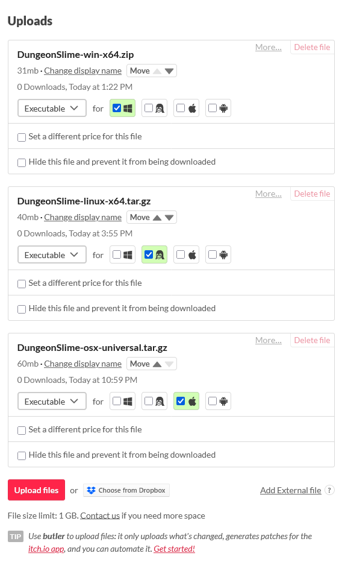
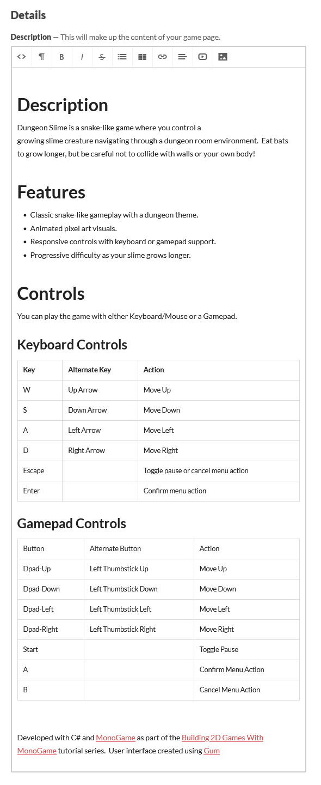
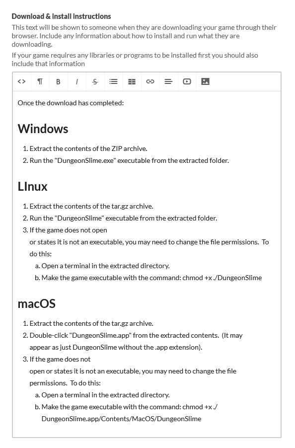
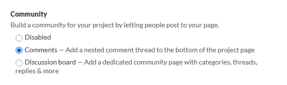

After packaging your game for various platforms in [Chapter 25](../25_packaging_game/index.md), the next step is to make it available for other players.  While there are many distribution platforms available ([Steam](https://store.steampowered.com/), [Epic Games store](https://store.epicgames.com/en-US/), [Good Old Games (GOG)](https://www.gog.com/en)), [itch.io](https://itch.io/) has become a popular choice for indie developers due to its simple publishing processes, developer-friendly revenue model, and strong community focus.

In this chapter, you will:

- Learn about itch.io and why it is beneficial for indie game developers.
- Create and configure an itch.io developer account with appropriate security measures.
- Create a project page that effectively showcases your game.

## Understanding itch.io as a Distribution Platform

Itch.io is an open marketplace for independent digital creators with a focus on indie games.  Unlike larger platforms with strict approval processes, itch.io allows any developer to publish their games instantly.  This makes it an ideal starting point for new developers looking to build an audience.

Key benefits of itch.io for developers include:

1. **Simple Publishing Process**: No approval waiting periods or complex requirements.
2. **Pay-What-You-Want Pricing**: Flexibility to set minimum prices, suggested prices, or make your game completely free.
3. **Cross-Platform Support**: Easy distribution for Windows, macOS, and Linux builds.
4. **Community Focused**: Built-in tools for building a community around you and your games, including devlogs and comments.
5. **Developer-Friendly Revenue Split**: The platform lets developers choose their revenue share (the default 90% to developers, 10% to itch.io).
6. **Analytics and Insights**: Basic analytics to track downloads, views, and purchases.
7. **Game Jams**: Integrated tools for hosting and participating in game development competitions.

## Setting Up an itch.io Account

Before you can publish your game, you need to create an itch.io account and set up your developer profile.

To do this:

1. Navigate to [itch.io](https://itch.io) and click "Register" in the top-right corner.
2. Fill in the registration form with your desired username, password, and email address.

    > [!TIP]
    > Your itch.io username will appear in the URL of your games (e.g. `https://yourusername.itch.io/dungeon-slime`).  Choose a username that represents you or your studio professionally and is easy to remember.
    >
    > The username can be changed later in your account settings if needed.

3. After registering, you will automatically be logged in.  However, for some additional configurations that need to be made, you must validate your email address.  Check the email address you entered when you registered for a new email from itch.io to validate the email address.
4. After validating your email address, go to your account settings by clicking your username in the top-right corner, and then choosing "Settings".
5. The settings page opens with your developer profile configuration.  Complete your developer profile with:
   - A profile picture.
   - Links to your social media platforms or portfolio.
   - A short biography for your profile page.
6. Next, click "Two factor auth" under the "Basics" section on the left to go through the process of configuring two factor authentication for your account.
7. If you plan to sell your game, you will need to configure your publisher information.  To do this, click the "Get Started" section under "Publisher" on the left and follow the steps presented to configure your account to accept payments.

## Creating a New Project

To put your game on itch.io, you first need to create a new project.  When creating a new project, you will be filling out information about the game to generate a project page that contains all the information about the game including the title, description, screenshots, and download files.

To create a new project, click the arrow beside your username in the top-right corner of the page, and choose "Upload new project".

|  |
| :---------------------------------------------------------------------------------------------------------------------------------------------: |
|                 **Figure 26-1: Drop-down menu after clicking the arrow beside user name with "Upload new project" highlighted**                 |

This will open the "Create a new project page", which presents you with a form to enter information about the game, upload the game files, and add screenshots.

|  |
| :------------------------------------------------------------------------------------------------: |
|                    **Figure 26-2: The "Create a new project" page on itch.io**                     |

> [!TIP]
> You can also create a new project by going to your dashboard by clicking the "Dashboard" navigation link at the top of the page, then clicking the "Create new project" button on the dashboard page.

### Basic Project Information

The first section of the form contains fields for the basic information about the project.  

1. **Title**: The title of the game.  This is how it will be displayed and shown throughout the itch.io website.
2. **Project URL**: The URL of the project.  This is the address you will share on social media platforms and other communities to point others to the project page for your game.  

    > [!NOTE]
    > When you enter the title of your game, the project URL will automatically generate based on the title entered (e.g. `https://yourusername.itch.io/project-title`).  The autogenerated URL is usually fine, but you can customize it if you are not happy with it.

3. **Short description or tagline**: Here you can enter a short description that is shown in embedded link previews for your game when it is shared on different social media platforms.
4. **Kind of project**: The type of project you are uploading.  The available options are:

    - **Downloadable**: For projects that require users to download and run files locally.  This is the appropriate choice for MonoGame projects since they are distributed as executable packages.
    - **HTML**: For web-based games or applications that run directly in the browser, typically using HTML5, JavaScript, and CSS.
    - **Flash**: For legacy Flash applications that require the Flash Player plugin.  This format is largely obsolete since Adobe discontinued Flash support.
    - **Java applet**: For Java-based applications that run in a browser.  Like Flash, this technology has been largely phased out of modern web development.
    - **Unity <= 5.3**: For older Unity Web Player games that run in the browser.  Newer Unity games typically use WebGL, which would fall under the HTML category.

    > [!TIP]
    > Since MonoGame games are distributed by packaging them into an archived bundle, you should choose the "Downloadable" option.

5. **Classification**: What type of project are you uploading.  The available options are:

    - **Games**: Interactive software designed primarily for entertainment or educational purposes.
    - **Game assets**: Resources used in game development, such as graphics, audio, fonts, or code modules.
    - **Game mods**: Modifications that alter or enhance an existing game's content or mechanics.
    - **Physical games**: Tabletop, card, or other non-digital games that can be printed or manufactured.
    - **Albums & soundtracks**: Musical compositions, including game soundtracks or independent music projects.
    - **Tools**: Utility software that assists in game development or other creative processes.
    - **Comics**: Sequential art narratives in digital format.
    - **Books**: Literary works including novels, guides, or educational texts.
    - **Other**: Projects that do not fit into the predefined categories.

6. **Release Status**: Set the development status of the project.  The available options are:

    - **Released**: The project is complete and ready for public distribution, though it may receive updates.
    - **In development**: The project is actively being worked on and may be available as an early access version.
    - **On hold**: Development has been temporarily paused but is expected to resume in the future.
    - **Canceled**: Development has been permanently discontinued.
    - **Prototype**: An early experimental version meant for concept testing rather than complete gameplay.

    > [!NOTE]
    > You can change the release status of the project at any time after creating the project page.

The following is an example of the basic project information that would be filled in for the Dungeon Slime game we developed throughout this tutorial series:

|  |
| :------------------------------------------------------------------------------------------------------: |
|                **Figure 26-3: The basic project information for the Dungeon Slime game**                 |

### Pricing

Following the basic information about the project, the next section of the form is for setting the price users would pay to download the game.  Itch.io offers three pricing models for a project:

1. **$0 or donate**: This model makes your game freely available while encouraging optional financial support.  When users download your game, they are presented with a donation prompt showing your suggested amount.  While they can contribute any amount they choose, they also have the option to download without payment by selecting "No thanks, take me to the download.".
2. **Paid**: This model requires users to purchase your game before downloading.  You set a minimum price that all users must pay, though they have the option to contribute more if they wish.
3. **No Payment**: This model provides your game completely free with no payment prompts.  When users click to download, they are taken directly to the download page without any suggestion to donate.

> [!TIP]
> Consider your goals when selecting a pricing model.  The **"$0 or donate"** option often provides a good balance for indie developers, removing financial barriers to trying your game while still providing a path for supportive players to contribute.

|  |
| :------------------------------------------------------------------------------------: |
|           **Figure 26-4: The pricing options for a new project on itch.io**            |

### Uploads

After choosing the pricing options for the project, the next part of the form is for uploading files that users can download for the project.  This is where you will add the platform-specific builds you created using the steps in [Chapter 25](../25_packaging_game/index.md).  Itch.io supports multiple file uploads, allowing you to provide the appropriate version for each platform you support.

> [!NOTE]
> Before uploading, ensure the builds are properly packaged into either ZIP (Windows) or tar.gz (macOS/Linux) archives as discussed in [Chapter 25](../25_packaging_game/index.md).

To upload a file for the project:

1. Click the "Upload files" button.
2. In the file select dialog, navigate to and select the file you want to upload.

> [!NOTE]
> For a MonoGame game project, you would upload the archived builds that you created through the steps in [Chapter 25](../25_packaging_game/index.md).

Once the upload has completed, you will be presented with options to set the following:

1. **Download Type**: Here you can set the type of file that the user will be downloading.  The available options are:

    - **Executable**: The main game application that users will run to play your game.  For MonoGame projects, your packaged builds fall into this category.
    - **Source code**: The underlying code of your game, useful for open-source projects or educational examples.
    - **Soundtrack**: Music files from your game, typically provided in MP3 or other audio formats.
    - **Book or Document**: Text content such as manuals, guides, or other written materials.
    - **Video**: Video content such as trailers, gameplay footage, or tutorials.
    - **Mod**: Add-ons or modifications that enhance or alter your base game.
    - **Graphical assets**: Art, textures, models, or other visual elements used in your game.
    - **Audio assets**: Sound effects, voice recordings, or other audio components.
    - **Documentation or Instructions**: Help files, control references, or other guidance for players.
    - **Other**: Any file type that does not fit into the above categories.

    > [!TIP]
    > Even if the project you are creating is a game, you can include additional downloads for users such as the soundtrack and an instruction manual.  Providing these supplementary materials can enhance the perceived value of your project and demonstrate professionalism and attention to detail.

2. If the download type is "Executable", you will be presented with checkboxes to choose which operating system it is for.  The available options are:

    - **Windows**: For Windows-compatible executable files (.exe).
    - **Linux**: For Linux-compatible executable files.
    - **macOS**: For macOS-compatible application bundles (.app).
    - **Android**: For Android-compatible application packages (.apk).

For each file that is uploaded, you are also given the following options:

- **Set a different price for this file**: This allows you to adjust pricing for specific downloads, useful for offering premium content or special editions.
- **Hide this file and prevent it from being downloaded**: This can be used to temporarily remove access to a file without deleting it, which is helpful when updating content or preparing future releases.

> [!NOTE]
> Itch.io also provides a command-line tool called **butler** that can automate the upload process for your game builds.  This is particularly useful for developers who frequently update their games or need to manage multiple platforms.  For more information, see the [butler GitHub page](https://github.com/itchio/butler).
>
> MonoGame community member [Jean-David Moisan (Apos)](https://github.com/Apostolique) also has a guide written on automating releases using butler with GitHub Actions.  For more information, see the [Automate Release](https://learn-monogame.github.io/how-to/automate-release/) document.

|  |
| :-----------------------------------------------------------------------------------------------------: |
|           **Figure 26-5: Example of uploaded files for Windows, Linux, and macOS platforms**            |

### Description

The description section is where you can showcase your game's unique appeal and provide potential players with compelling reasons to download it.  An effective game description serves multiple purposes: it explains what your game is about, highlights its distinctive features, and gives players an idea of what to expect.

When writing a description for your game, consider the following strategies to create a compelling presentation:

- **Start with a hook**: Begin with a concise, attention-grabbing summary that clearly communicates your game's concept and unique selling point.
- **Structure for readability**: Use short paragraphs, bullet points, and clear headings to make your description easy to scan.
- **Highlight key features**: List the most notable gameplay mechanics, visual elements, and player experiences your game offers.
- **Include technical information**: Mention the technologies used (such as MonoGame 😉), supported platforms, and any special hardware requirements or recommendations.
- **Describe the controls**: Briefly explain how players will interact with your game, especially if you support multiple input methods.
- **Add attribution**: Include proper credits for team members, external assets, and tools used in development that require attributions.
- **Consider your audience**: Write in a tone that resonates with your target players.

Here is an example structure for a game description:

```text
[Game Name] is a [genre] game where players [main gameplay activity].  [One additional sentence about a unique hook or setting].

Features:

- [Key Feature 1]
- [Key Feature 2]
- [Key Feature 3]
- [Key Feature 4]

Controls:
- [Control scheme for keyboard/mouse]
- [Control scheme for gamepad, if supported]

Developed with MonoGame
```

> [!TIP]
> Consider reviewing descriptions of popular games in your genre for inspiration, but ensure your description authentically represents your game.  False or exaggerated claims will lead to disappointed players and negative reviews.

|  |
| :---------------------------------------------------------------------: |
|             **Figure 26-6: Example of a game description outline**              |

### Metadata

Itch.io provides several metadata fields that help categorize your game and make it more discoverable when users search the platform.  Properly configured metadata increases visibility and helps your game reach its intended audience.  The following explores each of these fields:

1. **Genre**: Select the genre that most accurately represents your game's core gameplay experience.  While many games span multiple genres, choose the one that best captures your game's primary appeal.  Common genres include:

   - Action (for games focusing on reflexes and coordination)
   - Adventure (for exploration and narrative-driven experiences)
   - Puzzle (for games centered on problem-solving)
   - Role Playing (for character development and progression systems)
   - Simulation (for realistic system modeling)
   - Strategy (for tactical decision-making games)

2. **Tags**: Tags are keywords that help users find your game when searching or browsing.  Effective tagging significantly impacts your game's discoverability.  Consider including:
   - Platform identifiers (2d, 3d)
   - Visual style (pixel-art, low-poly, realistic)
   - Technical elements (monogame, procedural)
   - Player configuration (singleplayer, multiplayer)
   - Gameplay mechanics (shooter, platformer, roguelike)

   > [!TIP]
   > Itch.io recommends using their suggested tags when possible.  Review their [tagging guidelines](https://itch.io/docs/creators/quality-guidelines#tags) for best practices.  Focus on accuracy rather than quantity—irrelevant tags may attract the wrong audience and lead to disappointed players.

3. **AI generation disclosure**: This field requires you to indicate whether your game contains AI-generated assets.  This transparency helps users make informed decisions about the content they consume.  Options include:
   - Yes: The project contains AI-generated assets.
   - No: The project does not contain any AI-generated assets.

   > [!NOTE]
   > Itch.io takes this disclosure seriously.  For detailed information about their AI disclosure policy, visit their [generative AI guidelines](https://itch.io/docs/creators/quality-guidelines#ai-disclosure).

4. **App store links**: If your game is available on other platforms like Steam, Apple App Store, or Google Play, you can provide links to these listings.  This helps players find your game on their preferred platform and establishes your game's presence across multiple marketplaces.

5. **Custom Noun**: By default, itch.io refers to your project as a "game." If your project fits better with another descriptor (like "tool," "experience," or "interactive story"), you can specify a custom noun here.  This affects how your project is described throughout the itch.io interface.

|  |
| :-----------------------------------------------------------------------------------------: |
|            **Figure 26-7: Example of metadata configuration for a game project**            |

### Download and Install Instructions

The download and installation instructions section is where you provide clear guidance to users on how to get your game up and running after they download it.  Well-written instructions reduce confusion and ensure players can quickly start enjoying your game.

Since MonoGame projects are typically distributed as archived files (ZIP for Windows, tar.gz for macOS and Linux), it is essential to provide step-by-step instructions for extracting and launching your game on each supported platform.

- **Be platform-specific**: Separate instructions for each operating system you support.
- **Use numbered steps**: Sequential numbering makes instructions easier to follow.
- **Be explicit**: Specify exact filenames and actions to take.
- **Address common issues**: Mention any special permissions or requirements users might encounter.
- **Use simple language**: Avoid technical jargon when possible, as players may have varying technical expertise.

Here is an example template for installation instructions for a MonoGame project:

```text
Once the download has completed:

For Windows:
    1. Extract the contents of the ZIP archive.
    2. Run the "[YourGameName].exe" executable from the extracted folder.

For Linux:
    1. Extract the contents of the tar.gz archive.
    2. Run the "[YourGameName]" executable from the extracted folder.
    3. If the game does not open or states it is not executable, you may need to change the file permissions.  To do this:
        1. Open a terminal in the extracted directory.
        2. Make the game executable with the command: chmod +x ./[YourGameName]

For macOS:
    1. Extract the contents of the tar.gz archive.
    2. Run the [YourGameName].app executable from the extracted folder.
    3. If the game does not open or states it is not an executable, you may need to change the file permissions.  To do this:
        1. Open a terminal in the extracted directory.
        2. Make the game executable with the command: chmod +x ./[YourGameName].app/Contents/MacOS/[YourGameName]
```

> [!TIP]
> Consider testing your installation instructions on a clean system or with someone who has not seen your game before.  This can help identify any missing steps or assumptions you might have made.

|  |
| :----------------------------------------------------------------------------------------------------------------------------------: |
|                      **Figure 26-8: Example of download and installation instructions for a MonoGame project**                       |

### Community

Building a community around your game can significantly enhance its lifespan and success.  Itch.io offers several options for enabling player interaction directly on your project page.  Choosing the right level of community engagement depends on your game's needs and your capacity to moderate interactions.

The platform provides three community feature options:

- **Disabled**: No community interaction features will be available on your project page.  This option is appropriate when you prefer to direct community engagement elsewhere (such as Discord or social media), or when you do not have the resources to moderate community content.  This is also suitable for projects in very early development stages where you are not yet ready for public feedback.

- **Comments**: This enables a simple comment section at the bottom of your project page where players can leave feedback, ask questions, or share their experiences.  As the developer, you receive notifications when new comments are posted, allowing you to respond promptly.  This option provides a good balance between community engagement and moderation requirements, making it ideal for most indie games.

- **Discussion board**: This creates a full-featured forum dedicated to your project, with support for multiple topics, threaded replies, and content organization.  Discussion boards are beneficial for games with complex mechanics, active development cycles, or strong communities.  However, they require more active moderation and engagement from developers to remain valuable.

> [!TIP]
> Regardless of which option you choose, regularly engaging with your community demonstrates that you value player feedback and can build a loyal following.  Consider setting aside specific times each week to respond to comments or discussions.

|  |
| :--------------------------------------------------------------------------------------------: |
|            **Figure 26-9: Community feature settings available for game projects**             |

### Visibility and Access

The visibility settings control who can access your project page.  This feature allows you to prepare your page privately before making it public, or to create restricted access for testers or supporters.  Understanding these options helps you manage your game's release strategy effectively.

Itch.io offers three visibility levels:

- **Draft**: This setting makes your project page visible only to you and any collaborators you have explicitly given edit access.  Draft mode is ideal during the initial setup phase when you are still uploading files, writing descriptions, and configuring your page.  It provides a safe environment to experiment with different layouts and content without public exposure.

- **Restricted**: This option limits access to specific individuals you designate.  When you select this option, you can generate and share access keys with testers, reviewers, or early supporters.  Restricted access is valuable for beta testing, gathering feedback from a controlled group, or offering early access to supporters before a wider release.

- **Public**: This makes your project accessible to everyone visiting itch.io.  Once public, your game will appear in search results and category listings, making it discoverable by the platform's user base.  This is the appropriate setting when your game is ready for distribution.

> [!NOTE]
> Itch.io intentionally limits your initial options to either "Draft" or "Restricted" mode.  This design encourages you to completely prepare your project page before making it public.  Only after saving your initial project setup can you then return to change the visibility to "Public." This workflow helps prevent incomplete or unpolished project pages from being publicly visible.

> [!TIP]
> Consider using a phased release approach: start in Draft mode while building your page, switch to Restricted for beta testing with a select audience, then finally move to Public when you are confident in your game's presentation and stability.

|  |
| :-----------------------------------------------------------------------------------------------------: |
|                **Figure 26-10: Visibility and access settings for publishing your game**                 |

### Adding Visual Assets

Visual assets are often the first elements potential players notice about your game and play a crucial role in marketing.  According to industry research, games with high-quality visual presentations typically receive more downloads and engagement than those with minimal or poor-quality visuals.  Taking time to create compelling visual assets can significantly improve your game's appeal on the itch.io marketplace.

At minimum, you should prepare the following visual assets for your project:

1. **Cover Image**: This is your game's primary visual representation, displayed on the game's page, in search results, and in embedded links when shared on social media.  Itch.io recommends a size of 630×500 pixels, with a minimum requirement of 315×250 pixels.  Your cover image should:
   - Clearly represent your game's visual style
   - Include your game's title
   - Avoid cluttered compositions that become illegible when scaled down

2. **Screenshots**: Include 3-5 high-quality screenshots that showcase different aspects of your game.  Effective screenshots should:
   - Demonstrate core gameplay mechanics
   - Highlight unique visual elements or features
   - Show different environments or levels if applicable
   - Include UI elements only when relevant to showcase
   - Maintain consistent aspect ratios across all screenshots

3. **Trailer or Gameplay Video** (optional but recommended): A short video (30-90 seconds) can increase player interest.  Videos allow you to demonstrate gameplay flow, audio design, and interactive elements that static images cannot capture.

> [!TIP]
> When capturing screenshots and video:
>
> - **Windows**: Use the built-in Game Bar (Windows+G), Snipping Tool, or press `Windows+Shift+S` for screenshots.  OBS Studio works well for video capture.
> - **macOS**: Press `Command+Shift+4` for area screenshots or `Command+Shift+5` for screen recording.  QuickTime Player also offers screen recording functionality.
> - **Linux**: Use tools like GNOME Screenshot, Flameshot, or SimpleScreenRecorder.

To add a cover image to your project:

1. Prepare your image at the recommended 630×500 pixel size.
2. At the top-right of the "Create a new project" page, click the "Upload Cover Image" button.
3. Select your cover image file in the file browser dialog.

|  |
| :-------------------------------------------------------------------------------------------------------: |
|                  **Figure 26-11: Example of uploading a cover image for a game project**                  |

To add screenshots to your project:

1. Prepare 3-5 screenshots showcasing different aspects of your game.
2. Click the "Add Screenshots" button located below the cover image section.
3. Select your screenshot files in the file browser dialog.
4. Arrange screenshots in order of importance by hovering over them and using the "Move Up" and "Move Down" actions after uploading.

|  |
| :------------------------------------------------------------------------------------------------------: |
|                **Figure 26-12: Example of multiple screenshots added to a game project**                 |

> [!NOTE]
> While itch.io does not strictly require these visual assets, projects with complete visual presentations receive more attention than those without.

### Saving and Publishing Your Project

After filling out all the necessary form fields, uploading your game files, and adding visual assets, it is time to save your project and prepare it for publishing.  This process involves several steps designed to ensure your project is ready for your intended audience before publishing.

#### Initial Save and Preview

Once you have completed the project creation form:

1. Scroll to the bottom of the form and click the "Save & view page" button.
2. This action saves all your current information and generates a preview of your project page.
3. A popup will appear with important information about your project's status and next steps.

    |  |
    | :-------------------------------------------------------------------------------------------------: |
    |               **Figure 26-13: Initial information popup after saving a new project**                |

4. Click the "Got it" button after reading to close the popup and view your project page preview.

|  |
| :----------------------------------------------------------------------------------------------: |
|              **Figure 26-14: Example of a project page preview after initial save**              |

#### Visual Customization

The preview page provides additional customization options beyond the basic project information you have already entered.  As the project owner, you will notice an "Edit theme" button at the top of your preview page.  This feature allows you to customize the visual presentation of your project page with options including:

- **Background color**: Change the page's background to match your game's aesthetic.
- **Font selection**: Choose typography that complements your game's style.
- **Layout options**: Modify how elements are arranged on the page.
- **Banner image**: Add a wider image at the top of your page for additional visual impact.
- **Background image**: Set a tiled or full-page background image.

These visual customizations can significantly enhance your project's presentation and help it stand out among other games on the platform.  Experiment with different combinations to find a design that complements your game's identity while maintaining readability and usability.

#### Publishing Your Project

When you are satisfied with your project page and ready to make it publicly available:

1. Click the "Edit game" link in the top navigation bar to return to the project form.
2. Scroll to the bottom of the form to the **Visibility & access** section.
3. Change the setting from "Draft" to "Public."
4. Click the "Save" button to apply the change.

Your game is now publicly accessible to the itch.io community.  It will appear in search results and category listings based on the metadata you provided.

> [!TIP]
> Before widely promoting your game, consider a soft launch approach:
>
> 1. Share the link with a small group of trusted friends or fellow developers.
> 2. Ask them to test the download and installation process on different devices and operating systems.
> 3. Collect feedback on any unclear instructions or technical issues.
> 4. Make necessary adjustments before promoting your game to a wider audience.
>
> This approach helps identify potential issues you may have missed before presenting it to a larger audience.

## Dungeon Slime on itch.io

To see a completed version of a project uploaded to itch.io, you can explore the Dungeon Slime example at [https://monogame.itch.io/dungeon-slime](https://monogame.itch.io/dungeon-slime).

This published version demonstrates the concepts we covered in this chapter, showing how they come together in a finished project.

## Conclusion

In this chapter, you learned how to publish your MonoGame project on itch.io, one of the most accessible digital distribution platforms for indie game developers.  You have gained a comprehensive understanding of the entire publishing process, from creating an account to making your game available to players worldwide.

> [!NOTE]
> While you might think "why should I publish my demo or small game", we would recommend you do it anyway.  The experience you gain from completing a project from start to finish and then publish will gain you more and more experience over time, so that when you finally come to roll out your "big game", you will already know everything involved and be ready for it.
>
> The old saying that "the last 20% takes 80% of the effort" is VERY true when it comes to game development and it pays to be prepared.

Through this chapter, you have learned how to:

- Create and configure an itch.io developer account with the appropriate security measures.
- Set up a project page with compelling descriptions and relevant metadata.
- Upload platform-specific builds for different operating systems.
- Configure pricing options that align with your goals.
- Write clear download and installation instructions to ensure a smooth player experience.
- Add visual assets that showcase your game effectively.
- Enable appropriate community features to engage with your audience.
- Customize your project page's visual presentation.

Publishing a game represents a significant milestone in your journey as a game developer.  While itch.io is just one of many distribution platforms available, it provides an excellent starting point for indie developers due to its accessible nature, developer-friendly policies, and supportive community.  The skills you have learned in this chapter extend beyond itch.io and establish a foundation for publishing on other platforms.
