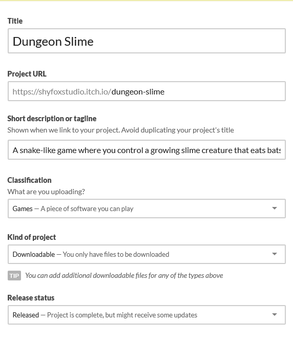
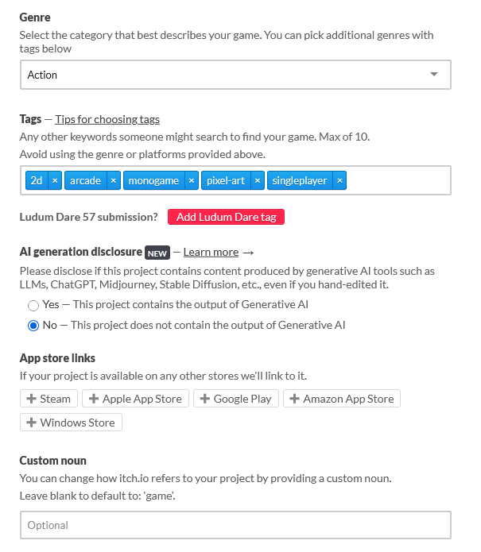
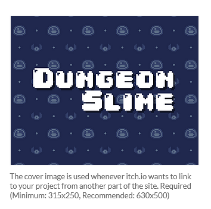

After packaging your game for various platforms in [Chapter 25](../25_packaging_game/index.md), the next step is to make it available for other players.  While there are many distribution platforms available ([Steam](https://store.steampowered.com/), [Unreal](https://publish.unrealengine.com/v3/welcome), [Good Old Games (GOG)](https://www.gog.com/en)), [itch.io](https://itch.io/) has become a popular choice for indie developers due to its simple publishing processes, developer-friendly revenue model, and strong community focus.

In this chapter, you will:

- Learn about itch.io and why it is beneficial for indie game developers.
- Create a project page that effectively showcases your game.
- Upload and configure platform-specific builds.
- Set up proper metadata and screenshots to attract players.
- Test your published game to ensure everything works correctly.

## Understanding itch.io as a Distribution Platform

Itch.io is an open marketplace for independent digital creators with a focus on indie games.  Unlike larger platforms with strict approval processes, itch.io allows any developer to publish their games instantly.  this makes it a good starting point for new developers looking to build an audience.

Key benefits of itch.io for developers include:

1. **Simple Publishing Process**: No approval waiting periods or complex requirements.
2. **Pay-What-You-Want Pricing**: Flexibility to set minimum prices, suggested prices, or make your game completely free.
3. **Cross-Platform Support**: Easy distribution for Windows, macOS, and Linux builds.
4. **Community Focused**: Built-in tools for building a community around you and your games, including devlogs and comments.
5. **Developer-Friendly Revenue Split**: The platform lets developers choose their revenue share (the default 90% to developers, 10% to itch.io).

## Setting Up an itch.io Account

Before you can publish your game, you need to create an itch.io account and setup your developer profile.  To do this

1. Navigate to [itch.io](https://itch.io) and click "Register" in the top-right corner.
2. Fill in the registration form with your desired username, password, and email address.

    > [!TIP]
    > Your itch.io username will appear in the URL of your games (e.g. `https://yourusername.itch.io/dungeon-slime`).  Choose a username that represents you or your studio professionally and is easy to remember.
    >
    > The username can be changed later in your account settings if needed.

3. After registering, you will automatically be logged in, however for some additional configurations that need to be made, you must validate your email address.  Check the email address you entered when you registered above for a new email from itch.io to validate the email address.
4. After validating your email address, go to your account settings by clicking your username in the top-right corner, and then choosing "Settings"
5. The settings page opens with your developer profile configuration.  Complete your developer profile with:
   - A profile picture.
   - Links to your social media platforms or portfolio.
   - A short biography for your profile page.
6. Next, click "Two factor auth" under the "Basics" section on the left to go through the process of configuring two factor authentication for your account.
7. If you plan to sell your game, you will need to configure your publisher information.  To do this, click the "Get Started" section under "Publisher" on the left and follow the steps presented to configure your account to accept payments.

## Creating a Project Page for Dungeon Slime

Once your account is setup, you can created a dedicated page for the game. This page will host all the information, screenshots, and download files.  In this section, we begin by setting the initial information to create a project page.  Complete the following:

1. Select the "Dashboard" navigation link at the top of the itch.io page.
2. From the dashboard, select "Create new project".

This will open the "Create a new project" page which presents you with a form to complete to detail information about the ame, upload the game files, and screenshots.

### Basic Project Information

First, we will fill in the basic project information on the form. Complete the following:

1. **Title**: The title of the game is how it will be displayed and shown on itch.io.  For this project, enter "Dungeon Slime".
2. **Project URL**: Once you enter a title, a project URl will be automatically generated based on the title entered.  Since we entered "Dungeon Slime" as the title, the project URl that is automatically generated is `https://yourusername.itch.io/dungeon-slime`.  For this project we will leave it as is, however it can be customized if you wish to do so.
3. **Short Description or tagline**: Here you can enter a short description that is shown in embedded link previews for your game when you or others share it on different social media platforms.  For this project, enter the following:

    ```text
    A snake-like game where you control a growing slime creature that eats bats to grow larger.
    ```

4. **Kind of Project**: Here you can choose the kind of project being uploaded.  Since MonOgame is distrusted by packaging the game and giving players the archived bundle, it is a "Downloadable" kind, so choose this.
5. **Release Status**: Here you can choose the status of the release.  If the project is completed and ready for others to download and play, you can choose "Released"; otherwise, there are other options such as "In development", "On hold", "Cancelled", and "Prototype".  For this project, choose "Released".

|  |
| :-----------------------------------------------------------------------------------------------------------------------: |
|                **Figure 25-1: Example of basic project information filled in for the Dungeon Slime game**                 |

### Pricing

Itch.io offers three pricing models for your project:

1. **$0 or donate**: With this pricing model, the game can be downloaded for free, but users are given a prompt to ask if they would like to donate an amount.  A suggested minimum donation amount can be configured for this
2. **Paid**: With this pricing model, users must pay a minimum price to download the game.  The price that you set is just the minimum price, users can opt to pay more if they wish to.
3. **No Payment**: With this pricing model, the game is completely free and users will not be prompted for a donation.

You can choose whichever option you feel comfortable with.  For the upload for this tutorial, I have chosen the **$0 or donate** option.

|  |
| :-------------------------------------------------------------------------------------------------------: |
|           **Figure 25-2: Example of pricing information filled in for the Dungeon Slime game**            |

### Upload Game Builds

Next on the form is the uploads for the game builds.  Here,we will add the platform-specific builds created in [Chapter 25](../25_packaging_game/index.md).  Itch.io supports multiple file uploads for different platforms, allowing you to provide the appropriate version for each player's operating system.

> [!NOTE]
> Before uploading, ensure the builds are properly packaged into either ZIP (Windows) or tar.gz (macOS/Linux) archives as discussed in [Chapter 25](../25_packaging_game/index.md).

To upload, for each build you created:

1. Click the "Upload files" button.
2. In the file select dialog, choose the archive for the platform build you are uploading.
3. Once the upload is completed, set the type of upload as "Executable", then check the box for the operating system that build is for.

|  |
| :---------------------------------------------------------------------------------------: |
|           **Figure 25-3: Example of uploaded files for the Dungeon Slime game**           |

### Description

When writing a description for your game, you try to write a compelling project description:

- Start with a concise summary of the game's concepts.
- List key features and gameplay mechanics.
- Mention third party tool and technologies used in developing the game (e.g. MonoGame 😉).
- Include credits for any team members, assets or tools uses that require attribution.

For the Dungeon Slime project, here is an example description you can enter:

```text
Dungeon Slime is a snake-like game where you control a growing slime creature navigating through a dungeon room environment.  Eat bats to grow longer, but be careful not to collide with walls or your own body!

Features:

- Classic snake-like gameplay with a dungeon theme.
- Animated pixel art visuals.
- Responsive controls with keyboard or gamepad support.
- Progressive difficulty as your slime grows longer.

Developed with C# and MonoGame as part of the Building 2D Games With MonoGame tutorial series.
```

|  |
| :-----------------------------------------------------------------------------------------: |
|             **Figure 25-4: Example of description for the Dungeon Slime game**              |

### Metadata

Itch.io provides different fields for metadata that can be set for the project tht will be displayed and used whens someone makes a search for a game.  Enter the following for this projects metadata fields:

1. **Genre**: Choose the genre that best describes the type of game you are uploading.  For the Dungeon Slime project, choose "Action"
2. **Tags**: Here you an set keywords for when someone searches to find your game.  Itch.io offers guidelines for tags in the [Use relevant tags, prefer using suggested tags](https://itch.io/docs/creators/quality-guidelines#tags) documentation page. For the Dungeon Slime project, enter the following keywords

    - 2d
    - arcade
    - monogame
    - pixel-art
    - singleplayer

3. **Ai generation disclosure**: You must disclose if your game is using assets that were generated using AI generative tools.  For more information, see the [Accurately tag your use of generative AI](https://itch.io/docs/creators/quality-guidelines#ai-disclosure) documentation page on Itch.io.  For the Dungeon Slime project, no assets were created using generative AI, so select the "No" options.
4. **App store links**: If the game is available on other app stores such as Steam, Apple App Store, or Google Play, you can include the link to it here.  There are no others to include for the Dungeon Slime project so you can skip this one.
5. **Custom Noun**: Here you can provide a custom noun for how itch.io will refer to your project.  If you leave it blank, it will refer to it as "game" by default.  Since the Dungeon Slime project is a game, leave this blank.

|  |
| :----------------------------------------------------------------------------------------: |
|            **Figure 25-5: Example of game metadata for the Dungeon Slime game**            |

### Download and Install Instructions

On this part of the form, you enter the steps users should take after downloading the game file in order to play the game.  For example, when uploading an archived file (ZIP or tar.gz archive), users will need to extract the archive then launch the game executable that is extracted.  For the Dungeon Slime project, enter the following:

```text
Once the download has completed:

For Windows:
    1. Extract the contents of the ZIP archive downloaded.
    2. Run the "DungeonSlime.exe" executable from the contents you extracted above.

For Linux
    1. Extract the contents of the tar.gz archive downloaded.
    2. Execute the "DungeonSlime" executable from the contents you extracted above.
```

|  |
| :-----------------------------------------------------------------------------------------------------------------------------------------: |
|                      **Figure 25-5: Example of download and install instructions for the for the Dungeon Slime game**                       |

### Community

Here you can choose the community options to enable for the project from the following:

- **Disabled**: No community options will be included for the project.
- **Comments**: The project page will allow community members to leave comments on the project.
- **Discussion board**: A full discussion board dedicated to the project will be created that the community can use to make posts and reply to each other about the project.

For the Dungeon Slime project, choose the *Comments* option.

|  |
| :----------------------------------------------------------------------------------------------: |
|            **Figure 25-6: Example of community settings for the Dungeon Slime game**             |

### Visibility and Access

Here, you can choose the visibility of the project page from the following:

- **Draft**: When choosing this, the project page is only accessible by you and anyone else you might have added with edit access to the project.
- **Restricted**: When choosing this, the project page is only accessible by those that have been given explicit access to view it
- **Public**: When choosing this, the project page is accessible to everyone.

> [!NOTE]
> Initially, you can only choose between "Draft" and "Restricted".  Once you have saved the initial changes for the project, you can then go back and change it to public when you are ready to fully publish it for others to view and download.  
>
> This is to help ensure you have fully prepared the project page before making it public.

For the Dungeon Slime project, choose "Draft" for now.

|  |
| :-----------------------------------------------------------------------------------------------------------: |
|                  **Figure 25-7: Example of visibility settings for the Dungeon Slime game**                   |

### Adding Visual Assets

Visual assets significantly impact a player's decision to try your game.  High-quality screenshots, cover images, and even short gameplay videos can generate interest in your project.

Event though itch.io doesn't require it, at minimum you should always prepare the following for your project:

1. **Cover Image**: This is the primary image displayed on the game's page, in search results, and embedded links on social media posts.  Itch.io recommends a size of 630x500 with a minimum size requirement of 315x250.
2. **Screenshots**: At least 3 to 5 screenshots showing different aspects of the game and gameplay.

> [!TIP]
> To create screenshots:
>
> - **Windows**: You can use the built-in Snipping tool or press `Windows+Shift+S` to capture screenshots.
> - **macOS**: You can press `Command+Shift+4` to capture a selected area of the screen.
> - **Linux**: You can use tools like GNOME Screenshot.

Below you can find a sample cover image you can use for the Dungeon Slime game, or you can create and provide your own.  To use the following cover image, first download it by right-clicking and selecting "Save As...".  

|  |
| :-------------------------------------------------------------------------: |
|             **Figure 25-8: Dungeon Slime example cover image**              |

Next, to set the cover image, at the top-right of the Create a new project page,click teh "Upload Cover Image" button and choose the cover image you want to upload. 

|  |
| :---------------------------------------------------------------------: |
|                  **Figure 25-9: Cover image uploaded**                  |

Now to add screenshots, below you can find four screenshots from the Dungeon Slime game you can use to upload as screenshots, or you can create and provide your own. To use the following screenshots, first download them by right-clicking and selecting "Save As..." for each image.

|      |  |
| :----------------------------------------------------------------------------: | :------------------------------------------------------------------------------: |
|                **Figure 24-10: The Dungeon Slime title screen**                |               **Figure 24-11: The Dungeon Slime gameplay screen**                |
|  |  |
|               **Figure 24-12: The Dungeon Slime options screen**               |               **Figure 24-13: The Dungeon Slime gameover screen**                |

Next, to add the screenshots, click the "Add Screenshots" button just below the cover image section and select the image files you wish to upload as screenshots.

|  |
| :-------------------------------------------------------------------: |
|                  **Figure 25-14: Screenshots added**                  |

### Saving and Making Changes

With the form now completed, a cover image uploaded, and screenshots uploaded, scroll to the bottom of the form and click the "Save & view page" button to save the changes. This will take you to a preview of the game's page with the following popup

|  |
| :----------------------------------------------------------------------------------------------------------------: |
|               **Figure 25-15: The initial popup shown after creating your project page on itch.io**                |

Click the "Got it" button after reading to close the popup and preview the page.

|  |
| :----------------------------------------------------------------------------------------------------: |
|              **Figure 25-16: The example project page for Dungeon Slime that we created**              |

From this page, as the project editor, you can click the "Edit theme" button at the top to make additional changes to the project page such as:

- Background color
- Font
- Layout
- Banner Image
- Background Image

We will not be covering these in this tutorial as they are self explanatory, however you should play around with them to create a page design you like.

Once you are satisfied with the project page, its now time to make it public.  To do this, or if you ever want to make general edits to the page, click the "Edit game" link in the top navigation bar to be take back to the project form.  Once back on the project form, scroll to the bottom and change the **Visibility & access** to "Public" and click the "Save" button.

> [!TIP]
> Before widely sharing your game, consider sending the link to a few friends or fellow developers to test the download and installation process. They might catch issues you might have overlooked.

## Conclusion

In this chapter, you learned how to publish your MonOGame project on itch.io.  You walked through the entire process from setting up an itch.io developer account to creating a project page for the game.

You have learned how to:

- Create an configure an itch.io developer account.
- Set up a project page with proper game information and metadata
- Upload platform-specific builds.
- Configure your game's visibility and access settings.
- Add visual assets like cover images and screenshots.
- Write clear download and installation instructions for different platforms.
- Enable community features.
- Make the game public and available for download.

Publishing a game represents a significant milestone for any game developer.  While itch.io is just one of many distribution platforms available, it provides an accessible starting point for indie developers to share their creations with the world.
