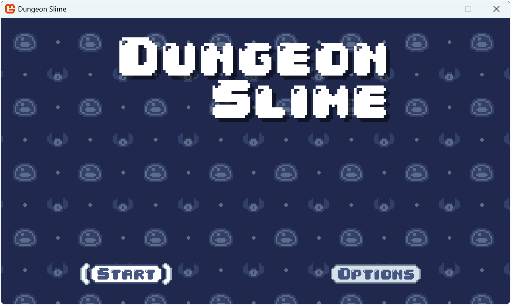
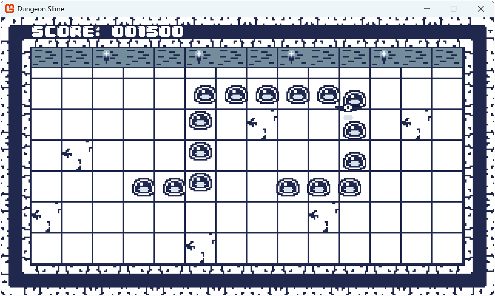

This tutorial covers game development concepts using the MonoGame framework as our tool. Throughout each chapter, we will explore game development with MonoGame, introducing new concepts to build upon previous ones as we go. We will create a Snake game, which will serve as the vehicle to apply the concepts learned throughout the tutorial. The goal of this tutorial is to give you a solid foundation in 2D game development with MonoGame and provide you with reusable modules that you can leverage to jump start future projects.

## What We Will Build

Throughout this tutorial series, we will build a complete game called **Dungeon Slime**; a snake-like game with a dungeon theme. By the end of this series, you will have created a polished game with:

- Smooth animated sprites
- Responsive controls across keyboard and gamepad
- Sound effects and background music
- UI menus with customized styling
- A complete game loop with scoring and game over states

You can see the finished game here: [Dungeon Slime on itch.io](https://shyfoxstudio.itch.io/dungeon-slime)

|  |  |
| :--------------------------------------------------------------------------------: | :----------------------------------------------------------------------------------------------------------------------------------------------------------------------------------------------------------------------: |
|                 **Figure 0-1: The title screen of Dungeon Slime**                 |                      **Figure 0-2: Gameplay of Dungeon Slime showing the player controlling a chain of slime segments (in blue) while navigating through the dungeon to collect bats for points.**                       |

## Who This Is For

This documentation is meant to be an introduction to game development and MonoGame. Readers should have a foundational understanding of C# and be comfortable with concepts such as classes and objects.

> [!NOTE]
> If you are just getting started with C# for the first time, I would recommend following the official [Learn C#](https://dotnet.microsoft.com/en-us/learn/csharp) tutorials provided by Microsoft. These free tutorials will teach you programming concepts as well as the C# language. Once you feel you have a good foundation, come back and continue here.

## How This Documentation Is Organized

This documentation will introduce game development concepts using the MonoGame framework while walking the reader through the development of a Snake clone. The documentation is organized such that each chapter should be read sequentially, with each introducing new concepts and building off of the previous chapters.

| Chapter                                                                              | Summary                                                                                                                                                                                           | Source Files                                                                                                                       |
| ------------------------------------------------------------------------------------ | ------------------------------------------------------------------------------------------------------------------------------------------------------------------------------------------------- | ---------------------------------------------------------------------------------------------------------------------------------- |
| [Chapter 01: What Is MonoGame](01_what_is_monogame/index.md)                         | Learn about the history of MonoGame and explore the features it provides to developers when creating games.                                                                                       | [01-What-Is-MonoGame](https://github.com/shyfox-studio/learn-monogame-2d/tree/main/src/01-What-Is-MonoGame/)                       |
| [Chapter 02: Getting Started](02_getting_started/index.md)                           | Setup your development environment for .NET development and MonoGame using Visual Studio Code as your IDE.                                                                                        | [02-Getting-Started](https://github.com/shyfox-studio/learn-monogame-2d/tree/main/src/02-Getting-Started/)                         |
| [Chapter 03: The Game1 File](03_the_game1_file/index.md)                             | Explore the contents of the Game1 file generated when creating a new MonoGame project.                                                                                                            | [03-The-Game1-File](https://github.com/shyfox-studio/learn-monogame-2d/tree/main/src/03-The-Game1-File/)                           |
| [Chapter 04: Creating a Class Library](04_creating_a_class_library/index.md)         | Learn how to create and structure a reusable MonoGame class library to organize game components and share code between projects.                                                                  | [04-Creating-A-Class-Library](https://github.com/shyfox-studio/learn-monogame-2d/tree/main/src/04-Creating-A-Class-Library/)       |
| [Chapter 05: Content Pipeline](05_content_pipeline/index.md)                         | Learn the advantages of using the **Content Pipeline** to load assets and go through the processes of loading your first asset                                                                    | [05-Content-Pipeline](https://github.com/shyfox-studio/learn-monogame-2d/tree/main/src/05-Content-Pipeline/)                       |
| [Chapter 06: Working with Textures](06_working_with_textures/index.md)               | Learn how to load and render textures using the MonoGame content pipeline and [**SpriteBatch**](xref:Microsoft.Xna.Framework.Graphics.SpriteBatch).                                               | [06-Working-With-Textures](https://github.com/shyfox-studio/learn-monogame-2d/tree/main/src/06-Working-With-Textures/)             |
| [Chapter 07: Optimizing Texture Rendering](07_optimizing_texture_rendering/index.md) | Explore optimization techniques when rendering textures using a texture atlas.                                                                                                                    | [07-Optimize-Texture-Rendering](https://github.com/shyfox-studio/learn-monogame-2d/tree/main/src/07-Optmize-Texture-Rendering/)    |
| [Chapter 08: The Sprite Class](08_the_sprite_class/index.md)                         | Explore creating a reusable Sprite class to efficiently manage sprites and their rendering properties, including position, rotation, scale, and more.                                             | [08-The-Sprite-Class](https://github.com/shyfox-studio/learn-monogame-2d/tree/main/src/08-The-Sprite-Class/)                       |
| [Chapter 09: The AnimatedSprite Class](09_the_animatedsprite_class/index.md)         | Create an AnimatedSprite class that builds upon our Sprite class to support frame-based animations.                                                                                               | [09-The-AnimatedSprite-Class](https://github.com/shyfox-studio/learn-monogame-2d/tree/main/src/09-The-AnimatedSprite-Class/)       |
| [Chapter 10: Handling Input](10_handling_input/index.md)                             | Learn how to handle keyboard, mouse, and gamepad input in MonoGame.                                                                                                                               | [10-Handling-Input](https://github.com/shyfox-studio/learn-monogame-2d/tree/main/src/10-Handling-Input/)                           |
| [Chapter 11: Input Management](11_input_management/index.md)                         | Learn how to create an input management system to handle keyboard, mouse, and gamepad input, including state tracking between frames and creating a reusable framework for handling player input. | [11-Input-Management](https://github.com/shyfox-studio/learn-monogame-2d/tree/main/src/11-Input-Management/)                       |
| [Chapter 12: Collision Detection](12_collision_detection/index.md)                   | Learn how to implement collision detection between game objects and handle collision responses like blocking, triggering events, and bouncing.                                                    | [12-Collision-Detection](https://github.com/shyfox-studio/learn-monogame-2d/tree/main/src/12-Collision-Detection/)                 |
| [Chapter 14: Sound Effects and Music](14_soundeffects_and_music/index.md)            | Learn how to load and play sound effects and background music in MonoGame, including managing audio volume, looping, and handling multiple simultaneous sound effects.                            | [14-SoundEffects-And-Music](https://github.com/shyfox-studio/learn-monogame-2d/tree/main/src/14-SoundEffects-And-Music/)           |
| [Chapter 15: Audio Controller](15_audio_controller/index.md)                         | Learn how to create a reusable audio controller class to manage sound effects and music, including volume control, muting/unmuting, and proper resource cleanup.                                  | [15-Audio-Controller](https://github.com/shyfox-studio/learn-monogame-2d/tree/main/src/15-Audio-Controller/)                       |
| [Chapter 16: Working with SpriteFonts](16_working_with_spritefonts/index.md)         | Learn how to create and use SpriteFonts to render text in your MonoGame project, including loading custom fonts and controlling text appearance.                                                  | [16-Working-With-SpriteFonts](https://github.com/shyfox-studio/learn-monogame-2d/tree/main/src/16-Working-With-SpriteFonts/)       |
| [Chapter 17: Scenes](17_scenes/index.md)                                             | Learn how to implement scene management to handle different game screens like menus, gameplay, and transitions between scenes.                                                                    | [17-Scenes](https://github.com/shyfox-studio/learn-monogame-2d/tree/main/src/17-Scenes/)                                           |
| [Chapter 18: Texture Sampling](18_texture_sampling/index.md)                         | Learn how to use texture sampling states and add a scrolling background effect to the game.                                                                                                       | [18-Texture-Wrapping](https://github.com/shyfox-studio/learn-monogame-2d/tree/main/src/18-Texture-Wrapping/)                       |
| [Chapter 19: User Interface Fundamentals](19_user_interface_fundamentals/index.md)   | Learn the core principles of game user interface design.                                                                                                                                          | [19-User-Interface-Fundamentals](https://github.com/shyfox-studio/learn-monogame-2d/tree/main/src/19-User-Interface-Fundamentals/) |
| [Chapter 20: Implementing UI with Gum](20_implementing_ui_with_gum/index.md)         | Learn how to integrate and use the Gum UI framework to create functional menus, buttons, and sliders for your MonoGame projects.                                                                  | [20-Implementing-UI-With-Gum](https://github.com/shyfox-studio/learn-monogame-2d/tree/main/src/20-Implementing-UI-With-Gum/)       |
| [Chapter 21: Customizing Gum UI](21_customizing_gum_ui/index.md)                     | Learn how to create custom UI components with animations and visual styling in Gum.                                                                                                               | [21-Customizing-Gum-UI](https://github.com/shyfox-studio/learn-monogame-2d/tree/main/src/21-Customizing-Gum-UI/)                   |
| [Chapter 22: Snake Game Mechanics](22_snake_game_mechanics/index.md)                 | Learn how to implement classic snake-like game mechanics and organize game objects into reusable components.                                                                                      | [22-Snake-Game-Mechanics](https://github.com/shyfox-studio/learn-monogame-2d/tree/main/src/22-Snake-Game-Mechanics/)               |
| [Chapter 23: Completing the Game](23_completing_the_game/index.md)                   | Finalize game mechanics by updating our current demo into a snake-like inspired game.                                                                                                             | [23-Completing-The-Game](https://github.com/shyfox-studio/learn-monogame-2d/tree/main/src/23-Completing-The-Game/)                 |
| [Chapter 24: Shaders](24_shaders/index.md)                                           | Learn how to create custom visual effects using shaders in MonoGame.                                                                                                                              | [24-Completing-The-Game](https://github.com/shyfox-studio/learn-monogame-2d/tree/main/src/24-Shaders/)                             |
| [Chapter 25: Packaging Your Game for Distribution](25_packaging_game/index.md)       | Learn how to package your game for distribution across Windows, macOS, and Linux platforms.                                                                                                       |                                                                                                                                    |
| [Chapter 26: Publishing Your Game to itch.io](26_publish_to_itch/index.md)           | Learn how to deploy your MonoGame project to itch.io and configure it for players across different platforms.                                                                                     |                                                                                                                                    |
| [Chapter 27: Conclusion and Next Steps](27_conclusion/index.md)                      | Review key MonoGame concepts learned, discover community resources, and get practical advice for beginning your own game development projects.                                                    |                                                                                                                                    |

## Conventions Used in This Documentation

The following conventions are used in this documentation.

### Italics

*Italics* are used for emphasis and technical terms.

### Highlights

`Highlights` are used for paths such as file paths, including filenames, extensions and other critical information in the application of steps in a tutorial.  These are similar to Inline code blocks as they stand out more in Markdown and require emphasis.

### Inline Code Blocks

`Inline code` blocks are used for methods, functions, and variable names when they are discussed within the paragraphs of text.  For example, when referring to a method such as `Foo` in a sentence,it will appear with this formatting.

### Code Blocks

```cs
// Example Code Block
public void Foo() { }
```

Code blocks are used to show code examples with syntax highlight.  These appear as separated blocks rather than inline with text, allowing for multi-line examples and better readability of complete code snippets.

## MonoGame

If you ever have questions about MonoGame or would like to talk with other developers to share ideas or just hang out with us, you can find us in the various MonoGame communities below:

- [Discord](https://discord.gg/monogame)
- [GitHub Discussions Forum](https://github.com/MonoGame/MonoGame/discussions)
- [Community Forums (deprecated)](https://community.monogame.net/)
- [Reddit](https://www.reddit.com/r/monogame/)
- [Facebook](https://www.facebook.com/monogamecommunity)

## Note From Author

> I have been using MonoGame for many years (since 2017), it was a time in my game development journey where I was looking for something that I had more control over. I did not want to spend the time to write a full game engine, but I also wanted to have more control than what the current engines at the time (i.e. Unity) offered. At that time, there was a vast amount of resources available for getting started, but none of them felt like they fit a good beginner series. Even now, the resources available still seem this way. They either require the reader to have a great understanding of game development and programming, or they assume the reader has none and instead focuses on teaching programming more than teaching MonoGame. Even still, some relied too heavily on third party libraries, while others were simply very bare bones, asking the reader to just copy and paste code without explaining the *what*/*why* of it all.
>
> Since then, I have written various small self contained tutorials on different topics for MonoGame to try and give back to the community for those getting started. I also participate regularly in the community discussion channels, answering questions and offering technical advice, so I am very familiar with the topics and pain points that users get hung up on when first starting out.
>
> With this documentation, I hope to take the lessons I have learned and provide a tutorial series that I wish was available when I first started, and to present using MonoGame in a straight forward way, introducing concepts and building off of them as we go along in a way that makes sense and is easy to follow.
>
> \- Christopher Whitley ([Aristurtle](https://github.com/AristurtleDev))

### Acknowledgements

This documentation would not have been possible without the support and contributions from numerous individuals within the MonoGame community.

First and foremost, I want to express my gratitude to the [MonoGame Foundation](https://monogame.net/about/), its maintainers, and the countless others contributors, who have preserved and evolved this framework, ensuring developers like myself have the tools needed to bring our creative visions to life.  Their dedication to keeping the spirit of XNA alive has been invaluable to indie game developers worldwide.

I am particularly grateful to the members of the [MonoGame Discord community](https://discord.gg/monogame) who reviewed early drafts of this content, providing feedback that helped shape these chapters into more a accessible and comprehensive learning resource.

To the many developers of games, such as [Celeste](https://store.steampowered.com/app/504230/Celeste/), thank you for demonstrating what is possible with MonoGame and inspiring newcomers to explore this framework.

Finally, I would like to thank all the creators and contributors to open-source libraries and tools for MonoGame, including the the creators of [Gum](https://docs.flatredball.com/gum/code/monogame), [Nez](https://github.com/prime31/Nez), and [MonoGame.Extended](https://github.com/craftworkgames/MonoGame.Extended) and the many other libraries that have helped make game development in MonoGame more accessible.

This documentation stands on the shoulders of a vibrant community that continues to share knowledge, and it is my hope that these tutorials will contribute meaningfully to that ongoing exchange.
